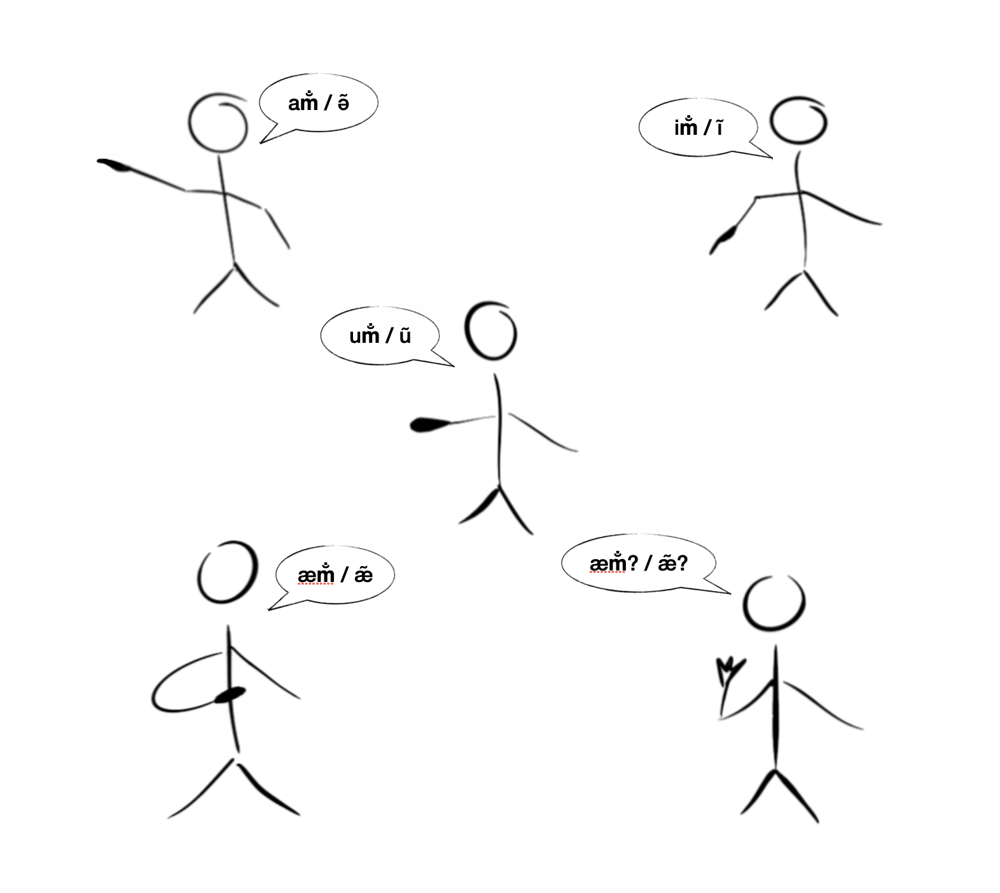

# Provenance of Pronouns

## Background

As [mentioned](Introduction%20and%20Context.md#note) in the [Introduction and Context](Introduction%20and%20Context.md) section,
due to the complexity and subtlety involved in the investigation of the pronoun forms of Kannada and other Dravidian languages,
this document has become unavaoidably detailed and long.
So, for the ease of access, publishing, collaboration, revision tracking as well as for some technical reasons, this document has been split into two parts.
- [Introduction and Context](Introduction%20and%20Context.md) - A brief introduction to the topic and the context for this investigation,
such as a listing of the various pronoun forms in Kannada and other Dravidian languages and highlights of some relevant existing scholarly work can be seen here.
- [Provenance of Pronouns](#provenance-of-pronouns) - The current document.
The actual investigation of pronoun roots of Kannada and other Dravidian languages.
This section refers to the relevant parts from the [Introduction and Context](Introduction%20and%20Context.md) section as required during the investigation of the pronoun roots of Kannada and other Dravidian languages. 

## ಅನುವಾದದ ಕುರಿತು / About Translation

ಈ ಲೇಖನವು ಮೊದಲು ಕನ್ನಡದಲ್ಲಿ ಪ್ರಕಾಶಿತವಾಗಿದ್ದು, ಆ ಕನ್ನಡದ ಆವೃತ್ತಿಯನ್ನು [ಇಲ್ಲಿ](../ಸರ್ವನಾಮಗಳ%20ಸರ್ಗ/ಸರ್ವನಾಮಗಳ%20ಸರ್ಗ.md) ನೋಡಬಹುದು.

This document was originally published in Kannada and that original Kannada version can be seen [here](../ಸರ್ವನಾಮಗಳ%20ಸರ್ಗ/ಸರ್ವನಾಮಗಳ%20ಸರ್ಗ.md).

## About Transliteration

Kannada and other Dravidian words and word fragments are transliterated in this document using [ISO 15919](https://en.wikipedia.org/wiki/ISO_15919) wherever possible and is unambiguous.
Where ISO 15919 transliteration is unclear or ambiguous, IPA transliteration has also been given alongside the ISO 15919 transliteration.

For example, the [anusvāra](https://en.wikipedia.org/wiki/anusvāra) is transliterated as `ṁ` in ISO 15919 but the pronunciation may not be clear to anyone not familiar with Indian languages.
But this is workable for Kannada words because the pronunciation is fairly clear to most Kannada speakers.
Nasalisation is similarly transliterated as `m̐`  in ISO 15919 but the pronunciation may not be clear to many Kannada speakers because the nasalisation has now been mostly lost in many dialects.
So, to make it clear at least in the transliteration, IPA transliteration (`​̃​ `) has been given alongside the ISO 15919 transliteration (e.g. `am̐`/`ə̃`, `ǣm̐`/`æ̃ː` etc.)

## Content

- [Provenance of Pronouns](#provenance-of-pronouns)
- [Background](#background)
- [ಅನುವಾದದ ಕುರಿತು / About Translation](#ಅನುವಾದದ-ಕುರಿತು--about-translation)
- [About Transliteration](#about-transliteration)
- [Content](#content)
- [License](#license)
- [Third-person Pronominal Roots](#third-person-pronominal-roots)
  - [Dravidian Languages](#dravidian-languages)
    - [Kannada, Tamil](#kannada-tamil)
    - [The euphonic infix v in the masculine and feminine singular and rational plural forms](#the-euphonic-infix-v-in-the-masculine-and-feminine-singular-and-rational-plural-forms)
    - [Neuter Gender Forms](#neuter-gender-forms)
    - [Proximal demonstrative ŭ in Tulu](#proximal-demonstrative-ŭ-in-tulu)
    - [Dative Presentative ŭṁda of Tulu](#dative-presentative-ŭṁda-of-tulu)
    - [Origins of the form and semantics of the the root vowel u](#origins-of-the-form-and-semantics-of-the-the-root-vowel-u)
    - [Neuter gender singular suffixes of finite verb forms in Havyaka Kannada](#neuter-gender-singular-suffixes-of-finite-verb-forms-in-havyaka-kannada)
    - [Neuter gender singular suffixes of finte verb forms in Kannada](#neuter-gender-singular-suffixes-of-finte-verb-forms-in-kannada)
    - [The relationship between the anta of Tamil and anta, atta and antu of Kannada](#the-relationship-between-the-anta-of-tamil-and-anta-atta-and-antu-of-kannada)
    - [Semantics of and the processes behind aṁta/iṁta/eṁta](#semantics-of-and-the-processes-behind-aṁtaiṁtaeṁta)
    - [Are the third-person demonstrative pronominal roots nasalised?](#are-the-third-person-demonstrative-pronominal-roots-nasalised)
    - [Third-person demonstrative pronouns in Kannada and their relationship to case suffixes](#third-person-demonstrative-pronouns-in-kannada-and-their-relationship-to-case-suffixes)
    - [The medial/presentative udu and the aggregating suffix uṁ](#the-medialpresentative-udu-and-the-aggregating-suffix-uṁ)
      - [Verse 133](#verse-133)
        - [Summary](#summary)
  - [Indo-European Languages](#indo-european-languages)
- [Second-person Pronominal Roots](#second-person-pronominal-roots)
  - [Dravidian Languages](#dravidian-languages-1)
    - [Caldwell's arguments against nīn/nin/nī/ni being the second-person pronominal roots](#caldwells-arguments-against-nīnninnīni-being-the-second-person-pronominal-roots)
    - [Caldwell's arguments for nīn/nin/nī/ni being the second-person pronominal roots](#caldwells-arguments-for-nīnninnīni-being-the-second-person-pronominal-roots)
    - [Analysis of Caldwell's arguments](#analysis-of-caldwells-arguments)
    - [The process of producing nīn/nin from the second-person pronominal root vowel i](#the-process-of-producing-nīnnin-from-the-second-person-pronominal-root-vowel-i)
  - [Indo-European Languages](#indo-european-languages-1)
- [First-person Pronominal Roots](#first-person-pronominal-roots)
  - [Dravidian Languages](#dravidian-languages-2)
    - [Caldwell's arguments against nān/nā being the first-person pronominal roots](#caldwells-arguments-against-nānnā-being-the-first-person-pronominal-roots)
    - [Caldwell's arguments for nān/nā being the first-person pronominal roots](#caldwells-arguments-for-nānnā-being-the-first-person-pronominal-roots)
    - [Analysis of Caldwell's arguments](#analysis-of-caldwells-arguments-1)
    - [The vowel that is intermediate to ā and ē suggested by Masti Venkatesha Iyengar](#the-vowel-that-is-intermediate-to-ā-and-ē-suggested-by-masti-venkatesha-iyengar)
    - [An afterward on the first, second and third person pronominal roots](#an-afterward-on-the-first-second-and-third-person-pronominal-roots)
  - [Indo-European Languages](#indo-european-languages-2)
- [Interrogative Pronominal Roots](#interrogative-pronominal-roots)
  - [Dravidian Languages](#dravidian-languages-3)
    - [Features of the interrogative pronominal forms](#features-of-the-interrogative-pronominal-forms)
    - [Interrogative pronominal root for all the variations starting with ā, e/ē, yā, ō and vā](#interrogative-pronominal-root-for-all-the-variations-starting-with-ā-eē-yā-ō-and-vā)
    - [The difference between the self-referential æ and the interrogative æ](#the-difference-between-the-self-referential-æ-and-the-interrogative-æ)
    - [The processes behind the interrogative/speculative/skeptical suffixes ē, ā, ō and the emphasising suffix ē in Kannada](#the-processes-behind-the-interrogativespeculativeskeptical-suffixes-ē-ā-ō-and-the-emphasising-suffix-ē-in-kannada)
  - [Indo-European Languages](#indo-european-languages-3)
- [Some Loose-ends](#some-loose-ends)
  - [Dravidian Languages](#dravidian-languages-4)
    - [On the elongation of the root vowel in the nominative and demonstrative determiner forms](#on-the-elongation-of-the-root-vowel-in-the-nominative-and-demonstrative-determiner-forms)
- [Summary](#summary-1)
- [Revisions](#revisions)

## License

## Third-person Pronominal Roots

### Dravidian Languages

It is not surprising that there is a kind of consensus among scholars regarding the [third-person](https://www.grammar-monster.com/glossary/third_person.htm) pronominal origins in Dravidian languages.
It is easy to see how all the third-person [demonstrative](https://en.wikipedia.org/wiki/Demonstrative) pronominal forms can be produced from the
demonstrative single vowels, [distal](https://en.wikipedia.org/wiki/Determiner#Distal_demonstratives) `a`,
[proximal](https://en.wikipedia.org/wiki/Determiner#Proximal_demonstratives) `i` and the [medial](https://en.wikipedia.org/wiki/Medial#Linguistics) `u`.
The simplicity, beauty and the logical consistency of this system may not surprise the native speakers of Dravidian languages
only because they have naturally inherited it as part of their mother tongue.

All the different third-person demonstrative pronominal forms are produced when grammatical [gender](https://en.wikipedia.org/wiki/Grammatical_gender) and [number](https://en.wikipedia.org/wiki/Grammatical_number) suffixes are appended to these third-person demonstrative pronominal roots.

#### Kannada, Tamil

&nbsp; | `an` (Masculine Singular) | `aḷ` (Feminine Singular) | `du` (Neuter Singular) | `ar` ([Rational](https://en.wikipedia.org/wiki/Noun_class#Common_criteria_for_noun_classes) Plural) | `vu` (Neuter Plural) | Elongated Vowel ([Demonstrative Determiner](https://en.wikipedia.org/wiki/Demonstrative#Demonstrative_determiners_and_pronouns))
:-- | :-- | :-- | :-- | :-- | :-- | :--
a | avan | avaḷ | adu | avar | avu | ā
i | ivan | ivaḷ | idu | ivar | ivu | ī
u | uvan | uvaḷ | udu | uvar | uvu | ū

Only the [Old Kannada](https://en.wikipedia.org/wiki/Old_Kannada) forms have been given here
and Tamil and [Modern Kannada](https://en.wikipedia.org/wiki/Kannada#Modern_Kannada) forms have been omitted because vary very little from these forms.

#### The euphonic infix `v` in the masculine and feminine singular and rational plural forms

The appearance of the [infix](https://en.wikipedia.org/wiki/Infix) `v` in the masculine and feminine singular and the rational plural forms (`avan`, `ivaḷ`, `uvar` etc.) needs an explanation.
This is because, normally, when a suffix starting with a vowel (`an`, `aḷ`, `ar` etc.) is appended to a word fragment having an ending vowel,
other euphonic processes might operate to produce forms different from the ones listed above.

For example,

- `a + an => an` - The ending vowel of the preceding fragment drops according to [lōpasaṁdhi](https://kn.wikipedia.org/wiki/ಲೋಪಸಂಧಿ).
- `i + aḷ => iyaḷ` - A euphonic infix `y` appears between the two fragments according to [yakārāgama saṁdhi](https://kn.wikipedia.org/wiki/ಆಗಮ_ಸಂಧಿ#ಯ_ಕಾರಾಗಮ_ಸಂಧಿ).
- `u + ar => uvar` - A euphonic infix `v` appears between the two fragments according to [vakārāgama saṁdhi](https://kn.wikipedia.org/wiki/ಆಗಮ_ಸಂಧಿ#ವ_ಕಾರಾಗಮ_ಸಂಧಿ).

Of these, only the form `uvar` appears in Kannada and Tamil; the other forms don't.

So, some other kind of process is required to explain the appearance of the `v` infix in these forms (`avan`, `ivaḷ` etc.).
A previous research article "[anusvārada anusāra](../ಅನುಸ್ವಾರದ%20ಅನುಸಾರ.md#ಅರ್ಧಅನುಸ್ವಾರದ-ಸ್ವರೂಪ)" proposes such a set of processes (please note that the document is in Kannada and is yet to be translated to English).
In these processes, nasalisation appears to mediate whenever suffixes are appended to roots.
This nasalisation then further transforms into many different forms according to a related set of processes.
Turning into `m` or `v` is among such transforms that the mediating nasalisation enables.
I.e.,

In ISO 15919,
- `a + m̐ + an => am̐ + an => avan`
- `i + m̐ + aḷ => im̐ + aḷ => ivaḷ`

In IPA,
- `ə +  ̃ + ən̪ => ə̃ + ən̪ => əʋən̪`
- `ɪ +  ̃ + əɭ => ɪ̃ + əɭ => ɪʋəɭ`

I have proposed in "[anusvārada anusāra](../ಅನುಸ್ವಾರದ%20ಅನುಸಾರ.md#ಅರ್ಧಅನುಸ್ವಾರದ-ಸ್ವರೂಪ)" that the ending `n` in the masculine singular suffix `an`
is also originally just a nasalisation. 
I.e., `an`/`ən̪` is originally derived from `am̐`/`ə̃`.
In light of this hypothesis, it is easy to see how not just the Old Kannada form of `avan`/`əʋən̪` but also `avam̐`/`əʋə̃` of [Havyaka Kannada](https://en.wikipedia.org/wiki/Havigannada_dialect) as well as `ava`/`əʋə` (without the trailing `n`) found in some regional spoken dialects of Kannada are produced.

In ISO 15919,
- `a + m̐ + am̐ => am̐ + am̐ => avam̐` - The first nasalisation turns into `v`.
    - `=> ava` - The trailing nasalisation disappears.
    - `=> avan` - The trailing nasalisation turns into `n`.

In IPA,
- `ə + ̃ + ə̃ => ə̃ + ə̃ => əʋə̃` - The first nasalisation turns into `ʋ`.
    - `=> əʋə` - The training nasalisation disappears.
    - `=> əʋən̪` - The trailing nasalisation turns into `n̪`.

When a mediating nasalisation can (among other things) turn into `v` or drop off, it wouldn't be incorrect, for the sake of logical consistency,
to invoke the mediating nasalisation even in the forms involving the medial demonstrative pronominal root `u` as well.
I.e.,

In ISO 15919,
- `u + m̐ + ar => um̐ + ar => uvar` - It can be considered that either the nasalisation has disappeared (and the euphonic infix `v` has appeared between `u` and `a` according to vakārāgama saṁdhi) or the nasalisation itself has turned into `v`.

In IPA,
- `u + ̃ + əɾ => ũ + əɾ => uʋəɾ` - It can be considered that either the nasalisation has disappeared (and the euphonic infix `ʋ` has appeared between `u` and `ə` according to vakārāgama saṁdhi) or the nasalisation itself has turned into `ʋ`.

The following discussion about neuter gender forms and Tulu third-person pronouns seem to support the case for the mediating nasalisation processes.

#### Neuter Gender Forms

Among the neuter gender singular pronominal forms in Kannada, forms ending with `du` (`adu`, `idu`, `udu` etc.) are most common.
Therefore, `du` has been mentioned above as the neuter gender singular suffix.
But there are reasons to think that this is not entirely correct.

For example, the verse [158](https://archive.org/details/abdamaidarpaa00kirjuoft/page/212/mode/2up) of [kēśirāja](https://en.wikipedia.org/wiki/Kesiraja)'s
[śabdamaṇidarpaṇaṁ](https://en.wikipedia.org/wiki/Shabdamanidarpana), mentions the forms `ninatu`, `enatu`, `tanatu` and `ninattu`, `enattu`, `tanattu`
for the common forms `ninnadu`, `ennudu`, `tannadu`.
These alternate forms are no longer found in Modern Kannada.
The suffixes in these forms are `atu`, `attu` and not `adu`.
I.e.,

- `nin + atu => ninatu`
- `en + attu => enattu`

This suggests the possibility of `tu` being the original neuter gender singular suffix,
because `t` transforming into `d` is a natural process in Kannada and Dravidian languages.

The reason for the optional [gemination]( https://en.wikipedia.org/wiki/Gemination) between `atu` and `attu` forms can be found in "[anusvārada anusāra](../ಅನುಸ್ವಾರದ%20ಅನುಸಾರ.md#ಉಕಾರಾಂತವಾದ-ನಪುಂಸಕಲಿಂಗದ-ಏಕವಚನದ-ಸರ್ವನಾಮಗಳ-ಚತುರ್ಥೀ-ವಿಭಕ್ತಿರೂಪಗಳಲ್ಲಿರುವ-ಅಕಾರ-ವಿಕಲ್ಪದ್ವಿತ್ವ)", 
where the nasalisation mediating the appending of suffixes to the third-person pronominal roots can explain the the optional gemination between `atu` and `attu`.

In ISP 15919,
- `a + m̐ + tu => am̐tu`
    - `=> atu` - The nasalisation disappears.
    - `=> aṁtu` - Nasalisation turns into [anusvāra](https://en.wikipedia.org/wiki/anusvāra) which is pronounced as `n` because of the `t` that follows.
        - `=> attu` - The anusvāra which was pronounced as `n` turns into a gemination of the following consonant `t`.

In IPA,
- `ə + ̃ + t̪u => ə̃t̪u`
    - `=> ət̪u` - The nasalisation disappears.
    - `=> ən̪t̪u` - Nasalisation turns into anusvāra which is pronounced as `n̪` because of the `t̪` that follows.
        - `=> ət̪t̪u` - The anusvāra which was pronounced as `n̪` turns into a gemination of the following consonant `t̪`.

More details about these processes can be seen in "[anusvārada anusāra](../ಅನುಸ್ವಾರದ%20ಅನುಸಾರ.md)".
The fact that other such occurrences of optional gemination of words ending with `tu` survive in Modern Kannada (`haḷ + atu/attu => haḷatu/haḷattu`, `hos + atu/attu => hosatu/hosattu` etc.) strengthens this argument.

So, *it can be supposed that the neuter gender singular suffix `du` has been derived from the original form `tu`*.
I.e.
- `atu => adu`

But the forms like `ninadu`, `enadu`, `tanadu` do not appear in Kannada; only forms like `ninnadu`, `ennadu`, `tannadu` are found.
The reason for this is another process of "[dvitvasaṁdhi](https://en.wikipedia.org/wiki/Malayalam_grammar#Dvitva_Sandhi_or_%22Rule_of_doubling%22)" which is natural to Dravidian languages, especially to Kannada.
It can be seen that, in the word fragments `nin`, `en`, `tan` that appear before `adu`, before the trailing consonant `n` is a single [light syllable](https://en.wikipedia.org/wiki/Syllable_weight) (`ni`, `e`, `ta`).
Gemination of the trailing consonant (in this case `n`) in such a word fragment, when it is appended with a suffix starting with a vowel,
is a natural process in Kannada which is called dvitvasaṁdhi.
I.e.,

- `nin + adu => ninnadu - DUMdada  (DUM - heavy syllable, da - light syllable)`

I have argued in a previous research article "[vakārada vibhakti](../ವಕಾರದ%20ವಿಭಕ್ತಿ.md)"
(please note that the document is in Kannada and is yet to be translated to English)
that such gemination is one of a set of processes used in Kannada (and other Dravidian languages too to varying extent)
to avoid the `daDUM` rhythm which is unnatural in Kannada (even more so in Modern Kanada) at the beginning of words
(especially, at the beginning of metrical units and sentences).

But `daDUM` rhythm  cannot be seen in the ungeminated form `ninadu` either.
So, the reason for the geminated form `ninnadu` seems to be the nasalisation hidden (but subsequently disappeared) inside `adu`.
That nasalisation, in some production sequences, is capable of producing `dada` or `daDUM` rhythms both of which are unnatural to Kannada at the beginning of words and metrical units.
So, the trailing consonant `n` gets geminated (`ninnadu`, `ennadu`, `tannadu`) in Kannada to avoid such `dada` or `daDUM` rhythms.
The production sequences could be as follows.

In ISO 15919,
1. `nin + a + m̐ + tu => (nin + a + m̐) + tu => ninnam̐ + tu` - Because `ninam̐` would be in the (undesirable) `dada` rhythm.
    - `=> ninnam̐tu => ninnatu` - The nasalisation disappears.
        - `=> ninnadu` - `t` turns into `d`.

1. `nin + a + m̐ + tu => nin + (a + m̐ + tu) => nin + am̐tu => nin + aṁtu` - `aṁtu` is found in Kannada but with different semantics.
    - `=> nin + aṁdu` - `t` turns into `d`. `aṁdu` is also found in Kannada but with different semantics.
        - `=> ninnaṁdu` - Because `ninaṁdu` (`daDUMda`) would start with the (undesirable) `daDUM` rhythm.
            - `=> ninnadu` - The anusvāra, which is pronounced as `n` here, disappears.

In IPA,
1. `n̪ɪn̪ + ə + ̃ + t̪u => (n̪ɪn̪ + ə + ̃) + t̪u => n̪ɪn̪n̪ə̃ + t̪u` - Because `n̪ɪn̪ə̃` would be in the (undesirable) `dada` rhythm.
    - `=> n̪ɪn̪n̪ə̃t̪u => n̪ɪn̪n̪ət̪u` - The nasalisation disappears.
        - `=> n̪ɪn̪n̪əd̪u` - `t̪` turns into `d̪`.

1. `n̪ɪn̪ + ə + ̃ + t̪u => n̪ɪn̪ + (ə + ̃ + t̪u) => n̪ɪn̪ + ə̃t̪u => n̪ɪn̪ + ən̪t̪u` - `ən̪t̪u` is found in Kannada but with different semantics.
    - `=> n̪ɪn̪ + ən̪d̪u` - `ən̪d̪u` - `t̪` turns into `d̪`. `ən̪d̪u` is also found in Kannada but with different semantics.
        - `=> n̪ɪn̪n̪ən̪d̪u` - Because `n̪ɪn̪ən̪d̪u` (`daDUMda`) would start with the (undesirable) `daDUM` rhythm.
            - `=> n̪ɪn̪n̪əd̪u` - The anusvāra, which was pronounced as `n̪` here, disappears.

More details about these processes can be seen in "[vakārada vibhakti](../ವಕಾರದ%20ವಿಭಕ್ತಿ.md)".

The existance of `ninattu`, `enattu`, `tanattu` forms which start with the (undesirable) `daDum` rhythm, might seem to contradict
the above mentioned processes.
But like the exceptions listed in the same "vakārada vibhakti", these exceptional forms are found only in Old Kannada
and have disappeared from Modern Kannada.
This supports the view that the processes related to dvitvasaṁdhi have dominated more in Modern Kannada when compared to Old Kannada.

#### Proximal demonstrative ŭ in Tulu

The argument that there is a nasalisation hidden inside the third-person pronouns finds strong support in the Tulu proximal demonstrative pronouns (`ŭṁbye`, `ŭṁbaḷŭ`, `ŭṁdu` etc.).
Here, the nasalisation appears as full-blown anusvāra which is pronounced as the euphonic nasal consonant of the succeeding consonant.
The `b` that appears in the masculine, feminine singular and the rational plural forms (`ŭṁbye`, `ŭṁbaḷŭ`, `ŭṁberŭ` etc.) seems to be
a latter phenomenon that was not present in the root forms.
I.e.,

In ISO 15919,
- `ŭ + m̐ + e` - `e` seems to be the root masculine singular suffix in Tulu.
    - `=> ŭṁ + ye` - The nasalisation turns into anusvāra which is pronounced here as `m`
    and an euphonic `y` infixes before `e`.
        - `=> ŭṁye` - The anusvāra is pronounced here as `m`, `ŭmye`.
            - `=> ŭṁbye` - Pronounced `ŭmbye`.
- `ŭ + m̐ + aḷŭ` - As in other Dravidian languages, `aḷŭ` is a feminine singular suffix in Tulu too.
    - `=> ŭṁ + aḷŭ` - The nasalisation turns into anusvāra which is pronounced here as `m`.
        - `=> ŭṁaḷŭ` - The anusvāra is pronounced here as `m`, `ŭmaḷŭ`.
            - `=> ŭṁbaḷŭ` - Pronounced `ŭmbaḷŭ`.
- `ŭ + m̐ + du` - As in other Dravidian languages, `du` is the neuter gender singular suffix in Tulu too.
    - `=> ŭṁdu` - The nasalisation turns into anusvāra which is pronounced here as `n` due to the `d` that follows, `ŭndu`.
- `=> ŭ + m̐ + erŭ` - `erŭ` seems to be the root rational plural suffix in Tulu.
    - `=> ŭṁ + erŭ` - The nasalisation turns into anusvāra which is pronounced here as `m`.
        - `=> ŭmerŭ` - The anusvāra is pronounced here as `m`.
            - `=> ŭṁberŭ` - Pronounced `ŭmberŭ`.
- `ŭ + m̐ + kŭḷŭ` - `kŭḷŭ` (like `gaḷu` in Kannada) seems to be a plural suffix in Tulu.
    - `=> ŭṁ + kŭḷŭ` - The nasalisation turns into anusvāra which is pronounced here as `m`.
        - `=> ŭṁkŭḷŭ` - The anusvāra is pronounced here as `m`, `ŭmkŭḷŭ`.
            - `=> ŭṁbŭkŭḷŭ => ŭṁbakŭḷŭ` - The anusvāra is pronounced here as `m`, `=> ŭmbŭkŭḷŭ => ŭmbakŭḷŭ`.

In IPA,
- `ɯ + ̃ + e` - `e` seems to be the root masculine singular suffix in Tulu.
    - `=> ɯm + je` - The nasalisation turns into anusvāra which is pronounced here as `m`
    and an euphonic `j` infixes before `e`.
        - `=> ɯmje` - The anusvāra is pronounced here as `m`.
            - `=> ɯmbje` - The anusvāra is pronounced here as `m`.
- `ɯ + ̃ + əɭɯ` - As in other Dravidian languages, `əɭɯ` is a feminine singular suffix in Tulu too.
    - `=> ɯm + əɭɯ` - The nasalisation turns into anusvāra which is pronounced here as `m`.
        - `=> ɯməɭɯ` - The anusvāra is pronounced here as `m`.
            - `=> ɯmbəɭɯ` - The anusvāra is pronounced here as `m`.
- `ɯ + ̃ + d̪u` - As in other Dravidian languages, `d̪u` is the neuter gender singular suffix in Tulu too.
    - `=> ɯn̪d̪u` - The nasalisation turns into anusvāra which is pronounced here as `n̪` due to the `d̪` that follows.
- `=> ɯ + ̃ + eɾɯ` - `eɾɯ` seems to be the root rational plural suffix in Tulu.
    - `=> ɯm + eɾɯ` - The nasalisation turns into anusvāra which is pronounced here as `m`.
        - `=> ɯmeɾɯ` - The anusvāra is pronounced here as `m`.
            - `=> ɯmbeɾɯ` - The anusvāra is pronounced here as `m`.
- `ɯ + ̃ + kɯɭɯ` - `kɯɭɯ` (like `gəɭu` in Kannada) seems to be a plural suffix in Tulu.
    - `=> ɯm + kɯɭɯ` - The nasalisation turns into anusvāra which is pronounced here as `m`.
        - `=> ɯmkɯɭɯ` - The anusvāra is pronounced here as `m`.
            - `=> ɯmbɯkɯɭɯ => ɯmbakɯɭɯ` - The anusvāra is pronounced here as `m`.

The appearance of an euphonic `b` as an infix after the anusvāra which is pronounced as `m` is similar to the linguistic processes
in other languages, where an euphonic consonant comes as in fix after a nasal consonant.
For example, the  name `Henry` has an alternate form `Hendry`; similarly, `Thomson` has the alternate form `Thompson`.
So, *it would not be wrong to say that `ŭṁbye`, `ŭṁbaḷŭ`, `ŭṁberŭ` etc. are derived from `ŭmye`, `ŭmaḷŭ`,  `ŭmerŭ` etc., respectively*.
Furthermore, the alternate forms of these pronouns which start with `i` instead of `ŭ` (`iṁbye`, `iṁbaḷŭ` etc.) must have been derived
by the `ŭ` turning into `i`
and the alternate forms which start with the consonant `m` instead of a vowel (`mekḷŭ`, `mokḷŭ`, `merŭ`, `mōḷŭ` etc.) must have been derived
from the forms without the euphonic `b` infix (`ŭmkŭḷŭ`, `ŭmerŭ` etc.) by losing the initial `ŭ`.

From this discussion, it becomes clear that *nasalisation is indeed hidden inside the third-person demonstrative pronouns of Dravidian languages*.
Also, the close relation between the euphonic infixes `v`, found in `ivanu`, `ivaḷu`, `ivaru` of Kannada
and `b` preceded by the nasal anusvāra/`m` , found in `ŭṁbye`, `ŭṁbaḷŭ`, `ŭṁberŭ` of Tulu is notable. 
Clearly, the euphonic `v`, anusvāra/`m`, `b` are derived from the original nasalisation.
The similarities in pronunciation of `v`, `m` and `b` is also noteworthy.

In most of the other Dravidian languages, `i` and `u` are used as the proximal and medial demonstrative pronominal roots, respectively.
But in Tulu, `ŭ` is used as the proximal demonstrative pronominal root
and the medial demonstrative pronominal forms do not exist (at least in the modern dialects).

Let's proceed investigate the reasons behind this peculiarity [next](#origins-of-the-form-and-semantics-of-the-the-root-vowel-u).

#### Dative Presentative ŭṁda of Tulu

Tulu has a [dative presentative](https://ygdp.yale.edu/phenomena/dative-presentatives) `ŭṁda`,
where the anusvāra is pronounced as `n` due to the `d` that follows (`ŭnda`).
Here `ŭ` is used in both the proximal demonstrative as well the *presentative* senses.
Kannada has the equivalent `ikō`/`igō` which are clearly derived from the proximal demonstrative `i`. 
Also, the anusvāra/`n` here is clearly derived from the original nasalisation.

#### Origins of the form and semantics of the the root vowel u

Tulu using `ŭ` in the the proximal demonstrative pronouns and the dative presentative form `ŭṁda` (the Kannada equivalent being `ikō`/`igō`),
suggests that the original form and semantics of the root vowel `u` might be subtler than the commonly accepted medial demonstrative sense.

Regarding the origins of the form, a possibility is that `u` might be originally derived from `ŭ`.
This is supported by the fact that Kannada and Telugu use `u` wherever Tulu uses `ŭ`
and that wherever it doesn't affect semantics, alternate forms for the words with `ŭ` can be seen even in Tulu where `ŭ` turns into `u`.
But it is difficult to conclude that `u` is derived from `ŭ` without further supporting arguments and evidence.

The medial demonstrative pronominal forms with the root `u` are quite rare in most Dravidian languages (especially so in the modern spoken dialects).
They are almost non-existant as independent pronominal forms in Modern Kannada.
But the root is still found in fragments and suffixes.
For example,

- `naḍe + udu => naḍevudu`
- `naḍe + u => naḍeyu`
    - `naḍeyu + udu => naḍeyuvudu`
- `tiḷi + udu => tiḷivudu`
- `tiḷi + u + udu => tiḷiyuvudu`
- `ā + da + udu => ādudu`
- `ā + udu => āvudu`
- `yā + udu => yāvudu`
- `ā + uvu => āvuvu`
- `yā + uvu => yāvuvu`

The `u` found in these forms turns into `a` in the northern dialects of Kannada.
For example, [aṁbikātanayadatta](https://en.wikipedia.org/wiki/D._R._Bendre) in his famous poem "[hr̥daya samudra](https://jnaanasootaka.blogspot.com/2022/01/blog-post_26.html)" says *miṁcubaḷaga tereteregaḷāgi `aleyuvadu` puṭṭapūrā*.
Havyaka Kannada also shows the same process of `u` turning into `a`.
For example, `naḍevadu`, `tiḷivadu` etc.

Words ending in a consonant being suffixed with a euphonic `u` (`kaṇ => kaṇṇu`, `kāl => kālu`) is a well known phenomenon in Modern Kannada.
This is also very common in Telugu.
Spoken dialects of Tulu, Tamil and Malayalam usually pronounce the consonant ending with a suffixed vowel `ŭ` (`kaṇ => kaṇṇŭ`, `kāl => kālŭ` etc.).
Also, in Modern Kannada, when such words where the original `ŭ` has turned into `u` are suffixed with anything starting with a vowel, the trailing `u` of the preceding word usually disappears following the process of [lōpasaṁdhi](https://kn.wikipedia.org/wiki/ಲೋಪಸಂಧಿ) (`kaṇṇu + iḍu => kaṇṇiḍu` etc.).

It is also common for `u` to disappear in the spoken dialects of Modern Kannada even in the middle of words.
For example, `ādudariṁda => āddariṁda`.

It is tempting to speculate that `u` being originally derived from `ŭ` might be the reason behind `u` sometimes dropping off or being replaced by `a`,
because the pronunciation of `ŭ` seems fit to turning into `a`, `u` and disappearing.
But it is hard to conclude based only on these speculations without further supporting arguments and evidence.
So, I leave the discussion on the origins of the form of the demonstrative root vowel `u` here, incomplete.

However, the above discussion sheds more light on the semantics of the demonstrative root vowel `u` too.
As already mentioned above, most scholars have considered the vowel `u` to be the medial demonstrative pronominal root and rightly so.
But *that may not be its only semantics*.
*It seems appropriate to suppose that, in addition to the medial demonstrative semantics, it also has [presentative](https://ygdp.yale.edu/phenomena/dative-presentatives) semantics.*
*Presentative* as in `here you go` or how a lawyer might present evidence saying `Exhibit A`;
but here, I propose that Dravidian languages use the root vowel `u` in the presentative sense much more systematically
(as they do the other pronominal roots) than in English.
As seen [above](#dative-presentative-ŭṁda-of-tulu), the semantics of the Tulu `ŭṁda` is clearly presentative.
Even in Kannada, the suffix `udu` in `māḍuvudu`, `baredudu` etc. adds the semantics of presence or relevance to the
action indicated by the verb root; to say it adds the semantics of medial distance to the action makes no sense.
*Since the presentative semantics has clear overtones of both metaphorical and physical medial (and proximal) distance,
it seems appropriate to even say that the medial demonstrative semantics of `u` is derived from the original presentative semantics.*

Considering that the presentative semantics also indicates logical and/or physical proximity too,
it seems appropriate that Tulu uses `ŭ` as the proximal demonstrative pronominal root.
In Kannada, masters of ceremony use the proximal demonstrative rational plural `ivaru` to introduce / present important guests to the audience.
This also indicates a close relationship between not only the root vowels `i` and `u` but also the proximal, medial demonstrative and presentative
semantics.
Because the presentative pronominal forms derived from `u` have now disappeared from use in Modern Kannada,
the semantically related proximal demonstrative pronominal form `ivaru` seems to have been pressed into service in their stead.
If the presentative pronouns derived from `u` were still in use in Kannada, it might have been more appropriate to use `uvaru` on such occasions.
If it is unavoidable to lose one of either of the distal `u`, the proximal `i` or the presentative `u`, it might be more logical to lose the proximal `i` like in Tulu
than to lose the presentative `u` like in Kannada. 
But languages do not evolve based on logical analyses, of course.
But that languages largely show logical consistency is undeniable 
and it is fortunate that these three root vowels (`a`, `i` and `u`) have been used in such simple, logical and beautiful regularity
in the [Proto-Dravidian](https://en.wikipedia.org/wiki/Proto-Dravidian_language) language.
The fact that this simple and logical regularity has survived to a great extent (though partially) even in the modern Dravidian languages,
leaves significant clues that aid linguists in the search of pronominal roots.

The fact that the presentative semantics of `u` metaphorically and/or physically indicates not only a medial (`u`) distance but also proximity (`i`),
will come in handy in the investigation of the second-person pronominal roots [later](#second-person-pronominal-roots).

#### Neuter gender singular suffixes of finite verb forms in Havyaka Kannada

As seen above, the third-person distal demonstrative neuter gender singular `adu` must have been derived from the original `atu`/`attu`.
The neuter gender singular suffixes of finite verb forms in Havyaka Kannada seem to support this argument further.
For example,

- `hō + attu => hōdattu (with d infix)` - In Kannada, `hōyitu`
- `tin + attu => tiṁdattu (with d infix)` - In Kannada, `tiṁditu`

Similarly, that Old Kannada must have had the original forms `utu`/`uttu` from which the third-person medial demonstrative neuter gender singular `udu`
must have derived, is also clear from the neuter gender suffixes of finite verb forms in Havyaka Kannada.
For example,

- `hō + uttu => hōvuttu (with v infix)` - In Kannada, `hōguvudu`
- `hēḷ + uttu => hēḷuttu` - In Kannada, `hēḷuvudu`

#### Neuter gender singular suffixes of finte verb forms in Kannada

As already seen [above](#origins-of-the-form-and-semantics-of-the-the-root-vowel-u), though the third-person presentative/medial demonstrative
neuter gender singular pronoun `udu` of Old Kannada might have disappeared in Modern Kannada, it has survived as a neuter gender singular suffix
of finite verb forms.
Similarly, the apparently third-person proximal demonstrative neuter gender singular `itu` found in `anitu`/`initu`/`enitu`,
can be seen as a neuter gender singular suffix of finite verb forms.
For example,

- `hō + itu => hōyitu (with the euphonic y infix)`
- `tin + itu => tiṁditu (with d infix)`
- `hēḷ + itu => hēḷitu`

But even in Old Kannada (and in many modern regional dialects), there alternate forms without the vowel `i`.
For example, `hōtu`, `tintu`, `hēḷtu`, etc.

So, proximal `i` or presentative/medial `u` might sometimes appear at the beginning of neuter gender suffixes of finite verb forms.

#### The relationship between the anta of Tamil and anta, atta and antu of Kannada

As already mentioned [above](#neuter-gender-forms), the neuter gender singular suffix `du` must have been originally derived from `tu`.
It was also [seen](#the-euphonic-infix-v-in-the-masculine-and-feminine-singular-and-rational-plural-forms) that nasalisation mediates
whenever a suffix is appended to pronominal roots and leads to many different forms based on a set of related processes.
Of these forms of the third-person distal demonstrative pronoun, `atu`, `aṁtu`, `attu`, `adu`, `aṁdu` are significant.
I.e.,

In ISO 15919,
- `a + m̐ + tu => am̐tu`
    - `=> atu` - The nasalisation disappears.
    - `=> aṁtu` - The nasalisation turns into anusvāra which is pronounced here as `n` due to the `t` that follows, `antu`.
        - `=> attu` - The anusvāra turns into a gemination of the following consonant `t`.
    - `=> am̐du` - `t` turns into `d`.
        - `=> adu` - The nasalisation disappears.
        - `=> aṁdu` - The nasalisation turns into anusvāra which is pronounced as `n` due to the `d` that follows, `andu`.

In IPA,
- `ə + ̃ + t̪u => ə̃t̪u`
    - `=> ət̪u` - The nasalisation disappear.
    - `=> ən̪t̪u` - The nasalisation turns into anusvāra which is pronounced here as `n̪` due to the `t̪` that follows.
        - `=> ət̪t̪u` - The anusvāra turns into a gemination of the following consonant `t̪`.
    - `=> ə̃d̪u` - `t̪` turns into `d̪`.
        - `=> əd̪u` - The nasalisation disappears.
        - `=> ən̪d̪u` - The nasalisation turns into anusvāra which is pronounced as `n̪` due to the `d̪` that follows.

Of these forms, `atu`, `attu`, `adu` have the same semantics in Old Kannada as `adu` in Modern Kannada.
But [`aṁtu`](https://kn.wiktionary.org/wiki/ಅಂತು) and [`aṁdu`](https://kn.wiktionary.org/wiki/ಅಂದು) have different semantics.
The same set of processes derive the proximal demonstrative forms `itu`, `iṁtu`, `ittu`, `idu`, `iṁdu`
and the interrogative forms `etu`, `eṁtu`, `ettu`, `edu`, `eṁdu` as well.
Of these forms too, [`iṁtu`](https://kn.wiktionary.org/wiki/ಇಂತು), [`iṁdu`](https://kn.wiktionary.org/wiki/ಇಂದು), [`eṁtu`](https://kn.wiktionary.org/wiki/ಎಂತು), [`eṁdu`](https://kn.wiktionary.org/wiki/ಎಂದು) have semantics different from their related standard pronominal forms.
Some forms (for example, `edu`) are in use only in some regional dialects,
while others (for example, `etu`, `ettu`) are not at all found amongst the pronominal forms in Kannada.

Some closely related forms to the above mentioned pronominal forms also notable here.
For example, `aṁta`, [`atta`](https://kn.wiktionary.org/wiki/ಅತ್ತ), `anitu`.
Their corresponding proximal `iṁta`, [`itta`](https://kn.wiktionary.org/wiki/ಇತ್ತ_ಕಡೆಗೆ), `initu`
and interrogative `eṁta`, [`etta`](ttps://kn.wiktionary.org/wiki/ಎತ್ತ), `enitu` also exist.
Of these too, some forms (for example, `eṁta`) are in use only in some regional dialects.

For the sake of argument, let us first keep the semantic differences aside and analyse only the similarities in processes of derivation.
The similarities in the processes of derivation of
`atu`/`itu`/`etu`, `aṁtu`/`iṁtu`/`eṁtu`, `attu`/`ittu`/`ettu`, `adu`/`idu`/`edu`, `aṁdu`/`iṁdu`/`eṁdu` are already shown above
and the processes that derive the forms `aṁta`/`iṁta`/`eṁta`, `atta`/`itta`/`etta`, `anitu`/`initu`/`enitu` are not hard to see.
I.e.,

- `aṁtu + a => aṁta`
- `ittu + a => itta`

The derivation of `anitu`/`initu`/`enitu` becomes clear by the set of processes explained in "[anusvārada anusāra](../ಅನುಸ್ವಾರದ%20ಅನುಸಾರ.md)".
I.e., nasalisation mediates when the root vowels, distal `a`, proximal `i`, interrogative `e`, are suffixed with the proximal demonstrative neuter gender singular pronoun `itu` and the nasalisation then turns into `n`, resulting in `anitu`/`initu`/`enitu`.
I.e.,

In ISO 15919,
- `e + m̐ + itu => enitu` - The nasalisation turns into `n`.

In IPA,
- `e + ̃ + ɪt̪u => en̪ɪt̪u` - The nasalisation turns into `n̪`.

The [Kannada dictionary](https://archive.org/download/BVPKSPKANNADANIGHANTUSAMPOORNA) published by
the [Kannada Sahitya Parishat](https://en.wikipedia.org/wiki/Kannada_Sahitya_Parishat)
gives the alternative forms `anittu`/`inittu`/`enittu` for `anitu`/`initu`/`enitu`.
This suggests that `itu`/`ittu` alternate forms also existed in Old Kannada
similar to the `atu`/`attu` alternate forms as can be seen in `ninatu`/`enatu`/`tanatu` and `ninattu`/`enattu`/`tanattu` as already mentioned [above](#neuter-gender-forms).
So, the existance of the forms and the processes of derivations of `atu`/`attu` and `itu`/`ittu` cannot be mere speculation.
The same dictionary gives the forms `anibar`/`inibar`/`enibar` as the rational plural counterparts of `anitu`/`initu`/`enitu`.
This confirms that `atu`/`itu`, `attu`/`ittu` forms had the neuter gender singular semantics in Old Kannada,
because it is easy to see that the `anibar`/`inibar`/`enibar` forms are produced by suffixing the proximal demonstrative rational plural pronoun `ivar`
to the root vowels, the distal `a`, the proximal `i` and the interrogative `e`.
I.e.,

In ISO 15919,
- `a/i/e + m̐ + ivar => anivar/inivar/enivar` - The nasalisation turns into `n`.
    - `=> anibar/inibar/enibar` - `v` turning into `b` is a common process in Kannada.

In IPA,
- `ə/ɪ/e + ̃ + ɪʋəɾ => ən̪ɪʋəɾ/ɪn̪ɪʋəɾ/en̪ɪʋəɾ` - The nasalisation turns into `n`.
    - `=> ən̪ɪbəɾ/ɪn̪ɪbəɾ/en̪ɪbəɾ` - `ʋ` turning into `b` is a common process in Kannada.

So, *this confirms not only that `anitu`/`initu`/`enitu` contain the suffix `itu`,
but also that `tu` is the original neuter gender singular suffix from which `du` is derived,
because, while `t` turning into `d` is a natural process in Kannada, `d` turning into `t` is not so common*.

Having analysed the similarities in the process of derivation of these related pronominal forms in isolation,
let us now turn towards the differences in their semantics.

As seen above, though not used as independent pronouns, `atu`/`attu`, `itu`/`ittu` were used in Old Kannada as suffixes
in the third-person demonstrative neuter gender singular pronominal semantics as seen in `ninatu`/ `ninattu`, `anitu`/`anittu` etc.
But `aṁtu`/`iṁtu`/`eṁtu`, `aṁta`/`iṁta`/`eṁta`, `atta`/`itta`/`etta`, `anitu`/`initu`/`enitu` have slightly different,
though still closely related to the neuter gender singular, semantics.
So, it is natural to question if it is possible to decide on the roots and processes of derivation of these forms
based only on the similiarities in the pronominal root and  processes of derivation.

These forms (or forms close to these) are found in other Dravidian languages.
But in some cases their semantics is close to and in other cases very different from their counter-parts in Kannada.

Please note that I am not very familiar with the transliteration of Tamil and Malayalam in ISO 15919.
So, I might have made mistakes in the transliteration of Tamil and Malayalam here and elsewhere in this document.
I would be grateful if knowledgeable readers point out the mistakes and help improve the document.

For example, in Tamil,

- [`aṁdu`](https://dsal.uchicago.edu/cgi-bin/app/burrow_query.py?page=1) - (written `antu`), `in that way`
- [`aṁṟu`](https://jnaanasootaka.blogspot.com/2022/08/ಇನ್ನು) - `that day`
- [`aṁda`](https://dsal.uchicago.edu/cgi-bin/app/burrow_query.py?page=1) - (written `aṁta`), `there`, [`that`](https://dravidianlinguisticsblog.wordpress.com/2022/05/16/analysing-itu-இது-and-inta-இந்த/)
- [`iṁda`](https://dsal.uchicago.edu/cgi-bin/app/burrow_query.py?page=38) - (written `iṁta`), `here`, [`this`](https://dravidianlinguisticsblog.wordpress.com/2022/05/16/analysing-itu-இது-and-inta-இந்த/)
- [`iṁṟu`](https://dsal.uchicago.edu/cgi-bin/app/burrow_query.py?page=38) - `this day`
- [`eṁdu`](https://dsal.uchicago.edu/cgi-bin/app/burrow_query.py?page=465) - (written `eṁtu`), `how`
- [`eṁda`](https://dravidianlinguisticsblog.wordpress.com/2022/05/16/analysing-itu-இது-and-inta-இந்த/) - `which`, `where`?
- [`enna`](https://dsal.uchicago.edu/cgi-bin/app/burrow_query.py?page=465) - `what`
- [`ennŭkkŭ`](https://dsal.uchicago.edu/cgi-bin/app/burrow_query.py?page=465) - `why`

In Telugu,

- [`aṁdi`](https://dsal.uchicago.edu/cgi-bin/app/burrow_query.py?page=1) - `that day`
- [`aṁdu`](https://dsal.uchicago.edu/cgi-bin/app/burrow_query.py?page=1) - `there`
- [`aṁta`](https://dsal.uchicago.edu/cgi-bin/app/burrow_query.py?page=1) - `that much`
- [`aṁtu`](https://dsal.uchicago.edu/cgi-bin/app/burrow_query.py?page=1) - `that much`?
- [`atti`](https://dsal.uchicago.edu/cgi-bin/app/burrow_query.py?page=1) - `to that side`
- [`iṁta`](https://dsal.uchicago.edu/cgi-bin/app/burrow_query.py?page=38) - `this much`
- [`iṁdu`](https://dsal.uchicago.edu/cgi-bin/app/burrow_query.py?page=38) - `here`
- [`eṁdi`](https://dsal.uchicago.edu/cgi-bin/app/burrow_query.py?page=465) - `which day`
- [`eṁdu`](https://dsal.uchicago.edu/cgi-bin/app/burrow_query.py?page=465) - `where`
- [`eṁduku`](https://dsal.uchicago.edu/cgi-bin/app/burrow_query.py?page=465) - `why`
- [`eṁta`](https://dsal.uchicago.edu/cgi-bin/app/burrow_query.py?page=465) - `how much`
- [`enni`](https://dsal.uchicago.edu/cgi-bin/app/burrow_query.py?page=465) - `how many things`

In Malayalam

- [`annu`](https://jnaanasootaka.blogspot.com/2022/08/ಇನ್ನು) - `then`, `that day`
- [`innu`](https://dsal.uchicago.edu/cgi-bin/app/burrow_query.py?page=38) - `now`, `this day`
- [`eṁdu`](https://dsal.uchicago.edu/cgi-bin/app/burrow_query.py?page=465) - `what`, `how`
- [`ennu`](https://dsal.uchicago.edu/cgi-bin/app/burrow_query.py?page=465) - `when`, `which day`

In Tulu,

- [`āni`](https://jnaanasootaka.blogspot.com/2022/08/ಇನ್ನು) - `that day`
- [`itte`](https://dsal.uchicago.edu/cgi-bin/app/burrow_query.py?page=38) - `now`, `at this time`
- [`ini`](https://jnaanasootaka.blogspot.com/2022/08/ಇನ್ನು) - `this day`

In the different Dravidian languages, these words seem to have been produced from similar roots and by similar processes of derivation.
But not only are the semantic differences are obvious, there also seems to be difference in the semantic differences.
I.e., there is no commonality even in the semantic difference.
In other words, from language to language the ways by which semantics change also seem to be different.
So, it doesn't seem appropriate to suppose that these words acquired different semantics because they were produced from
different roots following different processes of derivation.
Because if it was so, there wouldn't have been so much similarity in the word forms.
Instead, it seems more appropriate to suppose that these words were produced from the same Proto-Dravidian roots,
undergoing the same set of processes of derivation, leading to the original third-person neuter gender singular semantics,
which later in due course of time in the various branches of the language family, came to acquire different semantics,
though still closely related to the original third-person neuter gender singular semantics.

The way the semantics of these words changed in Kannada can be supposed as follows.

- `aṁdu` - The original distal (in the sense of space) demonstrative neuter gender singular pronoun (equivalent of `adu`) becomes distal in the sense of time,
leading to the current Kannada semantics of `that day`, `that time`.
If this is one possibility, another is that Kannada `aṁdu`, Tamil `aṁṟu` and Malayalam `annu` all derive from a common ancestral form.

- `iṁdu` - The original proximal (in the sense of space) demonstrative neuter gender singular pronoun (equivalent of `idu`)
becomes proximal in the sense of time, leading to the current Kannada semantics of `this day`, `this time`.
If this is one possibility, another is that Kannada `iṁdu`, Tamil `iṁṟu` and Malayalam `innu` all derive from a common ancestral form.

- `eṁdu` - Though `edu` now survives in the interrogative sense (`what`) only in some regional dialects of Kannada,
there are reasons to suppose that `edu` might be the original interrogative neuter gender pronominal form from which `yāvudu` is derived.
More details about this can be seen [here](#interrogative-pronominal-root-for-all-the-variations-starting-with-ā-eē-yā-ō-and-vā).
So, the original interrogative (in the sense of space) neuter gender singular pronoun (equivalent of `edu`) becomes interrogative in the sense of time,
leading to the current Kannada semantics of `which day`, `which/what time`, `when`.
If this is one possibility, another is that Kannada `eṁdu`, Tamil `eṁṟu` and Malayalam `ennu` all derive from a common ancestral form.

- `aṁtu` - The original distal (in the sense of space) demonstrative neuter gender singular pronoun (equivalent of `atu`) becomes distal
in the sense of way or procedure, leading to the current Kannada semantics of `in that way`.

- `iṁtu` - The original proximal (in the sense of space) demonstrative neuter gender singular pronoun (equivalent of `itu`) becomes proximal
in the sense of way or procedure, leading to the current Kannada semantics of `in this way`, `thus`.

- `eṁtu` - The original interrogative (in the sense of space) neuter gender singular pronoun (equivalent of `etu`/`edu`) becomes interrogative
in the sense of way or procedure, leading to the current Kannada semantics of `how`, `in which way`.

- `atta` - When the original distal (in the sense of space) demonstrative pronominal form `attu` (equivalent of `atu`/`adu`) is suffixed with `a`
(which, among other things, has genitive semantics), (i.e., `attu + a => atta`), it naturally acquires a distal directional semantics,
leading to the current Kannada semantics of `on/to that side`, `in that direction`.

- `itta` - When the original proximal (in the sense of space) demonstrative pronominal form `ittu` (equivalent of `itu`/`idu`) is suffixed with `a`
(which, among other things, has genitive semantics), (i.e., `ittu + a => itta`), it naturally acquires a proximal directional semantics,
leading to the current Kannada semantics of `on/to this side`, `in this direction`.

- `etta` - When the original interrogative (in the sense of space) pronominal form `ettu` (equivalent of `edu`) is suffixed with `a`
(which, among other things, has genitive semantics), (i.e., `ettu + a => etta`), it naturally acquires an interrogative directional semantics,
leading to the current Kannada semantics of `on/to which side`, `in which direction`.

- `aṁta` - When the original distal (in the sense of space) demonstrative pronominal form `aṁtu` (equivalent of `atu`/`adu`) is suffixed with `a`
(which, among other things, has genitive semantics), (i.e., `aṁtu + a => aṁta`), it naturally acquires a distal directional semantics,
which includes the semantics of a distal demonstrative determiner like the much more widely used `ā`.
This argument is supported by the fact that the related `aṁda` of Tamil (written as `aṁta`) is indeed used as a distal demonstrative determiner.
But `aṁta` is rarely used in the distal demonstrative determiner in Kannada.
Perhaps it can be found as a suffix in the words like `hāgaṁta`, `ēnaṁta`, though, it is possible that has a different derivation and semantics.

- `iṁta`/`iṁda` - When the original proximal (in the sense of space) demonstrative pronominal forms `iṁtu`/`iṁdu` (equivalents of `itu`/`idu`)
is suffixed with `a` (which, among other things, has genitive semantics), (i.e., `iṁtu/iṁdu + a => iṁta/iṁda`),
they naturally acquire a proximal directional semantics, which includes the semantics of a proximal demonstrative determiner
like the much more widely used `ī`.
This argument is supported by the fact that the related `iṁda` of Tamil (written as `iṁta`) is indeed used as a proximal demonstrative determiner.
But `iṁta`/`iṁda` also are rarely used in the proximal demonstrative determiner in Kannada.
But `iṁta` can still be seen as a suffix in forms like `bānigiṁta`, `beṭṭakkiṁta` etc. where it signifies
a direction physically or metaphorically different from the semantics of the preceding word fragment.
Likewise, `iṁda` can be seen as a suffix in the ostensibly instrumental forms like `bāniṁda`, `maradiṁda` etc.
More detailed discussion of these suffixes can be seen [here](#third-person-demonstrative-pronouns-in-kannada-and-their-relationship-to-case-suffixes).

- `eṁta` - When the original interrogative (in the sense of space) pronominal form `eṁtu` (equivalent of `edu`) is suffixed with `a`,
(which, among other things, has genitive semantics), (i.e., `eṁtu + a => eṁta`), it naturally acquires an interrogative directional semantics,
which includes the semantics of an interrogative determiner like `yāva` or `which`.
Since specific (for example, `which`) and general (for eample, `what`) interrogative determiner forms are closely related in many languages,
for example, in English, `Which delicacy is this?` vs. `What delicay is this?`,
in Kannada, `yāva tiṁḍiyidu?` vs. `ēnu tiṁḍiyidu?`,
it is not surprising that `eṁta` is used in some dialects of Kannada (like Havyaka Kannada, [Mangaluru Kannada](https://en.wikipedia.org/wiki/Mangalore_Kannada) etc.) in both the specific (`which`) and general (`what`) sense.
For example, `nīnu eṁta (eṁta = ēnu) hēḷiddu?` (`what did you say?`), `adu eṁta (eṁta = yāva) mara?` (`which/what kind of tree is that?`).

- `anitu`/`initu`/`enitu`, `anibar`/`inibar`/`enibar` - When the original demonstrative root vowels, the distal `a`, the proximal `i` and the interrogative `e`,
are suffixed with the proximal demonstrative pronouns, the neuter gender singular `itu` and the rational plural `ivar`,
the forms `anitu`/`initu`/`enitu` and `anibar`/`inibar`/`enibar` are produced.
Here, it seems that, the proximal demonstrative pronouns `itu` and `ivar` seem to have been used in the sense of quantity, leading to the semantics of
`this/that/how much/many`.

Thus, when variant forms are produced by a related set of processes acting on the same roots and suffixes,
the variant forms naturally develop variations in semantics over time and in time, if the original language diverges into dialects
and languages, different branches of the divergence are likely to diverge in the variations of the semantics too, which
is what is seen in these set of related words.
So, just because words have different semantics in the modern dialects of languages,
it is not necessary to conclude that they must have been produced by different roots, suffixes and processes.

#### Semantics of and the processes behind aṁta/iṁta/eṁta

Of the pronominal forms discussed above, it is a commonly held view that `aṁta`/`iṁta`/`eṁta` have formed
from `aṁtaha`/`iṁtaha`/`eṁtaha` by losing the trailing `ha`.
Alternatively, it is also said that `aṁta`/`iṁta`/`eṁta` have formed from `aṁtha`/`iṁtha`/`eṁtha`
(having the same semantics as `aṁtaha`/`iṁtaha`/`eṁtaha`), by the [aspirated](https://en.wikipedia.org/wiki/Aspirated_consonant) `th` turning into its unaspirated counter-part `t`.
For example, the [Kannada Wiktionary](https://kn.wiktionary.org/wiki/ಮುಖ್ಯ_ಪುಟ) seems to consider [`iṁta`](https://kn.wiktionary.org/wiki/ಇಂತ)
as an alternate form of [`iṁtha`](https://kn.wiktionary.org/wiki/ಇಂಥ).
But native Kannada (Dravidian, in fact) words do not have mahāprāṇas/aspirated consonants
and it is well known in linguistics that pronominal forms are usually native to the languages and rarely borrowed.
So, it is clear that `aṁtha`/`iṁtha`/`eṁtha` have formed from `aṁtaha`/`iṁtaha`/`eṁtaha` by fusing of the traliing `ta` and `ha`
into the aspirated form `tha`.
This means that `aṁta`/`iṁta`/`eṁta` cannot have been derived from `aṁtha`/`iṁtha`/`eṁtha`.
And it is not completely correct to say that `aṁta`/`iṁta`/`eṁta` have formed from `aṁtaha`/`iṁtaha`/`eṁtaha` either,
because `eṁta`, which is widely used in the western dialects (Mangaluru and Havyaka Kannada etc.),
clearly has semantics different from `eṁtaha` in those dialects.

`aṁtaha`/`iṁtaha`/`eṁtaha` of the Middle and Modern Kannada have derived by suffixing `aṁtu`/`iṁtu`/`eṁtu` with `aha`,
which itself is derived from the `appa` of Old Kannada.
I.e.

- `aṁtu/iṁtu/eṁtu + appa => aṁtappa/iṁtappa/eṁtappa => aṁtaha/iṁtaha/eṁtaha`

Naturally, semantics of these forms are something like `that kind of/this kind of/what kind of`.
While `eṁta` form is indeed used in many dialects with these semantics, is almost never used with these semantics
in the western dialects of Kannada (Mangaluru, Havyaka Kannada etc.).
For example,

- `īga eṁta māḍudu?` - meaning, `what to do now?`
- `eṁta hēḷtā iddi?` - meaning, `what are you saying?`
- `niṁge illi eṁta kelasa?` - meaning, `what work/business do you have here?`
- `adu eṁta mara?` - meaning, `what/which tree is that?`. It might seem the semantics of `what kind of` is also appropriate here,
but seeing the above examples and the close relationship between the specific and general interrogative determiners,
the semantics of `what`/`which` seems to be more appropriate here.
- `nīnu eṁtakke illi baṁdaddu?` - meaning, `why did you come here?`. It is notable that Tamil also uses the equivalent form `ennŭkkŭ`
with the same semantics.

From these example, it seems more appropriate to say that `eṁta`, as used in the western dialects (Mangaluru, Havyaka Kannada etc.),
is derived when the interrogative neuter gender singular pronominal form `eṁtu` (equivalent of `etu`/`edu`) is suffixed with `a`,
which, among other things, has genitive semantics, rather than to say that it is derived from `aṁtaha`/`iṁtaha`/`eṁtaha`.
If there were no possbile set of processes to derive `aṁta`/`iṁta`/`eṁta` from anything other than `aṁtaha`/`iṁtaha`/`eṁtaha`,
we might have had to be content conclude that that is indeed the derivation and the change in semantics in the western dialects
might have happened over a period of divergence.
But since process of producing `aṁta`/`iṁta`/`eṁta` by suffixing `a` to `aṁtu`/`iṁtu`/`eṁtu` is clear, as already shown [above](#the-relationship-between-the-anta-of-tamil-and-anta-atta-and-antu-of-kannada),
it is appropriate to say that `eṁta` is also derived from `eṁtu` and hence has the interrogative neuter gender singular pronominal semantics too.

Given this set of arguments, it seems unfortunate that the Kannada Dictionary of Karnataka Sahitya Parishat gives only the
`aṁtappa/iṁtappa => aṁta/iṁta` derivation and does not even have an independent entry for `eṁta`.

#### Are the third-person demonstrative pronominal roots nasalised?

In all the processes described above, nasalisation mediates the appending of suffixes to the pronominal roots.
Alternatively, the same phenomenon could be described as the pronominal roots are originally nasalised themselves.
There doesn't seem to be much qualitative difference between these two descriptions of the same underlying phenomenon.
Both the descriptions lead to the same set of processes and pronominal forms.

#### Third-person demonstrative pronouns in Kannada and their relationship to case suffixes

As already argued [above](#the-relationship-between-the-anta-of-tamil-and-anta-atta-and-antu-of-kannada), the forms like `iṁta`, `iṁda`
are derived from the original proximal (in the sense of space) demonstrative neuter gender singular pronominal forms `iṁtu`/`iṁdu` (equivalents of `itu`/`idu`),
by suffixing `a`, which, among other things, has genitive semantics, i.e., `iṁtu/iṁdu + a => iṁta/iṁda`.
But they are not used as independent pronouns, but only used as suffixes in `bānigiṁta`, `bāniṁda` etc.
to indicate a different physical or metaphorical direction from the semantics of the preceding word fragment.
In [Sanskrit](https://en.wikipedia.org/wiki/Sanskrit), a single [ablative](https://en.wikipedia.org/wiki/Ablative_case) form `ākāśāt`
has the semantics of both the example words `bānigiṁta` and `bāniṁda`.

[Sediyapu Krishna Bhat](https://kn.wikipedia.org/wiki/ಸೇಡಿಯಾಪು_ಕೃಷ್ಣಭಟ್ಟ), in his pathbreaking research article "*paṁcamī vibhakti*"
(this article has been included by [Dr. Padekallu Vishnu Bhat](https://www.clubhouse.com/@padekallu?utm_medium=ch_profile&utm_campaign=wSPhDP4r4o-9Pe_zqseDBA-212445)
in the book "*vicāraprapaṁca*" which is a collection of writings of Sediyapu Krishna Bhat),
has argued against the modern scholarly consensus that Kannada doesn't have an ablative suffix and for ablative semantics too it use the
[instrumental](https://en.wikipedia.org/wiki/Instrumental_case) suffix.
He goes on to argue that the ostensibly instrumental suffixes in Kannada (`iṁ`, `iṁda` etc.) are really ablative suffixes
and that for the instrumental case, Kannada relies mostly on the [locative](https://en.wikipedia.org/wiki/Locative_case) suffix
(for example, `kattiyalli kaḍi` etc.).
In support of this, he argues that a kind of (physical or metaphorical) *separation* is key to the ablative case.
I.e., in `maradiṁda haṇṇu bittu`, `maradiṁda` is the ablative form because of the separation of the fruit from the tree.
Similarly, in `kattiyalli kaḍi`, `kattiyalli` is the instrumental form because `katti` is instrumental in the action `kaḍi`,
though `alli` is generally considered to be the locative suffix.
However, in the [passive voice](https://en.wikipedia.org/wiki/Passive_voice) construction (which is unnatural and rare in Kannada)
`rāmaniṁda ahalyeya śāpavimōcaneyāyitu`, `rāmaniṁda` is the instrumental form because `rāma` is instrumental in the lifting of `ahalya`'s curse.
So, `iṁda` is indeed used as an instrumental suffix in Kannada in the passive voice constructions.
But given that passive voice is unnatural and rare in Kannada, Sediyapu Krishna Bhat's thesis that the sufixes `iṁ`, `iṁda` etc. are
mainly ablative suffixes in Kannada seems sound overall.

It is notable that `iṁta` suffix is only ever used in the ablative sense and never in the instrumental sense.

To recall again, `iṁta`, `iṁda` are derived from the original proximal (in the sense of space) demonstrative neuter gender singular pronominal forms
`iṁtu`/`iṁdu` (equivalents of `itu`/`idu`), by suffixing `a`, which, among other things, has genitive semantics, giving them a kind of proximal directional semantics.
When such a proximal demonstrative/directional suffix is appended to any word fragment,
it suggests a physical or metaphorical proximal direction from the semantics of the preceding word fragment; in other words, separation,
which is crucial to the ablative semantics.
So, it is natural that they are used as ablative suffixes in Kannada.

Taken together, this validates Sediyapu Krishna Bhat's argument that `iṁ`, `iṁda` etc. are ablative suffixes in Kannada,
not only from the perspective of semantics and usage, but also from the Proto-Dravidian third-person proximal demonstrative pronominal root
and the linguistic and grammatical processes that act on it.
*This inexorably leads to the conclusion that the ablative/instrumental suffix `iṁ` in Kannada
and the Proto-Dravidian third-person proximal demonstrative pronominal root `im̐`/`ɪ̃` are one and the same.
I.e., Kannada has put the third-person proximal demonstrative pronominal root (`im̐`/`ɪ̃`) to use as the ablative/instrumental suffix too.*

But Old Kannada scholars have insisted that `iṁ`/`iṁda`/`iṁde` are instrumental suffixes and `attaṇiṁ` is the ablative suffix
(for example, śabdamaṇidarpaṇaṁ, verse [103](https://archive.org/details/abdamaidarpaa00kirjuoft/page/134/mode/2up)).
Some Modern Kannada scholars have argued that `iṁ`/`iṁda`/`iṁde`  are indeed only instrumental suffixes,
whereas `deseyiṁda` is the ablative suffix but an unnatural one, especially, in spoken dialects of Modern Kannada
(for example , "kannaḍa kaipiḍi", pages [413](https://archive.org/details/ZeJJ_kannada-kaipidi-kannada-university-of-mysore/page/413/mode/1up), [414](https://archive.org/details/ZeJJ_kannada-kaipidi-kannada-university-of-mysore/page/414/mode/1up) and [406](https://archive.org/details/ZeJJ_kannada-kaipidi-kannada-university-of-mysore/page/406/mode/1up)).
As already seen above, `iṁ`/`iṁda`/`iṁde` are not exclusively instrumental suffixes, but in fact, they are more naturally ablative suffixes
(More details about the derivation of `iṁde` form, `iṁda + e => iṁde`, can be seen [here](../ಎಕಾರದ%20ಆವೇಶ.md#ಇಂದೆಯ-ಹಿಂದೆ-ಮುಂದೆ); please note that the document is in Kannada and is yet to be translated to English).
However, `deseyiṁda` is indeed unnatural to Kannada and rare outside works on linguistics and grammar.
Certainly, it did not catch on in speech.
It is relevant here to note that though `deseyiṁda` has `dese` in the beginning which gives it the directional semantics,
the ablative semantics is achieved only when it is suffixed with `iṁda`, the ostensibly instrumental suffix.
Without the `iṁda` suffix, only `dese` is not fit to be used as an ablative suffix.

Now let's investigate the case for `attaṇiṁ` as an ablative suffix in Old Kannada.
It is clear that `attaṇiṁ` is formed from the fragments `attu`, `aṇ` and `iṁ`.
It is well known in Old Kannada grammar that the case declensions of directional words get an `aṇ` infix
(śabdamaṇidarpaṇaṁ, verse [120](https://archive.org/details/abdamaidarpaa00kirjuoft/page/160/mode/2up)).
But I have argued in a previous [research article](../ಅನುಸ್ವಾರದ%20ಅನುಸಾರ.md#ದಿಗ್ವಾಚಕಶಬ್ದಗಳಲ್ಲಿ-ಅಲ್ಲಲ್ಲಿ-ಕಾಣುವ-ಣಕಾರ) (please note that the document is in Kannada and is yet to be translated to English) that the `aṇ` infix is in fact derived from the [accusative](https://en.wikipedia.org/wiki/Accusative_case)
suffix `aṁ`/`am̐`/`ə̃` mediating the case declension of such directional words (even in cases other than the accusative).
I.e., including the process of derivation of `attu`, the process for deriving `attaṇiṁ` could be as follows.

In ISO 15919,
- `a + m̐ + tu + a + m̐ +  i +  m̐ =>  (a + m̐ + tu) + (a + m̐) + (i +  m̐)`
    - `=> (am̐tu) + am̐ + (im̐)`
        - `=> (aṁtu) + am̐ + iṁ` - The nasalisation turns into anusvāra which is pronounced as `n` because of the `t` that follows.
            - `=> (attu + am̐) + iṁ` - The anusvāra turns into a gemination of the following consonant `t`. 
                - `=> attam̐ + iṁ` - The trailing `u` disappears according to lōpasaṁdhi.
                    - `=> attaṇiṁ` - The nasalisation turned into `ṇ`.

In IPA,
- `ə + ̃ + t̪u + ə + ̃ + ɪ + ̃ => (ə + ̃ + t̪u) + (ə + ̃) + (ɪ + ̃)`
    - `=> (ə̃t̪u) + ə̃ + (ɪ̃)`
        - `=> (ən̪t̪u) + ə̃ + ɪm` - The nasalisation turns into anusvāra which is pronounced as `n̪` because of the `t̪` that follows.
            - `=> (ət̪t̪u + ə̃) + ɪm` - The anusvāra turns into a gemination of the following consonant `t̪`. 
                - `=> ət̪t̪ə̃ + ɪm` - The trailing `u` disappears according to lōpasaṁdhi.
                    - `=> ət̪t̪əɳɪm` - The nasalisation turns into `ɳ`.

So, the Old Kannada grammarians, having decided that `iṁ`/`iṁda` are exclusively instrumental suffixes, seem to have settled on using
the Proto-Dravidian third-person distal demonstrative pronominal form `attu` as the base for the ablative suffix
because it has the appropriate distal directional semantics.
But having realised that this doesn't achive the required ablative semantics fully, they seem to have resorted to appending the very same
`iṁ` suffix (which they had decided was not the ablative suffix) before finally declaring that the required ablative semantics is achieved.
The key reason for this futile exercise seems to be the confusion that `iṁ`/`iṁda` suffixes are exclusively instrumental
and do not have the directional/separational semantics required for the ablative case.
As already shown above, `iṁ`/`iṁda` not only have the proximal demonstrative/directional semantics,
but also, when appended as a suffix to any word fragment,
they suggest a physical or metaphorical proximal direction (and hence, separation) from the semantics of the preceding word fragment,
which is all that is required for the ablative case.
So, *even though `iṁ`/`iṁda`, have proximal demonstrative pronominal semantics when seen as independent words,
impart ablative semantics when used as suffixes.*
Not noticing this subtlety seems to be at the heart of the confusion that `iṁ`/`iṁda` are not ablative suffixes.
Even if the `attaṇiṁ` form was constructed to escape from the trap caused by this confusion, that construction too ended up having to use
the very same `iṁ`, which was discarded in the first place as not being an ablative suffix, suffixed to `attu`,
a form generated by a related set of processes working on the distal equivalent root of the very same `iṁ` again.
To paraphrase a famous movie dialogue, grammar gods (i.e., [Goddess Saraswati](https://en.wikipedia.org/wiki/Saraswati)),
are not without a sense of irony.

It is lucky that ordinary Kannadigas did not fall into this trap as they have been using `iṁ`/`iṁda` as ablative suffixes freely.
The constructions `attaṇiṁ` and `deseyiṁda` never really caught on.
That even the grammarians who declared the motto "*prayōgaśaraṇāḥ vaiyākaraṇāḥ*" stumbled in this way is a reminder to us all
to think a hundred times before declaring any usage in language as incorrect or ungrammatical.

Now that it is clear that the third-person proximal demonstrative pronominal root `im̐`/`ɪ̃` is also used in Kannada as the instrumental/ablative suffix,
it is not hard to see that its distal counterpart, the third-person distal demonstrative pronominal root `am̐`/`ə̃`,
is also used in Kannada as the accusative suffix.
This is because the accusative case indicates the target or object of the action indicated by the verb.
For this a directional sense is need to be added to the root word's semantics to indicate the target or object of the action
and the distal demonstrative/directional `am̐`/`ə̃` when added as a suffix is perfectly suited to add that directional semantics.
I.e., appending the distal demonstrative/directional `am̐`/`ə̃`, makes the base word fragment the target or object of the action;
thus, achieving the accusative semantics.
*This supports the argument that the distal demonstrative pronominal root `am̐`/`ə̃` is also used in Kannada as the accusative suffix,
not just by comparison with the proximal counterpart `im̐`/`ɪ̃` being used in Kannada as the instrumental/ablative suffix,
but also by the processes of derivation and their implication on semantics.*

#### The medial/presentative udu and the aggregating suffix uṁ

In Old Kannada, `uṁ` is used as an aggregating suffix.
This is mentioned in śabdamaṇidarpaṇaṁ, verse [133](https://archive.org/details/abdamaidarpaa00kirjuoft/page/177/mode/1up).

##### Verse 133

<pre>
amumeṁdusirva samuccaya[-]
dumuvidhi nirutaṁ dvitīyeyoḷ pokkirkuṁ |
samanisaveṁduṁ ṣaṣṭhiyo[-]
ḷamumavu mikkina vibhaktigaḷa mēlirkuṁ ||

vr̥tti - am eṁduṁ um eṁdu pēḻva samuccayadoḷ uṁ eṁbudu dvitīyeya naḍuve pokkirkuṁ; ṣaṣṭhiyoḷ samuccayaṁ pattadu;
am umgaḷ mikka vibhaktigaḷa mēle yathārūpamāgi pattuguṁ.

prayōgaṁ -
    dvitīyeyoḷagaṇumuviṁge:
        - avarumanaṁtakanormeye
          savinōḍal...                                              (1)
        oṁdeḍeyoḷ kaṭṭuvude puliyumaṁ kavileyumaṁ                   (2)
    mikka vibhaktigaḷa mēgaṇa samuccayakke:
        naranuṁ naranaṁdananuṁ
        guruvuṁ gurusutanuṁ                                         (3)
        kāliṁdeyuṁ kaiyiṁdeyuṁ ghaṭṭisidaṁ.                         (4)
    caturthiyoḷ vikalpaṁ:
        drōṇaṁgaṁ ninagaṁ bil[-]
        jāṇikeyadu sakkasamane...                                   (5)
        vaṁcisuvudavaṁgeyuṁ ninageyuṁ sahajaṁ biḍisalke barkumē.    (6)
        jādiyattaṇiṁdeyuṁ kēdageyattaṇiṁdeyuṁ kaṁpu baṁdudu.        (7)
    saptamige am pattuvudu:
        caladoḷamācāradoḷaṁ
        kalitanadoḷaṁ...                                            (8)
    allayeṁbudaṟa mēle uṁ pattuguṁ:
        alliyumilliyumelliyaṁ naraṁ.                                (9)
</pre>

###### Summary

The aggregating suffixes `aṁ`/`uṁ` do not apply in the genitive case; in the accusative case they apply before the accusative suffix;
in the other cases they apply after the case suffixes.

In Modern Kannada (perhaps in Middle Kannada too), `uṁ` has turned into `ū`.
For example,
- `rāmanū lakṣmaṇanū sīteyū kāḍige hōdaru.`
- As in a typical childern's story title, `siṁhavū iliyū`.

As already discussed [above](#origins-of-the-form-and-semantics-of-the-the-root-vowel-u), original semantics of the
medial demonstrative pronominal root `um̐`/`ũ` is *presentative*.
In light of this, it becomes clear that the aggregating suffixes, `uṁ` in Old Kannada and `ū` in Modern Kannada,
are originally derived from the presentative pronominal root `um̐`/`ũ`,
because the role of the aggregating suffixes `uṁ`/`ū` is to present more one or more things as context,
so that the rest of the sentence can continue on about them.

The derivation process could be as follows.

In ISO 15919,
- `um̐`
    - `=> uṁ` - The nasalisation turns into anusvāra which is pronounced as `m`.
    - `=> ū`- The nasalisation elongates the vowel that was nasalised.
    More on this process can be seen [here](#on-the-elongation-of-the-root-vowel-in-the-nominative-and-demonstrative-determiner-forms).

In IPA,
- `ũ`
    - `=> um` - The nasalisation turns into anusvāra which is pronounced as `m`.
    - `=> uː` The nasalisation elongates the vowel that was nasalised.
    More on this process can be seen [here](#on-the-elongation-of-the-root-vowel-in-the-nominative-and-demonstrative-determiner-forms).

The presentative semantics of `ū` in `siṁhavū iliyū` is easy to see.
Likewise, in `rāmanū lakṣmaṇanū sīteyū kāḍige hōdaru`, the usage of `ū` in the part `rāmanū lakṣmaṇanū sīteyū` presents `rāma`, `lakṣmaṇa` and `sītā`
so that the `kāḍige hōdaru` can be said only once but still apply to all of them together.
Similarly, in Old Kannada, `naranuṁ naranaṁdananaṁ`, `kāliṁdeyuṁ kaiyiṁdeyuṁ`, `drōṇaṁgaṁ ninagaṁ`, `jādiyattaṇiṁdeyuṁ kēdageyattaṇiṁdeyuṁ`,
`caladoḷamācāradoḷaṁ`, `alliyumilliyumelliyaṁ` etc., `uṁ` presents one or more things for the rest of the sentence.

Though this analysis applies to the accusative case as well, the variation in Old Kannada of the aggregating suffix  `uṁ` 
applying before the accusative suffix (`aṁ`/`am̐`/`ə̃`) seems peculiar.
I.e., in the above example from śabdamaṇidarpaṇaṁ, `avarumaṁ aṁtakanormeye`, i.e., `avar + uṁ + aṁ => avarumaṁ`.
But in Modern Kannada (perhaps in Middle Kannada too), the aggregating suffix `ū` applies after the accusative suffix
just like in the other casess.
For example, the Modern Kannada "translation" of the above Old Kannada example would be `avarannū aṁtakanommeye`,
i.e., `avar + annu + ū => avarannū`.
The difference in the processes in Old Kannada and Modern Kannada in the accusative case can be reconciled as follows.

As already mentioned [above](#third-person-demonstrative-pronouns-in-kannada-and-their-relationship-to-case-suffixes),
the accusative case indicates the target or object of the action indicated by the verb.
In a crude comparison to English grammar, it can be said that if the nominative case indicates the
[`subject`](https://en.wikipedia.org/wiki/Subject_(grammar)) in a sentence, the accusative case indicates the
[`object`](https://en.wikipedia.org/wiki/Object_(grammar)).
In light of this, both orders of applying of aggregating suffix and the accusative suffix can be considered logically sound.

- Modern Kannada, like in other cases, seems to prefer to "objectify" the root word first by appending the accusative suffix `aṁ`/`am̐`/`ə̃`
and then present it for the rest of the sentence by appending the aggregating suffix `ū`.

- Old Kannada, in the accusative case, seems to prefer to present the root word first by appending the aggregating suffix `um`
and then "objectify" it by appending the accusative suffix `aṁ`/`am̐`/`ə̃`.

Since such "targetting/objectification" semantics is not relevant in the other cases, there is no difference between the aggregating
processes in Old and Modern Kannada.

This investigation of the aggregating suffixes, `uṁ` in Old Kannada and `ū` in Modern Kannada,
not only shows that these aggregating suffixes are originally derived from the presentative pronominal root `um̐`/`ũ`,
but also clarifies the variation in the aggregating processes between Old and Modern Kannada in the accusative case
and the lack of such variation in the other cases.
This gives a glimpse of the depth of the semantics of the pronominal roots and the wide-ranging breadth of use Dravidian languages have put them into.

### Indo-European Languages

Though the Dravidian third-person demonstrative pronominal root vowels, the distal `a`, the proximal `i` and the medial `u`,
are found in [Indo-European languages](https://en.wikipedia.org/wiki/Indo-European_languages) too,
their form and derivation doesn't seem to be as systematic as in the Dravidian languages,
as can be seen in the following sample (please note that this is not a complete list by any means;
it is presented here only for the purpose of comparison).
It is interesting to note that the vowel `i` appears most often in the proximal demonstrative pronominal forms
and the vowel `a` or `u` appear most often in the distal demonstrative pronominal forms, even in the Indo-European languages.

Language | Proximal with `i` | Proximal with `u` | Proximal with other vowels | Distal with `a` | Distal with `u` | Distal with other vowels | Single word for both distal and proximal
:-- | :-- | :-- | :-- | :-- | :-- | :-- | :-- 
Sanskrit | इदम् (idaṁ), इदानीम् (idānīṁ), इयम् (iyaṁ), इतः (itaḥ), इति (iti), इत्थम् (itthaṁ) एषः (ēṣaḥ)?, एषा (ēṣā)?, एतत् (ētat)?, एतावता (ētāvat) | |	अत्र (atra), अयम् (ayaṁ), अधुना (adhunā) | अतः (ataḥ), अदः (adaḥ), सः (saḥ), सा (sā), तत्  (tat), तत्र  (tatra), तदा  (tadā), तदानीम्  (tadānīṁ) | |	यावत् (yāvat)	
Hindi | यह (yah), इस (is), यहाँ (yahām̐), ऐसे (aisē)?, इतना (itnā), इधर (idhar) | |	अब (ab) | तब (tab) | वह (vah), उस (us), वहाँ (vahām̐), वैसे (vaisē), उतना (utnā), उधर (udhar)	
Gujarati | | | આ (ā), અહીં (ahīṁ), આટલું (āṭluṁ) | | |  તે (tē), ત્યાં (tyāṁ)
Punjabi | ਇਹ (iha), ਇਥੇ (ithē), इतना (inā) | ਹੁਣ (huṇa)	| | | ਉਹ (uha), ਉੱਥੇ (uthē), ਉਂਜ (uṁja), उतना (utnā) | ਜਿੰਨਾ (jinā)	
Bhojapuri | ई (ī), ईहाँ (īhām̐), इतना (ētnā) | | अब (ab) | तब (tab) | ऊ (ū), ऊहाँ (uūhām̐), ओइसे (ōisē), जोतना (jōtnā)
Bengali | এই (ēi), এখানে (ēkhānē), এতটুকু (ētaṭuku)?, এখন (ēkhāna) | | | | | সে (śē), যে (jē), সেখানে (śēkhānē), যতটুকু (yatatuku)	
English | it, this, these, here | now | | that, then?, there? | those | | he, she, thus
German | dies, hier, jetzt? | | | dass, dann | dort | | er, sie, es

## Second-person Pronominal Roots

Though it might be more appropriate to investigate the first and second person pronominal roots together,
because Caldwell has used his arguments regarding the second-person pronominal roots as supporting evidence/arguments
for his arguments regarding the first-person pronominal roots,
it is necessary (even at the cost of lucidity) to discuss the second-person pronouns first.
But it must be noted that the discussion of the second-person pronouns in this section
and the discussion on the first-person pronouns in the subsequent section are two parts of the same discussion.

### Dravidian Languages

As already seen in the "Introduction and Context" part, there is some consensus among scholars that `nīn` is the second-person pronominal root in Kannada.
Caldwell goes further and asserts that `nīn` is the second-person pronominal root in all Dravidian languages.
He also documents some evidences/arguments against this assertion.
But overall, he concludes that `nīn` (with the vowel `i` infixed between two consonant `n`s) must be the second-person pronominal root
and used it as a part of the argument to support his assertion that `nān` is the Proto-Dravidian first-person pronominal root.
Since the depth and breadth of Caldwell's analysis of the second-person pronominal roots is not seen in the other scholars mentioned
in the "Introduction and Context" section (if other scholars not mentioned here have done deeper analysis, the ignorance is entirely mine
and I will be grateful if knowledgeable readers point me towards such works),
Caldwell's arguments will be analysed first before continuing the investigation of the second-person pronominal roots.

First let's analyse the arguments Caldwell has mentioned for and against the case that `nīn` is the second-person pronominal root.

#### Caldwell's arguments against nīn/nin/nī/ni being the second-person pronominal roots

- > In the personal terminations of the verb, this pronoun is much changed in all the Drâvidian dialects. It not only loses its initial 'n,' like the pronoun of the first person; but its final 'n' also disappears. Generally nothing remains in the verbal inflexions but the included vowel, and that also is more or less modified by use. In the Canarese verb it appears as 'i,' 'î,' 'îye,' and 'e:' in the ancient dialect of the Canarese it is 'âÿ,' as in Tamil.
[From pages [306](Introduction%20and%20Context.md#a-comparative-grammar-of-the-dravidian-chapter-pronouns-page-306)
    and [307](Introduction%20and%20Context.md#a-comparative-grammar-of-the-dravidian-chapter-pronouns-page-307)]

    > ... In Malayâlam the nominative of this pronoun is 'nî;' but 'nin' is used, as in classical Tail, in the oblique cases. The dative has 'nan,' instead of nin; e.g., 'nanikka,' to thee - as if from a nominative in 'nan,' with 'a' as the included vowel. This use of 'a' is in accordance with the colloquial Tamil personal termination of the web, which is 'âÿ,' instead of 'îÿ.'
    [From page [308](Introduction%20and%20Context.md#a-comparative-grammar-of-the-dravidian-chapter-pronouns-page-308)]

    > In Tulu... The personal terminations of the verb in the second person singular is represented by 'a.'
    [From page [308](Introduction%20and%20Context.md#a-comparative-grammar-of-the-dravidian-chapter-pronouns-page-308)]

- > ... In the colloquial obliques the initial 'n' entirely disappears, and does not leave even a 'y' behind it, as the initial 'n' of the first personal pronoun generally does. When the initial is discarded, the included vowel changes from 'i' to 'u.' 'u,' however, constitutes the included vowel of this pronoun, not only when the initial 'n' is lost, but sometimes, in the higher dialect, even when it is retained. 'nin,' 'nun,' and 'un' are severally used as the bases of the oblique cases.
[From page [307](Introduction%20and%20Context.md#a-comparative-grammar-of-the-dravidian-chapter-pronouns-page-307)]

- > The root of the verb is regularly used in Tamil as the second person singular of the imperative, without any pronominal suffix, and even without any euphonic addition: but the second person plural of the imperative in the colloquial dialect is formed by the addition of 'um' (the ordinary plural base of the oblique cases); which 'um' is derived from a singular form in 'un,' one of the bases of the oblique cases already referred to. ...
[From page [307](Introduction%20and%20Context.md#a-comparative-grammar-of-the-dravidian-chapter-pronouns-page-307)]

- > The Tulu nominative 'î' illustrates the fact already stated that each of the nasals of 'nîn' (both the radical initial and the formative final) has sometimes been worn off.
[From page [308](Introduction%20and%20Context.md#a-comparative-grammar-of-the-dravidian-chapter-pronouns-page-308)]

- > In the higher dialect of Telugu, 'îvu,' from an old nominative 'î,' which is identical with the Tulu, is occasionally used instead of 'nîvu.'
[From page [309](Introduction%20and%20Context.md#a-comparative-grammar-of-the-dravidian-chapter-pronouns-page-309)]

#### Caldwell's arguments for nīn/nin/nī/ni being the second-person pronominal roots

- The nominative forms and their oblique cases have the root form that starts with the consonant `n`.
  - > In Canarese the nominative of this pronoun is 'nîn' or 'nîn-u;'
  [From page [306](Introduction%20and%20Context.md#a-comparative-grammar-of-the-dravidian-chapter-pronouns-page-306)]

  - > In Tamil 'nî,' which is properly the crude base, is invariably used as the isolated nominative... That 'nîn' originally constituted the nominative even in Tamil, appears from this that the oblique cases in the higher dialect agree in using 'nin' (shortened by rule from 'nîn') as the base to which the case suffixes are attached.
  [From page [307](Introduction%20and%20Context.md#a-comparative-grammar-of-the-dravidian-chapter-pronouns-page-307)]

  - > ... In Malayâlam the nominative of this pronoun is 'nî;' but 'nin' is used, as in classical Tail, in the oblique cases.
  From page [308](Introduction%20and%20Context.md#a-comparative-grammar-of-the-dravidian-chapter-pronouns-page-308)]

  - > In Tulu the nominative is 'î;' but the oblique cases are formed upon the base of 'ni' or 'nin.'
  From page [308](Introduction%20and%20Context.md#a-comparative-grammar-of-the-dravidian-chapter-pronouns-page-308)]

  - > ... The Telugu nominative is 'nîvu,' expanded from 'nî' by the addition of the euphonic particle 'vu:' 'nîvu,' Tel., thou ... In the oblique cases ... uses 'nî' as its inflexional base, and also as its possessive. The objective alone follows the example of the other dialects in abbreviating the included vowel, and appending a final nasal. That case is 'ni-nu,' 'nin-u,' or 'nin-nu,' and is evidently formed from a nominative 'nîn-u.'
  [From page [309](Introduction%20and%20Context.md#a-comparative-grammar-of-the-dravidian-chapter-pronouns-page-309)]

- > The compound sound of 'ñj' or 'ny,' in the Malayâla 'ñjân' or 'nyân' is a middle point between 'n' of 'nân,' and the 'y' of 'yân.' It is a softened and nasalised form of 'n,' from which the change to 'y' is easily made. In like manner, 'nîn,' the original form of the pronoun of the second person singular in all the Drâvidian dialects, has become in Tamil, first 'nîÿ,' then 'nî;' and in the verbal terminations 'aiy,' 'i,' and 'ei.'
[From page [294](Introduction%20and%20Context.md#a-comparative-grammar-of-the-dravidian-chapter-pronouns-page-294)]

- > The verbal inflexions of the Telugu, use only the final syllable of the nominative of each of the pronouns, viz., 'nu' (from 'nênu,' I), 'vu' (from 'nîvu,', thou), and 'ḍu' (from 'vâḍu,' he). The most important and essential part of each pronoun has thus been omitted; and the fragments which have been retained are merely formatives, or at most signs of gender and number.
[From page [295](Introduction%20and%20Context.md#a-comparative-grammar-of-the-dravidian-chapter-pronouns-page-295)]
    - > In the oblique cases the Telugu rejects the euphonic addition of 'vu,' and uses 'nî' as its inflexional base, and also as its possessive. ... In the personal terminations of the verb, the Telugu rejects every portion of the pronominal root, and employs only the euphonic addition 'vu' or 'vi.'
    [From page [309](Introduction%20and%20Context.md#a-comparative-grammar-of-the-dravidian-chapter-pronouns-page-309)]

- > ... On a comparison of the various Drâvidian dialects we arrive at the conclusion that the primitive form of this pronouns was 'nî,' 'nû,' or 'na;' - most probably the first. The only essential part of the pronoun appears to be the initial consonant 'n;' just as in the Indo-European languages 't' is the only essential part of the corresponding pronoun. In each family the vowel by the help of which the initial consonant is enunciated varies considerably, but evinces, on the whole, a preference for 'i' in the Dravidian languages, for 'u; in the Indo-European.
[From page [309](Introduction%20and%20Context.md#a-comparative-grammar-of-the-dravidian-chapter-pronouns-page-309)]

- > Supposing 'nî' to be the primitive form of the Drâvidian pronoun of the second person, and comparing it with 'nâ,' which we have seen
to be the primitive form of the Drâvidian pronoun of the first person, it is deserving of notice that the only difference between the two is the difference between the two included vowels, 'a' and 'i.' ... The method adopted by the Dravidian languages of expressing the difference between the first person and the second by means of of the vowel 'a' and 'i,' used as auxiliaries, does not appear to be the result of accident. It is probably founded on some ultimate principle; Though it may be difficult or impossible now to discover what that principle is.
[From pages [309](Introduction%20and%20Context.md#a-comparative-grammar-of-the-dravidian-chapter-pronouns-page-309)
and [310](https://github.com/amshuman-kr/kannadada-bhakti/blob/main/content/Provenance%20of%20Pronouns/Introduction%20and%20Context.md#a-comparative-grammar-of-the-dravidian-chapter-pronouns-page-310)]

- > If 'a' and 'i' be considered as identical with the demonstratives, an idea which would suit the signification, and which is corroborated by the circumstance that 'u' is also a demonstrative, we are met by the apparently insurmountable difficulty that in all the Drâvidian tongues, and (as far as the use of these demonstrative vowels extends) in all the tongues of the Indo-European family, 'a' is not the proximate, but the remote, demonstrative; and 'i' is not the remote, but the proximate; whilst 'u' is used in Tamil as an intermediate between these two.
[From page [310](Introduction%20and%20Context.md#a-comparative-grammar-of-the-dravidian-chapter-pronouns-page-310)]]

- > Is any weight to be attributed to the circumstances that 'a' has naturally the first place in all lists of vowels, and 'i' the second?
[From page [310](Introduction%20and%20Context.md#a-comparative-grammar-of-the-dravidian-chapter-pronouns-page-310)]]

- > If, as we have seen, 'nâ' is to be regarded as the primitive form of the Drâvidian pronoun of the first person, and the final 'n' as
merely a sign of number, or as an euphonic formative, it might appear extraordinary, that in the pronominal terminations of the verb, the initial 'n,' the primitive sign of the personality has invariably and altogether disappeared; whilst the first person singular is represented by the final 'n' alone. We might almost be led to suppose the initial 'n' to be a formative prefix, and the succeeding vowel to be the real pronominal base. Formative and definitive pre-fixes, however, are utterly unknown to the Dravidian languages; ...
[From page [296](Introduction%20and%20Context.md#a-comparative-grammar-of-the-dravidian-chapter-pronouns-page-296)
and [297](Introduction%20and%20Context.md#a-comparative-grammar-of-the-dravidian-chapter-pronouns-page-297)]]

#### Analysis of Caldwell's arguments

The main thrust of the the above arguments (both [for](#caldwells-arguments-for-nīnninnīni-being-the-second-person-pronominal-roots)
and [against](#caldwells-arguments-against-nīnninnīni-being-the-second-person-pronominal-roots)) on `nīn`/`nin`/`nī`/`ni` being the second-person pronominal roots
seems to be that the starting consonant `n` and the vowel `i` that animates it are both essential for the second-person semantics.
Now let's go through the arguments one by one.
For lucidity, the arguments are picked for analysis in an order different from those mentioned above or in the "Introduction and Context" part.
I apologise if this causes confusion.

- > In the personal terminations of the verb, this pronoun is much changed in all the Drâvidian dialects. It not only loses its initial 'n,' like the pronoun of the first person; but its final 'n' also disappears. Generally nothing remains in the verbal inflexions but the included vowel, and that also is more or less modified by use. In the Canarese verb it appears as 'i,' 'î,' 'îye,' and 'e:' in the ancient dialect of the Canarese it is 'âÿ,' as in Tamil.
[From pages [306](Introduction%20and%20Context.md#a-comparative-grammar-of-the-dravidian-chapter-pronouns-page-306)
    and [307](Introduction%20and%20Context.md#a-comparative-grammar-of-the-dravidian-chapter-pronouns-page-307).

    > ... In Malayâlam the nominative of this pronoun is 'nî;' but 'nin' is used, as in classical Tail, in the oblique cases. The dative has 'nan,' instead of nin; e.g., 'nanikka,' to thee - as if from a nominative in 'nan,' with 'a' as the included vowel. This use of 'a' is in accordance with the colloquial Tamil personal termination of the web, which is 'âÿ,' instead of 'îÿ.'
    [From page [308](Introduction%20and%20Context.md#a-comparative-grammar-of-the-dravidian-chapter-pronouns-page-308)]

    > In Tulu... The personal terminations of the verb in the second person singular is represented by 'a.'
    [From page [308](Introduction%20and%20Context.md#a-comparative-grammar-of-the-dravidian-chapter-pronouns-page-308)]

This argument strongly opposes the case for the starting consonant `n` in `nī`/`ni` being essential to the second-person semantics,
because the relationship between pronouns and the grammatical personal suffixes of finite verb forms seems to be an ancient one
and it is likely that the grammatical personal suffixes of finite verb forms are closer to the corresponding pronominal roots.
From this perspective, the lack of the starting consonant `n` in the grammatical personal suffixes of finite verb forms (`āy`, `i`, `ī`, `īye`, `e`, `ai`),
strongly opposes the case for the starting consonant `n` in the second-person pronominal root.
Since it is possible that `a`, the grammatical personal suffixes of finite verb form in Malayalam and Tulu, is related to the Tamil `āy`,
the fact of this suffix not having the vowel `i` does not undermine this argument against the starting consonant `n`.

- > The verbal inflexions of the Telugu, use only the final syllable of the nominative of each of the pronouns, viz., 'nu' (from 'nênu,' I), 'vu' (from 'nîvu,', thou), and 'ḍu' (from 'vâḍu,' he). The most important and essential part of each pronoun has thus been omitted; and the fragments which have been retained are merely formatives, or at most signs of gender and number.
[From page [295](Introduction%20and%20Context.md#a-comparative-grammar-of-the-dravidian-chapter-pronouns-page-295)]
    - > In the oblique cases the Telugu rejects the euphonic addition of 'vu,' and uses 'nî' as its inflexional base, and also as its possessive. ... In the personal terminations of the verb, the Telugu rejects every portion of the pronominal root, and employs only the euphonic addition 'vu' or 'vi.'
    [From page [309](Introduction%20and%20Context.md#a-comparative-grammar-of-the-dravidian-chapter-pronouns-page-309)]

Caldwell seems to have used this argument to weaken the strength of the argument by grammatical personal suffixes of finite verb forms
against the starting consonant `n`.
The point he makes about the second-person suffixes of finite verb forms in Telugu is true enough,
but the same phenomenon of not using the vowel from the pronominal form in the corresponding grammatical personal suffixes of finite verb forms
is not seen in the other Dravidian languages.
So, it does not seem appropriate to generalise a feature that seems specific only to Telugu to all Dravidian languages
and therefore, this argument doesn't carry much weight.

- > The Tulu nominative 'î' illustrates the fact already stated that each of the nasals of 'nîn' (both the radical initial and the formative final) has sometimes been worn off.
[From page [308](Introduction%20and%20Context.md#a-comparative-grammar-of-the-dravidian-chapter-pronouns-page-308)]

To the contrary, this is, in fact, a strong argument *against* the starting consonant `n` in the second-person pronominal root
and *for* the argument that the vowel `i`/`ī` is the second-person pronominal root.
It seems equally possible, and indeed more appropriate, to say that like in Tulu and literary Telugu,
the vowel `i`/`ī` is the second-person pronominal root than to say that `nīn`/`nin` is the second-person pronominal root
and the trailing consonants (`n`) has been lost in the
grammatical personal suffixes of finite verb forms.
The reason for this can be seen in more detail [here](#the-process-of-producing-nīnnin-from-the-second-person-pronominal-root-vowel-i).

- > In the higher dialect of Telugu, 'îvu,' from an old nominative 'î,' which is identical with the Tulu, is occasionally used instead of 'nîvu.'
[From page [309](Introduction%20and%20Context.md#a-comparative-grammar-of-the-dravidian-chapter-pronouns-page-309)]

Like in the case of Tulu second-person pronoun, this is a strong argument against the Caldwell's case for `nīn`/`nin` being the second-person pronominal root
and *for* the vowel `i`/`ī`  being the pronominal root.
It is notable that Tulu and Telugu have branched from the Proto-Dravidian earlier than Kannada, Tamil and Malayalam,
because it is often seen that earlier branches retain some features of the common ancestor that change or disappear in later branches.
For example, [monotremes](https://en.wikipedia.org/wiki/Monotreme) like the [platypus](https://en.wikipedia.org/wiki/Platypus)
and the [echidna](https://en.wikipedia.org/wiki/Echidna) are well known to be an earlier branch of [mammals](https://en.wikipedia.org/wiki/Mammal).
The fact that these monotremes are [oviparous](https://en.wikipedia.org/wiki/Oviparity) is strong argument for the case that
the common ancestor of all mammals was also oviparous,
even though the vast majority of mammal species today are [viviparous](https://en.wikipedia.org/wiki/Viviparity).
However, it is important to remember that the surviving species of the earlier branches have evolved as much as those from the later branches.
For example, just because platypuses (or is it platypi?) have a duck-like bill,
it would be wrong to conclude that the common ancestor of all mammals also had a duck-like bill.
Which aspect is inherited from a common ancestor and which is a change or evolution in a later branch is to be discerned by careful consideration
of various arguments and evidences.
Back in the case of the second-person pronominal root, it seems more appropriate to say that the Tulu and Telugu pronominal form `i`/`ī`
is the original second-person pronominal form with some processes leading to the incorporation of the leading and trailing consonant `n`
than to say that `nīn`/`nin` is the pronominal root and that the leading and trailing consonant `n` has disappeared independently in two separate
(Tulu and Telugu) earlier branches.

- The nominative forms and their oblique cases have the root form that starts with the consonant `n`.
  - > In Canarese the nominative of this pronoun is 'nîn' or 'nîn-u;'
  [From page [306](Introduction%20and%20Context.md#a-comparative-grammar-of-the-dravidian-chapter-pronouns-page-306)]

  - > In Tamil 'nî,' which is properly the crude base, is invariably used as the isolated nominative... That 'nîn' originally constituted the nominative even in Tamil, appears from this that the oblique cases in the higher dialect agree in using 'nin' (shortened by rule from 'nîn') as the base to which the case suffixes are attached.
  [From page [307](Introduction%20and%20Context.md#a-comparative-grammar-of-the-dravidian-chapter-pronouns-page-307)]

  - > ... In Malayâlam the nominative of this pronoun is 'nî;' but 'nin' is used, as in classical Tail, in the oblique cases.
  From page [308](Introduction%20and%20Context.md#a-comparative-grammar-of-the-dravidian-chapter-pronouns-page-308)]

  - > In Tulu the nominative is 'î;' but the oblique cases are formed upon the base of 'ni' or 'nin.'
  From page [308](Introduction%20and%20Context.md#a-comparative-grammar-of-the-dravidian-chapter-pronouns-page-308)]

  - > ... The Telugu nominative is 'nîvu,' expanded from 'nî' by the addition of the euphonic particle 'vu:' 'nîvu,' Tel., thou... In the oblique cases ... uses 'nî' as its inflexional base, and also as its possessive. The objective alone follows the example of the other dialects in abbreviating the included vowel, and appending a final nasal. That case is 'ni-nu,' 'nin-u,' or 'nin-nu,' and is evidently formed from a nominative 'nîn-u.'
  [From page [309](Introduction%20and%20Context.md#a-comparative-grammar-of-the-dravidian-chapter-pronouns-page-309)]

This is the main argument in support of `nīn`/`nin` being the second-person pronominal root in Dravidian Languages
and against only the vowel `i`/`ī` being the pronominal root.
There is no disputing that the second person pronouns in most of the Dravidian languages start with the consonant `n`.
But Caldwell's examples for second-person pronominal forms in Tulu are inaccurate and incomplete.
It is indeed true that `ni`/`nin` are the inflexional prefixes in some regional dialects of Tulu;
but in other regional dialects `i`/`iṁ`/`in` are the inflexional prefixes, as can be seen in the
[Tulu second-person pronouns](Introduction%20and%20Context.md#second-person-1) section of "Introduction and Context".
For example, `inna`, `iṁkŭḷŭ` etc.

Also, Caldwell has mentioned the inflextional prefixes starting with or including the vowel `u` in Tamil.

- > ... In the colloquial obliques the initial 'n' entirely disappears, and does not leave even a 'y' behind it, as the initial 'n' of the first personal pronoun generally does. When the initial is discarded, the included vowel changes from 'i' to 'u.' 'u,' however, constitutes the included vowel of this pronoun, not only when the initial 'n' is lost, but sometimes, in the higher dialect, even when it is retained. 'nin,' 'nun,' and 'un' are severally used as the bases of the oblique cases.
[From page [307](Introduction%20and%20Context.md#a-comparative-grammar-of-the-dravidian-chapter-pronouns-page-307)]

- > The root of the verb is regularly used in Tamil as the second person singular of the imperative, without any pronominal suffix, and even without any euphonic addition: but the second person plural of the imperative in the colloquial dialect is formed by the addition of 'um' (the ordinary plural base of the oblique cases); which 'um' is derived from a singular form in 'un,' one of the bases of the oblique cases already referred to. ...
[From page [307](Introduction%20and%20Context.md#a-comparative-grammar-of-the-dravidian-chapter-pronouns-page-307)]

Tulu and literary Telugu having second-person pronominal forms starting with the vowel `i`/`ī`,
spoken Tamil having the pronominal forms starting with the vowel `u`  instead of `i`/`ī`
and the literary Tamil having pronominal forms starting with the consonant `n` but including the same vowel `u`,
work against the case that `nīn`/`nin` is the second-person pronominal root.

- > The compound sound of 'ñj' or 'ny,' in the Malayâla 'ñjân' or 'nyân' is a middle point between 'n' of 'nân,' and the 'y' of 'yân.' It is a softened and nasalised form of 'n,' from which the change to 'y' is easily made. In like manner, 'nîn,' the original form of the pronoun of the second person singular in all the Drâvidian dialects, has become in Tamil, first 'nîÿ,' then 'nî;' and in the verbal terminations 'aiy,' 'i,' and 'ei.'
[From page [294](Introduction%20and%20Context.md#a-comparative-grammar-of-the-dravidian-chapter-pronouns-page-294)]

Even though this argument might seem plausible at first sight, it does not survive careful scrutiny (at least in the case of the second-person pronoun).
As in the mentioned first-person pronouns, there are no other examples of the `ñ` (ostensibly, middle point between `n` and `y`) turning into `y`
in Malayalam, Tamil or Tulu.
In fact, there are no second-person pronominal forms like `ñī`/`ñi` or `yī`/`yi` in any of these languages.
Besides, the nasal consonants `ñ` and `ṅ` are found in Malayalam much more than in other Dravidian languages.
So, it seems inappropriate to include such a process among the processes involved in producing the second-person pronominal forms
without considering the obvious possibility that this might be a process specific to Malayalam.
Likewise, the argument that `nīn` has turned first into `nīy` and then into `nī` doesn't hold water,
because the trailing `n` in `nīn` is originally just a nasalisation; i.e., `nīm̐`/`n̪ĩː`; that nasalisation turns into `n` to form `nīn`
or disappears to form `nī`.
More details on these processes involving nasalisation can be seen [here](ಅನುಸ್ವಾರದ%20ಅನುಸಾರ.md#ಅರ್ಧಅನುಸ್ವಾರದ-ಸ್ವರೂಪ).
In fact, the process of `n` turning into `ñ`, then into `y` and eventually disappearing is inaccurate not just in the case of the
second-person pronouns but also in the case the first-person as will be discussed [later](#analysis-of-caldwells-arguments-1).

- > ... On a comparison of the various Drâvidian dialects we arrive at the conclusion that the primitive form of this pronouns was 'nî,' 'nû,' or 'na;' - most probably the first. The only essential part of the pronoun appears to be the initial consonant 'n;' just as in the Indo-European languages 't' is the only essential part of the corresponding pronoun. In each family the vowel by the help of which the initial consonant is enunciated varies considerably, but evinces, on the whole, a preference for 'i' in the Dravidian languages, for 'u; in the Indo-European.
[From page [309](Introduction%20and%20Context.md#a-comparative-grammar-of-the-dravidian-chapter-pronouns-page-309)]

Caldwell seems to have included `nu` and `ni` in the list of possible second-person pronominal roots
based on the Tamil second-person pronominal forms containing the vowel `u`
and the Tulu, Malayalam grammatical personal suffix `a` of finite verb forms, correspondingly.
But his conclusion that Dravidian languages lean towards the vowel `i` and the Indo-European languages towards the vowel `u`
seems correct based on even just a few examples like `tvaṁ`, `yūyaṁ` in Sanskrit, `thou`, `you` in English etc.
But on closer inspection, it becomes clear that Caldwell's position has changed from the starting consonant `n` in `nīn`/`nin` being crucial for the second-person pronominal semantics
to the included vowel (`i`, `u` or `a`) being crucial.
It is notable that this position has already been arrived at in the discussion of the second-person pronominal forms in Tulu and literary Telugu above.

- > Supposing 'nî' to be the primitive form of the Drâvidian pronoun of the second person, and comparing it with 'nâ,' which we have seen
to be the primitive form of the Drâvidian pronoun of the first person, it is deserving of notice that the only difference between the two is the difference between the two included vowels, 'a' and 'i.' ... The method adopted by the Dravidian languages of expressing the difference between the first person and the second by means of of the vowel 'a' and 'i,' used as auxiliaries, does not appear to be the result of accident. It is probably founded on some ultimate principle; Though it may be difficult or impossible now to discover what that principle is.
[From pages [309](Introduction%20and%20Context.md#a-comparative-grammar-of-the-dravidian-chapter-pronouns-page-309)
and [310](https://github.com/amshuman-kr/kannadada-bhakti/blob/main/content/Provenance%20of%20Pronouns/Introduction%20and%20Context.md#a-comparative-grammar-of-the-dravidian-chapter-pronouns-page-310)]

- > If 'a' and 'i' be considered as identical with the demonstratives, an idea which would suit the signification, and which is corroborated by the circumstance that 'u' is also a demonstrative, we are met by the apparently insurmountable difficulty that in all the Drâvidian tongues, and (as far as the use of these demonstrative vowels extends) in all the tongues of the Indo-European family, 'a' is not the proximate, but the remote, demonstrative; and 'i' is not the remote, but the proximate; whilst 'u' is used in Tamil as an intermediate between these two.
[From page [310](Introduction%20and%20Context.md#a-comparative-grammar-of-the-dravidian-chapter-pronouns-page-310)]]

By extending the argument that *the included vowel (mainly, `i`) carries the second-person pronominal semantics* to the first-person pronominal roots as well, 
Caldwell conjectures that the included vowel `a`/`ā` in `nān`/`nan` carries the first-person pronominal semantics
and compares the first-personal `a`, the second-personal `i` and the occasional second-personal `u` of Tamil
with the third-person demonstrative pronominal root vowels, the distal `a`, the proximal `i` and the medial `u`.
*This is a great insight.*
But in that comparison, Caldwell notes that equating the first-personal `a` and the third-person demonstrative distal `a`,
the second-personal `i` and `u` with the third-person demonstrative proximal `i` and medial `u` is not logically sound.
But Caldwell is mistaken in saying that the demonstrative proximal `i` and the medial `u` do not fit the second-person pronominal semantics.
To the contrary, the demonstrative proximal `i` is very well suited to carry the second-person pronominal semantics
because the entity addressed in the second-person pronoun is always (physically or metaphorically) close-by.
It might seem right to say that the demonstrative medial `u` does not fit the second-person pronominal semantics,
but on considering the [already discussed](#origins-of-the-form-and-semantics-of-the-the-root-vowel-u) presentative semantics of the
demonstrative vowel `u`, it becomes clear that the presentative demonstrative `u` is quite suited to carry the second-person pronominal semantics,
because the entity addressed in the second-person pronouns is obviously (physically or metaphorically) present.
So, the pronominal root vowels `i` and `u` being used in the distal and presentative semantics in the third-person demonstrative pronouns
as well as in the second-person semantics seems quite appropriate.
But Caldwell's objection to equating the third-person demonstrative distal `a` with the first-person pronominal `a` is indeed correct.
But it is not unsolvable like he supposed, because *`a` is not the first-person pronominal root vowel* like he concluded.
This is discussed in more detail in the section on the [first-person pronominal roots](#first-person-pronominal-roots).

- > Is any weight to be attributed to the circumstances that 'a' has naturally the first place in all lists of vowels, and 'i' the second?
[From page [310](Introduction%20and%20Context.md#a-comparative-grammar-of-the-dravidian-chapter-pronouns-page-310)]]

It is difficult to decide about this speculation of Caldwell's.
But another possible reason for the vowels `a`, `i` and `u` being used in this way in the pronominal forms
will be discussed [later](#an-afterward-on-the-first-second-and-third-person-pronominal-roots) in this document.

What remains to investigate in the second-person pronominal forms is the crucial process by which the starting and trailing consonant `n`
are produced from the root vowel `i`, which will be picked next.

#### The process of producing nīn/nin from the second-person pronominal root vowel i

The clue for the process for producing `nīn`/`nin` from the second-person pronominal root vowel `ī`/`i` can be
found in a previous research article ["anusvārada anusāra"](../ಅನುಸ್ವಾರದ%20ಅನುಸಾರ.md)
(please note that the document is in Kannada and is yet to be translated to English),
which investigates the phenomenon of [nasalisation mediating](../ಅನುಸ್ವಾರದ%20ಅನುಸಾರ.md#ಬೇರೆ-ವಿಭಕ್ತಿಪ್ರತ್ಯಯಗಳ-ಮೊದಲೂ-ಕಾಣುವ-ಅರ್ಧಾನುಸ್ವಾರ)
wherever suffixes are appended to the root words, eventually producing various different forms.
Also, it is seen in the [previous document](../ಅನುಸ್ವಾರದ%20ಅನುಸಾರ.md#ಅರ್ಧಅನುಸ್ವಾರವೇ-ಪ್ರತ್ಯಯವೇ-ನಕಾರವೇ-ಲಿಂಗವಾಚಕವಾಗಿ-ಪ್ರಕೃತಿಯ-ಭಾಗವೇ) on nasalisation
and also briefly [above](#are-the-third-person-demonstrative-pronominal-roots-nasalised) in this document,
that saying nasalisation mediates when suffixes are appended to the roots is equivalent to saying that the roots themselves are nasalised
and it does not make much difference to the processes and the forms that are produced.
It is seen while [examining the variations in the nominative forms](../ಅನುಸ್ವಾರದ%20ಅನುಸಾರ.md#ಬೇರೆ-ವಿಭಕ್ತಿಪ್ರತ್ಯಯಗಳ-ಮೊದಲೂ-ಕಾಣುವ-ಅರ್ಧಾನುಸ್ವಾರ)
like `ava`/`rāma`, `avam̐`/`rāmam̐`, `avan`/`rāman` etc., that the nasalisation originally existed in the nominative case too.
With this background, it seems appropriate to suppose that the second-person pronominal root `ī`/`i` is also nasalised in the nominative case
and Caldwell has already noted the phenomenon of the included vowel in the pronouns being elongated in the nominative forms.
So, the nominative and the inflexional prefix forms of the second-person pronominal root would be as follows respectively. 

In ISO 15919,
- `īm̐` - Nominative
- `im̐` - Inflexional prefix

In IPA,
- `ĩː` - Nominative
- `ɪ̃` - Inflexional prefix

It is easy to see how the Tulu forms like `iṁkŭḷŭ`, literary Telugu forms like `īvu` and the Tulu (and old literary Telugu) forms like `ī`
are produced from these nasalised root vowels.
I.e.,

In ISO 15919,
- `īm̐ => ī` - The nasalisation disappears in Tulu and old literary Telugu.
- `īm̐ + u => īvu` - The nasalisation turns into `v` in literary Telugu.
- `im̐ + kŭḷŭ => iṁkŭḷŭ` - The nasalisation turns into anusvāra in Tulu, which is pronounced as `ṅ` because of the `k` that follows.

In IPA,
- `ĩː => iː` - The nasalisation has disappeared in Tulu and old literary Telugu.
- `ĩː + u => iːʋu` - The nasalisation turns into `ʋ` in literary Telugu.
- `ɪ̃ + kɯɭɯ => ɪŋkɯɭɯ` - The nasalisation turns into anusvāra in Tulu, which is pronounced as `ŋ` because of the `k` that follows.

It is no surprise then that the anusvāra in `iṁkŭḷŭ` is many times pronounced as a mere nasalisation rather than `ṅ`/`ŋ`,
i.e., as `im̐kŭḷŭ`/`ɪ̃kɯɭɯ`.

Similarly, since nasalisation turning into `n` is also a known process, the trailing consonant `n` in the `nīn`/`nin` can be easily explained.
I.e.,

In ISO 15919,
- `īm̐  => īn` - The nasalisation turns into `n`.
- `im̐ => in` - The nasalisation turns into `n`

In IPA,
- `ĩː  => iːn̪` - The nasalisation turns into `n̪`.
- `ɪ̃ => ɪn̪` - The nasalisation turns into `n̪`.

But the `īn`, `in` forms are not found in Dravidian languages.
Only the forms including the additional starting consonant `n` are found.
However, Caldwell mentions the `un` forms without the leading `n` in Tamil.
I.e.,

- `um̐ => un` - The nasalisation turns into `n` in the inflexional prefix of non-nominative cases of the second-person pronoun in spoken dialects of Tamil.

More details about these related set of processes of nasalisation disappearing, turning into anusvāra, `n`, `v` etc. can be seen [here](../ಅನುಸ್ವಾರದ%20ಅನುಸಾರ.md).

Now what remains is the process of producing the leading consonant `n` in `nīn`/`nin`.
Caldwell has argued (rightly so) that prefixes are not natural to and rarely found in Dravidian languages
and has used this as a strong argument for the leading consonant `n` in  `nīn`/`nin` being crucial to the second-person pronominal roots.

- > If, as we have seen, 'nâ' is to be regarded as the primitive form of the Drâvidian pronoun of the first person, and the final 'n' as
merely a sign of number, or as an euphonic formative, it might appear extraordinary, that in the pronominal terminations of the verb, the initial 'n,' the primitive sign of the personality has invariably and altogether disappeared; whilst the first person singular is represented by the final 'n' alone. We might almost be led to suppose the initial 'n' to be a formative prefix, and the succeeding vowel to be the real pronominal base. Formative and definitive pre-fixes, however, are utterly unknown to the Dravidian languages; ...
[From page [296](Introduction%20and%20Context.md#a-comparative-grammar-of-the-dravidian-chapter-pronouns-page-296)
and [297](Introduction%20and%20Context.md#a-comparative-grammar-of-the-dravidian-chapter-pronouns-page-297)]]

Here, Caldwell seems to retreat from the threshold of solving the problem of the second person pronominal root.
He is indeed largely right that prefixes are unnatural to Dravidian languages
but if he had access to some regional dialects of Tulu, I have no doubt that he might have seen the possibility of
producing the leading consonant `n` which doesn't involve prefixes.
Different regional dialects of Tulu have two different forms for the second-person rational plural pronouns, `iṁkḷŭ` and `niṁkḷŭ`
(pronounced variously as `iṅkḷŭ`/`ɪŋkɭɯ`, `niṅkḷŭ`/`n̪ɪŋkɭɯ`, `im̐kḷŭ`/`ɪ̃kɭɯ`, `nim̐kḷŭ`/`n̪ɪ̃kɭɯ` etc.).
It might seem that `niṁkḷŭ` is produced by prefixing `n` to `iṁkḷŭ`.
I.e.,

In ISO 15919,
- `n + im̐kḷŭ => nim̐kḷŭ`
- `n + iṁkḷŭ => niṁkḷŭ`
- `n + iṅkḷŭ => niṅkḷŭ`

In IPA,
- `n̪ + ɪ̃kɭɯ => n̪ɪ̃kɭɯ`
- `n̪ + ɪŋkɭu => n̪ɪŋkɭu`

Though Caldwell is indeed right in arguing that Dravidian languages do not use prefixes,
it is important to note that `n` is not just any old prefix
but a nasal consonant which makes a crucial difference.
It can be seen that while trying to pronounce the nasalisation or the nasal consonant clearly in `iṁkḷŭ` in `im̐kḷŭ`/`ɪ̃kɭɯ`, `iṅkḷŭ`/`ɪŋkɭɯ` respectively,
the nasality can be heard strongly, almost before the starting vowel `i`.
This process becomes even more clear while trying to pronounce just the nasalised vowel `i`.
I.e.,

In ISO 15919,
- `im̐ => m̐im̐` - The clear pronunciation of nasalisation can be heard almost before the vowel `i`.

In IPA,
- `ɪ̃ =>  ̃ɪ̃` - The clear pronunciation of nasalisation can be heard almost before the vowel `ɪ`.

Such a clear nasalisation is capable of producing the [transformations mediated by nasalisation](../ಅನುಸ್ವಾರದ%20ಅನುಸಾರ.md#ಅರ್ಧಅನುಸ್ವಾರದ-ಸ್ವರೂಪ)
both before and after the vowel `i` and the process of nasalisation turning into `n` is [already seen](../ಅನುಸ್ವಾರದ%20ಅನುಸಾರ.md#ಅರ್ಧಅನುಸ್ವಾರದ-ಸ್ವರೂಪ).
I.e.,

In ISO 15919,
- `m̐im̐  => nin` - The nasalisation of the vowel `i` turns into `n` both before and after the vowel.

In IPA,
- ` ̃ɪ̃  => n̪ɪn̪` - The nasalisation of the vowel `ɪ` turns into `n̪` both before and after the vowel.

In this process, there are no prefixes involved as objected to by Caldwell;
just the clear nasalisation of the vowel `i` has turned into `n` both before and after the vowel.

Seen together, the processes for producing `nīn`, `nī` of Old Kannada and Tamil from the second-person nominative pronominal root form `īm̐`/`ĩː`
and inflexional prefix `nin` of Old Kannada, Tamil, Malayalam and Telugu from the second-person pronominal root of the rest of the cases
could be as follows.

In ISO 15919,
- `īm̐` - The second-person nominative root form.
    - `=> m̐īm̐` - The clear pronunciation of nasalisation can be heard almost before the vowel `ī`.
        - `=> nīm̐` - The nasalisation heard before the vowel `ī` turns into `n`.
            - `=> nīn` - The nasalisation heard after the vowel `ī` turns into `n` as well.
            - `=> nī` - The nasalisation heard after the vowel `ī` disappears.
- `im̐` - The root form of the second-person inflexional prefix.
    - `=> m̐im̐` - The clear pronunciation of nasalisation can be heard almost before the vowel `ī`.
        - `=> nin` - The nasalisation heard on both sides of the vowel `i` turns into `n`.

In IPA,
- `ĩː` - The second-person nominative root form.
    - `=>  ̃ĩː` - The clear pronunciation of nasalisation can be heard almost before the vowel `iː`.
        - `=> n̪ĩː` - The nasalisation heard before the vowel `iː` turns into `n̪`.
            - `=> n̪iːn̪` - The nasalisation heard after the vowel `iː` turns into `n̪` as well.
            - `=> n̪iː` - The nasalisation heard after the vowel `iː` disappears.
- `ɪ̃` - The root form of the second-person inflexional prefix.
    - `=>  ̃ɪ̃` - The clear pronunciation of nasalisation can be heard almost before the vowel `ɪ`.
        - `=> n̪ɪn̪` - The nasalisation heard on both sides of the vowel `ɪ` turns into `n̪`.

In comparison with this set of processes involving nasalisation, the opposite process of losing the nasal consonant `n`
(i.e., `na => ña => ya => a`) suggested by Caldwell seems less plausible, not the least because the intermediate forms
are rarely found in any one Dravidian language 
which is why Caldwell had to invoke examples for each form from a different Dravidian language).

Similarly, the processes producing the second-person pronominal forms starting with or including the vowel `u`
in the spoken and literary Tamil could be as follows.

In ISO 15919,
- `um̐` - The presentative and second-person pronominal root form in the non-nominative cases in Tamil.
    - `=> un` - The nasalisation turns into `n` in spoken dialects of Tamil.
    - `=> um` - The nasalisation turns into `m` in the plural form of grammatical imperative mood of verbs in Tamil.
    - `=> m̐um̐` - The clear pronunciation of the nasalisation can be heard almost before the vowel `u`.
        - `=> nun` - The nasalisation heard on both sides of the vowel `u` turns into `n`.

In IPA,
- `ũ` - The presentative and second-person pronominal root form in the non-nominative cases in Tamil.
    - `=> un̪` - The nasalisation turns into `n̪` in spoken dialects of Tamil.
    - `=> um` - The nasalisation turns into `m` in the plural form of grammatical imperative mood of verbs in Tamil.
    - `=>  ̃ũ` - The clear pronunciation of the nasalisation can be heard almost before the vowel `u`.
        - `=> nun` - The nasalisation heard on both sides of the vowel `u` turns into `n̪`.

So, without invoking any processes involving prefixes, it is possible to produce the all the second-person pronominal forms
found in the old and modern variants of Dravidian languages by a set of related processes where the clear pronunciation of
nasalisation of the proximal demonstrative and second-person pronominal root vowel, `im̐`/`ɪ̃` (and `īm̐`/`ĩː`) and
the presentative and second-person pronominal root vowel, `um̐`/`ũ`, is naturally heard on both sides of the vowel which then
proceed to undergo the usual set of related processes already discussed in ["anusvārada anusāra"](../ಅನುಸ್ವಾರದ%20ಅನುಸಾರ.md).
With this, the last of the objections, due to which Caldwell abandoned pursuing the possibility of
the proximate demonstrative vowel `i`/`ī` being also the second-person pronominal root, is also rendered ineffective.
Taking all these arguments together, it seems appropriate to say that *the nasalised third-person demonstrative pronominal root vowels,
the proximal `im̐`/`ɪ̃` (and `īm̐`/`ĩː`) and the presentative `um̐`/`ũ`, are also the second-person pronominal roots*.
This brings the part of Caldwell's abandoned hypothesis equating the third-person demonstrative and the second-person pronominal root vowels
`i` and `u` to a positive logical conclusion.
The sole remaining objection to the rest of Caldwell's abandoned hypothesis that the third-person demonstrative distal pronominal root vowel `a` 
is not suited semantically to be the first-person pronominal root will be taken up in the section on the [first-person pronominal roots](#first-person-pronominal-roots).

### Indo-European Languages

As noted by Caldwell, the Dravidian languages favour the proximal demonstrative vowel `i` for the second-person pronominal forms,
whereas the Indo-European languages favour the presentative vowel `u`,
which can be seen in the following sample of second-person pronouns of some of the Indo-European languages
(please note that this is not a complete list by any means; it is presented here only for the purpose of comparison).

Language | Second-person Singular | Second-person Plural
:-- | :-- | :--
Sanskrit | त्वम् (tvaṁ) | यूयम् (yūyaṁ)
Hindi | तू (tū) | तुम (tuṁ)
Gujarati | તું (tuṁ) | તમે (tamē)
Punjabi | ਤੂੰ (tū) | ਤੁਸੀਂ (tusīṁ)
Bhojpuri | তুমি (tumi) | তোমরা (tōmrā)
English | thou | you
German | du | sie
Greek | σύ (sý) | εσείς (eseís)
Latin | tu | voi

## First-person Pronominal Roots

As already mentioned in the section on [second-person pronominal roots](#second-person-pronominal-roots),
it is to be noted that the discussion of the first-personal pronominal forms is but a continuation of the
discussion of the second-person pronominal forms.

### Dravidian Languages

As already mentioned in the "Introduction and Context" part of this document, the kind of apparent (but incorrect) consensus
that was seen in scholarly opinion on the second-person pronominal root forms is somewhat lacking in the case of
the first-person pronominal root forms.

kēśirāja in śabdamaṇidarpaṇaṁ, verse [157](https://archive.org/details/abdamaidarpaa00kirjuoft/page/211/mode/1up), mentions only 
the form starting with the vowel `ā` (`ān`), but does not clarify if the forms starting with the consonant `n`
are produced from the forms starting with the vowel `ā` or by some other independent mechanism.
Caldwell asserts that the form starting with the consonanant `n` (`nān`) must be the first-person pronominal root in all Dravidian languages.
He also documents some arguments against this assertion,
but concludes that, overall, the form `nān` with the leading and trailing consonant `n` and the infixed vowel `ā` must be the
Dravidian first-person pronominal root.
[Masti Venkatesha Iyengar](Introduction%20and%20Context.md##masti-venkatesha-iyengar) seems to have noticed this argument of Caldwell's,
but briefly mentions a new idea about the included vowel in the first personal pronominal forms which is not seen Caldwell's discussion.
So, let's first analyse Caldwell's position on the matter before seeing how Masti Venkatesha Iyengar's idea about the included vowel
helps in solving the mystery of the first-person pronominal root.

First, let us analyse the arguments Caldwell has mentioned for and against the case that `nān` is the first-person pronominal root.

#### Caldwell's arguments against nān/nā being the first-person pronominal roots

- > In Tamil the form which is used in the colloquial dialect is 'nân,' the inflexion of which is not 'nan,' as might have been expected, but 'en;' and this inflexion 'en' indicates the original existence of a nominative in 'ên.' Though 'ên' is no longer found in a separate shape, it survives in the inflexions of verbs; in which the sign of the first person singular is 'ên,' sometimes poetically shortened to 'en.' [From page [292](Introduction%20and%20Context.md#a-comparative-grammar-of-the-dravidian-chapter-pronouns-page-292)]

- > In the higher dialects of Tamil 'yân' is more commonly used than 'nân,' the inflexion of which is not 'yan' but 'en,' as in the colloquial dialect.* [From page [293](Introduction%20and%20Context.md#a-comparative-grammar-of-the-dravidian-chapter-pronouns-page-293)]

- > From the examples which have been adduced above, it would appear that there are three forms of the pronoun of the first person singular recognised in Tamil, viz., 'nân,' 'yân' and  'ên.' [From page [293](Introduction%20and%20Context.md#a-comparative-grammar-of-the-dravidian-chapter-pronouns-page-293)]

- > It is not easy to determine whether the included vowel of this pronoun was originally 'â' or 'ê.' [From page [293](Introduction%20and%20Context.md#a-comparative-grammar-of-the-dravidian-chapter-pronouns-page-293)]

- > A comparison of the corresponding plurals 'nâm,' 'yâm,' and 'em' (the inflexion of 'êm'), and of the plural terminations of the verb 'ôm,' 'âm,' 'am' and 'em,' leads to the conclusion that 'â' was most probably the original vowel. [From page [293](Introduction%20and%20Context.md#a-comparative-grammar-of-the-dravidian-chapter-pronouns-page-293)]

- > It might appear, indeed, at first sight that 'yân' was an older form than 'nân;' ... [From page [294](Introduction%20and%20Context.md#a-comparative-grammar-of-the-dravidian-chapter-pronouns-page-294)]

- > In Malayâlam, the nominative is 'ñjân' ('ny,' 'jñ,' or 'ñj,' the nasal of the palatal 'varga,' is to be pronounced as one letter, like the 'ni' of onion); but the oblique form, or inflexion, is 'en' as in Tamil, ... [From page [294](Introduction%20and%20Context.md#a-comparative-grammar-of-the-dravidian-chapter-pronouns-page-294)]

- > The ordinary Malayâla verb is destitute of personal endings: but in the poetry an inflected form of the verb is occasionally used, in which the pronominal termination of the first person singular is 'ên,' precisely as in Tamil. [From page [294](Introduction%20and%20Context.md#a-comparative-grammar-of-the-dravidian-chapter-pronouns-page-294)]

- > In Canarese, ... The ancient dialect uses 'ân,' the inflexion of which is 'en' - identical with that of the Tamil. [From page [294](Introduction%20and%20Context.md#a-comparative-grammar-of-the-dravidian-chapter-pronouns-page-294)]

- > The pronominal terminations of the first person singular of the Canarese verb are 'en' in the ancient dialect, and 'êne,' 'ênu,' and 'enu' in the modern. [From page [294](Introduction%20and%20Context.md#a-comparative-grammar-of-the-dravidian-chapter-pronouns-page-294)]

- > The Tulu nominative is 'yân,' the inflexion 'yân,' the pronominal ending of the verb 'e,' which is probably softened from 'en.' [From page [294](Introduction%20and%20Context.md#a-comparative-grammar-of-the-dravidian-chapter-pronouns-page-294)]

- > In Telugu the nominative of this pronouns is 'nên-u;' in the higher dialect 'ênu' (answering to 'ên,' the Tamil-Canarese pronominal ending of the verb and 'en,' the Tamil and Ancient Canarese inflexion); ... [From page [295](Introduction%20and%20Context.md#a-comparative-grammar-of-the-dravidian-chapter-pronouns-page-295)]

- > ... this preference of 'ê' to 'â' appears also in the plural, which is 'mêm-u,' and in the higher dialect 'êmu.' [From page [295](Introduction%20and%20Context.md#a-comparative-grammar-of-the-dravidian-chapter-pronouns-page-295)]

- > 'nê' may be used at pleasure instead of 'nên-u,' like 'nâ' in Canarese; and in the higher dialect 'ên-u' is sometimes represented by 'ê' alone. [From page [295](Introduction%20and%20Context.md#a-comparative-grammar-of-the-dravidian-chapter-pronouns-page-295)]

#### Caldwell's arguments for nān/nā being the first-person pronominal roots

- > From the examples which have been adduced above, it would appear that there are three forms of the pronoun of the first person singular recognised in Tamil, viz., 'nân,' 'yân' and  'ên.' The first of these forms, though the most common, was probably the primitive one: its initial 'n' was first, I think, softened to 'y,' and finally abandoned. [From page [293](Introduction%20and%20Context.md#a-comparative-grammar-of-the-dravidian-chapter-pronouns-page-293)]

- > A comparison of the corresponding plurals 'nâm,' 'yâm,' and 'em' (the inflexion of 'êm'), and of the plural terminations of the verb 'ôm,' 'âm,' 'am' and 'em,' leads to the conclusion that 'â' was most probably the original vowel. [From page [293](Introduction%20and%20Context.md#a-comparative-grammar-of-the-dravidian-chapter-pronouns-page-293)]

- > ... The final 'ôm' ... could not well have been corrupted from 'êm,' but would spring naturally enough from 'âm;' and of this we have a proof in the circumstance that 'âm' (from 'âgum,' it is, yes) is also sometimes converted into 'ôm.' Moreover, whilst there are many instances of the change of 'a' into 'e' of 'ei,' there is not any of the converse. ... [From page [293](Introduction%20and%20Context.md#a-comparative-grammar-of-the-dravidian-chapter-pronouns-page-293)]

- > ... I conclude, therefore, that 'â' was originally the included vowel of the Tamil pronoun of the first person, and that 'nân,' the ordinary colloquial form of the pronoun, is the most faithful representative of the primitive Tamil I. [From page [294](Introduction%20and%20Context.md#a-comparative-grammar-of-the-dravidian-chapter-pronouns-page-294)]

- > It might appear, indeed, at first sight that 'yân' was an older form than 'nân;' but before our investigation is concluded, we shall be convinced, I think, that the 'n' is radical. 'n' is known to change into 'y;' but 'y' evinces no tendency to be changed into 'n.' [From page [294](Introduction%20and%20Context.md#a-comparative-grammar-of-the-dravidian-chapter-pronouns-page-294)]

- > The compound sound of 'ñj' or 'ny,' in the Malayâla  'ñjân' or 'nyân' is a middle point between 'n' of 'nân,' and the 'y' of 'yân.' It is a softened and nasalised form of 'n,' from which the change to 'y' is easily made. In like manner, 'nîn,' the original form of the pronoun of the second person singular in all the Drâvidian dialects, has become in Tamil, first 'nîÿ,' then 'nî;' and in the verbal terminations 'aiy,' 'i,' and 'ei.' [From page [294](Introduction%20and%20Context.md#a-comparative-grammar-of-the-dravidian-chapter-pronouns-page-294)]

- > In Canarese, ... 'ân' is evidently softened from the Tamil 'yân,' as 'yân' from 'nyân,' or 'ñjân,' and that from 'nân'; and the same softening is apparent in the Canarese plural 'âm'  (instead of 'yâm' or 'nâm'), we. [From page [294](Introduction%20and%20Context.md#a-comparative-grammar-of-the-dravidian-chapter-pronouns-page-294)]

- > The crude form of this pronoun ('nâ') is sometimes used in Canarese as a nominative, instead of 'nânu;' e.g., 'nâ bandenu,' I came; ... [From page [294](Introduction%20and%20Context.md#a-comparative-grammar-of-the-dravidian-chapter-pronouns-page-294)]

- > 'nênu,' I, takes 'nâ' for its inflexion or oblique form; and this shows that 'â' and not 'ê' was originally the included vowel in Telugu, as well as in Tamil and Canarese. This view is corroborated by the accusative of this pronoun in Telugu, which is 'nanu' or 'nannu,' me, (compare the Canarese accusative 'nanna' or 'nannu'), and which has evidently been derived from a nominative, 'nân' or 'nâ.' [From page [295](Introduction%20and%20Context.md#a-comparative-grammar-of-the-dravidian-chapter-pronouns-page-295)]

- > From this comparison the weight of evidence appears to be in favour of our reading 'nân,' the Tamil nominative, as the best existing representative of the old Drâvidian nominative this pronoun, and 'nâ,' the crude form of the Canarese, as the primitive, unmodified 
root. This conclusion will be found to gain strength from the investigation of the pronoun of the second person, the root of which will appear to be not 'î' or 'yî,' but 'nî.' [From pages [295](Introduction%20and%20Context.md#a-comparative-grammar-of-the-dravidian-chapter-pronouns-page-295) and [296](Introduction%20and%20Context.md#a-comparative-grammar-of-the-dravidian-chapter-pronouns-page-296)]

- > Each consonant of 'nân' evinces a tendency to be softened away. The initial 'n,' though the more essential of the two, has been softened into 'dñj' or 'ny,' then into 'y,' and finally has disappeared; and in none of the dialects has it, or any relic of it, been retained in the personal terminations of the verb. [From page [296](Introduction%20and%20Context.md#a-comparative-grammar-of-the-dravidian-chapter-pronouns-page-296)]

- > The final 'n,' though not a part of the root, has shown itself more persistent, especially in the verbal terminations; but in the Telugu and Ku inflexion 'nâ,' in the Canarese crude nominative 'nâ,' and in the corresponding Telugu 'nê,' it has disappeared altogether. [From page [296](Introduction%20and%20Context.md#a-comparative-grammar-of-the-dravidian-chapter-pronouns-page-296)]

- > The pronoun of the second person singular in Telugu is 'nîvu,' thou, from 'nî,' the radical base, and 'vu' an euphonic addition. This 'vu' is of so little importance that it totally disappears in all the oblique cases. Nevertheless, it forms the regular termination of the second person singular of the Telugu verb; and it has acquired this use simply through the accident of position, seeing that it has not even a sign of number, much less of personality, but is merely an euphonisation. [From page [297](Introduction%20and%20Context.md#a-comparative-grammar-of-the-dravidian-chapter-pronouns-page-297)]

- > If, as we have seen, 'nâ' is to be regarded as the primitive form of the Drâvidian pronoun of the first person, and the final 'n' as
merely a sign of number, or as an euphonic formative, it might appear extraordinary, that in the pronominal terminations of the verb, the initial 'n,' the primitive sign of the personality has invariably and altogether disappeared; whilst the first person singular is represented by the final 'n' alone. We might almost be led to suppose the initial 'n' to be a formative prefix, and the succeeding vowel to be the real pronominal base. Formative and definitive pre-fixes, however, are utterly unknown to the Dravidian languages; [From pages [296](Introduction%20and%20Context.md#a-comparative-grammar-of-the-dravidian-chapter-pronouns-page-296) and [297](Introduction%20and%20Context.md#a-comparative-grammar-of-the-dravidian-chapter-pronouns-page-297)]

- > Supposing 'nî' to be the primitive form of the Drâvidian pronoun of the second person, and comparing it with 'nâ,' which we have seen
to be the primitive form of the Drâvidian pronoun of the first person, it is deserving of notice that the only difference between the two is the difference between the two included vowels, 'a' and 'i.' ... The method adopted by the Dravidian languages of expressing the difference between the first person and the second by means of of the vowel 'a' and 'i,' used as auxiliaries, does not appear to be the result of accident. It is probably founded on some ultimate principle; Though it may be difficult or impossible now to discover what that principle is.
[From pages [309](Introduction%20and%20Context.md#a-comparative-grammar-of-the-dravidian-chapter-pronouns-page-309)
and [310](https://github.com/amshuman-kr/kannadada-bhakti/blob/main/content/Provenance%20of%20Pronouns/Introduction%20and%20Context.md#a-comparative-grammar-of-the-dravidian-chapter-pronouns-page-310)]

- > If 'a' and 'i' be considered as identical with the demonstratives, an idea which would suit the signification, and which is corroborated by the circumstance that 'u' is also a demonstrative, we are met by the apparently insurmountable difficulty that in all the Drâvidian tongues, and (as far as the use of these demonstrative vowels extends) in all the tongues of the Indo-European family, 'a' is not the proximate, but the remote, demonstrative; and 'i' is not the remote, but the proximate; whilst 'u' is used in Tamil as an intermediate between these two.
[From page [310](Introduction%20and%20Context.md#a-comparative-grammar-of-the-dravidian-chapter-pronouns-page-310)]]

#### Analysis of Caldwell's arguments

There is consensus among scholars that the first-personal pronominal root consists of three components, namely, the leading consonant, the vowel that animates it and the trailing nasal consonant `n` or anusvāra.
Since this seems largely correct, the main task is to analyse how these three components were in the first-person pronominal root.
But before analysing Caldwell's arguments (both [for](#caldwells-arguments-for-nānnā-being-the-first-person-pronominal-roots)
and [against](#caldwells-arguments-against-nānnā-being-the-first-person-pronominal-roots)) on `nān` being the first-person pronominal root,
a few inaccuracies in those arguments need to be addressed first.

- > The Tulu nominative is 'yân,' the inflexion 'yân,' the pronominal ending of the verb 'e,' which is probably softened from 'en.' [From page [294](Introduction%20and%20Context.md#a-comparative-grammar-of-the-dravidian-chapter-pronouns-page-294)]

As can be seen in the "Introduction and Context", Tulu has both [`yān`](Introduction%20and%20Context.md#a-comparative-grammar-of-the-dravidian-chapter-pronouns-page-294)
and [`ēn`](Introduction%20and%20Context.md#first-person-1) as the first-personal pronominal nominative forms in different dialects.
The inflexional prefix form for both these pronouns in the non-nominative cases is not `yān` as Caldwell asserts,
but `en` instead, just like in Old Kannada and Tamil.
Also, the first-person singular suffix of the verb finite forms is not `e` as Caldwell asserts,
but `æ` instead.
More details about the distinction between `æ` and `e` can be seen in the ["Introduction and Conetxt"](Introduction%20and%20Context.md#tulu-pronominal-forms)
as well as in another research article ["drāviḍabhāṣegaḷa viśēṣasvaragaḷu"](../ದ್ರಾವಿಡಭಾಷೆಗಳ%20ವಿಶೇಷಸ್ವರಗಳು.md#ಅರ್ಧ-ಎಕಾರ)
(please note that the document is in Kannada and is yet to be translated to English).

- > 'nênu,' I, takes 'nâ' for its inflexion or oblique form; and this shows that 'â' and not 'ê' was originally the included vowel in Telugu, as well as in Tamil and Canarese. This view is corroborated by the accusative of this pronoun in Telugu, which is 'nanu' or 'nannu,' me, (compare the Canarese accusative 'nanna' or 'nannu'), and which has evidently been derived from a nominative, 'nân' or 'nâ.' [From page [295](Introduction%20and%20Context.md#a-comparative-grammar-of-the-dravidian-chapter-pronouns-page-295)]

The first-person singular accusative forms in Kannada are "`nanna` or `nannannu`" and not "`nanna` or `nannu`".
This is probably an error while typesetting/printing.

Of the three components that make up the first-person pronominal root, it is easier to decide about the trailing consonant `n` or anusvāra.
Caldwell has insisted that this must be the consonant `n` and Masti Venkatesha Iyengar also seems agree with this.
Though kēśirāja specifies anusvāra for the trailing consonants `n` or `m` in the verses of śabdamaṇidarpaṇaṁ
(for example, verse [103](https://archive.org/details/abdamaidarpaa00kirjuoft/page/134/mode/2up)),
the `nān` form with the trailing consonant `n` does appear in some explanations and examples for the verses,
as can be seen in the "Introduction and Context".
But since forms without the trailing consonant `n` also exist (for example, `nā` of Kannada, `nē` of Telugu),
the trailing component must be originally just a nasalisation, as explained in "[anusvārada anusāra](../ಅನುಸ್ವಾರದ%20ಅನುಸಾರ.md#ಅರ್ಧಅನುಸ್ವಾರದ-ಸ್ವರೂಪ)".
I.e.,

In ISO 15919,
- `nām̐`
    - `=> nān` - The nasalisation turns into `n` in Old Kannada and Tamil.
        - `nān + u`
            - `=> nānu` - Kannada appends an euphonic vowel `u` to the consonant ending.
    - `=> nā` - The nasalisation disappears in Kannada.
- `ām̐`
    - `=> ān` - The nasalisation turns into `n` in Old Kannada.
        - `ān + u`
            - `=> ānu` - Middle and Havyaka Kannada append an euphonic vowel `u` to the consonant ending.
- `nēm̐`
    - `=> nēn` - The nasalisation turns into `n` in Telugu.
        - `nēn + u`
            - `=> nēnu` - Telugu appends an euphonic vowel `u` to the consonant ending.
    - `=> nē` - The nasalisation disappears in Telugu.
- `ēm̐`
    - `=> ēn` - The nasalisation turns into `n` in Tulu and literary Telugu.
        - `ēn + ŭ`
            - `=> ēnŭ` - Tulu appends an euphonic vowel `ŭ` to the consonant ending. 
        - `ēn + u`
            - `=> ēnu` - Telugu appends an euphonic vowel `u` to the consonant ending.
    - `=> ē` - The nasalisation disappears in literary Telugu.

In IPA,
- `n̪ɑ̃ː`
    - `=> n̪ɑːn̪` - The nasalisation turns into `n̪` in Old Kannada and Tamil.
        - `n̪ɑːn̪ + u`
            - `=> n̪ɑːn̪u` - Kannada appends an euphonic vowel `u` to the consonant ending.
    - `=> n̪ɑː` - The nasalisation disappears in Kannada.
- `ɑ̃ː`
    - `=> ɑːn̪` - The nasalisation turns into `n̪` in Old Kannada.
        - `ɑːn̪ + u`
            - `=> ɑːn̪u` - Middle and Havyaka Kannada append an euphonic vowel `u` to the consonant ending.
- `n̪ẽː`
    - `=> n̪eːn̪` - The nasalisation turns into `n̪` in Telugu.
        - `n̪eːn̪ + u`
            - `=> n̪eːn̪u` - Telugu appends an euphonic vowel `u` to the consonant ending.
    - `=> n̪eː` - The nasalisation disappears in Telugu.
- `ẽː`
    - `=> eːn̪` - The nasalisation turns into `n̪` in Tulu and literary Telugu.
        - `eːn̪ + ɯ`
            - `=> ēnŭ` - Tulu appends an euphonic vowel `ɯ` to the consonant ending. 
        - `eːn̪ + u`
            - `=> eːn̪u` - Telugu appends an euphonic vowel `u` to the consonant ending.
    - `=> eː` - The nasalisation disappears in literary Telugu.

Caldwell mentions the first-personal suffix of verb finite forms only with a trailing consonant `n`,
but single vowel `e` without the trailing consonant `n` is widely used in spoken dialects and even in poetry of Modern Kannada
(for example, [Dasa](https://en.wikipedia.org/wiki/Dasa_sahitya) and [Vachana](https://en.wikipedia.org/wiki/Vachana_sahitya) literature),
for example, `nānu baṁde` etc.
These variations of the first-personal suffix of verb finite forms as well as the inflexional prefixes is also explained by the nasalisation-related processes.
I.e.,

In ISO 15919,
- `nam̐`
    - `=> nan` - The nasalisation turns into `n` in the inflexional prefix of Kannada and Telugu.
 - `em̐`
    - `=> en` - The nasalisation turns into `n` in the inflexional prefix and the first-personal suffix of verb finite forms in Old Kannada, Tamil and Tulu.
    - `=> e` - The nasalisation disappears in he first-personal suffix of verb finite forms in Tulu and spoken dialects of Kannada.

In IPA,
- `n̪ə̃`
    - `=> n̪ən̪` - The nasalisation turns into `n̪` in the inflexional prefix of Kannada and Telugu.
- `ẽ`
    - `=> en̪` - The nasalisation turns into `n̪` in the inflexional prefix and the first-personal suffix of verb finite forms in Old Kannada, Tamil and Tulu.
    - `=> e` - The nasalisation disappears in he first-personal suffix of verb finite forms in Tulu and spoken dialects of Kannada.

So, seeing that the nasalisation-related set of processes produce all the variations of the first-person pronominal nominative,
inflexional prefix and grammatical gender suffix of verb finite forms,
it is safe to says that *the trailing component in the first-person pronominal root is a nasalisation
(or that the trailing component is not present in the root but the nasalisation mediates the appending of suffixes to it)*.

Let us examine the leading consonant of the first-person pronominal root next.
As already seen in the "Introduction and Context", kēśirāja mentions mainly the first-person pronominal root starting with a vowel (and not any consonant).
But first-person pronominal forms starting with the consonant `n` are indeed found not just in Middle and Modern but also Old Kannada.
Caldwell clearly supports the starting consonant `n` by saying that `nān` is the first-person pronominal root.
He uses the `nān`/`nānu`, `nān`, `nēnu` forms of Kannada, Tamil, Telugu respectively, all of which start with the consonant `n`,
as a strong argument in support of the starting consonant `n`.
The Malayalam equivalent `ñān` being closely related to `nān` supports a starting consonant `n` being present in the first-person pronominal root.
But he has recorded that the `yān` of Tamil and Tulu as well as the `ēnu` of literary Telugu show some variations in the starting component
of the first-person pronominal root.
However, the inflexional prefix `en` of Old Kannada, Tamil and Tulu argues against the starting consonant `n`.
Even more than this, the first-personal suffix of verb finite forms `ēn`, `en`, `ēne`, `ēnu`, `enu` of Kannada, Tamil and Tulu,
all starting with a vowel, strongly opposes the case for the starting consonant `n`,
because, as mentioned in the context of the second-person pronominal roots,
the relationship between pronouns and the grammatical gender suffixes of verb finite forms is an ancient one
and it is likely that the grammatical gender suffixes of verb finite forms are close to their corresponding pronominal roots.
Caldwell acknowledges and documents this in the context of the second-person pronoun. 
This casts strong doubts about not only the starting component of the first-person pronominal root being the consonant `n`,
but also the starting vowel being `a`.
The first-personal suffix of verb finite forms suggests that the starting vowel of the first-person pronominal root might be `e` instead of `a`.
Though this suggestion might be close the truth, it is not entirely accurate, the reasons for which will be discussed [later](#the-vowel-that-is-intermediate-to-ā-and-ē-suggested-by-masti-venkatesha-iyengar).

As seen in the context of the [second-person pronoun](#analysis-of-caldwells-arguments), Caldwell seems to weaken the opposition
to the starting consonant `n` by grammatical gender suffixes of verb finite forms, by citing the example of the first-personal `vu` suffix
in Telugu verb finite forms which is really just the euphonic suffix and does not have any part of the original first-person pronominal root.
Caldwell uses this example to conclude that it is not just that the pronominal roots may be much modified
in the grammatical gender suffixes of verb finite form, but also,
as in the case of Telugu first-personal suffix of verb finite forms, nothing of the corresponding pronominal root might be retained.
But as already seen in the context of the second-person pronoun, while Caldwell is right that the first-personal suffix of verb finite forms in Telugu
do not retain any component of the first-person pronominal root, such a phenomenon is not seen in the other Dravidian languages.
So, hoisting a process specific to Telugu on all the rest of the Dravidian languages seems unsound.

Caldwell tries to explain the variations in the starting component of the first-person pronominal root by proposing the process of `n` turning into 
`ñ` (as in Malayalam), then into `y` (as in Tamil and Tulu) and then finally disappearing (as in Tulu and literary Telugu).
While this might seem plausible at first sight, it does not survive closer scrutiny.

- While the consonant `ñ` is found in Malayalam, `y` in Tamil and Tulu and the consonant disappearing (starting with vowel `e`) in Tulu and literary Telugu,
other examples of `n` turning into `ñ`, `y` or disappearing are rare in these languages.

- Though it might seem that the consonant `ñ` is suitable for turning into `y`, in reality such a transformation is not found in Malayalam and Tulu
where the consonant `ñ` abounds in comparison with other Dravidian languages.
The reason for this sequence of transformations being rare and the misconception that the transformations are plausible seems to be the same,
which is that, in most languages, `ñ` is rarely used as independent consonant outside of consonant clusters with trailing
[palatal consonant](https://en.wikipedia.org/wiki/Palatal_consonant), i.e., `ñ` is rarely used with a vowel directly following it.
So, the speakers of languages where `ñ` is not found immediately before a vowel, being unfamiliar with the clear pronunciation of the
[palatal] nasal consonant `ñ`, pronounce it variously as `y` (for example, `jñāna =>  gyāna`),
or `n` (for example, `jñāna => gnāna`), or as a consonant cluster of `n` follows by `y` (`ny`).
But in reality, there is no hint of the pronunciation of `n` or `y` in the pronunciation of the palatal nasal consonant `ñ`.
Native speakers of languages where the palatal nasal consonant `ñ` is often followed by a vowel (like in Malayalam or Tulu),
pronounce the palatal nasal consonant without any hint of the pronunciation of `n` or `y`.
This must be why `ñ` rarely turns into `y` in Malayalam and Tulu and
the misconception that palatal nasal consonant `ñ` is suitable to turn into `y`
seems to be due to the unfamiliarity of the pronunciation of the palatal nasal consonant `ñ`.

- The consonant `y` disappearing (or turning into vowels like `a` or `e`) is also rare and is not a natural process.

- Malayalam does indeed have a lot of examples for the consonant `n` turning into `ñ`.
But the nasal consonants `ñ`, `ṅ` abound in Malayalam in comparison with the other Dravidian languages.
So, hoisting the processes involving the consonant `ñ` on all the Dravidian languages without examining
the obvious possibility that it might be specific to Malayalam seems unsound.

- The third-personal singular suffix of verb finite forms in Tulu, `e` is probably the transformed form of the third-person demonstrative distal
pronominal root `am̐`/`ə̃` (`am̐ => an => anu` or `ə̃ => ən̪ => ən̪u` in Kannada).
More details on this can be seen [here](../ಅನುಸ್ವಾರದ%20ಅನುಸಾರ.md#ಅನುಸ್ವಾರ-ಮ-ವ-ಒಕಾರಗಳ-ಹಾಗೂ-ನ-ಎಕಾರಗಳ-ನುಡುವಣ-ಸಂಬಂಧ)
(please note that the document is in Kannada and is yet to be translated to English).
But even this process is rare in Tulu and unsuitable to be extended into processes in the Proto-Dravidian that transform the vowel `a` into `e`.

If there were no other viable processes that can produce the variations in the starting component of the first-person pronominal root,
accepting the argument of the consonant `n` turning into `ñ`, then into `y` and finally disappearing might have seemed reasonable.
But as seen in the context of the [second-person pronoun](#the-process-of-producing-nīnnin-from-the-second-person-pronominal-root-vowel-i),
given the process of the clear pronunciation of the nasalisation of the starting vowel being heard on both the sides of the vowel
and turning into the consonant `n` on both sides of the vowel exists, it seems unreasonable.
However, while the processes involving nasalisation can explain the starting consonant `n` and `n` turning into `ñ` is natural in Malayalam,
the starting consonant `y` or vowel `e` are not readily explained by the processes related to nasalisation.
But as can be seen [later](#the-vowel-that-is-intermediate-to-ā-and-ē-suggested-by-masti-venkatesha-iyengar),
it is indeed possible to explain the starting consonant `y` or vowel `e` with some additional processes
which complement the processes related to nasalisation.
Taking all these arguments together, *given that the links in the case for the `na => ña => ya => a => e` processes are either weak
or just plain non-existent, it is safe to reject this argument*.

Caldwell notes that it may not be easy to decide if the starting vowel of the first-person pronominal root is `a` or `e`.

- > It is not easy to determine whether the included vowel of this pronoun was originally 'â' or 'ê.' [From page [293](Introduction%20and%20Context.md#a-comparative-grammar-of-the-dravidian-chapter-pronouns-page-293)]

But he concludes that the starting vowel in the first-personal pronominal root must be `a` after considering
the first-person plural suffixes of verb finite forms in Tamil. 

- > A comparison of the corresponding plurals 'nâm,' 'yâm,' and 'em' (the inflexion of 'êm'), and of the plural terminations of the verb 'ôm,' 'âm,' 'am' and 'em,' leads to the conclusion that 'â' was most probably the original vowel. [From page [293](Introduction%20and%20Context.md#a-comparative-grammar-of-the-dravidian-chapter-pronouns-page-293)]

- > ... The final 'ôm' ... could not well have been corrupted from 'êm,' but would spring naturally enough from 'âm;' and of this we have a proof in the circumstance that 'âm' (from 'âgum,' it is, yes) is also sometimes converted into 'ôm.' Moreover, whilst there are many instances of the change of 'a' into 'e' of 'ei,' there is not any of the converse. ... [From page [293](Introduction%20and%20Context.md#a-comparative-grammar-of-the-dravidian-chapter-pronouns-page-293)]

The argument that `a` can turn into `o`, `e` and `ai` but it is rare for `ai` or `e` to turn into `a` seems correct.
So, Caldwell's case for the vowel in the first-person pronominal root being `a` might seem convincing.
But the idea about the vowel in the first-person pronominal root from Masti Venkatesha Iyengar in "namma nudi" enables
an even more convincing argument.

#### The vowel that is intermediate to ā and ē suggested by Masti Venkatesha Iyengar

As seen in the "Introduction and Context", Masti Venkatesha Iyengar proposes a new idea that is not seen in Caldwell's discussion
regarding the vowel in the first-person pronominal root.

- > ... tamiḷinalli ān, nān eṁdu idda śabda teluginalli ēnu, nēnu eṁdāyitu eṁdu hēḷuvudu vāḍike. iveraḍakkū mūladalli oṁdu madhyasthavāda svara iddirabēku. adu oṁdu bhāṣege ā eṁdu innoṁdakke ē eṁdu iḷiyitu eṁdu hēḷuvudu heccu sariyāgabahudu. [From page [52](Introduction%20and%20Context.md#namma-nuḍi-chapter-vacana-vibhakti-pratyayagaḷu-page-52)]

This is a key insight in unlocking the mystery of the first-person pronominal root.
Masti Venkatesha Iyengar has not elaborated about what might the intermediate vowel between `a` and `e` be
and if there are any modern Dravidian languages where it might still be surviving.
But we need not search too much for this intermediate vowel.

As can be seen in ["drāviḍabhāṣegaḷa viśēṣasvaragaḷu"](../ದ್ರಾವಿಡಭಾಷೆಗಳ%20ವಿಶೇಷಸ್ವರಗಳು.md#ಅರ್ಧ-ಎಕಾರ)
(please note that the document is in Kannada and is yet to be translated to English),
Tulu not only has the vowel `æ` (as well as and distinct from the vowel `e`), but uses it as the first-personal singular suffix
of verb finite forms (for example, `ēnŭ batte` = `nānu baṁde`).
On careful observation, even in Kannada where `æ` is generally considered to be absent (it is certainly absent in the script),
the `e` in the first-personal suffix of verb finite forms `enu`, while not identical to `æ`, is not fully `e` either.
This becomes even more clear in the the alternate form `e` of the first-personal singular suffix of verb finite forms in the spoken dialects of Kannada
(for example, `nānu baṁde`).
The fact that Tulu uses `æ` as the first-personal suffix and `e` as the third-personal suffix of verb finite forms might be a reason why
Tulu has retained the distinction between `æ` and `e`.
Because, pronouncing the first-personal suffix of verb finite forms as `e` instead of `æ` does not make too much of a difference to the semantics
and the script anyway lacking the distinction between `æ` and `e`, the distinction between these vowels might have or be continuing to be blurred in Kannada.
However, if `æ` is pronounced as `e` in such contexts in Kannada, it might sound like toddler-speech or produce some comic effect.
So, the distinction between `æ` and `e` might still remain in Kannada, but not as much as in Tulu.
More details about this can be seen [here](../ದ್ರಾವಿಡಭಾಷೆಗಳ%20ವಿಶೇಷಸ್ವರಗಳು.md#ಕನ್ನಡದಲ್ಲಿ-ಎ್ಕಾರ).

This vowel `æ` is clearly suitable to turn into `a` on the one side and `e` on the other, as supposed by Masti Venkatesha Iyengar.
I.e.,

- `æ`
    - `=> a` - `æ` turns into `a`.
    - `=> e` - `æ` turns into `e`.

Similarly, the elongated vowel `ǣ` is suitable to turn into `ā` and `ē` in the first-person singular nominative case.
I.e.,

- `ǣ`
    - `=> ā` - `ǣ` turns into `ā`.
    - `=> ē` - `ǣ` turns into `ē`.

This avoids the objection of Caldwell that, while there are many examples of `a` turning into `e` or `ai`,
not enough examples exist of `e` or `ai` turning into `a`, because here `æ` turns into `a` or `e`.

In addition to turning into `a` or `e`, `æ` is suitable for producing `y` as well,
because in Kannada, where there are no symbols for `æ` and `ǣ` in script,
it is a common practice to transliterate English words having the vowel `æ` or `ǣ` as `a` or `ā` but with an additional `y`.
For example, `apple` as `ಆ್ಯಪಲ್` or `bank` as `ಬ್ಯಾಂಕ್`/`byāṁk` and `calendar` as `ಕ್ಯಾಲೆಂಡರ್`/`kyāleṁḍar`
I.e.,

- `ǣ`
    `=> yā` - `ǣ` turns into `yā`,

This process of `æ` turning into `ya` seems more convincing than the process of `na => ña => ya => a => e` argued for by Caldwell,
because it is a common process found in many occasions in Kannada and even in other Dravidian languages.

As already seen in the case of the [second-person](#dravidian-languages-1) pronominal roots,
[nasalisation](../ಅನುಸ್ವಾರದ%20ಅನುಸಾರ.md#ಬೇರೆ-ವಿಭಕ್ತಿಪ್ರತ್ಯಯಗಳ-ಮೊದಲೂ-ಕಾಣುವ-ಅರ್ಧಾನುಸ್ವಾರ) is either present in the pronominal roots or mediates when suffixes are appended to such pronominal roots
and when the nasalisation of the vowel `æ` is pronounced clearly, it is heard almost before the vowel.
I.e.,

In ISO 15919,
- `æm̐ => m̐æm̐` - The clear pronunciation of the nasalisation can be heard on both sides of the vowel.

In IPA,
- `æ̃ =>  ̃æ̃` - The clear pronunciation of the nasalisation can be heard on both sides of the vowel.

Such as clear pronunciation is suitable for undergoing the processes related to nasalisation on both the sides of the vowel
and the nasalisation turning into the consonant `n` is already seen above and [elsewhere](../ಅನುಸ್ವಾರದ%20ಅನುಸಾರ.md#ಅರ್ಧಅನುಸ್ವಾರದ-ಸ್ವರೂಪ).
I.e.,

In ISO 15919,
- `m̐æm̐`
    - `=> æn` - The nasalisation disappears before the vowel and turns into `n` after the vowel.
    - `=> næn` - The nasalisation turns into `n` on both the sides of the vowel.

In IPA,
- ` ̃æ̃`
    - `=> æn̪` - The nasalisation disappears before the vowel and turns into `n̪` after the vowel.
    - `=> n̪æn̪` - The nasalisation turns into `n̪` on both the sides of the vowel.

As seen in the case of the second-person pronouns, these processes are not subject to Caldwell's objection that
prefixes are rare and unnatural in Dravidian languages, because `n` is not just any old prefix but a nasal consonant
which is formed when the clear pronunciation of the nasalision of the vowel `ǣ` is heard on both sides of the vowel
which then turns naturally into the nasal consonant `n` on both the sides of the root vowel.

The short vowel `æ` seen in these processes becomes `ǣ` in the nominative case which produces the variations in the 
first-person pronominal singular nominative forms `ǣ`, `ǣn`, `nǣ`, `nǣn`.

In ISO 15919,
- `ǣm̐`
    - `=> m̐ǣm̐` - The clear pronunciation of the nasalisation can be heard on both sides of the vowel.
        - `=> nǣm̐` - The nasalisation turns in to `n` before the vowel.
            - `=> nǣn` - The nasalisation turns in to `n` after the vowel too.
            - `=> nǣ` - The nasalisation disappears after the vowel.
    - `=> ǣn` - The nasalisation turns into `n` after the vowel.
    - `=> ǣ` - The nasalisation disappears.

In IPA,
- `æ̃ː`
    - ` =>  ̃æ̃ː` - The clear pronunciation of the nasalisation can be heard on both sides of the vowel.
        - `=> n̪æ̃ː` - The nasalisation turns in to `n̪` before the vowel.
            - `=> n̪æːn̪` - The nasalisation turns in to `n̪` after the vowel too.
            - `=> n̪ǣ` - The nasalisation disappears after the vowel.
    - `=> æːn̪` - The nasalisation turns into `n̪` after the vowel.
    - `=> æː` - The nasalisation disappears.

Similarly, the first-person inflexional prefixes and suffixes of verb finite forms, `en`, `e`, `nēn` are also formed.
I.e.,

In ISO 15919,
- `æm̐`,
    - `=> m̐æm̐` - The clear pronunciation of the nasalisation can be heard on both sides of the vowel.
        - `=> næm̐` - The nasalisation turns into `n` before the vowel.
            - `=> næn` - The nasalisation turns into `n` after the vowel too.
    - `=> æn` - The nasalisation turns into `n`.
    - `=> æ` - The nasalisation disappears.

In IPA,
- `æ̃`
    - `=>  ̃æ̃` - The clear pronunciation of the nasalisation can be heard on both sides of the vowel.
        - `=> n̪æ̃` - The nasalisation turns into `n̪` before the vowel.
            - `=> n̪æn̪` - The nasalisation turns into `n̪` after the vowel too.
    - `=> æn̪` - The nasalisation turns into `n̪`.
    - `=> æ` - The nasalisation disappears.

Taken together, these processes can be seen to produce all the variations of the first-person pronominal forms
from just the nasalised vowels `æ`/`ǣ`.
I.e.,

In ISO 15919,
- `ǣm̐`
    - `=> m̐ǣm̐` - The clear pronunciation of the nasalisation can be heard on both sides of the vowel.
        - `=> nǣm̐` - The nasalisation turns in to `n` before the vowel.
            - `=> nǣn` - The nasalisation turns in to `n` after the vowel too.
                - `=> nān` - `ǣ` turns into `ā` in Old Kannada and Tamil.
                    - `nān + u`
                        - `=> nānu` - Kannada appends an euphonic `u` to the consonant ending.
                - `=> nēn` - `ǣ` turns into `ē`.
                    - `nēn + u`
                        - `=> nēnu` - Telugu appends an euphonic `u` to the consonant ending.
            - `=> nǣ` - The nasalisation disappears after the vowel.
                - `=> nē` - `ǣ` turns into `ē` in Telugu.
    - `=> ǣn` - The nasalisation turns into `n`.
        - `=> ān` - `ǣ` turns into `ā` in Old Kannada.
            - `ān + u`
                - `=> ānu` - Old Kannada and Havyaka Kannada (also in Telugu first-personal suffix of verb finite forms) append an euphonic `u` to the consonant ending.
        - `=> ēn` - `ǣ` turns into `ē`.
            - `ēn + ŭ`
                - `=> ēnŭ` - Tulu appends an euphonic `ŭ` to the consonant ending.
            - `ēn + u`
                - `=> ēnu` - Literary Telugu appends an euphonic `u` to the consonant ending.
        - `=> yān` - `ǣ` turns into `yā` in Tulu and literary Tamil.
            - `yān + ŭ`
                - `=> yānŭ` - Tulu appends an euphonic `ŭ` to the consonant ending.
    - `=> ǣ` - The nasalisation disappears in literary Telugu.
- `æm̐`
    - `=> m̐æm̐` - The clear pronunciation of the nasalisation can be heard on both sides of the vowel.
        - `=> næm̐` - The nasalisation turns into `n` before the vowel.
            - `=> næn` - The nasalisation turns into `n` after the vowel too.
                - `=> nan` - `æ` turns into `a` in the inflexional prefix in Kannada and Telugu.
    - `=> æn` - The nasalisation turns into `n` in the first-personal suffix of verb finite forms in Kannada.
        - `=> en` - `æ` turns into `e` in the inflectional prefixes of Old Kannada, Tamil, Tulu and in the first-personal suffixes of verb finite forms in Kannada.
            - `en + u`
                - `=> enu` - Kannada appends an euphonic `u` to the consonant ending.
    - `=> æ` - The nasalisation disappears in the first-personal suffixes of verb finite forms in Tulu and Kannada.

In IPA,
- `æ̃ː`
    - ` =>  ̃æ̃ː` - The clear pronunciation of the nasalisation can be heard on both sides of the vowel.
        - `=> n̪æ̃ː` - The nasalisation turns in to `n̪` before the vowel.
            - `=> n̪æːn̪` - The nasalisation turns in to `n̪` after the vowel too.
                - `=> n̪ɑːn̪` - `æː` turns into `ɑː` in Old Kannada and Tamil.
                    - `n̪ɑːn̪ + u`
                        - `=> n̪ɑːn̪u` - Kannada appends an euphonic `u` to the consonant ending.
                - `=> n̪eːn̪` - `æː` turns into `eː`.
                    - `n̪eːn̪ + u`
                        - `=> n̪eːn̪u` - Telugu appends an euphonic `u` to the consonant ending.
            - `=> n̪æː` - The nasalisation disappears after the vowel.
                - `=> n̪eː` - `æː` turns into `eː` in Telugu.
    - `=> æːn̪` - The nasalisation turns into `n̪`.
        - `=> ɑːn̪` - `æː` turns into `ɑː` in Old Kannada.
            - `ɑːn̪ + u`
                - `=> ɑːn̪u` - Old Kannada and Havyaka Kannada (also in Telugu first-personal suffix of verb finite forms) append an euphonic `u` to the consonant ending.
        - `=> eːn̪` - `æː` turns into `eː`.
            - `eːn̪ + ɯ`
                - `=> eːn̪ɯ` - Tulu appends an euphonic `ɯ` to the consonant ending.
            - `eːn̪ + u`
                - `=> eːn̪u` - Literary Telugu appends an euphonic `u` to the consonant ending.
        - `=> yɑːn̪` - `æː` turns into `yɑː` in Tulu and literary Tamil.
            - `yɑːn̪ + ɯ`
                - `=> yɑːn̪ɯ` - Tulu appends an euphonic `ɯ` to the consonant ending.
    - `=> æː` - The nasalisation disappears in literary Telugu.
- `æ̃`
    - `=>  ̃æ̃` - The clear pronunciation of the nasalisation can be heard on both sides of the vowel.
        - `=> n̪æ̃` - The nasalisation turns into `n̪` before the vowel.
            - `=> n̪æn̪` - The nasalisation turns into `n̪` after the vowel too.
                - `=> n̪ən̪` - `æ` turns into `ə` in the inflexional prefix in Kannada and Telugu.
    - `=> æn̪` - The nasalisation turns into `n̪` in the first-personal suffix of verb finite forms in Kannada.
        - `=> en̪` - `æ` turns into `e` in the inflectional prefixes of Old Kannada, Tamil, Tulu and in the first-personal suffixes of verb finite forms in Kannada.
            - `en̪ + u`
                - `=> en̪u` - Kannada appends an euphonic `u` to the consonant ending.
    - `=> æ` - The nasalisation disappears in the first-personal suffixes of verb finite forms in Tulu and Kannada.

As mentioned above, `n` turning into `ñ` is a natural process in Malayalam, which produces the `ñān` form.
I.e.,

- `nān => ñān` - The starting `n` turns into `ñ` in Malayalam. 

Of the remaining first-person plural suffixes of verb finite forms `ōm`, `ām`, `am`, `em`, it is easy to see that `ām` can be produced from `ǣ`
and `am`, `em` from `æ`, which leaves only the process for producing `ōm` to be explained.
The process of words ending with the nasalised vowel `a` (even non-native, loan-words) being pronounced with the nasalised vowel `o`
is already discussed in the [previous research document](../ಅನುಸ್ವಾರದ%20ಅನುಸಾರ.md#ಅನುಸ್ವಾರ-ಮ-ವ-ಒಕಾರಗಳ-ಹಾಗೂ-ನ-ಎಕಾರಗಳ-ನುಡುವಣ-ಸಂಬಂಧ) on processes related to nasalisation.
For example, `aparaṁ` is often pronounced as `aprom̐` in spoken dialects of Tamil.
So, `ām` can turn into `ōm` by this natural process in Tamil, which has also been recorded and acknowledged by Caldwell.
I.e.,

- `ām => ōm` - The ending `a`, when nasalised or followed by anusvāra or `m`, turns into `o` in Tamil.

Taken together, the processes of producing all the first-personal suffixes `ōm`, `ām`, `am`, `em` in Tamil from `ǣ`/`æ` could be as follows.

In ISO 15919,
- `ǣm̐`
    - `=> ām̐` - `ǣ` turns into `ā` in the first-personal suffix of verb finite forms in Tamil. 
        - `=> ām` - The nasalisation turns into `m` in the plural.
        - `=> ōm̐`- The ending `ā`, when nasalised or followed by anusvāra or `m`, turns into `ō` in Tamil.
            - `=> ōm` - The nasalisation turns into `m` in the plural.
- `æm̐`
    - `=> æm` - The nasalisation turns into `m` in the first-person plural suffix of verb finite forms in Tamil.
        - `=> am` - `æ` turns into `a`.
        - `=> em` - `æ` turns into `e`.

In IPA,
- `æ̃ː`
    - `=> ɑ̃ː` - `æː` turns into `ɑː` in the first-personal suffix of verb finite forms in Tamil. 
        - `=> ɑːm` - The nasalisation turns into `m` in the plural.
        - `=> õː`- The ending `ɑː`, when nasalised or followed by anusvāra or `m`, turns into `oː` in Tamil.
            - `=> oːm` - The nasalisation turns into `m` in the plural.
- `æ̃`
    - `=> æm` - The nasalisation turns into `m` in the first-person plural suffix of verb finite forms in Tamil.
        - `=> əm` - `æ` turns into `ə`.
        - `=> em` - `æ` turns into `e`.

Thus, all the variations of the first-person pronominal nominative forms, their inflextional prefixes and the corresponding
grammatical gender suffixes of verb finite forms are produced by these set of related processes acting on the nasalised vowel `æm̐`/`æ̃` (and `ǣm̐`/`æ̃ː`).
This leads to the inevitable conclusion that *the nasalised vowel `æm̐`/`æ̃` (and `ǣm̐`/`æ̃ː`), and not `nān`,
is the first-person pronominal root in all the Dravidian languages*.
A [cursory look](#indo-european-languages-2) at the the first-person pronoun forms in the Indo-European
(especially, in the reconstructed [Proto-Indo-European](https://en.wikipedia.org/wiki/Proto-Indo-European_language))
seems to further support this conclusion.

#### An afterward on the first, second and third person pronominal roots

The depth and breadth of Caldwell's insight in comparing the third-person pronominal roots with the first and second person
pronominal roots becomes apparent in light of the conclusion, as seen above, that the distal vowel `a` is the third-person demonstrative distal,
the proximal and medial/presentative vowels `i` and `u` are, correspondingly third-person demonstrative proximal and medial/presentative
as well as second-person and the self-referential vowel `æ` is the first-person, pronominal roots in all the Dravidian languages.

- > Supposing 'nî' to be the primitive form of the Drâvidian pronoun of the second person, and comparing it with 'nâ,' which we have seen
to be the primitive form of the Drâvidian pronoun of the first person, it is deserving of notice that the only difference between the two is the difference between the two included vowels, 'a' and 'i.' ... The method adopted by the Dravidian languages of expressing the difference between the first person and the second by means of of the vowel 'a' and 'i,' used as auxiliaries, does not appear to be the result of accident. It is probably founded on some ultimate principle; Though it may be difficult or impossible now to discover what that principle is.
[From pages [309](Introduction%20and%20Context.md#a-comparative-grammar-of-the-dravidian-chapter-pronouns-page-309)
and [310](https://github.com/amshuman-kr/kannadada-bhakti/blob/main/content/Provenance%20of%20Pronouns/Introduction%20and%20Context.md#a-comparative-grammar-of-the-dravidian-chapter-pronouns-page-310)]

- > If 'a' and 'i' be considered as identical with the demonstratives, an idea which would suit the signification, and which is corroborated by the circumstance that 'u' is also a demonstrative, we are met by the apparently insurmountable difficulty that in all the Drâvidian tongues, and (as far as the use of these demonstrative vowels extends) in all the tongues of the Indo-European family, 'a' is not the proximate, but the remote, demonstrative; and 'i' is not the remote, but the proximate; whilst 'u' is used in Tamil as an intermediate between these two.
[From page [310](Introduction%20and%20Context.md#a-comparative-grammar-of-the-dravidian-chapter-pronouns-page-310)]]

That the proximal vowel `i` and the medial/presentative vowel `u` are, respectively, the third-person demonstrative proximal and medial/presentative 
as well as the second-person pronominal roots was shown in the section on the [second-person pronominal root](#the-process-of-producing-nīnnin-from-the-second-person-pronominal-root-vowel-i).
Now in the discussion of the first-person pronominal root, the last remaining objection that the distal vowel `a` is not suited for the 
first-person semantics is also eliminated by showing that the self-referential vowel `æ`, and indeed not the distal vowel `a`,
is the first-person pronominal root.
So, it turns out that, while it might have been difficult, it is not impossible to discover the ultimate principle behind the root vowels of
all the first, second and third person pronominal roots in the Dravidian languages.
With a small modification that the self-referential vowel `æ`, and indeed not the distal vowel `a`, is the first-person pronominal root,
Caldwell's deep insight indeed turns out to be correct and is brought to a positive logical conclusion.
Only a couple of unfortunate missteps such as an incomplete analysis of Tulu pronominal forms and a misconception about the pronunciation of the
palatal nasal consonant `ñ` seem to have prevented Caldwell from reaching this positive conclusion himself.
But this positive result was only possible by building on the continuous tradition of deep, broad, relentless research over the centuries
by all the great scholars including but not limited to Masti Venkatesha Iyengar, Caldwell and kēśirāja.
I cannot but feel grateful for such a great tradition and heritage.

As Caldwell remarks, the related set of processes acting on the root vowels, `a`, `i`, `u` and `æ` to form the first, second and third person pronominal forms
as well as the corresponding grammatical gender suffixes of verb finite forms of such simple, logical and beautiful regularity 
in the Dravidian languages are second to none and probably unmatched.
Because traces of this system is found, but with less regularity and consistency, in the other language families (for example, the Indo-European) as well,
it can be speculated that the system is at least as old as a possible common ancestor of these families if they indeed have a shared ancestry.
It is fortunate that the modern Dravidian languages have largely retained this system with sufficient regularity and consistency,
which sheds light on some aspects of the deep ancestry of pronouns across language families.
Further investigation of the pronominal forms in the other language families in the light of this result might be productive.

### Indo-European Languages

The self-referential vowel `æ` can found quite a bit in the first-person pronominal forms of Indo-European languages.
But there are variations with other vowels, including the vowel `a`, as can be seen in the sample below.
Please note that this list not complete by any means and is presented here only for the purpose of comparison.

Language | First-person pronouns, with vowels `e` or `ai` | First-person pronouns, with the vowel `a` | First-person pronouns, with other vowels
:-- | :-- | :-- | :--
Sanskrit | |अहम् (ahaṁ), आवाम् (āvāṁ), वयम् (vayaṁ)	
Hindi | मैं (mēm̐) | हम (haṁ)	
Gujarati | |હું (haṁ), અમે (amē)	
Punjabi | ਮੈਂ (mēm̐) | ਅਸੀ (asīṁ)	
Bhojpuri | | हम (haṁ)	
Bengali | | আমি (āmi), আমি (āmarā)	
English | I	| | We
German | | | Ich, Wir
Greek | ἐγώ (egó, ēgo), εμείς (emeis, emīs)		
Latin | ego (ēgo) | |nos (nōs)
[Proto-Indo-European](https://en.wikipedia.org/wiki/Proto-Indo-European_pronouns#Personal_pronouns) | heǵ(oH/Hom), eǵoH, uei, weh

In the above list, the first-person pronominal form of the reconstructed Proto-Indo-European `h₁eǵ(oH/Hom)`, `eǵoH`
is closer to the Greek and Latin forms `egó`, `ēgo`, `ego` etc. rather than the Sanskrit `ahaṁ`.
These forms clearly have a vowel that is close to the self-referential root vowel `æ`.
The same self-referential root vowel `æ` is also found in the reconstructed first-person plural forms `uei`, `weh`.
I do not know the reason behind choosing these forms while reconstructing the Proto-Indo-European language
and I will be grateful if knowledgeable readers point me to relevant works.
But choosing these forms seems to be consistent with the result that the vowel `æ` is the first-person pronominal root,
because in the pronunciation of the Greek, Latin and Proto-Indo-European `ἐγώ` (`egó`, `ēgo`), `ego` (`ēgo`)`heǵ(oH/Hom)`, `eǵoH`,
the first vowel sounds almost the same as `æ`.

## Interrogative Pronominal Roots

### Dravidian Languages

There is no similarity in the interrogative pronominal forms in the Dravidian and the other language families like the Indo-European,
but among the Dravidian languages there is a lot of commonality.
An investigation of the interrogative pronominal roots turns out to be complementary to the investigation of the first, second and the third
person pronominal roots.
There is not much conflict amongst the views of scholars regarding the interrogative pronominal roots
and where conflicts exist, they are easily resolved in the light of the discussion on the first-person pronominal root.
So, let us briefly see the main points about the interrogative pronouns mentioned in the "Introduction and Context"
and proceed to resolve any conflicts that might be there.

#### Features of the interrogative pronominal forms

- As Caldwell mentions, the processes producing the interrogative pronominal forms seem identical to those producing the third-person pronominal forms.
I.e., interrogative pronominal forms are produced when the third-person pronominal root is substituted by the interrogative pronominal root
in the corresponding third-person pronominal forms.
For example, `avanu`/`yāvanu`, `avaḷu`/`yāvaḷu` etc.

- Old Kannada has interrogative pronominal forms starting with the vowel `ā`.
For example, `āvudu` etc. As seen in the "Introduction and Context", kēśirāja [only mentions](Introduction%20and%20Context.md#verse-162)
these forms in the verses of śabdamaṇidarpaṇaṁ.

- Interrogative pronominal forms starting with the vowel `e` or `ē` are found in all the Dravidian languages.
For example, `eṁta`, `ēnu`, `ēke` in Kannada; `enna` etc. in Tamil; `ērŭ`, `eṁca` etc. in Tulu; `ēmi`, `ē` = `which` etc. in Telugu.

- Interrogative pronominal forms starting with `yā` are found in Kannada and Tamil.
For example, `yāvan`/`yāvanu`, `yāvaḷ`/`yāvaḷu`, `yāvar`/`yār`/`yāru` etc.

- Interrogative pronominal forms starting with `ō` or `vā` are found in Tulu.
For example, `ōvu` = `yāvudu`, `vā` = `yāva`.
Caldwell doesn't seem to have noticed these forms.

#### Interrogative pronominal root for all the variations starting with ā, e/ē, yā, ō and vā

The variations `ā`, `e`/`ē`, `yā`, `ō` and `vā` of the starting component of the interrogative pronominal forms provide a clue about what might be the interrogative pronominal root.
It was already seen in the section on [first-person pronominal roots](#the-vowel-that-is-intermediate-to-ā-and-ē-suggested-by-masti-venkatesha-iyengar) that,
of these variations, `ā`, `e`/`ē`, `yā` can be produced from `æ`/`ǣ`.
I.e.,

- `æ`
    - `=> a` - `æ` turns into `a` - This form is not found in the interrogative pronominal forms.
    - `=> e` - `æ` turns into `e`.
    - `=> ya` - `æ` turns into `ya` - This form is not found in the interrogative pronominal forms.
- `ǣ`
    - `=> ā` - `ǣ` turns into `ā`.
    - `=> ē` - `ǣ` turns into `ē`. 
    - `=> yā` - `ǣ` turns into `yā`.

As discussed in the sections on the first, second and the third person pronominal roots, 
[nasalisation](ಅನುಸ್ವಾರದ%20ಅನುಸಾರ.md#ಬೇರೆ-ವಿಭಕ್ತಿಪ್ರತ್ಯಯಗಳ-ಮೊದಲೂ-ಕಾಣುವ-ಅರ್ಧಾನುಸ್ವಾರ) either is part of pronominal roots
or mediates the appending of suffixes to the pronominal roots, which leads to different pronominal forms.
The process of producing `ō` from `ǣ` was also seen in the section on
[first-person pronouns](#the-vowel-that-is-intermediate-to-ā-and-ē-suggested-by-masti-venkatesha-iyengar),
which is the same process [naturally found](../ಅನುಸ್ವಾರದ%20ಅನುಸಾರ.md#ಅನುಸ್ವಾರ-ಮ-ವ-ಒಕಾರಗಳ-ಹಾಗೂ-ನ-ಎಕಾರಗಳ-ನುಡುವಣ-ಸಂಬಂಧ) in Tamil and Tulu.
I.e.,

In ISO 15919,
- `ǣm̐`
    - `=> ām̐` - `ǣ` turns into `ā`.
        - `=> ōm̐` - The ending nasalised vowel `ā` turns into the nasalised vowel `ō`.

In IPA,
- `æ̃ː`
    - `=> ɑ̃ː` - `æː` turns into `ɑː`.
        - `=> õː` - The ending nasalised vowel `ɑː` turns into the nasalised vowel `oː`.

The `ō`, thus produced, can further produce the `vā` of Tulu,
because, the vowels `u` and `o` turning into `v` is a common process in not just Tulu but also in most other languages.
The reason for this is the fact, as mentioned in the [research article on nasalisation](../ಅನುಸ್ವಾರದ%20ಅನುಸಾರ.md#ಅನುಸ್ವಾರ-ಮ-ವ-ಒಕಾರಗಳ-ಹಾಗೂ-ನ-ಎಕಾರಗಳ-ನುಡುವಣ-ಸಂಬಂಧ),
that the pronunciation of [`u`, `o`](https://en.wikipedia.org/wiki/Roundedness)
and [`v`](https://en.wikipedia.org/wiki/Labial_consonant) are closely related and involve the use of the lips.
I.e.,

- `o => va` - `o` turns into `va` - This form is not found in the interrogative pronominal forms.
- `ō => vā` - `ō` turns into `vā`.

Taking all these processes together, the processes producing all the variations of the starting component of the interrogative pronominal forms
could be as follows.

In ISO 15919,
- `ǣm̐`
    - `=> ēm̐` - `ǣ` turns into `ē` in most of the Dravidian languages.
        - `=> ēn` - The nasalisation turns into `n` in Kannada and Tamil.
            - `ēn + u`
                - `=> ēnu` - Kannada appends an euphonic vowel `u` to the consonant ending.
        - `=> ēm` - The nasalisation turns into `m` in Telugu.
            - `ēm + i`
                - `=> ēmi` - Telugu appends an euphonic vowel `i` to the consonant ending.
    - `=> yām̐` - `ǣ` turns into `yā` in Kannada and Tamil.
        - `yām̐ + am̐`
            - `=> yāvam̐` - The initial nasalisation turns into `v`.
                - `=> yāvan` - The final nasalisation turns into `n`.
                    - `yāvan + u`
                        - `=> yāvanu` - Kannada appends an euphonic vowel `u` to the consonant ending.
    - `=> ām̐` - `ǣ` turns into `ā` in Old Kannada.
        - `ām̐ + udu`
            - `=> āvudu` - The nasalisation either has turned into `v` or has disappeared and the euphonic `v` has infixed between the vowels `ā` and `u`.
        - `=> ōm̐` - The ending nasalised vowel `ā` turns into the nasalised vowel `ō` in Tulu.
            - `ōm̐ + u`
                - `=> ōvu` - The nasalisation turns into `v`.
            - `ōm̐ + a`
                - `=> ō + a` - The nasalisation disappears.
                    - `=> vā` - `ō` turns into `v` and elongates the vowel animating it in Tulu.

In IPA,
- `æ̃ː`
    - `=> ẽː` - `æː` turns into `eː` in most of the Dravidian languages.
        - `=> eːn̪` - The nasalisation turns into `n̪` in Kannada and Tamil.
            - `eːn̪ + u`
                - `=> eːn̪u` - Kannada appends an euphonic vowel `u` to the consonant ending.
        - `=> eːm` - The nasalisation turns into `m` in Telugu.
            - `eːm + ɪ`
                - `=> eːmɪ` - Telugu appends an euphonic vowel `ɪ` to the consonant ending.
    - `=> jɑ̃ː` - `æː` turns into `jɑː` in Kannada and Tamil.
        - `jɑ̃ː + ə̃`
            - `=> jɑːʋə̃` - The initial nasalisation turns into `ʋ`.
                - `=> jɑːʋən̪` - The final nasalisation turns into `n̪`.
                    - `jɑːʋən̪ + u`
                        - `=> jɑːʋən̪u` - Kannada appends an euphonic vowel `u` to the consonant ending.
    - `=> ɑ̃ː` - `æː` turns into `ɑː` in Old Kannada.
        - `ɑ̃ː + ud̪u`
            - `=> ɑːʋud̪u` - The nasalisation either has turned into `ʋ` or has disappeared and the euphonic `ʋ` has infixed between the vowels `ɑː` and `u`.
        - `=> õː` - The ending nasalised vowel `ɑː` turns into the nasalised vowel `oː` in Tulu.
            - `õː + u`
                - `=> õːʋu` - The nasalisation turns into `ʋ`.
            - `õː + ə`
                - `=> oː + ə` - The nasalisation disappears.
                    - `=> ʋoː` - `oː` turns into `ʋ` and elongates the vowel animating it in Tulu.

With this, *it seems appropriate to say that the interrogative vowel `æ`/`ǣ` is the interrogative pronominal root*,
but the same vowel also being the first-personal pronominal root seems confusing; this will be picked next for discussion.

#### The difference between the self-referential æ and the interrogative æ

The same vowel `æ`/`ǣ` being both the first-person and interrogative pronominal roots might seem problematic.
The difference of mostly the short vowel `æ` being used in the first-person and the long vowel `ǣ` being used in the interrogative pronominal forms
may not be the full solution to this problem, because the long vowel `ǣ` does appear in the first-person nominative case.
However, the solution for this problem is easily found,
which is that in the first-personal pronominal forms the vowel is pronounced with a normal tone,
whereas in the interrogative pronominal forms the vowel is pronounced with an interrogative uptick in intonation.
The fact that such an interrogative tone is heard not only in interrogative pronominal forms of Dravidian languages,
but also in other languages when a nasalised `æ`/`ǣ` (i.e. `am̐`/`æ̃` and `ǣm̐`/`æ̃ː`) might be used naturally in an interrogative sense,
seems to show a deep and general linguistic feature.

This strengthens not only the argument that the nasalised vowel `æ` pronounced in an interrogative tone is the interrogative pronominal root,
but also the general insight that the nasalised vowels `a`, `i`, `u` and `æ` are variously the third, second, first and interrogative pronominal roots
in the Dravidian languages.
The fact that these vowels are used systematically in the Dravidian languages (and less systematically in the other language families)
and the close resemblance these root vowels have to the initial utterances of babies seems to bridge the gap between the ancient roots of language
development and the roots of language learning in developmental biology,
which makes it both ancient and ever-green.
So, Caldwell using the adjective [Japhetic](https://en.wikipedia.org/wiki/Japhetites) to describe the antiquity of these root vowels seems beautifully appropriate;
not literally, of course, but certainly appropriate metaphorically.

#### The processes behind the interrogative/speculative/skeptical suffixes ē, ā, ō and the emphasising suffix ē in Kannada

In Kannada and other Dravidian languages, the vowels `ā`, `ō` are used as interrogative, speculative/skeptical suffixes
and `ē` as interrogative, speculative/skeptical and emphasising suffix.
The interrogative, speculative/skeptical suffixes might be used to express surprise as well.
For example,

Interrogative, speculative/skeptical `ā`,
- `baṁdanu + ā? => baṁdanā?`

Interrogative, speculative/skeptical `ō`,
- `baṁdanu + ō? => baṁdanō?`

Interrogative, speculative/skeptical `ē`,
- `baṁdanu + ē? => baṁdanē?`

Emphasising `ē`,
- `(dēvaru + ē) gati => dēvarē gati`

As already seen above, if the root vowel `æ`, pronounced in an interrogative tone, is the interrogative pronominal root,
then it seems reasonable to suppose that it might be the root of the interrogative, speculative/skeptical suffixes `ā`, `ō` and `ē`.
I.e.,

In ISO 15919,
- `ǣm̐`
    - `=> ēm̐` - `ǣ` turns into `ē`.
        - `=> ē` - The nasalisation disappears in the interrogative, speculative/skeptical suffix `ē`.
    - `=> ām̐` - `ǣ` turns into `ā`.
        - `=> ā` - The nasalisation disappears in the interrogative, speculative/skeptical suffix `ā`.
        - `=> ōm̐` - The nasalised ending vowel `ā` turns into the nasalised vowel `ō`.
            - `=> ō` - The nasalisation disappears in the interrogative, speculative/skeptical suffix `ō`.

In IPA,
- `æ̃ː`
    - `=> ẽː` - `æː` turns into `eː`.
        - `=> eː` - The nasalisation disappears in the interrogative, speculative/skeptical suffix `eː`.
    - `=> ɑ̃ː` - `æː` turns into `ɑː`.
        - `=> ɑː` - The nasalisation disappears in the interrogative, speculative/skeptical suffix `ɑː`.
        - `=> õː` - The nasalised ending vowel `ɑː` turns into the nasalised vowel `oː`.
            - `=> oː` - The nasalisation disappears in the interrogative, speculative/skeptical suffix `oː`.

These set of processes producing the interrogative, speculative/skeptical suffixes `ā`, `ō` and `ē`
strengthen the argument that the root vowel `æ`, pronounced in an interrogative tone, is the interrogative pronominal root.

Though it can be said that the emphasising suffix `ē` is also derived from the interrogative root vowel `æ`,
from the perspective of linguistics and semantics, it might be more appropriate to say that it is derived from the self-referential root vowel `æ`.

### Indo-European Languages

The processes producing the interrogative pronominal forms in the Indo-European languages do not seem to be as systematic or consistent as 
those in the Dravidian languages.
But in the interrogative pronominal forms of Sanskrit, the languages derived from the various [Prakrit](https://en.wikipedia.org/wiki/Prakrit)s and Latin,
the consonant `k` (or something close to it) abounds.
For example, कः (kaḥ), का (kā), किम् (kiṁ),  कुत्र (kutra), etc. in Sankrit,  कौन (kōn), क्या (kyā), कहाँ (kahām̐) etc. in Hindi,
ਕੀ (kī), ਕਿੱਥੇ (kithē) etc. in Punjabi, का (kā), कहाँ (kahām̐) etc. in Bhojpuri, কি (ki), কোথায় (kōthāya) in Bengali
and `quis`, `quid` in Latin.
But the consonant `ś` is found in Gujarati. For example, શું (śum̐).
The consonant `v` (or something close to it) abounds in English and German.
For example, `who`, `what` etc. in English, `was`, `wo` etc. in German.
The consonant `t` (or something close to it) is used in Greek. For example, `τι`.

So, the Indo-European languages seem to have taken their own different paths for the interrogative pronominal forms.

## Some Loose-ends

### Dravidian Languages

#### On the elongation of the root vowel in the nominative and demonstrative determiner forms

The root vowels being long in the nominative case but short in the inflexional prefixes of the non-nominative cases
and in the grammatical gender suffixes of verb finite forms is already mentioned in the "Introduction and Context"
as well as [in this document](#the-process-of-producing-nīnnin-from-the-second-person-pronominal-root-vowel-i).
What could be the reason for this peculiarity?
I.e.,
- `āṁ`/`ān`/`ānu`/`nānu`/`nā` - The vowel is elongated in the nominative case (`ā`).
- In Tulu, `ēnŭ`/`yānŭ` - The vowel is elongated in the nominative case (`ē`/`ā`).
- `nīnu`/`nī` - The vowel is elongated in the nominative case (`ī`); in Tulu, the equivalent nominative form is `ī`.
- `nannaṁ`/`nanna`/`nannanu`/`nannannu`, `nanniṁ`/`nanniṁda`/`nanniṁde`, `nanage`/`naṁge`, `nanna`, `nannoḷ`/`nannoḷu`/`nannal`/`nannali`/`nannalli` - The vowel is short in the non-moninative cases (`a`).
- `ennaṁ`/`enna`/`ennanu`/`ennannu`, `enniṁ`/`enniṁda`/`enniṁde`, `enage`, `enna`, `ennoḷ`/`ennoḷu`/`ennal`/`ennali`/`ennalli` - The vowel is short in the non-nominative cases (`e`).

But it would be incorrect to say that the root vowel is elongated only in all the nominative case,
because only the short vowel is seen in the third-person demonstrative pronominal nominative cases (`avanu`, `avaḷu`, `adu`, `avu` etc.)
and the root vowel is elongated in the [demonstrative determiner](https://en.wikipedia.org/wiki/Demonstrative#Demonstrative_determiners_and_pronouns)
(`ā`, `ī`, `ū`, in Tulu `vā` etc.).

As already seen [above](#the-medialpresentative-udu-and-the-aggregating-suffix-uṁ), the aggregating suffix in Modern Kannada is also
the elongated presentative pronominal root vowel `ū`.

All the examples of the root vowels being elongated, if taken together, would be as follows.
- `āṁ`/`ān`/`ānu`/`nānu`/`nā` - The root vowel is elongated in the first-person nominative (`ā`).
- In Tulu, `ēnŭ`/`yānŭ` - The root vowel is elongated in the first-person nominative  (`ē`/`ā`).
- `nīnu`/`nī` - The root vowel is elongated in the second-person nominative (`ī`); in Tulu, the equivalent nominative is `ī`.
- `ā`, `ī`, `ū`, in Tulu `vā` etc. - The root vowel is elongated in the third-person demonstrative determiners.
- `ū` - The root vowel is elongated in the aggregating suffix in Modern Kannada.

It is significant that all these forms are made up of only one or two syllables and never more than that.
If we consider only the monosyllabic forms from this list, most of them are frequently seen at the beginning of sentences,
except for `ū`, the aggregating suffix in Modern Kannada.
I.e.,

- `āṁ/ān/nā baṁdeṁ/baṁden`
- `nī baṁde`
- `ā/ī/ū biṁdige`

If the root vowel was not elongated in these sentences, the `daDUM` rhythm (i.e., a light syllable followed by a heavy syllable)
would have formed at the beginning of the sentence, which, as already seen [above](#neuter-gender-forms), is undesirable in Kannada
and also in the other Dravidian languages though to a somewhat lesser extent.
I.e.,

- `aṁ/an/na baṁdeṁ/baṁden` - *daDUM*DUM
- `ni baṁde` - *daDUM*da
- `a/i/u biṁdige` - *daDUM*dada

In a [previous research article](../ವಕಾರದ%20ವಿಭಕ್ತಿ.md#ಆದ್ಯಕ್ಷರದ-ಹ್ರಸ್ವಸ್ವರಾಂಶವು-ಕೆಲವೊಮ್ಮೆ-ದೀರ್ಘವಾಗುವುದು)
(please note that the document is in Kannada and is yet to be translated to English),
it can be seen that elongating the vowel in the first syllable is one of the ways of avoiding such an undesirable `daDUM` rhythm
in Kannada and other Dravidian languages.

By elongating the vowel in the light first syllable, it is turned into a heavy syllable, thus avoiding the `daDUM` rhythm.
I.e.,

- `āṁ/ān/nā baṁdeṁ/baṁden` - DUMDUMDUM
- `nī baṁde` - DUMDUMda
- `ā/ī/ū biṁdige` - DUMDUMdada

In the bisyllabic forms from the above list, if the first syllable remains light (i.e., the root vowel is not elongated),
then `dada` rhythmic unit would have formed.
As can be seen in the [same research article](../ವಕಾರದ%20ವಿಭಕ್ತಿ.md), this form too is undesirable in Kannada and other Dravidian languages.
I.e.,

- `anu`/`nanu` - dada
- tuḷuvinalli, `enŭ`/`yanŭ` - dada
- `ninu` - dada

Therefore, the vowel is elongated in the bisyllabic forms also to avoid this.

Since the dvitvasaṁdhi and the other related processes operate in the processes involved in the production of
the first, second person non-nominative pronominal forms and the third-person demonstrative pronominal forms (except the demonstrative determiner forms),
the problem of `daDUM` rhythm gets addressed already, obviating the need to elongate the root vowel in the first syllable.

The reason for the elongated vowel in the aggregating suffix `ū` of Modern Kannada, which never appears at the beginning of the sentence,
must be that if the vowel is not elongated, it becomes almost indistinguishable from the euphonic vowel `u` appended to consonant endings in Modern Kannada.

Regarding the problem, why is the root vowel not elongated in the aggregating suffix `uṁ` of Old Kannada,
I can offer no better solution than to merely observe that, as [listed](../ವಕಾರದ%20ವಿಭಕ್ತಿ.md#ಕ್ರಿಯಾಪದಗಳಲ್ಲಿ-ಕಾಣುವ-ಲಗಂ-ಗತ) in the same research article, 
forms starting with `daDUM` rhythm occur more in Old Kannada in comparison with Modern Kannada
and [Modern Kannada has intensified the removal](../ವಕಾರದ%20ವಿಭಕ್ತಿ.md#ಸಾರಾಂಶ) of such forms.

## Summary

Kannada and other Dravidian languages systematically use the nasalised vowels `am̐`/`ə̃`, `im̐`/`ĩ`, `um̐`/`ũ`, `æm̐`/`æ̃` (and their longer forms `ām̐`/`ɑ̃ː`, `īm̐`/`ĩː`, `ūm̐`/`ũː`, `ǣm̐`/`æ̃ː`) as distal, proximal, medial [demonstrative](https://en.wikipedia.org/wiki/Demonstrative) third-person, second-person, first-person and [interrogative](https://en.wikipedia.org/wiki/Interrogative_word#Interrogative_pronoun) pronominal roots.
Other language families (for example, Indo-European), also use these but less systematically.
In other words,

- The distal demonstrative `am̐`/`ə̃` is the distral demonstrative pronominal root.
In Kannada, it is also the [accusative](https://en.wikipedia.org/wiki/Accusative_case) suffix.
- The proximal demonstrative `im̐`/`ĩ`, medial/[*presentative*](https://ygdp.yale.edu/phenomena/dative-presentatives) `um̐`/`ũ` are the proximal and medial/*presentative* demonstrative pronominal roots correspondingly.
They both (`im̐`/`ĩ` and `um̐`/`ũ`) are also the second-person pronominal roots.
Among them, in Kannada, `im̐`/`ĩ` is also the root of the `iṁ` suffix which is widely known as the [instrumental](https://en.wikipedia.org/wiki/Instrumental_case) suffix but really is also the [ablative](https://en.wikipedia.org/wiki/Ablative_case) suffix.
- The *presentative* `um̐`/`ũ` is also used as the *aggregating* suffix (`uṁ` in [Old Kannada](https://en.wikipedia.org/wiki/Old_Kannada) and `ū` in modern Kannada)
- Self-referential `æm̐`/`æ̃` is the first-person pronominal root.
It is also the root of the *emphasising* suffix `ē`.
- `æm̐`/`æ̃` with an interrogative tone is the interrogative pronominal root.
It is also the root of the interrogative/*speculative*/*skeptical* suffixes `ā`, `ē`, `ō`.

This hypothesis, on the one hand, takes the provenance of of the pronouns back to a pre-historical (perhaps even a *proto-linguistic*) time and on the other, to baby-talk.
That these nasalised vowels are naturally suited to signify the above mentioned semantics can be pictorially represented as follows.

## Revisions

- [Interrogative Pronominal Roots](#interrogative-pronominal-roots) and [Some Loose-ends](#some-loose-ends) sections are translated.
- [First-person Pronominal Roots](#first-person-pronominal-roots) section is translated.
- [Second-person Pronominal Roots](#second-person-pronominal-roots) section is translated.
- Changed the terminology *collectivising/conjugating suffix* to *aggregating suffix*.
I am grateful to [Pooja P](https://github.com/poojapi) for the suggestion.
- [Third-person Pronominal Roots](#third-person-pronominal-roots) section is translated.
- [Background](#background) and [Summary](#summary) sections are translated.

A more detailed revision history can be seen [here](../../../../commits/main/content/Provenance%20of%20Pronouns/Provenance%20of%20Pronouns.md).