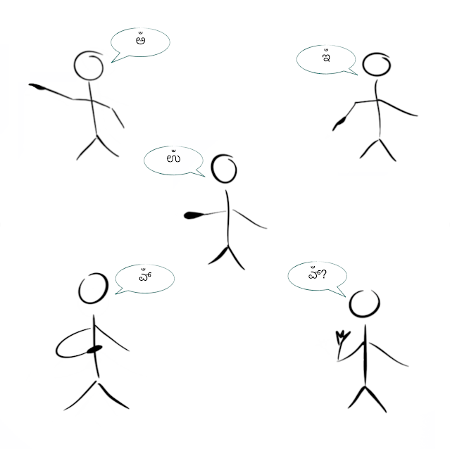

# ಸರ್ವನಾಮಗಳ ಸರ್ಗ

## ಹಿನ್ನಲೆ

[ಪ್ರಸ್ತಾವನೆ](ಪ್ರಸ್ತಾವನೆ%20ಮತ್ತು%20ಪೂರ್ವಪಕ್ಷ.md#ಪ್ರಸ್ತಾವನೆ)ಯಲ್ಲೇ [ಸೂಚಿಸಿ](ಪ್ರಸ್ತಾವನೆ%20ಮತ್ತು%20ಪೂರ್ವಪಕ್ಷ.md#ಸೂಚನೆ)ದಂತೆ, ಕನ್ನಡ ಮತ್ತಿತರ ದ್ರಾವಿಡಭಾಷೆಗಳ ಸರ್ವನಾಮದ ಸಂಶೋಧನೆಯ ಸೂಕ್ಷ್ಮತೆಯಿಂದಾಗಿ ಈ ಲೇಖನವು ತುಸು ನೀಳವೂ, ವಿಸ್ತೃತವೂ ಆಗುವುದು ಅನಿವಾರ್ಯವಾಯಿತು.
ಹಾಗಾಗಿ, ಪ್ರವೇಶ, ಪ್ರಕಾಶನ, ಸಹಯೋಗ, ತಿದ್ದುಪಡಿಗಳ ಅನುಕ್ರಮಗಳ ಸೌಲಭ್ಯ ಮಾತ್ರವಲ್ಲದೆ ಕೆಲವು ತಾಂತ್ರಿಕ ಕಾರಣಗಳಿಂದಲೂ ಈ ಲೇಖನವನ್ನು ಎರಡು ಭಾಗಗಳಲ್ಲಿ ಪ್ರಕಾಶಿಸಿದ್ದೇನೆ.
- [ಪ್ರಸ್ತಾವನೆ ಮತ್ತು ಪೂರ್ವಪಕ್ಷ](ಪ್ರಸ್ತಾವನೆ%20ಮತ್ತು%20ಪೂರ್ವಪಕ್ಷ.md) - ಇಲ್ಲಿ ವಿಷಯದ ಪ್ರಸ್ತಾವನೆ ಹಾಗೂ ಮುಂದಿನ ಸಂಶೋಧನೆ, ವಿಶ್ಲೇಷಣೆಗಳಿಗೆ ಅಗತ್ಯವಾದ ಕನ್ನಡ ಮತ್ತಿತರ ದ್ರಾವಿಡಭಾಷೆಗಳ ಸರ್ವನಾಮರೂಪಗಳನ್ನೂ, ಈ ವಿಷಯದಲ್ಲಿ ನಾನು ಇಲ್ಲಿಯವರೆಗೆ ಕಂಡಿರುವ ಹಲವು ಪೂರ್ವಪಕ್ಷಗಳನ್ನೂ ಕಾಣಬಹುದು.
- [ಸರ್ವನಾಮಗಳ ಸರ್ಗ](#ಸರ್ವನಾಮಗಳ-ಸರ್ಗ) - ಪ್ರಸ್ತುತ ಲೇಖನಭಾಗ.
ಇಲ್ಲಿ ಕನ್ನಡ ಮತ್ತಿತರ ದ್ರಾವಿಡಭಾಷೆಗಳ ಸರ್ವನಾಮಗಳ ಮೂಲಾನ್ವೇಷಣೆಯಿದೆ.
ಹಿಂದಿನ [ಪೂರ್ವಪಕ್ಷ](ಪ್ರಸ್ತಾವನೆ%20ಮತ್ತು%20ಪೂರ್ವಪಕ್ಷ.md#ಪೂರ್ವಪಕ್ಷ)ದ ಭಾಗದಲ್ಲಿರುವ ವಿಚಾರಗಳ ಉಲ್ಲೇಖ, ವಿಶ್ಲೇಷಣೆಗಳನ್ನು, ಹಲವು ಹೊಸ ಸಂಶೋಧಕ ವಿಚಾರಗಳೊಂದಿಗೆ, ಈ ಭಾಗದಲ್ಲಿ ನೋಡಬಹುದು.

## ಅನುವಾದದ ಕುರಿತು / About Translation

ಈ ಲೇಖನದ ಇಂಗ್ಲಿಷ್ ಅನುವಾದವು ಮೊದಲ್ಗೊಂಡಿದ್ದು, ಹಂತ ಹಂತವಾಗಿ ಪೂರ್ಣಗೊಳ್ಳಲಿದೆ.
ಇಲ್ಲಿಯವರೆಗೆ ನಡೆದಿರುವ ಇಂಗ್ಲಿಷ್ ಅನುವಾದವನ್ನು [ಇಲ್ಲಿ](../Provenance%20of%20Pronouns/Provenance%20of%20Pronouns.md) ನೋಡಬಹುದು.

The English translation of this document has started and will be completed progressively over a period of time.
The English translation at its current state can be seen [here](../Provenance%20of%20Pronouns/Provenance%20of%20Pronouns.md).

## ಪರಿವಿಡಿ

- [ಸರ್ವನಾಮಗಳ ಸರ್ಗ](#ಸರ್ವನಾಮಗಳ-ಸರ್ಗ)
- [ಹಿನ್ನಲೆ](#ಹಿನ್ನಲೆ)
- [ಅನುವಾದದ ಕುರಿತು / About Translation](#ಅನುವಾದದ-ಕುರಿತು--about-translation)
- [ಪರಿವಿಡಿ](#ಪರಿವಿಡಿ)
- [ಪರವಾನಗಿ / License](#ಪರವಾನಗಿ--license)
- [ಪ್ರಥಮಪುರುಷ ಸರ್ವನಾಮಗಳ ಮೂಲಧಾತುಗಳು](#ಪ್ರಥಮಪುರುಷ-ಸರ್ವನಾಮಗಳ-ಮೂಲಧಾತುಗಳು)
  - [ದ್ರಾವಿಡಭಾಷೆಗಳು](#ದ್ರಾವಿಡಭಾಷೆಗಳು)
    - [ಕನ್ನಡ, ತಮಿಳು](#ಕನ್ನಡ-ತಮಿಳು)
    - [ಪುಂ, ಸ್ತ್ರೀ, ಪುಂಸ್ತ್ರೀಲಿಂಗರೂಪಗಳಲ್ಲಿ ಕಾಣಿಸುವ ವಕಾರ](#ಪುಂ-ಸ್ತ್ರೀ-ಪುಂಸ್ತ್ರೀಲಿಂಗರೂಪಗಳಲ್ಲಿ-ಕಾಣಿಸುವ-ವಕಾರ)
    - [ನಪುಂಸಕಲಿಂಗರೂಪಗಳು](#ನಪುಂಸಕಲಿಂಗರೂಪಗಳು)
    - [ತುಳುವಿನಲ್ಲಿ ಸಾಮೀಪ್ಯಾರ್ಥಕವಾದ ಉ್‍ಕಾರ](#ತುಳುವಿನಲ್ಲಿ-ಸಾಮೀಪ್ಯಾರ್ಥಕವಾದ-ಉ್ಕಾರ)
    - [ತುಳುವಿನ ಇಕೋ/ಇಗೋ ಎನ್ನುವ ಅರ್ಥದ ಉ್ಂದ](#ತುಳುವಿನ-ಇಕೋಇಗೋ-ಎನ್ನುವ-ಅರ್ಥದ-ಉ್ಂದ)
    - [ಉ ಧಾತುವಿನ ಅರ್ಥ, ಸ್ವರೂಪಗಳು](#ಉ-ಧಾತುವಿನ-ಅರ್ಥ-ಸ್ವರೂಪಗಳು)
    - [ಹವ್ಯಕ ಕನ್ನಡದಲ್ಲಿ ನಪುಂಸಕಲಿಂಗ ಏಕವಚನದ ಆಖ್ಯಾತಪ್ರತ್ಯಯ](#ಹವ್ಯಕ-ಕನ್ನಡದಲ್ಲಿ-ನಪುಂಸಕಲಿಂಗ-ಏಕವಚನದ-ಆಖ್ಯಾತಪ್ರತ್ಯಯ)
    - [ಕನ್ನಡದ ನಪುಂಸಕಲಿಂಗ ಏಕವಚನದ ಆಖ್ಯಾತಪ್ರತ್ಯಯಗಳು](#ಕನ್ನಡದ-ನಪುಂಸಕಲಿಂಗ-ಏಕವಚನದ-ಆಖ್ಯಾತಪ್ರತ್ಯಯಗಳು)
    - [ತಮಿಳಿನ ಅಂದ, ಕನ್ನಡದ ಅಂತ, ಅತ್ತ, ಅಂತುಗಳ ನಂಟು](#ತಮಿಳಿನ-ಅಂದ-ಕನ್ನಡದ-ಅಂತ-ಅತ್ತ-ಅಂತುಗಳ-ನಂಟು)
    - [ಅಂತ/ಇಂತ/ಎಂತಗಳ ಅರ್ಥ, ಪ್ರಕ್ರಿಯೆಗಳು](#ಅಂತಇಂತಎಂತಗಳ-ಅರ್ಥ-ಪ್ರಕ್ರಿಯೆಗಳು)
    - [ಪ್ರಥಮಪುರುಷ ಸರ್ವನಾಮಧಾತುಗಳು (ಅರ್ಧ)ಅನುಸ್ವಾರಾಂತವೇ?](#ಪ್ರಥಮಪುರುಷ-ಸರ್ವನಾಮಧಾತುಗಳು-ಅರ್ಧಅನುಸ್ವಾರಾಂತವೇ)
    - [ಕನ್ನಡದ ಪ್ರಥಮಪುರುಷ ಸರ್ವನಾಮಗಳ, ವಿಭಕ್ತಿಪ್ರತ್ಯಯಗಳ ನಂಟು](#ಕನ್ನಡದ-ಪ್ರಥಮಪುರುಷ-ಸರ್ವನಾಮಗಳ-ವಿಭಕ್ತಿಪ್ರತ್ಯಯಗಳ-ನಂಟು)
    - [ಉದುವೂ, ಉಮುವಿಧಿಯೂ](#ಉದುವೂ-ಉಮುವಿಧಿಯೂ)
      - [ಸೂತ್ತ ೧೩೩](#ಸೂತ್ತ-೧೩೩)
        - [ಸಾರಾಂಶ](#ಸಾರಾಂಶ)
  - [Indo-European ಭಾಷೆಗಳು](#indo-european-ಭಾಷೆಗಳು)
- [ಮಧ್ಯಮಪುರುಷ ಸರ್ವನಾಮಗಳ ಮೂಲಧಾತುಗಳು](#ಮಧ್ಯಮಪುರುಷ-ಸರ್ವನಾಮಗಳ-ಮೂಲಧಾತುಗಳು)
  - [ದ್ರಾವಿಡಭಾಷೆಗಳು](#ದ್ರಾವಿಡಭಾಷೆಗಳು-1)
    - [ನೀನ್/ನಿನ್/ನೀ/ನಿ ಎನ್ನುವುವೇ ಮೂಲ ಮಧ್ಯಮಪುರುಷ ಸರ್ವನಾಮರೂಪಗಳು ಎನ್ನುವುದಕ್ಕೆ ವಿರೋಧವಾಗಿ ಕಾಲ್ಡ್ವೆಲ್ಲರು ಕೊಟ್ಟಿರುವ ಪ್ರಮಾಣಗಳು](#ನೀನ್ನಿನ್ನೀನಿ-ಎನ್ನುವುವೇ-ಮೂಲ-ಮಧ್ಯಮಪುರುಷ-ಸರ್ವನಾಮರೂಪಗಳು-ಎನ್ನುವುದಕ್ಕೆ-ವಿರೋಧವಾಗಿ-ಕಾಲ್ಡ್ವೆಲ್ಲರು-ಕೊಟ್ಟಿರುವ-ಪ್ರಮಾಣಗಳು)
    - [ನೀನ್/ನಿನ್/ನೀ/ನಿ ಎನ್ನುವುವೇ ಮೂಲ ಮಧ್ಯಮಪುರುಷ ಸರ್ವನಾಮರೂಪಗಳು ಎನ್ನುವುದಕ್ಕೆ ಪರವಾಗಿ ಕಾಲ್ಡ್ವೆಲ್ಲರು ಕೊಟ್ಟಿರುವ ಪ್ರಮಾಣಗಳು](#ನೀನ್ನಿನ್ನೀನಿ-ಎನ್ನುವುವೇ-ಮೂಲ-ಮಧ್ಯಮಪುರುಷ-ಸರ್ವನಾಮರೂಪಗಳು-ಎನ್ನುವುದಕ್ಕೆ-ಪರವಾಗಿ-ಕಾಲ್ಡ್ವೆಲ್ಲರು-ಕೊಟ್ಟಿರುವ-ಪ್ರಮಾಣಗಳು)
    - [ಪರ, ವಿರೋಧಗಳ ತುಲನೆ](#ಪರ-ವಿರೋಧಗಳ-ತುಲನೆ)
    - [ಮಧ್ಯಪುರುಷವಾಚಕ ಇಕಾರದಿಂದ ನೀನ್/ನಿನ್ ಎನ್ನುವ ರೂಪಗಳು ಸಿದ್ಧಿಸುವ ಪ್ರಕ್ರಿಯೆ](#ಮಧ್ಯಪುರುಷವಾಚಕ-ಇಕಾರದಿಂದ-ನೀನ್ನಿನ್-ಎನ್ನುವ-ರೂಪಗಳು-ಸಿದ್ಧಿಸುವ-ಪ್ರಕ್ರಿಯೆ)
  - [Indo-European ಭಾಷೆಗಳು](#indo-european-ಭಾಷೆಗಳು-1)
- [ಉತ್ತಮಪುರುಷ ಸರ್ವನಾಮಗಳ ಮೂಲಧಾತುಗಳು](#ಉತ್ತಮಪುರುಷ-ಸರ್ವನಾಮಗಳ-ಮೂಲಧಾತುಗಳು)
  - [ದ್ರಾವಿಡಭಾಷೆಗಳು](#ದ್ರಾವಿಡಭಾಷೆಗಳು-2)
      - [ನಾನ್, ನಾ ಎನ್ನುವುವೇ ಮೂಲ ಉತ್ತಮಪುರುಷ ಸರ್ವನಾಮರೂಪ ಎನ್ನುವುದಕ್ಕೆ ವಿರೋಧವಾಗಿ ಕಾಲ್ಡ್ವೆಲ್ಲರು ಕೊಟ್ಟಿರುವ ಪ್ರಮಾಣಗಳು](#ನಾನ್-ನಾ-ಎನ್ನುವುವೇ-ಮೂಲ-ಉತ್ತಮಪುರುಷ-ಸರ್ವನಾಮರೂಪ-ಎನ್ನುವುದಕ್ಕೆ-ವಿರೋಧವಾಗಿ-ಕಾಲ್ಡ್ವೆಲ್ಲರು-ಕೊಟ್ಟಿರುವ-ಪ್ರಮಾಣಗಳು)
    - [ನಾನ್, ನಾ ಎನ್ನುವುವೇ ಮೂಲ ಉತ್ತಮಪುರುಷ ಸರ್ವನಾಮರೂಪ ಎನ್ನುವುದಕ್ಕೆ ಪರವಾಗಿ ಕಾಲ್ಡ್ವೆಲ್ಲರು ಕೊಟ್ಟಿರುವ ಪ್ರಮಾಣಗಳು](#ನಾನ್-ನಾ-ಎನ್ನುವುವೇ-ಮೂಲ-ಉತ್ತಮಪುರುಷ-ಸರ್ವನಾಮರೂಪ-ಎನ್ನುವುದಕ್ಕೆ-ಪರವಾಗಿ-ಕಾಲ್ಡ್ವೆಲ್ಲರು-ಕೊಟ್ಟಿರುವ-ಪ್ರಮಾಣಗಳು)
    - [ಪರ, ವಿರೋಧಗಳ ತುಲನೆ](#ಪರ-ವಿರೋಧಗಳ-ತುಲನೆ-1)
    - [ಮಾಸ್ತಿಯವರು ಹೇಳಿದ ಕನ್ನಡದ ಆನು, ತೆಲುಗಿನ ಏನುಗಳಗೆ ಮಧ್ಯಸ್ಥವಾದ ಸ್ವರ](#ಮಾಸ್ತಿಯವರು-ಹೇಳಿದ-ಕನ್ನಡದ-ಆನು-ತೆಲುಗಿನ-ಏನುಗಳಗೆ-ಮಧ್ಯಸ್ಥವಾದ-ಸ್ವರ)
    - [ಪ್ರಥಮ, ಮಧ್ಯಮ, ಉತ್ತಮಪುರುಷ ಸರ್ವನಾಮಗಳ ಮೂಲರೂಪದ ಉಪಸಂಹಾರ](#ಪ್ರಥಮ-ಮಧ್ಯಮ-ಉತ್ತಮಪುರುಷ-ಸರ್ವನಾಮಗಳ-ಮೂಲರೂಪದ-ಉಪಸಂಹಾರ)
  - [Indo-European ಭಾಷೆಗಳು](#indo-european-ಭಾಷೆಗಳು-2)
- [ಪ್ರಶ್ನಾರ್ಥಕ ಸರ್ವನಾಮಗಳ ಮೂಲಧಾತುಗಳು](#ಪ್ರಶ್ನಾರ್ಥಕ-ಸರ್ವನಾಮಗಳ-ಮೂಲಧಾತುಗಳು)
  - [ದ್ರಾವಿಡಭಾಷೆಗಳು](#ದ್ರಾವಿಡಭಾಷೆಗಳು-3)
    - [ಪ್ರಶ್ನಾರ್ಥಕ ಸರ್ವನಾಮರೂಪಗಳ ಲಕ್ಷಣಗಳು](#ಪ್ರಶ್ನಾರ್ಥಕ-ಸರ್ವನಾಮರೂಪಗಳ-ಲಕ್ಷಣಗಳು)
    - [ಅ, ಎ, ಯ, ಒ, ವಕಾರಾದಿ ರೂಪಗಳ ಮೂಲ ಪ್ರಶ್ನಾರ್ಥಕ ಸರ್ವನಾಮಧಾತು](#ಅ-ಎ-ಯ-ಒ-ವಕಾರಾದಿ-ರೂಪಗಳ-ಮೂಲ-ಪ್ರಶ್ನಾರ್ಥಕ-ಸರ್ವನಾಮಧಾತು)
    - [ಉತ್ತಮಪುರುಷಾರ್ಥದ ಎ್‍ಕಾರ, ಪ್ರಶ್ನಾರ್ಥಕ ಏ್‍ಕಾರಗಳ ನಡುವಣ ವ್ಯತ್ಯಾಸ](#ಉತ್ತಮಪುರುಷಾರ್ಥದ-ಎ್ಕಾರ-ಪ್ರಶ್ನಾರ್ಥಕ-ಏ್ಕಾರಗಳ-ನಡುವಣ-ವ್ಯತ್ಯಾಸ)
    - [ಕನ್ನಡದ ಪ್ರಶ್ನಾರ್ಥಕ, ಸಂದೇಹಾರ್ಥಕ ಏ, ಆ, ಓಕಾರಗಳ ಹಾಗೂ ಅವಧಾರಣಾರ್ಥಕ ಏಕಾರದ ಹಿಂದಿರುವ ಪ್ರಕ್ರಿಯೆಗಳು](#ಕನ್ನಡದ-ಪ್ರಶ್ನಾರ್ಥಕ-ಸಂದೇಹಾರ್ಥಕ-ಏ-ಆ-ಓಕಾರಗಳ-ಹಾಗೂ-ಅವಧಾರಣಾರ್ಥಕ-ಏಕಾರದ-ಹಿಂದಿರುವ-ಪ್ರಕ್ರಿಯೆಗಳು)
  - [Indo-European ಭಾಷೆಗಳು](#indo-european-ಭಾಷೆಗಳು-3)
- [ಕೆಲವು ಬಿಡಿ ಎಳೆಗಳು](#ಕೆಲವು-ಬಿಡಿ-ಎಳೆಗಳು)
  - [ದ್ರಾವಿಡಭಾಷೆಗಳು](#ದ್ರಾವಿಡಭಾಷೆಗಳು-4)
    - [ಸರ್ವನಾಮಗಳ ಪ್ರಥಮಾ ವಿಭಕ್ತಿಯಲ್ಲೂ, ಗುಣವಾಚಕ, ನಿರ್ದೇಶನಾತ್ಮಕ ರೂಪಗಳಲ್ಲೂ ಕಾಣುವ ಆದಿಯ ದೀರ್ಘಸ್ವರ](#ಸರ್ವನಾಮಗಳ-ಪ್ರಥಮಾ-ವಿಭಕ್ತಿಯಲ್ಲೂ-ಗುಣವಾಚಕ-ನಿರ್ದೇಶನಾತ್ಮಕ-ರೂಪಗಳಲ್ಲೂ-ಕಾಣುವ-ಆದಿಯ-ದೀರ್ಘಸ್ವರ)
- [ಸಾರಾಂಶ](#ಸಾರಾಂಶ-1)
- [ತಿದ್ದುಪಡಿ](#ತಿದ್ದುಪಡಿ)
- [ಸ್ಥಳಾಂತರದ ಕುರಿತು / About Migration](#ಸ್ಥಳಾಂತರದ-ಕುರಿತು--about-migration)

## ಪರವಾನಗಿ / License

## ಪ್ರಥಮಪುರುಷ ಸರ್ವನಾಮಗಳ ಮೂಲಧಾತುಗಳು

### ದ್ರಾವಿಡಭಾಷೆಗಳು

ದ್ರಾವಿಡಭಾಷೆಗಳಲ್ಲಿ ಪ್ರಥಮಪುರುಷ ಸರ್ವನಾಮಗಳ ಮೂಲರೂಪಗಳ ಬಗೆಗೆ, ಮೇಲೆ ಉದ್ಧರಿಸಿದಂತೆ ಎಲ್ಲ ವಿದ್ವಾಂಸರಲ್ಲೂ ಒಂದು ಬಗೆಯ ಸಹಮತವಿರುವುದರಲ್ಲಿ ಆಶ್ಚರ್ಯವೇನಿಲ್ಲ.
ದೂರವಾಚಕ `ಅ`, ಸಾಮೀಪ್ಯವಾಚಕ `ಇ` ಹಾಗೂ ಅನತಿದೂರವಾಚಕ `ಉ` ಎನ್ನುವ ಕೇವಲ ಸ್ವರರೂಪದ ಧಾತುಗಳಿಂದಲೇ ಈ ಎಲ್ಲ ಸರ್ವನಾಮರೂಪಗಳು ಸಿದ್ಧಿಸುವ ಪ್ರಕ್ರಿಯೆ ಸುಲಭವಾಗಿಯೇ ತಿಳಿಯುತ್ತದೆ ಮಾತ್ರವಲ್ಲ, ಆ ವ್ಯವಸ್ಥೆಯ ಸರಳತೆ, ಸೌಂದರ್ಯ, ತಾರ್ಕಿಕತೆಗಳು ದ್ರಾವಿಡಭಾಷಿಗರನ್ನು ಆಶ್ಚರ್ಯಚಕಿತರನ್ನಾಗಿ ಮಾಡದಿದ್ದರೆ, ಆ ಸರಳತೆ, ಸೌಂದರ್ಯ, ತಾರ್ಕಿಕತೆಗಳನ್ನು ಅವರು ಸಹಜವಾಗಿ ಪಡೆದಿರುವುದೇ ಕಾರಣವಿರಬೇಕು.

ಈ ಮೂಲಧಾತುಗಳಿಗೆ ಲಿಂಗ, ವಚನವಾಚಕ ಪ್ರತ್ಯಯಗಳು ಸೇರಿದಾಗ ಪೂರ್ಣ ಸರ್ವನಾಮರೂಪಗಳು ಸಿದ್ಧಿಸುತ್ತವೆ.

#### ಕನ್ನಡ, ತಮಿಳು

&nbsp; | `ಅನ್` (ಪುಲ್ಲಿಂಗ ಏಕವಚನ) | `ಅಳ್` (ಸ್ತ್ರೀಲಿಂಗ ಏಕವಚನ) | `ದು` (ನಪುಂಸಕಲಿಂಗ ಏಕವಚನ) | `ಅರ್` (ಪುಂಸ್ತ್ರೀಲ್ಲಿಂಗ ಉಭಯವಚನ) | `ವು` (ನಪುಂಸಕಲಿಂಗ ಬಹುವಚನ) | ಸವರ್ಣದೀರ್ಘ (ಗುಣವಾಚಕ, ನಿರ್ದೇಶನಾರ್ಥಕ)
--- | --- | --- | --- | --- | --- | ---
ಅ | ಅವನ್ | ಅವಳ್ | ಅದು | ಅವರ್ | ಅವು | ಆ
ಇ | ಇವನ್ | ಇವಳ್ | ಇದು | ಇವರ್ | ಇವು | ಈ
ಉ | ಉವನ್ | ಉವಳ್ | ಉದು | ಉವರ್ | ಉವು | ಊ

ಇಲ್ಲಿ ಹಳಗನ್ನಡದ ರೂಪಗಳನ್ನು ಕೊಟ್ಟಿದ್ದೇನೆ.
ತಮಿಳು, ಹೊಸಗನ್ನಡರೂಪಗಳು ಇದರಿಂದ ಅಲ್ಪಸ್ವಲ್ಪವೇ ಬೇರೆಯಾಗಿರುವುದರಿಂದ, ವಿಸ್ತಾರಭಯದಿಂದ ಇಲ್ಲಿ ನಿರೂಪಿಸಿಲ್ಲ.

#### ಪುಂ, ಸ್ತ್ರೀ, ಪುಂಸ್ತ್ರೀಲಿಂಗರೂಪಗಳಲ್ಲಿ ಕಾಣಿಸುವ ವಕಾರ

ಪುಂ, ಸ್ತ್ರೀ, ಪುಂಸ್ತ್ರೀಲಿಂಗರೂಪಗಳಲ್ಲಿ (`ಅವನ್`, `ಇವಳ್`, `ಉವರ್` ಇತ್ಯಾದಿ.) ವಕಾರವು ಕಾಣಿಸುವುದರ ಹಿಂದಿನ ಪ್ರಕ್ರಿಯೆಯನ್ನು ವಿವರಿಸಬೇಕಾಗುತ್ತದೆ.
ಏಕೆಂದರೆ, ಸಾಮಾನ್ಯವಾಗಿ ಮೂಲಧಾತುಗಳಿಗೆ ಸ್ವರಾದಿಯಾದ (`ಅನ್`, `ಅಳ್`, `ಅರ್` ಇತ್ಯಾದಿ.) ಪ್ರತ್ಯಯಗಳು ಪರವಾದಾಗ ಲೋಪ, ಆಗಮಸಂಧಿಗಳಾಗಿ ಬೇರೆ ರೂಪಗಳು ಸಿದ್ಧಿಸುತ್ತವೆ.
ಉದಾಹರಣೆಗೆ,

- `ಅ + ಅನ್ => ಅನ್` (ಲೋಪಸಂಧಿ)
- `ಇ + ಅಳ್ => ಇಯಳ್` (ಯಕಾರಾಗಮಸಂಧಿ)
- `ಉ + ಅರ್ => ಉವರ್` (ವಕಾರಾಗಮಸಂಧಿ)

ಇವುಗಳಲ್ಲಿ, `ಉವರ್` ಎನ್ನುವ ರೂಪ ಮಾತ್ರ ಕನ್ನಡ, ತಮಿಳುಗಳಲ್ಲಿ ಕಾಣಿಸುತ್ತವೆ.
ಇನ್ನುಳಿದ ರೂಪಗಳು ಕಾಣಿಸುವುದಿಲ್ಲ.

ಹೀಗಿರುವಾಗ, "[ಅನುಸ್ವಾರದ ಅನುಸಾರ](../ಅನುಸ್ವಾರದ%20ಅನುಸಾರ.md#ಅರ್ಧಅನುಸ್ವಾರದ-ಸ್ವರೂಪ)"ವು `ಅವನ್`, `ಇವಳ್` ಇತ್ಯಾದಿಗಳಲ್ಲಿ ವಕಾರವು ಪ್ರಕ್ರಿಯಿಸುವ ದಾರಿಯನ್ನು ತೋರಿಸುತ್ತದೆ.
ಈ ಪ್ರಕ್ರಿಯೆಯಲ್ಲಿ, ಧಾತುಗಳಿಗೆ ಪ್ರತ್ಯಯಗಳು ಪರವಾದಾಗ ಮಧ್ಯವರ್ತಿಯಾಗಿ (ಅರ್ಧ)ಅನುಸ್ವಾರವು ಕಂಡುಬಂದು ವಿವಿಧರೂಪಗಳನ್ನು ತಾಳುತ್ತದೆ.
ಈ ವಿವಿಧರೂಪಗಳಲ್ಲಿ (ಅರ್ಧ)ಅನುಸ್ವಾರವು ಮಕಾರ, ವಕಾರಗಳಾಗುವುದೂ ಸೇರಿವೆ.
ಅಂದರೆ,

- `ಅ + ಁ + ಅನ್ => ಅಁ + ಅನ್ => ಅವನ್`
- `ಇ + ಁ + ಅಳ್ => ಇಁ + ಅಳ್ => ಇವಳ್`

"[ಅನುಸ್ವಾರದ ಅನುಸಾರ](../ಅನುಸ್ವಾರದ%20ಅನುಸಾರ.md#ಅರ್ಧಅನುಸ್ವಾರದ-ಸ್ವರೂಪ)"ದಲ್ಲಿ ಅನ್ ಎನ್ನುವ ಪುಲ್ಲಿಂಗ ಏಕವಚನ ಪ್ರತ್ಯಯದ ಕೊನೆಯಲ್ಲಿರುವ ನಕಾರವೂ ನಿಜವಾಗಿ (ಅರ್ಧ)ಅನುಸ್ವಾರವೇ ಎಂದು ಪ್ರತಿಪಾದಿಸಿದ್ದೇನೆ.
ಅಂದರೆ, `ಅಁ`  ಎನ್ನುದೇ `ಅನ್` ಎನ್ನುವುದರ ಮೂಲರೂಪ.
ಈ ನಿರೂಪಣೆಯಿಂದ, `ಅವನ್` ಎನ್ನುವ ಹಳಗನ್ನಡದ ರೂಪ ಮಾತ್ರವಲ್ಲದೆ, ಹವ್ಯಕ ಕನ್ನಡದ `ಅವಁ`, ಕನ್ನಡದ ಕೆಲವು ಪ್ರಾಂತ್ಯಗಳ ಆಡುಭಾಷೆಗಳಲ್ಲಿ ಕಾಣುವ ನಕಾರವಿಲ್ಲದ `ಅವ` ಎನ್ನುವ ರೂಪಗಳು ಸಿದ್ಧಿಸುವ ಪ್ರಕ್ರಿಯೆಗಳೂ ಸುಲಭವಾಗಿ ತಿಳಿಯುತ್ತದೆ.

- `ಅ + ಁ + ಅಁ => ಅಁ + ಅಁ => ಅವಁ` - ಮೊದಲಿನ (ಅರ್ಧ)ಅನುಸ್ವಾರವು ವಕಾರವಾಗಿದೆ
    - `=> ಅವ` - ಕೊನೆಯ (ಅರ್ಧ)ಅನುಸ್ವಾರವು ಲೋಪವಾಗಿದೆ
    - `=> ಅವನ್` - ಕೊನೆಯ (ಅರ್ಧ)ಅನುಸ್ವಾರವು ನಕಾರವಾಗಿದೆ

ಹೀಗೆ, (ಅರ್ಧ)ಅನುಸ್ವಾರವು ಲೋಪ, ವಕಾರಗಳಾಗುವಾಗ, ಅನತಿದೂರವಾಚಕ `ಉ` ಧಾತುವಿನ ರೂಪಗಳ ಪ್ರಕ್ರಿಯೆಯಲ್ಲೂ (ಅರ್ಧ)ಅನುಸ್ವಾರವು ಮಧ್ಯವರ್ತಿಯಾಗಿ ಬರುತ್ತದೆಂದು ತಾರ್ಕಿಕತೆಗಾಗಿ ನಿರೂಪಿಸಿದರೆ ತಪ್ಪಾಗದು.
ಅಂದರೆ,

- `ಉ + ಁ + ಅರ್ => ಉಁ + ಅರ್ => ಉವರ್` - (ಅರ್ಧ)ಅನುಸ್ವಾರವು ಲೋಪವಾಗಿ `ಉ`, ಅಗಳ ನಡುವೆ ಸ್ವಾಭಾವಿಕ ವಕಾರಾಗಮವಾಗಿದೆ ಎನ್ನಲೂ ಬಹುದು, ಅಥವಾ (ಅರ್ಧ)ಅನುಸ್ವಾರವೇ ವಕಾರವಾಗಿದೆ ಎನ್ನಲೂ ಬಹುದು.

ಇಲ್ಲಿ ಮಾಡಿರುವ (ಅರ್ಧ)ಅನುಸ್ವಾರದ ಪ್ರಕ್ರಿಯೆಯ ನಿರೂಪಣೆಗೆ ಪುಷ್ಟಿಯನ್ನು, ಮುಂದೆ ನಪುಂಸಕಲಿಂಗ ರೂಪಗಳ ಹಾಗೂ ತುಳುವಿನ ಪ್ರಥಮಪುರುಷ ಸರ್ವನಾಮಗಳ ನಿರೂಪಣೆಯಲ್ಲಿ ನೋಡಬಹುದು.

#### ನಪುಂಸಕಲಿಂಗರೂಪಗಳು

ಕನ್ನಡದ ನಪುಂಸಕಲಿಂಗ ಏಕವಚನ ಸರ್ವನಾಮಗಳಲ್ಲಿ `ಅದು`, `ಇದು`, `ಉದು` ಇತ್ಯಾದಿ ದುಕಾರಾಂತವಾದ ರೂಪಗಳೇ ಕನ್ನಡದಲ್ಲಿ ಹೆಚ್ಚಾಗಿ ಕಾಣಿಸುತ್ತವೆ.
ಹೀಗಾಗಿ, `ದು` ಎನ್ನುವುದನ್ನೇ ನಪುಂಸಕಲಿಂಗ ಏಕವಚನದ ಪ್ರತ್ಯಯವೆಂದು ಮೇಲೆ ನಿರೂಪಿಸಿದ್ದೇನೆ.
ಆದರೆ, ಇದು ಪೂರ್ತಿ ಸರಿಯಲ್ಲ ಎನ್ನುವುದಕ್ಕೆ ಕಾರಣಗಳಿವೆ.

ಉದಾಹರಣೆಗೆ, ಕೇಶಿರಾಜನ ಶಬ್ದಮಣಿದರ್ಪಣದ ಸೂತ್ರ [೧೫೮](https://archive.org/details/abdamaidarpaa00kirjuoft/page/212/mode/2up)ರಲ್ಲಿ, ಕನ್ನಡದಲ್ಲಿ ಸಾಮಾನ್ಯವಾಗಿ ಕಾಣುವ `ನಿನ್ನದು`, `ಎನ್ನುದು`, `ತನ್ನದು` ಎನ್ನುವುವಕ್ಕೆ `ನಿನತು`, `ಎನತು`, `ತನತು` ಹಾಗೂ `ನಿನತ್ತು`, `ಎನತ್ತು`, `ತನತ್ತು` ಎನ್ನುವ ರೂಪಗಳನ್ನೂ ನಿರೂಪಿಸಿರುವುದನ್ನು ನೋಡಬಹುದು.
ಈ ರೂಪಗಳು ಹೊಸಗನ್ನಡದಲ್ಲಿ ಕಾಣಿಸುವುದಿಲ್ಲ.
ಇವುಗಳ ಕೊನೆಯಲ್ಲಿ ಕಾಣುವುದು ಕ್ರಮವಾಗಿ `ಅತು`, `ಅತ್ತು`ಗಳೇ ಹೊರತು, `ಅದು` ಅಲ್ಲ.
ಅಂದರೆ,

- `ನಿನ್ + ಅತು => ನಿನತು`
- `ಎನ್ + ಅತ್ತು => ಎನತ್ತು`

ಇದನ್ನು ನೋಡಿದರೆ, `ತು` ಎನ್ನುವುದೇ ನಪುಂಸಕಲಿಂಗ ಏಕವಚನದ ಮೂಲಪ್ರತ್ಯಯವಾಗಿರಬಹುದೇ ಎನ್ನುವ ಸಂಶಯ ಮೂಡುತ್ತದೆ.
ಏಕೆಂದರೆ, ತಕಾರವು ದಕಾರವಾಗುವುದು ಕನ್ನಡಕ್ಕೆ ಮಾತ್ರವಲ್ಲ ಇತರ ದ್ರಾವಿಡಭಾಷೆಗಳಿಗೂ ಸ್ವಾಭಾವಿಕವೇ ಆಗಿರುವ ಪ್ರಕ್ರಿಯೆಯಾಗಿದೆ.

ಇಲ್ಲಿ, `ಅತು`, `ಅತ್ತು` ಎನ್ನುವಲ್ಲಿ ವಿಕಲ್ಪದ್ವಿತ್ವವೇಕಿದೆ ಎನ್ನುವುದಕ್ಕೂ "[ಅನುಸ್ವಾರದ ಅನುಸಾರ](../ಅನುಸ್ವಾರದ%20ಅನುಸಾರ.md#ಉಕಾರಾಂತವಾದ-ನಪುಂಸಕಲಿಂಗದ-ಏಕವಚನದ-ಸರ್ವನಾಮಗಳ-ಚತುರ್ಥೀ-ವಿಭಕ್ತಿರೂಪಗಳಲ್ಲಿರುವ-ಅಕಾರ-ವಿಕಲ್ಪದ್ವಿತ್ವ)"ದಲ್ಲಿ ದಾರಿ ಕಾಣುತ್ತದೆ.
ಮೇಲೆಯೇ ನಿರೂಪಿಸಿದಂತೆ, ಪ್ರಥಮಪುರುಷ ಸರ್ವನಾಮಗಳ ಮೂಲಧಾತುಗಳಿಗೆ ಪ್ರತ್ಯಯಗಳು ಪರವಾದಾಗ ಮಧ್ಯವರ್ತಿಯಾಗಿ (ಅರ್ಧ)ಅನುಸ್ವಾರವು ಕಂಡುಬರುವುದೆಂದುಕೊಂಡರೆ, `ಅತು`, `ಅತ್ತು` ಎನ್ನುವ ಎರಡೂ ರೂಪಗಳು ಸಿದ್ಧಿಸುವುದನ್ನು ನೋಡಬಹುದು.

- `ಅ + ಁ + ತು => ಅಁತು`
    - `=> ಅತು` - (ಅರ್ಧ)ಅನುಸ್ವಾರವು ಲೋಪವಾಗಿದೆ
    - `=> ಅಂತು` - ಈ ಅರ್ಧಾನುಸ್ವಾರವು ಪೂರ್ಣಾನುಸ್ವಾರವಾಗಿರುವ ರೂಪ ಕನ್ನಡದಲ್ಲಿ ಬೇರೆ ಅರ್ಥದಲ್ಲಿ ಕಾಣಿಸುತ್ತದೆ
        - `=> ಅತ್ತು` - ಪೂರ್ಣಾನುಸ್ವಾರವು, ಪರವಾದ ವ್ಯಂಜನಕ್ಕೆ ದ್ವಿತ್ವವನ್ನುಂಟುಮಾಡಿದೆ

ಈ ಪ್ರಕ್ರಿಯೆಗಳ ಬಗೆಗಿನ ವಿವರಗಳನ್ನು "[ಅನುಸ್ವಾರದ ಅನುಸಾರ](../ಅನುಸ್ವಾರದ%20ಅನುಸಾರ.md)"ದಲ್ಲಿ ನೋಡಬಹುದು.
`ಹಳ್ + ಅತು/ಅತ್ತು => ಹಳತು/ಹಳತ್ತು`, `ಹೊಸ್ + ಅತು/ಅತ್ತು => ಹೊಸತು/ಹೊಸತ್ತು` ಇತ್ಯಾದಿ ವಿಕಲ್ಪದ್ವಿತ್ವವಿರುವ ತುಕಾರಾಂತ ರೂಪಗಳು ಹೊಸನ್ನಡದಲ್ಲಿ ಇಂದಿಗೂ ಉಳಿದುಕೊಂಡಿರುವುದು, ತುಕಾರದ, ಮತ್ತದರ ವಿಕಲ್ಪದ್ವಿತ್ವದ ಈ ನಿರೂಪಣೆಯನ್ನು ಬಲಗೊಳಿಸುತ್ತದೆ.

ಹಾಗಾಗಿ, *`ತು` ಎನ್ನುವ ಮೂಲಪ್ರತ್ಯಯದಿಂದಲೇ `ದು` ಎನ್ನುವ ರೂಪ ಸಿದ್ಧಿಸಿದೆ ಎನ್ನಬಹುದು*.
ಅಂದರೆ,

- `ಅತು => ಅದು`

ಆದರೆ, `ನಿನದು`, `ಎನದು`, `ತನದು` ಎನ್ನುವ ರೂಪಗಳು ಕನ್ನಡದಲ್ಲಿ ಕಾಣುವುದಿಲ್ಲ.
ಕೇವಲ `ನಿನ್ನದು`, `ಎನ್ನದು`, `ತನ್ನದು` ಎನ್ನುವ ರೂಪಗಳೇ ಕಾಣಿಸುತ್ತವೆ.
ಇದಕ್ಕೆ, ಕನ್ನಡಕ್ಕೆ ಸ್ವಾಭಾವಿಕವಾದ ದ್ವಿತ್ವಸಂಧಿಯ ಇನ್ನೊಂದು ಪ್ರಕ್ರಿಯೆಯೇ ಕಾರಣ.
ಏಕೆಂದರೆ, `ಅದು` ಎನ್ನುವುದಕ್ಕೆ ಪೂರ್ವಪದವಾಗಿರುವ `ನಿನ್`, `ಎನ್`, `ತನ್` ಎನ್ನುವ ಸರ್ವನಾಮಧಾತುಗಳ ಕೊನೆಯಲ್ಲಿರುವ ಕೇವಲ ವ್ಯಂಜನದ ಹಿಂದೆ ಒಂದೇ ಲಘುವಿದೆ (`ನಿ`, `ಎ`, `ತ`).
ಹೀಗಿರುವ ಪದಕ್ಕೆ ಸ್ವರವು ಪರವಾದಾಗ ಪೂರ್ವಪದಾಂತ್ಯದ ವ್ಯಂಜನವು ದ್ವಿತ್ವವಾಗುವ ದ್ವಿತ್ವಸಂಧಿಯ ಪ್ರಕ್ರಿಯೆ ಕನ್ನಡಕ್ಕೆ ಸ್ವಾಭಾವಿಕ.
ಅಂದರೆ,

- `ನಿನ್ + ಅದು => ನಿನ್ನದು - ಗಂಲಲ (ಗಂ - ಗುರು, ಲ - ಲಘು)`

ಆದರೆ, ದ್ವಿತ್ವವಿಲ್ಲದ `ನಿನದು` (`ಲಲಲ`) ಎನ್ನುವ ರೂಪದಲ್ಲೂ ವರ್ಜ್ಯವಾದ `ಲಗಂ` ಗತಿ ಕಾಣಿಸುವುದಿಲ್ಲ.
`ನಿನ್ನದು` ಎನ್ನುವ ದ್ವಿತ್ವವಿರುವ ರೂಪ ಸಿದ್ಧಿಸುವುದಕ್ಕೆ, ಮೇಲೆ ನಿರೂಪಿಸಿರುವಂತೆ, `ಅದು` ಎನ್ನುವುದರ ನಡುವಲ್ಲಿ ಅಡಗಿರುವ (ಲೋಪವಾಗಿರುವ) (ಅರ್ಧ)ಅನುಸ್ವಾರವೇ ಕಾರಣ.
ಆ (ಅರ್ಧ)ಅನುಸ್ವಾರವು ಕೆಲವು ಪ್ರಕ್ರಿಯಾನುಕ್ರಮಗಳಲ್ಲಿ `ಲಲ` ಅಥವಾ `ಲಗಂ` ರೂಪಗಳನ್ನು ಸಾಧಿಸಲು ಶಕ್ತವಾಗಿದೆ.
ಹಾಗಾಗಿ, ಆ `ಲಲ` ಅಥವಾ `ಲಗಂ` ರೂಪಗಳನ್ನು ತಪ್ಪಿಸಲೆಂದೇ `ನಿನ್ನದು`, `ಎನ್ನದು`, `ತನ್ನದು` ಎಂಬಲ್ಲಿ ನಕಾರಕ್ಕೆ ದ್ವಿತ್ವವು ಕಾಣಿಸುತ್ತದೆ.
ಇದನ್ನು ಎರಡು ರೀತಿ ಪ್ರಕ್ರಿಯಿಸಬಹುದು.

1. `ನಿನ್ + ಅ + ಁ + ತು => (ನಿನ್ + ಅ + ಁ) + ತು => ನಿನ್ನಁ + ತು` - ಏಕೆಂದರೆ, `ನಿನಁ` (ವರ್ಜ್ಯವಾದ) `ಲಲ` ರೂಪವಾಗುತ್ತದೆ
    - `=> ನಿನ್ನಁತು => ನಿನ್ನತು` - (ಅರ್ಧ)ಅನುಸ್ವಾರವು ಲೋಪವಾಗಿದೆ
        - `=> ನಿನ್ನದು`

1. `ನಿನ್ + ಅ + ಁ + ತು => ನಿನ್ + (ಅ + ಁ + ತು) => ನಿನ್ + ಅಁತು => ನಿನ್ + ಅಂತು` - `ಅಂತು` ಎನ್ನುವ ರೂಪ ಕನ್ನಡದಲ್ಲಿ ಬೇರೆ ಅರ್ಥದಲ್ಲಿ ಕಾಣಿಸುತ್ತದೆ
    - `=> ನಿನ್ + ಅಂದು` - `ಅಂದು` ಎನ್ನುವ ರೂಪವೂ ಕನ್ನಡದಲ್ಲಿ ಬೇರೆ ಅರ್ಥದಲ್ಲಿ ಕಾಣಿಸುತ್ತದೆ
        - `=> ನಿನ್ನಂದು` - ಏಕೆಂದರೆ, `ನಿನಂದು` (`ಲಗಂಲ`) `ಲಗಂ` ಗತಿಯಾಗುತ್ತದೆ
            - `=> ನಿನ್ನದು` - ಅನುಸ್ವಾರವು ಲೋಪವಾಗಿದೆ

ಈ ಬಗ್ಗೆ ಹೆಚ್ಚಿನ ವಿವರಗಳನ್ನು "[ವಕಾರದ ವಿಭಕ್ತಿ](../ವಕಾರದ%20ವಿಭಕ್ತಿ.md)"ಯಲ್ಲಿ ನೋಡಬಹುದು.
ಇಲ್ಲಿ `ನಿನತ್ತು`, `ಎನತ್ತು`, `ತನತ್ತು` ಎನ್ನುವಲ್ಲಿ `ಲಗಂ` ಗತಿಯು ಕಾಣಿಸುವುದು "*ವಕಾರದ ವಿಭಕ್ತಿ*"ಯಲ್ಲಿ ನಿರೂಪಿಸಿರುವ `ಲಲ` ರೂಪ, `ಲಗಂ` ಗತಿಗಳನ್ನು ತಪ್ಪಿಸುವ ಕನ್ನಡದ ಸ್ವಭಾವಕ್ಕೆ ಪ್ರತಿಕೂಲವಾಗಿ ಕಂಡರೂ, ಆ ಲೇಖನದಲ್ಲೇ ನಿರೂಪಿಸಿರುವ ಹೆಚ್ಚಿನ ಪ್ರತಿಕೂಲ ಉದಾಹರಣೆಗಳಂತೆ, ಈ ರೂಪಗಳು ಕೇವಲ ಹಳಗನ್ನಡದಲ್ಲಿ ಮಾತ್ರ ಕಂಡುಬಂದು, ಹೊಸಗನ್ನಡದಲ್ಲಿ ಕಾಣೆಯಾಗಿರುವುದು, ಈ ದ್ವಿತ್ವಸಂಧಿಯ ಪ್ರಕ್ರಿಯೆ ಹೊಸಗನ್ನಡದಲ್ಲಿ ಇನ್ನೂ ಪ್ರಬಲವಾಗಿರುವುದಕ್ಕೆ ಒಳ್ಳೆಯ ಸಾಕ್ಷಿಯಾಗುತ್ತದೆ.

#### ತುಳುವಿನಲ್ಲಿ ಸಾಮೀಪ್ಯಾರ್ಥಕವಾದ ಉ್‍ಕಾರ

ಪ್ರಥಮಪುರುಷ ಸರ್ವನಾಮಗಳ ಮಧ್ಯದಲ್ಲಿ (ಅರ್ಧ)ಅನುಸ್ವಾರವು ಅಡಗಿದೆ ಎನ್ನುವ ಮೇಲಿನ ನಿರೂಪಣೆಗೆ ತುಳುವಿನ ಸಾಮೀಪ್ಯವಾಚಕ ಪ್ರಥಮಪುರುಷ ಸರ್ವನಾಮಗಳಲ್ಲಿ (`ಉ್ಂಬ್ಯೆ`, `ಉ್ಂಬಳು್`, `ಉ್ಂದು` ಇತ್ಯಾದಿ), ಬಲವಾದ ಪುಷ್ಟಿ ದೊರೆಯುತ್ತದೆ.
ಇಲ್ಲಿ ಸ್ಪಷ್ಟವಾಗಿ ಪೂರ್ಣಾನುಸ್ವಾರವೇ ಕಾಣಿಸುತ್ತದೆ.
ಪುಂ, ಸ್ತ್ರೀ, ಪುಂಸ್ತ್ರೀಲಿಂಗರೂಪಗಳಲ್ಲಿ ಕಾಣಿಸುವ ಬಕಾರವು ಮೂಲದಲ್ಲಿ ಇರದೆ ಆಮೇಲೆ ಕಾಣಿಸಿಕೊಂಡಿದೆಯೆನಿಸುತ್ತದೆ.
ಅಂದರೆ,

- `ಉ್ + ಁ + ಎ` - ಎಕಾರವೇ ತುಳುವಿನ ಮೂಲ ಪುಲ್ಲಿಂಗ ಏಕವಚನ ಪ್ರತ್ಯಯವಿರಬೇಕು
    - `=> ಉ್ಂ + ಯೆ`- ಅರ್ಧಾನುಸ್ವಾರವು ಪೂರ್ಣಾನುಸ್ವಾರವಾಗಿದೆ, ಎಕಾರದ ಮೊದಲು ಯಕಾರಾಗಮವಾಗಿದೆ
        - `=> ಉ್‍ಂಯೆ` - `ಉ್‍ಮ್ಯೆ`, ಉಚ್ಚಾರದಲ್ಲಿ ಪೂರ್ಣಾನುಸ್ವಾರವು ಅನುನಾಸಿಕ ಮಕಾರವಾಗಿದೆ, `ಉ್‍ಮ್ಯೆ`
            - `=> ಉ್ಂಬ್ಯೆ` - ಉಚ್ಚಾರಣೆ `ಉ್‍ಮ್ಬ್ಯೆ`
- `ಉ್ + ಁ + ಅಳು್` - ಇತರ ದ್ರಾವಿಡಭಾಷೆಗಳಂತೆ, ತುಳುವಿನಲ್ಲೂ `ಅಳು್` ಎನ್ನುವುದು ಸ್ತ್ರೀಲ್ಲಿಂಗ ಏಕವಚನ ಪ್ರತ್ಯಯ
    - `=> ಉ್ಂ + ಅಳು್` - ಅರ್ಧಾನುಸ್ವಾರವು ಪೂರ್ಣಾನುಸ್ವಾರವಾಗಿದೆ
        - `=> ಉ್‍ಮಳು್` - ಪೂರ್ಣಾನುಸ್ವಾರವು ಅನುನಾಸಿಕ ಮಕಾರವಾಗಿದೆ
            - `=> ಉ್ಂಬಳು್` - ಉಚ್ಚಾರಣೆ `ಉ್‍ಮ್ಬಳು್`
- `ಉ್ + ಁ + ದು` - ಇತರ ದ್ರಾವಿಡಭಾಷೆಗಳಂತೆ, ತುಳುವಿನಲ್ಲೂ `ದು` ಎನ್ನುವುದು ನಪುಂಸಕಲಿಂಗ ಏಕವಚನ ಪ್ರತ್ಯಯ
    - `=> ಉ್ಂದು` - ಅರ್ಧಾನುಸ್ವಾರವು ಪೂರ್ಣಾನುಸ್ವಾರವಾಗಿದೆ
- `=> ಉ್ + ಁ + ಎರು್` - `ಎರು್` ಎನ್ನುವುದು ತುಳುವಿನ ಮೂಲ ಪುಂಸ್ತ್ರೀಲ್ಲಿಂಗ (ಏಕ?)ಬಹುವಚನ ಪ್ರತ್ಯಯವಿರಬೇಕು
    - `=> ಉ್ಂ + ಎರು್` - ಅರ್ಧಾನುಸ್ವಾರವು ಪೂರ್ಣಾನುಸ್ವಾರವಾಗಿದೆ
        - `=> ಉ್‍ಮೆರು್` - ಪೂರ್ಣಾನುಸ್ವಾರವು ಅನುನಾಸಿಕ ಮಕಾರವಾಗಿದೆ
            - `=> ಉ್ಂಬೆರು್` - ಉಚ್ಚಾರಣೆ `ಉ್‍ಮ್ಬೆರು್`
- `ಉ್ + ಁ + ಕು್‍ಳು್` - `ಕು್‍ಳು್` ಎನ್ನುವುದು, ಕನ್ನಡದಲ್ಲಿ `ಗಳು` ಎಂಬಂತೆ, ತುಳುವಿನ ಮೂಲ ಬಹುವಚನ ಪ್ರತ್ಯಯವಿರಬೇಕು
    - `=> ಉ್ಂ + ಕು್‍ಳು್` - ಅರ್ಧಾನುಸ್ವಾರವು ಪೂರ್ಣಾನುಸ್ವಾರವಾಗಿದೆ
        - `=> ಉ್‍ಮ್ಕು್‍ಳು್` - ಪೂರ್ಣಾನುಸ್ವಾರವು ಅನುನಾಸಿಕ ಮಕಾರವಾಗಿದೆ
            - `=> ಉ್‍ಮ್ಬು್‍ಕು್‍ಳು್ => ಉ್‍ಮ್ಬಕು್‍ಳು್`

ಇಲ್ಲಿ ಮಕಾರದನಂತರ ಬಕಾರಾಗಮವಾದಂತೆ, ಅನುನಾಸಿಕದನಂತರ ಅದೇ ವರ್ಗದ ಅಲ್ಪಪ್ರಾಣವ್ಯಂಜನದ (ಹೆಚ್ಚಾಗಿ ಮೃದುವ್ಯಂಜನದ) ಆಗಮವಾಗುವುದು ಇತರ ಭಾಷೆಗಳಲ್ಲೂ ಕಾಣುವ ಭಾಷಾಶಾಸ್ತ್ರದ ಶಬ್ದಲೋಕದ ಸಾಮಾನ್ಯ ಪ್ರಕ್ರಿಯೆ.
ಉದಾಹರಣೆಗೆ, ಆಂಗ್ಲರಲ್ಲಿ `Henry` ಎನ್ನುವ ಹೆಸರಿಗೆ `Hendry` ಎನ್ನುವ ವಿಕಲ್ಪರೂಪವೂ ಇರುವುದನ್ನು ನೋಡಬಹುದು.
ಹಾಗೆಯೇ, `Thomson` ಎನ್ನುವುದಕ್ಕೆ `Thompson` ಎನ್ನುವ ವಿಕಲ್ಪರೂಪವೂ ಇದೆ.
ಹಾಗಾಗಿ, *`ಉ್ಂಬ್ಯೆ`, `ಉ್ಂಬಳು್`, `ಉ್ಂಬೆರು್` ಇತ್ಯಾದಿಗಳು ಕ್ರಮವಾಗಿ `ಉ್‍ಮ್ಯೆ`, `ಉ್‍ಮಳು್`,  `ಉ್‍ಮೆರು್` ಎಂಬುವುಗಳಿಂದಲೇ ಸಿದ್ಧಿಸಿವೆ ಎಂದರೆ ತಪ್ಪಾಗದು*.
ಹಾಗೆಯೇ, ಈ ಸರ್ವನಾಮಗಳ ಇಕಾರಾದಿ (`ಇಂಬ್ಯೆ`, `ಇಂಬಳು್` ಇತ್ಯಾದಿ) ರೂಪಗಳು ಆದಿಯ ಮೂಲ "ಅರ್ಧ ಉಕಾರ"ದ ಸವೆತದಿಂದ ಸಿದ್ಧಿಸಿರಬೇಕು ಹಾಗೂ ಮಕಾರಾದಿಯಾದ (`ಮೆಕ್ಳು್`, `ಮೊಕ್ಳು್`, `ಮೆರು್`, `ಮೋಳು್` ಇತ್ಯಾದಿ) ರೂಪಗಳು ಬಕಾರಾಗಮವಾಗದ (`ಉ್‍ಮ್ಕು್‍ಳು್`, `ಉ್‍ಮೆರು್` ಇತ್ಯಾದಿ) ರೂಪಗಳಲ್ಲಿ ಆದಿಯ ಮೂಲ "ಅರ್ಧ ಉಕಾರ"ವು ಲೋಪವಾಗಿ ಸಿದ್ಧಿಸಿರಬೇಕು.

ಈ ನಿರೂಪಣೆಯಿಂದ, *ದ್ರಾವಿಡಭಾಷೆಗಳ ಪ್ರಥಮಪುರುಷ ಸರ್ವನಾಮಗಳ ನಡುವಲ್ಲಿ (ಅರ್ಧ)ಅನುಸ್ವಾರವು ಅಡಗಿದೆ ಎಂದು ಧೈರ್ಯವಾಗಿ ಹೇಳಬಹುದು*.
ಹಾಗೆಯೇ, ಕನ್ನಡದಲ್ಲಿ `ಇವನು`, `ಇವಳು`, `ಇವರು` ಎಂಬುವಲ್ಲಿರುವ ವಕಾರಕ್ಕೂ, `ಉ್ಂಬ್ಯೆ`, `ಉ್ಂಬಳು್`, `ಉ್ಂಬೆರು್` ಎಂಬುವಲ್ಲಿರುವ ಅನುಸ್ವಾರ/ಮಕಾರ, ಬಕಾರಗಳ ನಡುವಿನ ಹತ್ತಿರದ ಸಂಬಂಧವೂ ಈ ನಿರೂಪಣೆಯಿಂದ ಸ್ಪಷ್ಟವಾಗುತ್ತದೆ
ಇಲ್ಲಿ ಮೂಲ (ಅರ್ಧ)ಅನುಸ್ವಾರವೇ, ವಕಾರ, ಮಕಾರ, ಬಕಾರಗಳಾಗಿದೆ.
ವಕಾರ, ಮಕಾರ, ಬಕಾರಗಳಲ್ಲಿರುವ ಉಚ್ಚಾರಣಾಸಾಮ್ಯವೂ ಗಮನಾರ್ಹ.

ಇತರ ದ್ರಾವಿಡಭಾಷೆಗಳಲ್ಲಿ, ಸಾಮೀಪ್ಯವಾಚಕವಾಗಿ `ಇ` ಧಾತುವೂ, ಅನತಿದೂರವಾಚಕವಾಗಿ `ಉ` ಧಾತುವೂ ಕಾಣಿಸುತ್ತದೆ.
ಆದರೆ ತುಳುವಿನಲ್ಲಿ ಸಾಮೀಪ್ಯವಾಚಕವಾಗಿ ಉ್‍ಕಾರವು ಕಾಣಿಸುತ್ತದೆ ಹಾಗೂ ಅನತಿದೂರವಾಚಕವಾದ ಸರ್ವನಾರೂಪಗಳು ಕಾಣಿಸುವುದಿಲ್ಲ.
ಈ ವೈಚಿತ್ರ್ಯದ ಬಗೆಗೆ ಇನ್ನು [ಮುಂದೆ](#ಉ-ಧಾತುವಿನ-ಅರ್ಥ-ಸ್ವರೂಪಗಳು) ನೋಡೋಣ.

#### ತುಳುವಿನ ಇಕೋ/ಇಗೋ ಎನ್ನುವ ಅರ್ಥದ ಉ್ಂದ

ತುಳುವಿನಲ್ಲಿ, `ಉ್ಂದ` ಎನ್ನುವ ಪದ ಕನ್ನಡದ `ಇಕೋ`, `ಇಗೋ` ಎನ್ನುವ ಅರ್ಥದಲ್ಲಿ ಬಳಕೆಯಾಗುತ್ತದೆ.
ಇಲ್ಲೂ, ಉ್‍ಕಾರವು ಸಾಮೀಪ್ಯವಾಚಕವಾಗಿ ಬಳಕೆಯಾಗುವುದನ್ನು ನೋಡಬಹುದು.
ಹಾಗೆಯೇ, ಇಲ್ಲಿ ಅನುಸ್ವಾರವೂ ಕಾಣಿಸುತ್ತದೆ.

#### ಉ ಧಾತುವಿನ ಅರ್ಥ, ಸ್ವರೂಪಗಳು

ತುಳುವಿನಲ್ಲಿ ಸಾಮಾನ್ಯವಾಗಿ ಉ್‍ಕಾರವೇ ಸಾಮೀಪ್ಯವಾಚಕ ಸರ್ವನಾಮಗಳಲ್ಲಿ ಕಂಡುಬರುವುದನ್ನೂ, ತುಳುವಿನಲ್ಲಿ `ಉ್ಂದ` ಎನ್ನುವ ಪದ ಸಾಮೀಪ್ಯವಾಚಕವಾಗಿ (ಕನ್ನಡದ `ಇಕೋ`, `ಇಗೋ` ಎನ್ನುವ ಅರ್ಥದಲ್ಲಿ) ಬಳಕೆಯಾಗುವುದನ್ನೂ ನೋಡಿದಾಗ, ಉಕಾರದ ಅರ್ಥ, ಸ್ವರೂಪಗಳು ಕೇವಲ ಅನತಿದೂರವಾಚಕ ಎನ್ನುವುದಕ್ಕಿಂತಲೂ ಹೆಚ್ಚು ಸೂಕ್ಷ್ರ್ಮವಾಗಿರಬಹುದು ಎನ್ನುವ ಸಂದೇಹ ಮೂಡುತ್ತದೆ.

ಇಲ್ಲಿ, `ಉ` ಧಾತುವಿನ ಸ್ವರೂಪದ ಬಗೆಗಿನ ಸಂದೇಹ, ಉ್‍ಕಾರವೇ ಉಕಾರದ ಮೂಲರೂಪವಿರಬಹುದೇ ಎನ್ನುವುದು.
ತುಳುವಿನಲ್ಲಿ ಉ್‍ಕಾರವಿರುವಲ್ಲೆಲ್ಲ ಕನ್ನಡ, ತೆಲುಗು ಮತ್ತಿತರ ಭಾಷೆಗಳಲ್ಲಿ ಉಕಾರವೇ ಕಾಣಿಸುವುದರಿಂದಲೂ, ತುಳುವಿನಲ್ಲೂ ಅರ್ಥವ್ಯತ್ಯಾಸವಾಗದಿರುವಲ್ಲಿ ಉ್‍ಕಾರಕ್ಕೆ ವಿಕಲ್ಪವಾಗಿ ಉಕಾರವೂ ಕಾಣಿಸುವುದನ್ನು ಗಮನಿಸಿದಾಗ, ಈ ಊಹೆ ಸರಿಯಿರಬಹುದೆನಿಸುತ್ತದೆ.
ಆದರೆ ಇನ್ನೂ ಹೆಚ್ಚಿನ ಮಾಹಿತಿ, ಪ್ರಮಾಣಗಳಿಲ್ಲದೆ ಇದನ್ನು ನಿರ್ಧರಿಸುವುದು ಕಷ್ಟ.

`ಉ` ಧಾತುವಿನ ಅನತಿದೂರವಾಚಕ ಸ್ವತಂತ್ರ ಸರ್ವನಾಮರೂಪಗಳು ಹೆಚ್ಚಿನ ಆಧುನಿಕ ದ್ರಾವಿಡಭಾಷೆಗಳಲ್ಲಿ ವಿರಳವೇ.
ಹೊಸಗನ್ನಡದಲ್ಲಂತೂ ಸ್ವತಂತ್ರ ಸರ್ವನಾಮಗಳಾಗಿ ಕಾಣಿಸುವುದೇ ಇಲ್ಲ.
ಆದರೆ, ಹಲವು ಪದಗಳಲ್ಲಿ ತುಣುಕುಗಳಾಗಿ ಧಾರಾಳವಾಗಿ ಕಾಣಿಸುತ್ತದೆ.
ಉದಾಹರಣೆಗೆ,

- `ನಡೆ + ಉದು => ನಡೆವುದು`
- `ನಡೆ + ಉ => ನಡೆಯು`
    - `ನಡೆಯು + ಉದು => ನಡೆಯುವುದು`
- `ತಿಳಿ + ಉದು => ತಿಳಿವುದು`
- `ತಿಳಿ + ಉ + ಉದು => ತಿಳಿಯುವುದು`
- `ಆ + ದ + ಉದು => ಆದುದು`
- `ಆ + ಉದು => ಆವುದು`
- `ಯಾ + ಉದು => ಯಾವುದು`
- `ಆ + ಉವು => ಆವುವು`
- `ಯಾ + ಉವು => ಯಾವುವು`

ಈ ರೂಪಗಳಲ್ಲಿ ಕಾಣುವ ಉಕಾರವು, ಉತ್ತರ ಕರ್ನಾಟಕದ ಪ್ರಾಂತ್ಯಗಳಲ್ಲಿ ಅಕಾರವಾಗಿ ಕಾಣಿಸುವುದನ್ನು ಗಮನಿಸಬಹುದು.
ಉದಾಹರಣೆಗೆ, [ಅಂಬಿಕಾತನಯದತ್ತ](https://en.wikipedia.org/wiki/D._R._Bendre)ರು ತಮ್ಮ ಪ್ರಸಿದ್ಧವಾದ ಭಾವಗೀತೆ "[ಹೃದಯ ಸಮುದ್ರ](https://jnaanasootaka.blogspot.com/2022/01/blog-post_26.html)"ದಲ್ಲಿ, "*ಮಿಂಚುಬಳಗ ತೆರೆತೆರೆಗಳಾಗಿ `ಅಲೆಯುವದು` ಪುಟ್ಟಪೂರಾ*" ಎಂದಿದ್ದಾರೆ.
ಹಾಗೆಯೇ, ಹವ್ಯಕಕನ್ನಡದಲ್ಲೂ ಹೀಗೆಯೇ ಅಕಾರವಾಗುವದನ್ನು ಕಾಣಬಹುದು.
ಉದಾಹರಣೆಗೆ, `ನಡೆವದು`, `ತಿಳಿವದು` ಇತ್ಯಾದಿ.

ಹೊಸಗನ್ನಡದಲ್ಲಿ ವ್ಯಂಜನಾಂತ ಪದಗಳು ಉಕಾರಾಂತಗಳಾಗುವುದು (`ಕಣ್ => ಕಣ್ಣು`, `ಕಾಲ್ => ಕಾಲು` ಇತ್ಯಾದಿ) ಪ್ರಸಿದ್ಧವೇ ಆಗಿದೆ.
ತೆಲುಗಿನಲ್ಲೂ ಈ ಪ್ರಕ್ರಿಯೆ ಧಾರಾಳವಾಗಿ ಕಾಣಿಸುತ್ತದೆ.
ತುಳು, ತಮಿಳು, ಮಲಯಾಳಗಳ ಆಡುಭಾಷೆಗಳಲ್ಲಿ ಇಂತಹ ವ್ಯಂಜನಾಂತ ಪದಗಳು ಸಾಮಾನ್ಯವಾಗಿ ಉ್‍ಕಾರವಾಗಿ (`ಕಣ್ಣು್`, `ಕಾಲು್ `ಇತ್ಯಾದಿ) ಉಚ್ಚರಿಸುವುದನ್ನು ಕಾಣಬಹುದು.
ಅಲ್ಲದೆ, ಹೊಸಗನ್ನಡದಲ್ಲಿ ಹೀಗೆ ಉಕಾರಾಂತವಾಗಿ ಮಾರ್ಪಟ್ಟಿರುವ ಪದಗಳಿಗೆ ಸ್ವರಾಕ್ಷರವು ಪರವಾದಾಗ ಪೂರ್ವಪದದ ಅಂತ್ಯದ ಉಕಾರವು ಲೋಪವಾಗುವುದೇ ಹೆಚ್ಚು (`ಕಣ್ಣು + ಇಡು => ಕಣ್ಣಿಡು` ಇತ್ಯಾದಿ).

ಹಾಗೆಯೇ, ಹೊಸಗನ್ನಡದ ಆಡುಭಾಷೆಯಲ್ಲಿ ಮೇಲೆ ಹೇಳಿರುವ ಉಕಾರಗಳು ಪದಮಧ್ಯದಲ್ಲೂ ಲೋಪವಾಗುವುದಿದೆ.
ಉದಾಹರಣೆಗೆ, `ಆದುದರಿಂದ => ಆದ್ದರಿಂದ`.

ಹೀಗೆ, ಉಕಾರಕ್ಕೆ ಅಕಾರದ ವಿಕಲ್ಪವಿರುವುದಕ್ಕೂ, ಕೆಲವೊಮ್ಮೆ ಲೋಪವಾಗುವುದಕ್ಕೂ, ಉ್‍ಕಾರವು ಅದರ ಮೂಲರೂಪವಾಗಿರುವುದು ಕಾರಣವಿರಬಹುದೇ ಎಂದು ಸಂದೇಹಿಸಬಹುದು.
ಏಕೆಂದರೆ, ಉ್‍ಕಾರದ ಉಚ್ಚಾರಣೆ ಅಕಾರವಾಗುವುದಕ್ಕೂ, ಲೋಪವಾಗುವುದಕ್ಕೂ ಯೋಗ್ಯವೇ ಆಗಿದೆ.
ಆದರೆ ಇಷ್ಟೇ ಅನುಮಾನಗಳ ಬಲದಲ್ಲಿ ಈ ವಿಷಯವನ್ನು ನಿರ್ಧರಿಸುವುದು ಕಷ್ಟ.
ಹಾಗಾಗಿ, ಈ ವಿಚಾರವನ್ನು ಇಷ್ಟಕ್ಕೇ ನಿಲ್ಲಿಸುತ್ತೇನೆ.

ಅದರೆ, ಈ ಮೇಲಿನ ಉದಾಹರಣೆಗಳು, `ಉ` ಧಾತುವಿನ ಅರ್ಥದ ಬಗೆಗೂ ಬೆಳಕನ್ನು ಚೆಲ್ಲುತ್ತದೆ.
ಹೆಚ್ಚಿನ ವೈಯಾಕರಣರು `ಉ` ಧಾತುವು ಮೂಲತಃ ಅನತಿದೂರವಾಚಕ ಎಂದೇ ಪ್ರತಿಪಾದಿಸಿದ್ದಾರೆ.
ಇದು ಸರಿಯೂ ಆಗಿದೆ.
ಆದರೆ, *`ಉ` ಧಾತುವಿಗೆ ಕೇವಲ ಅನತಿದೂರದ ಆರ್ಥಮಾತ್ರವಿದೆ ಎನ್ನಲಾಗದು*.
*ಅದಕ್ಕೆ ಅನತಿದೂರದೊಂದಿಗೆ ಒಂದು ರೀತಿಯ (ಇಂಗ್ಲಿಷಲ್ಲಿ, "Exhibit A" ಎನ್ನುವಂತಹ)  [ಪ್ರಸ್ತುತಿ](https://www.learnsanskrit.cc/translate?search=prastuti&dir=se)ಯ, [ಪ್ರಸ್ತುತ](https://www.learnsanskrit.cc/translate?search=प्रस्तुत&dir=au)ತೆಯ ಅರ್ಥವೂ ಸೇರಿದೆ* ಎಂದೆನಿಸುತ್ತದೆ.
ಉದಾಹರಣೆಗೆ, ತುಳುವಿನ `ಉ್ಂದ` ಎನ್ನುವಲ್ಲಿ ಪ್ರಸ್ತುತಾರ್ಥವೇ ಇದೆ.
ಕನ್ನಡದಲ್ಲೂ, `ಮಾಡುವುದು`, `ಬರೆದುದು` ಎಂಬುವುಗಳಲ್ಲಿರುವ `ಉದು` ಎಂಬುದು ಕ್ರಿಯೆಯು ಅನತಿದೂರವಾಗಿರುವುದಕ್ಕಿಂತ ಪ್ರಸ್ತುತವಾಗಿರುವುದನ್ನೇ ಸೂಚಿಸುತ್ತದೆ.
*ಪ್ರಸ್ತುತತೆಯಲ್ಲಿ ತಾತ್ವಿಕವೂ, ಕೆಲವೊಮ್ಮೆ ಭೌತಿಕವೂ ಆದ ಅನತಿದೂರಾರ್ಥವೂ ಒಂದು ರೀತಿಯಲ್ಲಿ ಅಡಗಿಯೇ ಇದೆಯಷ್ಟೇ.*
ಹಾಗಾಗಿ, *`ಉ` ಧಾತು ಮೂಲದಲ್ಲಿ ಅನತಿದೂರಾರ್ಥಕವಾದುದು ಎನ್ನುವುದಕ್ಕಿಂತ ಪ್ರಸ್ತುತಾರ್ಥಕವಾದುದು ಎನ್ನುವುದೇ ಸಮಂಜಸವೆನಿಸುತ್ತದೆ*.

*ಪ್ರಸ್ತುತತೆಗೆ ಅನತಿದೂರದಂತೆ ತಾತ್ವಿಕವೂ, ಕೆಲವೊಮ್ಮೆ ಭೌತಿಕವೂ ಆದ ಸಾಮೀಪ್ಯವೂ ಸ್ವಲ್ಪಮಟ್ಟಿಗೆ ಸರಿಹೊಂದುವುದರಿಂದ*, ತುಳುವಿನಲ್ಲಿ ಉ್‍ಕಾರವೇ ಸಾಮೀಪ್ಯಾರ್ಥಕ ಸರ್ವನಾಮಗಳಲ್ಲಿ ಬಳಕೆಯಾಗಿರುವುದರಲ್ಲೂ ತಾತ್ವಿಕ ಯೋಗ್ಯತೆಯಿದೆ.
ಸಭೆ, ಸಮಾರಂಭಗಳಲ್ಲಿ ಗಣ್ಯರನ್ನು ಪ್ರಸ್ತುತಿಸುವಾಗ, ಕನ್ನಡದಲ್ಲಿ `ಇವರು` ಎಂಬ ಸಾಮೀಪ್ಯವಾಚಕ ಸರ್ವನಾಮವನ್ನೇ ಬಳಸುವುದೂ, `ಇ`, `ಉ` ಧಾತುಗಳ ನಡುವೆ ಇರುವ ಹತ್ತಿರದ ಸಂಬಂಧವನ್ನು ಸೂಚಿಸುತ್ತದೆ.
ಹೊಸಗನ್ನಡದಲ್ಲಿ ಈಗ ಪ್ರಸ್ತುತಾರ್ಥದ ಉಕಾರಾದಿಯಾದ ಸರ್ವನಾಮರೂಪಗಳು ಕಣ್ಮರೆಯಾಗಿರುವುದರಿಂದ, ಸಾಮೀಪ್ಯಾರ್ಥದ ಇಕಾರಾದಿಯಾದ ಸರ್ವನಾಮವನ್ನು ಬಳಸುವುದಾಗಿದೆ.
ಕನ್ನಡದಲ್ಲಿ ಉಕಾರಾದಿ ಸರ್ವನಾಮಗಳು ಬಳಕೆಯಲ್ಲಿ ಇನ್ನೂ ಇದ್ದಿದ್ದರೆ, ಇಂತಹ ಸಂದರ್ಭಗಳಲ್ಲಿ `ಉವರು` ಎನ್ನುವುದೇ ಹೆಚ್ಚು ಸೂಕ್ತವಾಗುತ್ತಿತ್ತೇನೋ.
ದೂರವಾಚಕ `ಅ`, ಸಾಮೀಪ್ಯವಾಚಕ `ಇ`, ಪ್ರಸ್ತುತಾರ್ಥಕ `ಉ`, ಈ ಮೂರರಲ್ಲಿ ಒಂದನ್ನು ಕಳೆದುಕೊಳ್ಳುವುದು ಅನಿವಾರ್ಯವಾದಲ್ಲಿ, ಕನ್ನಡದಂತೆ ಪ್ರಸ್ತುತಾರ್ಥಕ `ಉ` ಧಾತುವನ್ನು ಕಳೆದುಕೊಳ್ಳುವುದಕ್ಕಿಂತ, ತುಳುವಿನಂತೆ ಸಾಮೀಪ್ಯಾರ್ಥಕ `ಇ` ಧಾತುವನ್ನು ಕಳೆದುಕೊಳ್ಳುವುದೇ ತಾತ್ವಿಕವಾಗಿ ಸರಿಯೆನಿಸುತ್ತದೆ.
ಆದರೆ ಭಾಷೆಗಳು ಹೀಗೆ ತಾತ್ವಿಕ ಚಿಂತನೆಗೊಳಪಟ್ಟೇ ಬೆಳೆಯುವುದಿಲ್ಲ.
ಆದರೂ, ಭಾಷೆಗಳಲ್ಲಿ ತಾತ್ವಿಕತೆಯು ಬಹುಮಟ್ಟಿಗೆ ಆಡಗಿರುವುದು ಬೆರಗಾಗಿಸುವಂತಿದೆ.
ಈ ಮೂರೂ ಧಾತುಗಳು ಸರಳ, ಸುಂದರ ಹಾಗೂ ತತ್ವಯುತವಾಗಿ ಮೂಲ ದ್ರಾವಿಡಭಾಷೆಯಲ್ಲಿ ಇರುವುದು ನಮ್ಮ ಅದೃಷ್ಟ ಹಾಗೂ ಅವು ವಿವಿಧ ಆಧುನಿಕ ದ್ರಾವಿಡಭಾಷೆಗಳಲ್ಲಿ ಆಂಶಿಕವಾಗಿಯಾದರೂ ಉಳಿದಿರುವುದು ಭಾಷಾಶಾಸ್ತ್ರಜ್ಞರಿಗೆ ಸರ್ವನಾಮಗಳ ಮೂಲರೂಪವನ್ನು ಹುಡುಕಲು ದಾರಿದೀಪವಾಗಿದೆ.

ಮೇಲುನೋಟಕ್ಕೆ, ಅನತಿದೂರಾರ್ಥಕವಾದ `ಉ` ಧಾತು, ದೂರಾರ್ಥಕವಾದ `ಅ` ಧಾತುವಿಗೆ ಹತ್ತಿರವೆನಿಸಿದರೂ (ಉದಾಹರಣೆಗೆ, `ಅಲೆಯುವುದು` ಎನ್ನುವಲ್ಲಿರುವ ಉಕಾರ, ಉತ್ತರಕರ್ನಾಟಕದಲ್ಲಿ `ಅಲೆಯುವದು` ಎಂದು ಅಕಾರವಾಗುವುದು), ಇಲ್ಲಿ ನಿರೂಪಿಸಿದಂತೆ, `ಉ` ಧಾತು ನಿಜವಾಗಿ ಪ್ರಸ್ತುತಾರ್ಥಕವೆನ್ನುವುದನ್ನು ಗಮನಿಸಿದರೆ, `ಉ` ಧಾತು ಅರ್ಥದಲ್ಲಿ ಸಾಮೀಪ್ಯಾರ್ಥಕ `ಇ` ಧಾತುವಿಗೂ ಹತ್ತಿರವೇ ಎನ್ನುವುದು ಸ್ಪಷ್ಟವಾಗುತ್ತದೆ.
`ಉ` ಧಾತುವಿನ ಅರ್ಥದ ಬಗೆಗಿನ ಈ ಸ್ಪಷ್ಟತೆಯಿಂದ, ಮುಂದೆ ಮಧ್ಯಮಪುರುಷ ಸರ್ವನಾಮಗಳ ಮೂಲರೂಪಗಳನ್ನರಸುವಲ್ಲಿ ಸಹಾಯವಾಗುತ್ತದೆ.

#### ಹವ್ಯಕ ಕನ್ನಡದಲ್ಲಿ ನಪುಂಸಕಲಿಂಗ ಏಕವಚನದ ಆಖ್ಯಾತಪ್ರತ್ಯಯ

ಮೇಲೆ ನೋಡಿದಂತೆ, `ಅದು` ಎಂಬ ದೂರವಾಚಕ ಪ್ರಥಮಪುರುಷ ಸಪುಂಸಕಲಿಂಗ ಏಕವಚನದ ಸರ್ವನಾಮಕ್ಕೆ ಹಿಂದೆ `ಅತು`/`ಅತ್ತು` ಎಂಬ ರೂಪಗಳಿದ್ದವು ಎನ್ನುವುದನ್ನು ಮೇಲೆ ನೋಡಿದೆವಷ್ಟೇ.
ಈ ನಿರೂಪಣೆಗೆ ಇನ್ನಷ್ಟು ಪುಷ್ಟಿ ಹವ್ಯಕ ಕನ್ನಡದ ನಪುಂಸಕಲಿಂಗದ ಆಖ್ಯಾತಪ್ರತ್ತಯಗಳಲ್ಲಿ ಸಿಗುತ್ತದೆ.
ಉದಾಹರಣೆಗೆ,

- `ಹೋ + ಅತ್ತು => ಹೋದತ್ತು (ದಕಾರಾಗಮವಾಗಿದೆ)` - ಕನ್ನಡದಲ್ಲಿ, `ಹೋಯಿತು`
- `ತಿನ್ + ಅತ್ತು => ತಿಂದತ್ತು (ದಕಾರಾಗಮವಾಗಿದೆ)` - ಕನ್ನಡದಲ್ಲಿ, `ತಿಂದಿತು`

ಇದೇ ರೀತಿ, ಹಳಗನ್ನಡದ `ಉದು` ಎನ್ನುವ ಅನತಿದೂರಾರ್ಥಕ ಪ್ರಥಮಪುರುಷ ಸಪುಂಸಕಲಿಂಗ ಏಕವಚನದ ಸರ್ವನಾಮಕ್ಕೂ `ಉತು`/`ಉತ್ತು` ಎಂಬ ರೂಪಗಳಿದ್ದವು ಎನ್ನುವುದೂ ಹವ್ಯಕ ಕನ್ನಡದ ನಪುಂಸಕಲಿಂಗದ ಆಖ್ಯಾತಪ್ರತ್ತಯಗಳಿಂದಲೇ ತಿಳಿಯುತ್ತದೆ.
ಉದಾಹರಣೆಗೆ,

- `ಹೋ + ಉತ್ತು => ಹೋವುತ್ತು (ವಕಾರಾಗಮವಾಗಿದೆ)` - ಕನ್ನಡದಲ್ಲಿ, `ಹೋಗುವುದು`
- `ಹೇಳ್ + ಉತ್ತು => ಹೇಳುತ್ತು` - ಕನ್ನಡದಲ್ಲಿ, `ಹೇಳುವುದು`

#### ಕನ್ನಡದ ನಪುಂಸಕಲಿಂಗ ಏಕವಚನದ ಆಖ್ಯಾತಪ್ರತ್ಯಯಗಳು

ಹಳಗನ್ನಡದ `ಉದು` ಎನ್ನುವ ಪ್ರಸ್ತುತಾರ್ಥಕ/ಅನತಿದೂರಾರ್ಥಕ ಪ್ರಥಮಪುರುಷ ಸರ್ವನಾಮವು ಹೊಸಗನ್ನಡದಲ್ಲಿ ಕಣ್ಮರೆಯಾಗಿದ್ದರೂ ನಪುಂಸಕಲಿಂಗ ಏಕವಚನದ ಆಖ್ಯಾತಪ್ರತ್ಯಯವಾಗಿ ಇನ್ನೂ ಉಳಿದುಕೊಂಡಿರುವುದನ್ನು [ಮೇಲೆ](#ಉ-ಧಾತುವಿನ-ಅರ್ಥ-ಸ್ವರೂಪಗಳು)ಯೇ ನೋಡಿದೆವಷ್ಟೇ.
ಅದೇ ರೀತಿ, `ಅನಿತು`/`ಇನಿತು`/`ಎನಿತು` ಎಂಬಲ್ಲಿರುವ `ಇತು` ಎನ್ನುವ ಸಾಮೀಪ್ಯವಾಚಕ ಪ್ರಥಮಪುರುಷ ಸರ್ವನಾಮರೂಪವೂ ಕೆಲವೊಮ್ಮೆ (ಹೊಸಗನ್ನಡದಲ್ಲಿ ಇನ್ನೂ ಹೆಚ್ಚಾಗಿ) ನಪುಂಸಕಲಿಂಗ ಏಕವಚನದ ಆಖ್ಯಾತಪ್ರತ್ಯಯವಾಗಿ ಕಾಣಿಸುವುದಿದೆ.
ಉದಾಹರಣೆಗೆ,

- `ಹೋ + ಇತು => ಹೋಯಿತು (ಯಕಾರಾಗಮವಾಗಿದೆ)`
- `ತಿನ್ + ಇತು => ತಿಂದಿತು (ದಕಾರಾಗಮವಾಗಿದೆ)`
- `ಹೇಳ್ + ಇತು => ಹೇಳಿತು`

ಆದರೆ, ಹಳಗನ್ನಡದಲ್ಲೂ, ಅನೇಕ ಪ್ರಾಂತ್ಯಗಳ ಆಡುಭಾಷೆಯಲ್ಲೂ, ಇಂತಹ ರೂಪಗಳಿಗೆ ವಿಕಲ್ಪವಾಗಿ ಇಕಾರವಿಲ್ಲದ, ಕೇವಲ ತುಕಾರ ಮಾತ್ರವಿರುವ ರೂಪಗಳೂ ಇರುವುದು ಗಮನಾರ್ಹ.
ಉದಾಹರಣೆಗೆ, `ಹೋತು`, `ತಿನ್ತು`, `ಹೇಳ್ತು` ಇತ್ಯಾದಿ.

ಹೀಗೆ, ನಪುಂಸಕಲಿಂಗದ ಆಖ್ಯಾತಪ್ರತ್ಯಯಗಳಲ್ಲಿ ಲಿಂಗವಾಚಕ ಪ್ರತ್ಯಯದ (ಅಂದರೆ, `ತು`, `ಅಁ`/`ಅಂ`/`ಅನ್`, `ಅಳ್` ಇತ್ಯಾದಿಗಳ) ಮೊದಲು, ಸಾಮೀಪ್ಯವಾಚಕ ಇಕಾರವೋ, ಪ್ರಸ್ತುತಾರ್ಥಕ/ಅನತಿದೂರಾರ್ಥಕ ಉಕಾರವೋ ಕೆಲವೊಮ್ಮೆ ಬರುವುದಿದೆ.

#### ತಮಿಳಿನ ಅಂದ, ಕನ್ನಡದ ಅಂತ, ಅತ್ತ, ಅಂತುಗಳ ನಂಟು

ಪ್ರಥಮಪುರುಷದ ನಪುಂಸಕಲಿಂಗ ಏಕವಚನದ ಸರ್ವನಾಮರೂಪಗಳ ಸಂದರ್ಭದಲ್ಲಿ, ನಪುಂಸಕಲಿಂಗ, ಏಕವಚನಸೂಚಕವಾದ `ದು` ಎನ್ನುವ ಪ್ರತ್ಯಯದ ಪೂರ್ವರೂಪ `ತು` ಎಂದಿರಬಹುದು ಎಂದು ಮೇಲೆಯೇ ಊಹಿಸಿದೆ.
ಆ ಸಂದರ್ಭದಲ್ಲಿ, ಸರ್ವನಾಮಗಳ ಧಾತುಗಳಿಗೆ ಪ್ರತ್ಯಯಗಳು ಪರವಾದಾಗ (ಅರ್ಧ)ಅನುಸ್ವಾರವು ಮಧ್ಯವರ್ತಿಯಾಗಿ ಬಂದು ವಿವಿಧರೂಪಗಳನ್ನು ತಾಳುವುದನ್ನೂ ನೋಡಿದೆವಷ್ಟೇ.
ಅಂತಹ ರೂಪಗಳಲ್ಲಿ `ಅತು`, `ಅಂತು`, `ಅತ್ತು`, `ಅದು`, `ಅಂದು` ಎಂಬುವು ಮುಖ್ಯವಾದುವು.
ಅಂದರೆ,

- `ಅ + ಁ + ತು => ಅಁತು`
    - `=> ಅತು` - ಅರ್ಧಾನುಸ್ವಾರವು ಲೋಪವಾಗಿದೆ
    - `=> ಅಂತು` - ಅರ್ಧಾನುಸ್ವಾರವು ಪೂರ್ಣಾನುಸ್ವಾರವಾಗಿದೆ
        - `=> ಅತ್ತು` - ಪೂರ್ಣಾನುಸ್ವಾರವು ತುಕಾರಕ್ಕೆ ದ್ವಿತ್ವವಾಗಿದೆ
    - `=> ಅಁದು` - ತಕಾರವು ದಕಾರವಾಗಿದೆ
        - `=> ಅದು` - ಅರ್ಧಾನುಸ್ವಾರವು ಲೋಪವಾಗಿದೆ
        - `=> ಅಂದು` - ಅರ್ಧಾನುಸ್ವಾರವು ಪೂರ್ಣಾನುಸ್ವಾರವಾಗಿದೆ

ಈ ರೂಪಗಳಲ್ಲಿ, `ಅತು`, `ಅತ್ತು`, `ಅದು` ಎಂಬುವುಗಳು, ಹಳಗನ್ನಡದಲ್ಲೂ, ಹೊಸಗನ್ನಡದ `ಅದು` ಎನ್ನುವ ಅರ್ಥವನ್ನೇ ಸೂಚಿಸುವಂತಿವೆ.
ಆದರೆ, [`ಅಂತು`](https://kn.wiktionary.org/wiki/ಅಂತು), [`ಅಂದು`](https://kn.wiktionary.org/wiki/ಅಂದು) ಎಂಬುವುಗಳು ಬೇರೆ ಅರ್ಥಗಳನ್ನು ಸೂಚಿಸುತ್ತವೆ.
ಈ ಪದಗಳ ಪ್ರಕ್ರಿಯೆಯಿಂದಲೇ, ಸಾಮೀಪ್ಯಾರ್ಥಕವಾದ `ಇತು`, `ಇಂತು`, `ಇತ್ತು`, `ಇದು`, `ಇಂದು` ಎಂಬುವೂ, ಪ್ರಶ್ನಾರ್ಥಕವಾದ `ಎತು`, `ಎಂತು`, `ಎತ್ತು`, `ಎದು`, `ಎಂದು` ಎನ್ನುವ ರೂಪಗಳೂ ಸಿದ್ಧಿಸುತ್ತವೆ.
ಇವುಗಳಲ್ಲೂ, [`ಇಂತು`](https://kn.wiktionary.org/wiki/ಇಂತು), [`ಇಂದು`](https://kn.wiktionary.org/wiki/ಇಂದು), [`ಎಂತು`](https://kn.wiktionary.org/wiki/ಎಂತು), [`ಎಂದು`](https://kn.wiktionary.org/wiki/ಎಂದು) ಎಂಬುವುಗಳು ಬೇರೆ ಅರ್ಥಗಳನ್ನು ಸೂಚಿಸುತ್ತವೆ.
ಕೆಲವು ಪದಗಳು ಕೆಲವು ಪ್ರಾಂತ್ಯಗಳಲ್ಲಿ (ಉದಾಹರಣೆಗೆ, `ಎದು`) ಮಾತ್ರ ಕಂಡುಬರುತ್ತವೆ.
ಇನ್ನು ಕೆಲವು, ಕನ್ನಡದಲ್ಲಿ ಸರ್ವನಾಮರೂಪಗಳಲ್ಲಿ ಕಾಣುವುದೂ ಇಲ್ಲ (ಉದಾಹರಣೆಗೆ, `ಎತು`, `ಎತ್ತು`).

ಹಾಗೆಯೇ, ಇಲ್ಲಿ ಕಾಣುವ ಪದರೂಪಗಳಿಗೆ ಹತ್ತಿರವಾದ ಇನ್ನು ಕೆಲವು ಪದಗಳನ್ನೂ ಗಮನಿಸಬಹುದು.
ಉದಾಹರಣೆಗೆ, `ಅಂತ`, [`ಅತ್ತ`](https://kn.wiktionary.org/wiki/ಅತ್ತ), `ಅನಿತು`.
ಅವುಗಳ ಸಾಮೀಪ್ಯಾರ್ಥಕ `ಇಂತ`, [`ಇತ್ತ`](https://kn.wiktionary.org/wiki/ಇತ್ತ_ಕಡೆಗೆ), `ಇನಿತು` ಹಾಗೂ ಪ್ರಶ್ನಾರ್ಥಕ `ಎಂತ`, [`ಎತ್ತ`](https://kn.wiktionary.org/wiki/ಎತ್ತ), `ಎನಿತು` ಎನ್ನುವ ಪದಗಳೂ ಇವೆ.
ಇವುಗಳಲ್ಲೂ, ಕೆಲವು ಪದಗಳು ಕೆಲವು ಪ್ರಾಂತ್ಯಗಳಲ್ಲಿ (ಉದಾಹರಣೆಗೆ, `ಎಂತ`) ಮಾತ್ರ ಕಂಡುಬರುತ್ತವೆ.

ತಾತ್ವಿಕವಾಗಿ ಒಂದು ಕ್ಷಣ ಆರ್ಥವ್ಯತ್ಯಾಸವನ್ನು ಬದಿಗಿರಿಸಿ, ಕೇವಲ ಪ್ರಕ್ರಿಯಾಸಾಮ್ಯವನ್ನು ಗಮನಿಸೋಣ.
`ಅತು`/`ಇತು`/`ಎತು`, `ಅಂತು`/`ಇಂತು`/`ಎಂತು`, `ಅತ್ತು`/`ಇತ್ತು`/`ಎತ್ತು`, `ಅದು`/`ಇದು`/`ಎದು`, `ಅಂದು`/`ಇಂದು`/`ಎಂದು` ಎಂಬುವುಗಳಲ್ಲಿರುವ ಪ್ರಕ್ರಿಯಾಸಾಮ್ಯವನ್ನು ಮೇಲೆಯೇ ನಿರೂಪಿಸಿದ್ದೇನೆ.
ಇನ್ನು, `ಅಂತ`/`ಇಂತ`/`ಎಂತ`, `ಅತ್ತ`/`ಇತ್ತ`/`ಎತ್ತ`, `ಅನಿತು`/`ಇನಿತು`/`ಎನಿತು` ಎಂಬುವುಗಳು ಸಿದ್ಧಿಸುವ ಪ್ರಕ್ರಿಯೆಗಳನ್ನು ತಿಳಿಯುವುದೂ ಕಷ್ಟವೇನಲ್ಲ.
ಅಂದರೆ,

- `ಅಂತು + ಅ => ಅಂತ`
- `ಇತ್ತು + ಅ => ಇತ್ತ`

`ಅನಿತು`/`ಇನಿತು`/`ಎನಿತು` ಎಂಬುವುಗಳ ಪ್ರಕ್ರಿಯೆಯನ್ನು ತಿಳಿಯಲು "[ಅನುಸ್ವಾರದ ಅನುಸಾರ](../ಅನುಸ್ವಾರದ%20ಅನುಸಾರ.md)"ವು ನೆರವಾಗುತ್ತದೆ.
ಅಂದರೆ, ದೂರವಾಚಕ `ಅ`, ಸಾಮೀಪ್ಯವಾಚಕ `ಇ`, ಪ್ರಶ್ನಾರ್ಥಕ `ಎ` ಧಾತುಗಳಿಗೆ, `ಇತು` ಎನ್ನುವ ಸಾಮೀಪ್ಯವಾಚಕ ನಪುಂಸಕಲಿಂಗ ಏಕವಚನದ ಸರ್ವನಾಮವೇ ಪರವಾದಾಗ, (ಅರ್ಧ)ಅನುಸ್ವಾರವು ಮಧ್ಯವರ್ತಿಯಾಗಿ ಬಂದು, ಆ ಅರ್ಧಾನುಸ್ವಾರವು ನಕಾರವಾಗಿ, `ಅನಿತು`/`ಇನಿತು`/`ಎನಿತು` ಎನ್ನುವ ರೂಪಗಳು ಸಿದ್ಧಿಸುತ್ತವೆ.
ಅಂದರೆ,

- `ಎ + ಁ + ಇತು => ಎನಿತು` - ಅರ್ಧಾನುಸ್ವಾರವು ನಕಾರವಾಗಿದೆ

[ಕನ್ನಡ ಸಾಹಿತ್ಯ ಪರಿಷತ್ತಿ](https://kn.wikipedia.org/wiki/ಕನ್ನಡ_ಸಾಹಿತ್ಯ_ಪರಿಷತ್ತು)ನ [ಕನ್ನಡ ನಿಘಂಟಿ](https://archive.org/download/BVPKSPKANNADANIGHANTUSAMPOORNA)ನಲ್ಲಿ, `ಅನಿತು`/`ಇನಿತು`/`ಎನಿತು`ಗಳಿಗೆ `ಅನಿತ್ತು`/`ಇನಿತ್ತು`/`ಎನಿತ್ತು` ಎಂಬ ರೂಪಗಳನ್ನೂ ಕೊಟ್ಟಿರುವುದನ್ನು ಗಮನಿಸಿದಾಗ, ಹಳಗನ್ನಡದಲ್ಲಿ `ನಿನತು`/`ಎನತು`/`ತನತು`, `ನಿನತ್ತು`/`ಎನತ್ತು`/`ತನತ್ತು` ಎನ್ನುವಲ್ಲಿ `ಅತು`/`ಅತ್ತು`ಗಳಿರುವಂತೆ, `ಇತು`/`ಇತ್ತು`ಗಳೂ ಇದ್ದವೆನ್ನುವುದು ತಿಳಿಯುತ್ತದೆ.
ಹಾಗಾಗಿ, `ಅತು`/`ಅತ್ತು`, `ಇತು`/`ಇತ್ತು`ಗಳ ಇರುವಿಕೆ ಕೇವಲ ಪ್ರಕ್ರಿಯಾಸಾಮ್ಯದಿಂದ ಮಾಡಿದ ಊಹೆಯಾಗಿ ಉಳಿಯುವುದಿಲ್ಲ.
ಹಾಗೆಯೇ, ಅದೇ ನಿಘಂಟಿನಲ್ಲಿ, `ಅನಿತು`/`ಇನಿತು`/`ಎನಿತು`ಗಳ ಪುಂಸ್ತ್ರೀಲಿಂಗ ಬಹುವಚನರೂಪಗಳಾಗಿ `ಅನಿಬರ್`/`ಇನಿಬರ್`/`ಎನಿಬರ್` ಎನ್ನುವುವನ್ನು ಕೊಟ್ಟಿರುವುದನ್ನೂ ಗಮನಿಸಿದಾಗ, `ಅತು`/`ಇತು`, `ಅತ್ತು`/`ಇತ್ತು`ಗಳು ಹಳಗನ್ನಡದಲ್ಲಿ ಪ್ರಥಮಪುರುಷ ನಪುಂಸಕಲಿಂಗ ಏಕವಚನದ ಅರ್ಥದಲ್ಲೇ ಬಳಕೆಯಲ್ಲಿದ್ದವು ಎನ್ನುವುದೂ ತಿಳಿಯುತ್ತದೆ.
ಏಕೆಂದರೆ, `ಅನಿಬರ್`/`ಇನಿಬರ್`/`ಎನಿಬರ್` ಎಂಬುವು ದೂರವಾಚಕ `ಅ`, ಸಾಮೀಪ್ಯವಾಚಕ `ಇ`, ಪ್ರಶ್ನಾರ್ಥಕ `ಎ` ಸರ್ವನಾಮ ಧಾತುಗಳಿಗೆ ಪುಂಸ್ತ್ರೀಲಿಂಗ ಬಹುವಚನರೂಪವಾದ `ಇವರ್` ಎನ್ನುವುದು ಪರವಾಗಿ ಬಂದು ಸಿದ್ಧಿಸಿರುವುದು ಸುಲಭವೇದ್ಯ.
ಅಂದರೆ,

- `ಅ/ಇ/ಎ + ಁ + ಇವರ್ => ಅನಿವರ್/ಇನಿವರ್/ಎನಿವರ್`
    - `=> ಅನಿಬರ್/ಇನಿಬರ್/ಎನಿಬರ್` - ವಕಾರವು ಬಕಾರವಾಗುವುದು ಕನ್ನಡದಲ್ಲಿ ಸಹಜ

ಹೀಗೆ, *`ಅನಿತು`/`ಇನಿತು`/`ಎನಿತು`ಗಳ ಕೊನೆಯಲ್ಲಿ `ಇತು` ಇರುವುದರಲ್ಲಿ ಸಂದೇಹವುಳಿಯುವುದಿಲ್ಲ ಮಾತ್ರವಲ್ಲ ತುಕಾರವೇ ಮೂಲ ನಪುಂಸಕಲಿಂಗ ಏಕವಚನ ಪ್ರತ್ಯಯವೆನ್ನುವುದೂ ಖಚಿತವಾಗುತ್ತದೆ*.
ಏಕೆಂದರೆ, ದ್ರಾವಿಡಭಾಷೆಗಳಲ್ಲಿ ತಕಾರವು ದಕಾರವಾಗುವುದು ಸಹಜ ಪ್ರಕ್ರಿಯೆ;
ಆದರೆ, ದಕಾರವು ತಕಾರವಾಗುವುದು ಅಷ್ಟು ಸಹಜವಲ್ಲ.

ಅರ್ಥವ್ಯತ್ಯಾಸವನ್ನು ಬದಿಗಿಟ್ಟು ಕೇವಲ ಧಾತು, ಪ್ರತ್ಯಯಗಳಿಂದ ಪದರೂಪಗಳು ಸಿದ್ಧಿಸುವ ಪ್ರಕ್ರಿಯೆಗಳನ್ನು ಇಷ್ಟು ಗಮನಿಸಿದ ಮೇಲೆ, ಇನ್ನು ಅರ್ಥವ್ಯತ್ಯಾಸವನ್ನು ಗಮನಿಸೋಣ.
`ಅತು`/`ಅತ್ತು`, `ಇತು`/`ಇತ್ತು`ಗಳು ಹಳಗನ್ನಡದಲ್ಲಿ, ಸ್ವತಂತ್ರವಾಗಿ ಅಲ್ಲದಿದ್ದರೂ, `ನಿನತು`/`ನಿನತ್ತು`, `ಅನಿತು`/`ಅನಿತ್ತು`ಗಳಲ್ಲಿರುವಂತೆ ಇತರ ಪದಗಳ ಭಾಗವಾಗಿ ಪ್ರಥಮಪುರುಷ ನಪುಂಸಕಲಿಂಗ ಏಕವಚನದ ಅರ್ಥದಲ್ಲೇ ಬಳಕೆಯಲ್ಲಿದ್ದದ್ದು ಕಾಣುತ್ತದೆ.
ಆದರೆ, `ಅಂತು`/`ಇಂತು`/`ಎಂತು`, `ಅಂತ`/`ಇಂತ`/`ಎಂತ`, `ಅತ್ತ`/`ಇತ್ತ`/`ಎತ್ತ`, `ಅನಿತು`/`ಇನಿತು`/`ಎನಿತು`ಗಳು ಹಳಗನ್ನಡದಲ್ಲೂ ಪ್ರಥಮಪುರುಷ ನಪುಂಸಕಲಿಂಗ ಏಕವಚನಕ್ಕೆ ಹತ್ತಿರವಿದ್ದರೂ ಸ್ವಲ್ಪ ಬೇರೆಯಾದ ಅರ್ಥದಲ್ಲೇ ಬಳಕೆಯಾಗಿವೆ.
ಹೀಗಿರುವಾಗ, ಕೇವಲ ಧಾತು, ಪ್ರತ್ಯಯಗಳ ಪ್ರಕ್ರಿಯಾಸಾಮ್ಯತೆಯಿಂದ ಈ ಪದಗಳ ಮೂಲವನ್ನು ನಿರ್ಧರಿಸಬಹುದೇ ಎನ್ನುವ ಸಂಶಯ ಸಾಧುವೇ ಆಗಿದೆ.

ಈ (ಅಥವಾ ಇವಕ್ಕೆ ಹತ್ತಿರವಾದ) ಪದಗಳು ಇತರ ದ್ರಾವಿಡಭಾಷೆಗಳಲ್ಲೂ ಕಾಣಿಸುತ್ತವೆ.
ಆದರೆ, ಅಲ್ಲಿ ಅವುಗಳ ಅರ್ಥಗಳು ಕೆಲವೆಡೆ ಕನ್ನಡದಲ್ಲಿರುವಂತೆಯೂ, ಇನ್ನು ಕೆಲವೆಡೆ ಕನ್ನಡದಲ್ಲಿರುವುದಕ್ಕಿಂತಲೂ ಭಿನ್ನವಾಗಿಯೂ ಕಾಣುತ್ತವೆ.

ಉದಾಹರಣೆಗೆ ತಮಿಳಿನಲ್ಲಿ,

- [`ಅಂದು`](https://dsal.uchicago.edu/cgi-bin/app/burrow_query.py?page=1) - (ಲಿಪಿಯಲ್ಲಿ `ಅಂತು`), `ಆ ರೀತಿಯಲ್ಲಿ`, `ಹಾಗೆ`, `ಅಂತು`
- [`ಅಂಱು`](https://jnaanasootaka.blogspot.com/2022/08/ಇನ್ನು) - `ಆ ದಿನ`, `ಅಂದು`
- [`ಅಂದ`](https://dsal.uchicago.edu/cgi-bin/app/burrow_query.py?page=1) - (ಲಿಪಿಯಲ್ಲಿ `ಅಂತ`), `ಅಲ್ಲಿ`, [`ಆ`](https://dravidianlinguisticsblog.wordpress.com/2022/05/16/analysing-itu-இது-and-inta-இந்த/)
- [`ಇಂದ`](https://dsal.uchicago.edu/cgi-bin/app/burrow_query.py?page=38) - (ಲಿಪಿಯಲ್ಲಿ `ಇಂತ`), `ಇಲ್ಲಿ`, [`ಈ`](https://dravidianlinguisticsblog.wordpress.com/2022/05/16/analysing-itu-இது-and-inta-இந்த/)
- [`ಇಂಱು`](https://dsal.uchicago.edu/cgi-bin/app/burrow_query.py?page=38) - `ಈ ದಿನ`, `ಇಂದು`
- [`ಎಂದು`](https://dsal.uchicago.edu/cgi-bin/app/burrow_query.py?page=465) - (ಲಿಪಿಯಲ್ಲಿ `ಎಂತು`), `ಯಾವ ರೀತಿಯಲ್ಲಿ`, `ಹೇಗೆ`, `ಎಂತು`, `ಏನು`, `ಯಾವುದು`
- [`ಎಂದ`](https://dravidianlinguisticsblog.wordpress.com/2022/05/16/analysing-itu-இது-and-inta-இந்த/) - `ಯಾವ`, `ಎಲ್ಲಿ`?
- [`ಎನ್ನ`](https://dsal.uchicago.edu/cgi-bin/app/burrow_query.py?page=465) - `ಏನು`
- [`ಎನ್ನು್‍ಕ್ಕು್`](https://dsal.uchicago.edu/cgi-bin/app/burrow_query.py?page=465) - `ಏಕೆ`, `ಯಾಕೆ`, `ಎಂತಕ್ಕೆ`

ತೆಲುಗಿನಲ್ಲಿ,

- [`ಅಂದಿ`](https://dsal.uchicago.edu/cgi-bin/app/burrow_query.py?page=1) - `ಆ ದಿನ`
- [`ಅಂದು`](https://dsal.uchicago.edu/cgi-bin/app/burrow_query.py?page=1) - `ಅಲ್ಲಿ`
- [`ಅಂತ`](https://dsal.uchicago.edu/cgi-bin/app/burrow_query.py?page=1) - `ಅಷ್ಟು`
- [`ಅಂತು`](https://dsal.uchicago.edu/cgi-bin/app/burrow_query.py?page=1) - `ಅಷ್ಟೂ`?
- [`ಅತ್ತಿ`](https://dsal.uchicago.edu/cgi-bin/app/burrow_query.py?page=1) - `ಆ ಕಡೆಗೆ`, `ಅತ್ತ`
- [`ಇಂತ`](https://dsal.uchicago.edu/cgi-bin/app/burrow_query.py?page=38) - `ಇಷ್ಟು`
- [`ಇಂದು`](https://dsal.uchicago.edu/cgi-bin/app/burrow_query.py?page=38) - `ಇಲ್ಲಿ`
- [`ಎಂದಿ`](https://dsal.uchicago.edu/cgi-bin/app/burrow_query.py?page=465) - `ಯಾವ ದಿನ`
- [`ಎಂದು`](https://dsal.uchicago.edu/cgi-bin/app/burrow_query.py?page=465) - `ಎಲ್ಲಿ`
- [`ಎಂದುಕು`](https://dsal.uchicago.edu/cgi-bin/app/burrow_query.py?page=465) - `ಏಕೆ`, `ಯಾಕೆ`, `ಯಾವುದಕ್ಕೆ`, `ಎಂತಕ್ಕೆ`
- [`ಎಂತ`](https://dsal.uchicago.edu/cgi-bin/app/burrow_query.py?page=465) - `ಎಷ್ಟು`
- [`ಎನ್ನಿ`](https://dsal.uchicago.edu/cgi-bin/app/burrow_query.py?page=465) - `ಎಷ್ಟು`

ಮಲಯಾಳದಲ್ಲಿ,

- [`ಅನ್ನು`](https://jnaanasootaka.blogspot.com/2022/08/ಇನ್ನು) - `ಆಗ`, `ಆ ದಿನ`, `ಅಂದು`
- [`ಇನ್ನು`](https://dsal.uchicago.edu/cgi-bin/app/burrow_query.py?page=38) - `ಈಗ`, `ಈ ದಿನ`, `ಇಂದು`
- [`ಎಂದು`](https://dsal.uchicago.edu/cgi-bin/app/burrow_query.py?page=465) - `ಏನು`, `ಹೇಗೆ`
- [`ಎನ್ನು`](https://dsal.uchicago.edu/cgi-bin/app/burrow_query.py?page=465) - `ಯಾವಾಗ`, `ಯಾವ ದಿನ`, `ಎಂದು` 

ತುಳುವಿನಲ್ಲಿ,

- [`ಆನಿ`](https://jnaanasootaka.blogspot.com/2022/08/ಇನ್ನು) - `ಆ ದಿನ`, `ಅಂದು`
- [`ಇತ್ತೆ`](https://dsal.uchicago.edu/cgi-bin/app/burrow_query.py?page=38) - `ಈಗ`, `ಈ ಸಮಯದಲ್ಲಿ`
- [`ಇನಿ`](https://jnaanasootaka.blogspot.com/2022/08/ಇನ್ನು) - `ಈ ದಿನ`, `ಇಂದು`

ಬೇರೆ ಬೇರೆ ದ್ರಾವಿಡಭಾಷೆಗಳಲ್ಲಿ ಕಾಣುವ ಈ ಪದಗಳು, ಒಂದೇ ರೀತಿಯ ಧಾತು, ಪ್ರತ್ಯಯಗಳ ಪ್ರಕ್ರಿಯಾಂತರಗಳಿಂದ ಸಿದ್ಧಿಸಿದಂತೆಯೇ ಇವೆ.
ಹಾಗೆಯೇ, ಅವುಗಳಲ್ಲಿ ಅರ್ಥವ್ಯತ್ಯಾಸವೂ ಕಾಣುತ್ತದೆ.
ಆದರೆ, ಈ ಅರ್ಥವ್ಯತ್ಯಾಸದಲ್ಲಿ ಸಾಮಾನ್ಯತೆ ಅಷ್ಟಾಗಿ ಕಾಣುವುದಿಲ್ಲ.
ಅಂದರೆ, ಭಾಷೆಯಿಂದ ಭಾಷೆಗೆ ಈ ಪದಗಳ ಅರ್ಥವ್ಯತ್ಯಾಸದಲ್ಲೂ ವ್ಯತ್ಯಾಸವಿದೆ.
ಹೀಗಿರುವಾಗ, ಈ ಪದಗಳು, ಮೂಲದ್ರಾವಿಡಭಾಷೆಯಲ್ಲೇ ಬೇರೆ ಬೇರೆ ಧಾತು, ಪ್ರತ್ಯಯ, ಪ್ರಕ್ರಿಯೆಗಳಿಂದ ಮೂಡಿ, ಹಾಗಾಗಿ ಬೇರೆ ಬೇರೆ ಅರ್ಥಗಳನ್ನು ಪಡೆದಿವೆ ಎನ್ನುವುದು ಸರಿಯೆನಿಸುವುದಿಲ್ಲ.
ಏಕೆಂದರೆ, ಹಾಗಿದ್ದರೆ ಪದರೂಪಸಾಮ್ಯವಿರುತ್ತಿರಲಿಲ್ಲ.
ಅದಕ್ಕಿಂತ ಮೂಲದ್ರಾವಿಡಭಾಷೆಯ ಒಂದೇ ರೀತಿಯ ಧಾತು, ಪ್ರತ್ಯಯಗಳ ಪ್ರಕ್ರಿಯಾಂತರಗಳಿಂದ ವಿವಿಧರೂಪಗಳು ಮೂಡಿದ್ದು, ಅವೆಲ್ಲವುಗಳ ಮೂಲ ಅರ್ಥ ಪ್ರಥಮಪುರುಷ ನಪುಂಸಕಲಿಂಗ ಏಕವಚನ ಸರ್ವನಾದಂತೆಯೇ ಇದ್ದು, ಮುಂದೆ ಕಾಲಕ್ರಮದಲ್ಲಿ ಮೂಲದ್ರಾವಿಡಭಾಷೆಯ ಬೇರೆ ಬೇರೆ ಕವಲುಗಳಲ್ಲಿ ಒಂದೇ ಮೂಲ ಅರ್ಥದ ಈ ಬೇರೆ ಬೇರೆ ಪದಗಳು ಆ ಮೂಲ ಅರ್ಥಕ್ಕೆ ಹತ್ತಿರವೇ ಆದ ಅರ್ಥವೈವಿಧ್ಯವನ್ನು ಬೇರೆ ಬೇರೆ ರೀತಿಯಲ್ಲಿ ಪಡೆದವು ಎನ್ನುವುದೇ ಹೆಚ್ಚು ಸೂಕ್ತ.

ಕನ್ನಡದಲ್ಲಿ ಈ ಪದಗಳು ಅರ್ಥಾಂತರಗೊಂಡ ರೀತಿಯನ್ನು ಹೀಗೆ ಊಹಿಸಬಹುದು.

- `ಅಂದು` - ಮೂಲದಲ್ಲಿ `ಅದು` ಎನ್ನುವಂತೆ `ದೇಶ`(space)ದಲ್ಲಿ ದೂರವಾಚಕ ಸರ್ವನಾಮವು `ಕಾಲ`(time)ದಲ್ಲಿ ದೂರವಾಚಕವಾದಾಗ, `ಆ ದಿನ`, `ಆ ಸಮಯ` ಎನ್ನುವ ಕನ್ನಡದಲ್ಲಿ ಈಗಿರುವ ಅರ್ಥವು ಮೂಡುತ್ತದೆ.

`ಅಂದು` ಎನ್ನುವುದರ ಶಬ್ದಾರ್ಥಗಳ ಸಿದ್ಧಿಗೆ ಇದು ಒಂದು ದಾರಿಯಾಗಬಹುದಾದರೆ, ತಮಿಳು, ಮಲಯಾಳಗಳಲ್ಲಿ ಕ್ರಮವಾಗಿ `ಅಂಱು`, `ಅನ`್ನು ಎನ್ನುವ ರೂಪಗಳು ಕಾಣಿಸುವುದರಿಂದ, `ಅಂದು` ಎನ್ನುವುದೂ ಈ ಗುಂಪಿಗೇ ಸೇರಿ ಈ ಮೂರೂ ರೂಪಗಳು ಯಾವುದೋ ಸಾಮಾನ್ಯ ಪ್ರಕ್ರಿಯೆಯಿಂದ ಸಿದ್ಧಿಸುವುದು ಇನ್ನೊಂದು ದಾರಿಯಾಗಿರಬಹುದು.

- `ಇಂದು` - ಮೂಲದಲ್ಲಿ `ಇದು` ಎನ್ನುವಂತೆ `ದೇಶ`(space)ದಲ್ಲಿ ಸಾಮೀಪ್ಯವಾಚಕ ಸರ್ವನಾಮವು `ಕಾಲ`(time)ದಲ್ಲಿ ಸಾಮೀಪ್ಯವಾಚಕವಾದಾಗ, `ಈ ದಿನ`, `ಈ ಸಮಯ` ಎನ್ನುವ ಕನ್ನಡದಲ್ಲಿ ಈಗಿರುವ ಅರ್ಥವು ಮೂಡುತ್ತದೆ.
`ಇಂದು` ಎನ್ನುವುದರ ಶಬ್ದಾರ್ಥಗಳ ಸಿದ್ಧಿಗೆ ಇದು ಒಂದು ದಾರಿಯಾಗಬಹುದಾದರೆ, ತಮಿಳು, ಮಲಯಾಳಗಳಲ್ಲಿ ಕ್ರಮವಾಗಿ `ಇಂಱು`, `ಇನ್ನು` ಎನ್ನುವ ರೂಪಗಳು ಕಾಣಿಸುವುದರಿಂದ, `ಇಂದು` ಎನ್ನುವುದೂ ಈ ಗುಂಪಿಗೇ ಸೇರಿ ಈ ಮೂರೂ ರೂಪಗಳು ಯಾವುದೋ ಸಾಮಾನ್ಯ ಪ್ರಕ್ರಿಯೆಯಿಂದ ಸಿದ್ಧಿಸುವುದು ಇನ್ನೊಂದು ದಾರಿಯಾಗಿರಬಹುದು.

- `ಎಂದು` - ಈಗ ಕೆಲವೇ ಪ್ರಾಂತ್ಯಗಳ ಕನ್ನಡದಲ್ಲಿ `ಎದು` ಎನ್ನುವುದು `ಯಾವುದು` ಎನ್ನುವ ಅರ್ಥದಲ್ಲಿ ಬಳಕೆಯಲ್ಲಿದೆ.
ಆದರೆ, ಮೇಲೆ ನೋಡಿದಂತೆ, ಪ್ರಕ್ರಿಯಾಧಾರದಿಂದ `ಎದು` ಎನ್ನುವುದೇ `ಯಾವುದು` ಎನ್ನುವುದಕ್ಕಿಂತಲೂ ಮೂಲರೂಪ ಎನ್ನುವುದಕ್ಕೆ ಆಧಾರಗಳಿವೆ.
ಇದನ್ನು ಮುಂದೆ [ಪ್ರಶ್ನಾರ್ಥಕ ಸರ್ವನಾಮ](#ದ್ರಾವಿಡಭಾಷೆಗಳು-3)ಗಳ ಸಂದರ್ಭದಲ್ಲಿ ಹೆಚ್ಚು ವಿವರವಾಗಿ ನೋಡೋಣ.
ಹೀಗಿರುವಾಗ, ಮೂಲದಲ್ಲಿ `ಎದು` ಎನ್ನುವಂತೆ `ದೇಶ`(space)ದಲ್ಲಿ ಪ್ರಶ್ನಾರ್ಥಕ ಸರ್ವನಾಮವು `ಕಾಲ`(time)ದಲ್ಲಿ ಪ್ರಶ್ನಾರ್ಥಕವಾದಾಗ, `ಯಾವ ದಿನ`, `ಯಾವ ಸಮಯ` ಎನ್ನುವ ಕನ್ನಡದಲ್ಲಿ ಈಗಿರುವ ಅರ್ಥವು ಮೂಡುತ್ತದೆ.
ಇದು ಒಂದು ಸಾಧ್ಯತೆಯಾದರೆ, ತಮಿಳಿನ `ಎಂಱು` ಎನ್ನುವುದರೊಂದಿಗೆ ಸಾಮಾನ್ಯ ಪ್ರಕ್ರಿಯೆಯಿಂದ ಸಿದ್ಧಿಸುವುದು ಇನ್ನೊಂದು ಸಾಧ್ಯತೆ.

- `ಅಂತು` - ಮೂಲದಲ್ಲಿ `ಅತು`(`ಅದು`) ಎನ್ನುವಂತೆ `ದೇಶ`(space)ದಲ್ಲಿ ದೂರವಾಚಕ ಸರ್ವನಾಮವು `ರೀತಿ`, `ದಾರಿ` ಎನ್ನುವ ಅರ್ಥದಲ್ಲಿ ದೂರವಾಚಕವಾದಾಗ, `ಆ ರೀತಿ`, `ಆ ದಾರಿಯಲ್ಲಿ`, `ಹಾಗೆ` ಎನ್ನುವ ಕನ್ನಡದಲ್ಲಿ ಈಗಿರುವ ಅರ್ಥವು ಮೂಡುತ್ತದೆ.

- `ಇಂತು` - ಮೂಲದಲ್ಲಿ `ಇತು`(`ಇದು`) ಎನ್ನುವಂತೆ `ದೇಶ`(space)ದಲ್ಲಿ ಸಾಮೀಪ್ಯವಾಚಕ ಸರ್ವನಾಮವು `ರೀತಿ`, `ದಾರಿ` ಎನ್ನುವ ಅರ್ಥದಲ್ಲಿ ಸಾಮೀಪ್ಯವಾಚಕವಾದಾಗ, `ಈ ರೀತಿ`, `ಈ ದಾರಿಯಲ್ಲಿ`, `ಹೀಗೆ` ಎನ್ನುವ ಕನ್ನಡದಲ್ಲಿ ಈಗಿರುವ ಅರ್ಥವು ಮೂಡುತ್ತದೆ.

- `ಎಂತು` - ಮೂಲದಲ್ಲಿ `ಎತು`(`ಎದು`) ಎನ್ನುವಂತೆ `ದೇಶ`(space)ದಲ್ಲಿ ಪ್ರಶ್ನಾರ್ಥಕ ಸರ್ವನಾಮವು `ರೀತಿ`, `ದಾರಿ` ಎನ್ನುವ ಅರ್ಥದಲ್ಲಿ ಪ್ರಶ್ನಾರ್ಥಕವಾದಾಗ, `ಯಾವ ರೀತಿ`, `ಯಾವ ದಾರಿಯಲ್ಲಿ`, `ಹೇಗೆ` ಎನ್ನುವ ಕನ್ನಡದಲ್ಲಿ ಈಗಿರುವ ಅರ್ಥವು ಮೂಡುತ್ತದೆ.

- `ಅತ್ತ` - ಮೂಲದಲ್ಲಿ `ಅತ್ತು`(`ಅದು`) ಎನ್ನುವಂತೆ `ದೇಶ`(space)ದಲ್ಲಿ ದೂರವಾಚಕ ಸರ್ವನಾಮಕ್ಕೆ ಷಷ್ಠೀ ವಿಭಕ್ತಿಪ್ರತ್ಯಯ*ವೂ* ಆದ ಅಕಾರವು ಸೇರಿದಾಗ (ಅಂದರೆ, `ಅತ್ತು + ಅ => ಅತ್ತ`) ಒಂದು ರೀತಿಯ ದೂರವಾಚಕ ಸಂಬಂಧಾರ್ಥವನ್ನು ಸೂಚಿಸುವುದು ಸ್ವಾಭಾವಿಕ.
ಏಕೆಂದರೆ, ಸಂಬಂಧಾರ್ಥವೇ ಷಷ್ಠೀ ವಿಭಕ್ತಿಯ ಪ್ರಮುಖಾರ್ಥ.
ದೂರವಾಚಕ ಸಂಬಂದಾರ್ಥದಲ್ಲಿ ದೂರದ ದಿಕ್ಕಿನ ಅಂಶವೂ ಅಡಕವಾಗಿಯೇ ಇರುವುದರಿಂದ, `ಆ ದಿಕ್ಕು`, `ಆ ಕಡೆ` ಎನ್ನುವ ಕನ್ನಡದಲ್ಲಿ ಈಗಿರುವ ಅರ್ಥವು ಮೂಡುತ್ತದೆ.

- `ಇತ್ತ` - ಮೂಲದಲ್ಲಿ `ಇತ್ತು`(`ಇದು`) ಎನ್ನುವಂತೆ `ದೇಶ`(space)ದಲ್ಲಿ ಸಾಮೀಪ್ಯವಾಚಕ ಸರ್ವನಾಮಕ್ಕೆ ಷಷ್ಠೀ ವಿಭಕ್ತಿಪ್ರತ್ಯಯ*ವೂ* ಆದ ಅಕಾರವು ಸೇರಿದಾಗ  (ಅಂದರೆ, `ಇತ್ತು + ಅ => ಇತ್ತ`) ಒಂದು ರೀತಿಯ ಸಾಮೀಪ್ಯವಾಚಕ ಸಂಬಂಧಾರ್ಥವನ್ನು ಸೂಚಿಸುವುದು ಸ್ವಾಭಾವಿಕ.
ಸಾಮೀಪ್ಯವಾಚಕ ಸಂಬಂಧಾರ್ಥದಲ್ಲಿ ಹತ್ತಿರದ ದಿಕ್ಕಿನ ಅಂಶವೂ ಅಡಕವಾಗಿಯೇ ಇರುವುದರಿಂದ, `ಈ ದಿಕ್ಕು`, `ಈ ಕಡೆ` ಎನ್ನುವ ಕನ್ನಡದಲ್ಲಿ ಈಗಿರುವ ಅರ್ಥವು ಮೂಡುತ್ತದೆ.

- `ಎತ್ತ` - ಮೂಲದಲ್ಲಿ `ಎತ್ತು`(`ಎದು`) ಎನ್ನುವಂತೆ `ದೇಶ`(space)ದಲ್ಲಿ ಪ್ರಶ್ನಾರ್ಥಕ ಸರ್ವನಾಮಕ್ಕೆ ಷಷ್ಠೀ ವಿಭಕ್ತಿಪ್ರತ್ಯಯ*ವೂ* ಆದ ಅಕಾರವು ಸೇರಿದಾಗ  (ಅಂದರೆ, `ಎತ್ತು + ಅ => ಎತ್ತ`) ಒಂದು ರೀತಿಯ ಪ್ರಶ್ನಾರ್ಥಕ ಸಂಬಂಧಾರ್ಥವನ್ನು ಸೂಚಿಸುವುದು ಸ್ವಾಭಾವಿಕ.
ಪ್ರಶ್ನಾರ್ಥಕ ಸಂಬಂದಾರ್ಥದಲ್ಲಿ ದಿಕ್ಕಿನ ಅಂಶವೂ ಅಡಕವಾಗಿಯೇ ಇರುವುದರಿಂದ, `ಯಾವ ದಿಕ್ಕು`, `ಯಾವ ಕಡೆ` ಎನ್ನುವ ಕನ್ನಡದಲ್ಲಿ ಈಗಿರುವ ಅರ್ಥವು ಮೂಡುತ್ತದೆ.

- `ಅಂತ` - ಮೂಲದಲ್ಲಿ `ಅಂತು`(`ಅತು`/`ಅದು`) ಎನ್ನುವಂತೆ `ದೇಶ`(space)ದಲ್ಲಿ ದೂರವಾಚಕ ಸರ್ವನಾಮಕ್ಕೆ ಷಷ್ಠೀ ವಿಭಕ್ತಿಪ್ರತ್ಯಯ*ವೂ* ಆದ ಅಕಾರವು ಸೇರಿದಾಗ (ಅಂದರೆ, `ಅಂತು+ ಅ => ಅಂತ`) ಒಂದು ರೀತಿಯ ದೂರವಾಚಕ ಸಂಬಂಧಾರ್ಥವನ್ನು ಸೂಚಿಸುವುದು ಸ್ವಾಭಾವಿಕ.
ದೂರವಾಚಕ ಸಂಬಂದಾರ್ಥದಲ್ಲಿ ದೂರದ (ಕೆಲವೊಮ್ಮೆ ತಾತ್ವಿಕವಾದ, ಕೆಲವೊಮ್ಮೆ ಭೌತಿಕವಾದ) ದಿಕ್ಕಿನ ಅಂಶವೂ ಅಡಕವಾಗಿಯೇ ಇರುವುದರಿಂದ, `ಆ` ಎನ್ನುವ ಕನ್ನಡದಲ್ಲಿ ಈಗಿರುವ ಅರ್ಥವು ಮೂಡುತ್ತದೆ.
`ಅಂತ` ಎನ್ನುವುದರ ಪ್ರತಿರೂಪದಂತಿರುವ ತಮಿಳಿನ `ಅಂದ`ವೂ (ಲಿಪಿಯಲ್ಲಿ ಅದು `ಅಂತ`ವೇ), ಕನ್ನಡದ `ಆ` ಎನ್ನುವ ಅರ್ಥದಲ್ಲೇ ಬಳಕೆಯಾಗುವುದು ಈ ನಿರೂಪಣೆಯನ್ನು ಬಲಗೊಳಿಸುತ್ತದೆ.
ಆದರೆ, ಈ ಅರ್ಥದ ಬಳಕೆಯೂ, ಕನ್ನಡದಲ್ಲಿ `ಆ` ಎನ್ನುವುದಕ್ಕೆ ಪರ್ಯಾಯವಾಗಿ ಕಾಣುವುದು ವಿರಳ.
`ಹಾಗಂತ`, `ಏನಂತ` ಇತ್ಯಾದಿ ಪದಗಳಲ್ಲಿ ಅವಧಾರಣೆ ಕೊಡಲು ಬಳಕೆಯಾಗುತ್ತದೆನ್ನಬಹುದೇನೋ.

- `ಇಂತ`/`ಇಂದ` - ಮೂಲದಲ್ಲಿ `ಇಂತು`/`ಇಂದು`(`ಇತು`/`ಇದು`) ಎನ್ನುವಂತೆ `ದೇಶ`(space)ದಲ್ಲಿ ಸಾಮೀಪ್ಯವಾಚಕ ಸರ್ವನಾಮಕ್ಕೆ ಷಷ್ಠೀ ವಿಭಕ್ತಿಪ್ರತ್ಯಯ*ವೂ* ಆದ ಅಕಾರವು ಸೇರಿದಾಗ (ಅಂದರೆ, `ಇಂತು/ಇಂದು + ಅ => ಇಂತ/ಇಂದ`) ಒಂದು ರೀತಿಯ ಸಾಮೀಪ್ಯವಾಚಕ ಸಂಬಂಧಾರ್ಥವನ್ನು ಸೂಚಿಸುವುದು ಸ್ವಾಭಾವಿಕ.
ಸಾಮೀಪ್ಯವಾಚಕ ಸಂಬಂದಾರ್ಥದಲ್ಲಿ ಹತ್ತಿರದ (ಕೆಲವೊಮ್ಮೆ ತಾತ್ವಿಕವಾದ, ಕೆಲವೊಮ್ಮೆ ಭೌತಿಕವಾದ) ದಿಕ್ಕಿನ ಅಂಶವೂ ಅಡಕವಾಗಿಯೇ ಇರುವುದರಿಂದ, `ಈ` ಎನ್ನುವ ಕನ್ನಡದಲ್ಲಿ ಈಗಿರುವ ಅರ್ಥವು ಮೂಡುತ್ತದೆ.
`ಇಂತ`/`ಇಂದ` ಎನ್ನುವುದರ ಪ್ರತಿರೂಪದಂತಿರುವ ತಮಿಳಿನ `ಇಂದ`ವೂ (ಲಿಪಿಯಲ್ಲಿ ಅದು `ಇಂತ`ವೇ), ಕನ್ನಡದ `ಈ` ಎನ್ನುವ ಅರ್ಥದಲ್ಲೇ ಬಳಕೆಯಾಗುವುದು ಈ ನಿರೂಪಣೆಯನ್ನು ಬಲಗೊಳಿಸುತ್ತದೆ.
ಆದರೆ, ಈ ಅರ್ಥದ ಬಳಕೆಯೂ, ಕನ್ನಡದಲ್ಲಿ `ಈ` ಎನ್ನುವುದಕ್ಕೆ ಪರ್ಯಾಯವಾಗಿ ಕಾಣುವುದು ವಿರಳ.
ಆದರೆ, `ಇಂತ` ಎನ್ನುವುದು `ಬಾನಿಗಿಂತ`, `ಬೆಟ್ಟಕ್ಕಿಂತ` ಎನ್ನುವಲ್ಲಿ ಪೂರ್ವಪದಕ್ಕಿಂತ ಬೇರೆ (ತಾತ್ವಿಕ/ಭೌತಿಕ) ದಿಕ್ಕನ್ನು ಸೂಚಿಸಲು ಬಳಕೆಯಾಗುವುದನ್ನು ಕಾಣಬಹುದು.
ಹಾಗೆಯೇ, `ಇಂದ` ಎನ್ನುವುದೂ, `ಬಾನಿಂದ`, `ಮರದಿಂದ` ಎನ್ನುವಲ್ಲಿ ಕಾಣಿಸುತ್ತದೆ.
ಈ ವಿಷಯವನ್ನು ಮುಂದೆ ಸ್ವಲ್ಪ ಹೆಚ್ಚು ವಿಸ್ತಾರವಾಗಿ [ಪ್ರಥಮಪುರುಷ ಸರ್ವನಾಮಧಾತುಗಳ ಹಾಗೂ ವಿಭಕ್ತಿ ಪ್ರತ್ಯಯಗಳ ಸಂಬಂಧ](#ಕನ್ನಡದ-ಪ್ರಥಮಪುರುಷ-ಸರ್ವನಾಮಗಳ-ವಿಭಕ್ತಿಪ್ರತ್ಯಯಗಳ-ನಂಟು)
- `ಎಂತ` - ಮೂಲದಲ್ಲಿ `ಎಂತು`(`ಎತು`/`ಎದು`) ಎನ್ನುವಂತೆ `ದೇಶ`(space)ದಲ್ಲಿ ಪ್ರಶ್ನಾರ್ಥಕ ಸರ್ವನಾಮಕ್ಕೆ ಷಷ್ಠೀ ವಿಭಕ್ತಿಪ್ರತ್ಯಯ*ವೂ* ಅದ ಅಕಾರವು ಸೇರಿದಾಗ (ಅಂದರೆ, `ಎಂತು+ ಅ => ಎಂತ`) ಒಂದು ರೀತಿಯ ಪ್ರಶ್ನಾರ್ಥಕ ಸಂಬಂಧಾರ್ಥವನ್ನು ಸೂಚಿಸುವುದು ಸ್ವಾಭಾವಿಕ.
ಪ್ರಶ್ನಾರ್ಥಕ ಸಂಬಂದಾರ್ಥಕ್ಕೂ (`ಯಾವ`, `which`), ಶುದ್ಧ ಪ್ರಶ್ನಾರ್ಥ(`ಏನು`, `what`)ಕ್ಕೂ ಹಲವು ಭಾಷೆಗಳಲ್ಲಿ ಒಂದು ರೀತಿಯ ಸಾಮ್ಯವಿರುವುದನ್ನೂ ಗಮನಿಸಬಹುದು.
ಉದಾಹರಣೆಗೆ, ಇಂಗ್ಲಿಷಲ್ಲಿ, `Which delicacy is this?`, `What delicacy is this?`;
ಕನ್ನಡದಲ್ಲಿ, `ಯಾವ ತಿಂಡಿಯಿದು?`, `ಏನು ತಿಂಡಿಯಿದು?`.
ಹಾಗಾಗಿ, `ಎಂತ` ಎನ್ನುವುದು `ಯಾವ` ಎನ್ನುವಂತೆ ಪ್ರಶ್ನಾರ್ಥಕ ಸಂಬಂಧಾರ್ಥದಲ್ಲೂ, `ಏನು` ಎನ್ನುವಂತೆ ಶುದ್ಧ ಪ್ರಶ್ನಾರ್ಥದಲ್ಲೂ ಬಳಕೆಯಾದರೆ ಆಶ್ಚರ್ಯವೇನಿಲ್ಲ.
ಕರಾವಳಿ, ಹವ್ಯಕ ಕನ್ನಡಗಳಲ್ಲಿ `ಎಂತ` ಎನ್ನುವುದು ಈ ಎರಡೂ ಅರ್ಥದಲ್ಲಿ ಬಳಕೆಯಾಗುತ್ತವೆ.
ಉದಾಹರಣೆಗೆ, `ನೀನು ಎಂತ (`ಎಂತ` = `ಏನು`) ಹೇಳಿದ್ದು?`, `ಅದು ಎಂತ (ಎಂತ = ಯಾವ) ಮರ?`.

- `ಅನಿತು`/`ಇನಿತು`/`ಎನಿತು`, `ಅನಿಬರ್`/`ಇನಿಬರ್`/`ಎನಿಬರ್` - ಮೂಲ ದೂರವಾಚಕ `ಅ`, ಸಾಮೀಪ್ಯವಾಚಕ `ಇ`, ಪ್ರಶ್ನಾರ್ಥಕ `ಎ` ಸರ್ವನಾಮಧಾತುಗಳಿಗೆ, `ಇತು` ಎನ್ನುವ ಮೂಲ ಪ್ರಥಮಪುರುಷ ಸಾಮೀಪ್ಯವಾಚಕ ನಪುಂಸಕಲಿಂಗ ಏಕವಚನಾರ್ಥಕ ಸರ್ವನಾಮರೂಪವು ಪ್ರತ್ಯಯದಂತೆ ಬಂದು `ಅನಿತು`/`ಇನಿತು`/`ಎನಿತು` ಎಂಬ ರೂಪಗಳೂ, `ಇವರ್` ಎನ್ನುವ ಮೂಲ ಪ್ರಥಮಪುರುಷ ಸಾಮೀಪ್ಯವಾಚಕ ಪುಂಸ್ತ್ರೀಲಿಂಗ (ಏಕ?)ಬಹುವಚನಾರ್ಥಕ ಸರ್ವನಾಮರೂಪವು ಪ್ರತ್ಯಯದಂತೆ ಬಂದು `ಅನಿಬರ್`/`ಇನಿಬರ್`/`ಎನಿಬರ್` ಎಂಬ ರೂಪಗಳೂ ಮೂಡಿವೆಯೆಂದು ಮೇಲೆಯೇ ನೋಡಿದ್ದೇವಷ್ಟೇ.
ಇಲ್ಲಿ, ಮೂಲದಲ್ಲಿ ಸಾಮೀಪ್ಯವಾಚಕ ಸರ್ವನಾಮಾರ್ಥದ `ಇತು`, `ಇವರ್` ಎಂಬುವುಗಳು ಬಹುಷಃ ಅಳತೆಯ ಹೋಲಿಕೆಯ ಅರ್ಥದಲ್ಲಿ ಬಳಕೆಯಾಗಿ, `ಅನಿತು`/`ಇನಿತು`/`ಎನಿತು` ಎನ್ನುವಲ್ಲಿ `ಅಷ್ಟು`/`ಇಷ್ಟು`/`ಎಷ್ಟು` ಎನ್ನುವ ಕನ್ನಡದಲ್ಲಿ ಈಗಿರುವ ಆರ್ಥವು ಮೂಡುತ್ತದೆಂದೂ, `ಅನಿಬರ್`/`ಇನಿಬರ್`/`ಎನಿಬರ್` ಎನ್ನುವಲ್ಲೂ `ಅಷ್ಟು`/`ಇಷ್ಟು`/`ಎಷ್ಟು` ಜನರು ಎನ್ನುವುದಕ್ಕೆ ಹತ್ತಿರವಾದ ಆರ್ಥದಲ್ಲಿ ಹಳಗನ್ನಡದಲ್ಲೂ ಬಳಕೆಗೆ ಬಂದಿರಬಹುದೆಂದೂ ಊಹಿಸುವುದು ಕಷ್ಟವಲ್ಲ.

ಹೀಗೆ, ಒಂದೇ ಮೂಲ ಧಾತು, ಪ್ರತ್ಯಯಗಳಿಂದ ಬೇರೆ ಬೇರೆ ಪ್ರಕ್ರಿಯಾನುಕ್ರಮಗಳಲ್ಲಿ ವಿವಿಧಪದರೂಪಗಳು ಸಿದ್ಧಿಸುವಾಗ, ಕಾಲಕ್ರಮದಲ್ಲಿ ಈ ವಿವಿಧರೂಪಗಳಲ್ಲಿ ಅರ್ಥವ್ಯತ್ಯಾಸವುಂಟಾಗುವುದು ಸಹಜ.
ಕೇವಲ ಅರ್ಥವ್ಯತ್ಯಾಸವಿರುವ ಕಾರಣದಿಂದ ಪದಗಳು ಸಿದ್ಧಿಸುವ ಪ್ರಕ್ರಿಯೆಗಳೂ, ಅವುಗಳ ಹಿಂದಿರುವ ಧಾತು, ಪ್ರತ್ಯಯಗಳೂ ಬೇರೆಯಾಗಿರಲೇಬೇಕು ಎನ್ನುವಂತಿಲ್ಲ. 

#### ಅಂತ/ಇಂತ/ಎಂತಗಳ ಅರ್ಥ, ಪ್ರಕ್ರಿಯೆಗಳು

ಮೇಲೆ ನಿರೂಪಿಸಿದ ಪದರೂಪಗಳಲ್ಲಿ, `ಅಂತ`/`ಇಂತ`/`ಎಂತ` ಎಂಬುವುಗಳು, `ಅಂತು`/`ಇಂತು`/`ಎಂತು`ಗಳಿಗೆ ಅಕಾರವು ಪ್ರತ್ಯಯವಾಗಿ ಬಂದು ಸಿದ್ಧಿಸಿವೆಯೆಂಬ ಮೇಲಿನ ನಿರೂಪಣೆಗೆ ವಿರುದ್ಧವಾಗಿ, `ಅಂತಹ`/`ಇಂತಹ`/`ಎಂತಹ` ಎನ್ನವಲ್ಲಿ ಅಂತ್ಯದ ಹಕಾರವು ಲೋಪವಾಗಿ ಸಿದ್ಧಿಸಿವೆ ಎನ್ನುವ ಅಭಿಪ್ರಾಯವು ವ್ಯಾಪಕವಾಗಿದೆ.
`ಅಂತಹ`/`ಇಂತಹ`/`ಎಂತಹ` ಎನ್ನುವ ಅರ್ಥವನ್ನೇ ಸೂಚಿಸುವ `ಅಂಥ`/`ಇಂಥ`/`ಎಂಥ` ಎನ್ನುವಲ್ಲಿ ಅಂತ್ಯದ ಥಕಾರದ ಮಹಾಪ್ರಾಣವು ಅಲ್ಪಪ್ರಾಣವಾಗಿ ಸಿದ್ಧಿಸಿವೆ ಎನ್ನುವುದೂ ಇದೆ.
ಉದಾಹರಣೆಗೆ, [ಕನ್ನಡ ವಿಕ್ಷನರಿ](https://kn.wiktionary.org/wiki/ಮುಖ್ಯ_ಪುಟ)ಯಲ್ಲಿ, [`ಇಂತ`](https://kn.wiktionary.org/wiki/ಇಂತ) ಎನ್ನುವುದನ್ನು [`ಇಂಥ`](https://kn.wiktionary.org/wiki/ಇಂಥ) ಎನ್ನುವುದಕ್ಕೆ ಪರ್ಯಾಯವಾಗಿಯೇ ಪರಿಗಣಿಸಲಾಗಿದೆ.
ಆದರೆ, ಅಚ್ಚಗನ್ನಡದ ಶಬ್ದಗಳಲ್ಲಿ ಮಹಾಪ್ರಾಣಗಳಿಲ್ಲ.
ಸರ್ವನಾಮಗಳು ಹೆಚ್ಚಾಗಿ ಭಾಷೆಯಲ್ಲಿ ಮೂಲಶಬ್ದಗಳೇ ಆಗಿರುವುದು ಭಾಷಾಶಾಸ್ತ್ರದಲ್ಲಿ ಪ್ರಸಿದ್ಧ.
ಹಾಗಾಗಿ, `ಅಂಥ`/`ಇಂಥ`/`ಎಂಥ` ಎಂಬುವುಗಳು, `ಅಂತಹ`/`ಇಂತಹ`/`ಎಂತಹ` ಎಂಬುವುಗಳ ಕೊನೆಯಲ್ಲಿರುವ ತಕಾರ, ಹಕಾರಗಳು ಬೆರೆತು ಮಹಾಪ್ರಾಣವಾದ ಥಕಾರವಾಗಿ ಮೂಡಿವೆ ಎನ್ನುವುದರಲ್ಲಿ ಸಂಶಯವಿಲ್ಲ.
ಹಾಗಾಗಿ, `ಅಂಥ`/`ಇಂಥ`/`ಎಂಥ`ಗಳ ಥಕಾರದ ಮಹಾಪ್ರಾಣವು ಅಲ್ಪವಾಗಿ `ಅಂತ`/`ಇಂತ`/`ಎಂತ`ಗಳಾಗಿವೆ ಎನ್ನುವುದರಲ್ಲಿ ಹುರುಳಿಲ್ಲ.
ಇನ್ನು, `ಅಂತಹ`/`ಇಂತಹ`/`ಎಂತಹ`ಗಳ ಕೊನೆಯ ಹಕಾರವು ಲೋಪವಾಗಿ `ಅಂತ`/`ಇಂತ`/`ಎಂತ`ಗಳಾಗಿವೆ ಎನ್ನುವುದೂ ಪೂರ್ತಿ ಸರಿಯಲ್ಲ.
ಏಕೆಂದರೆ, `ಎಂತ` ಎನ್ನುವುದು ಬಹಳ ವ್ಯಾಪಕವಾಗಿ ಬಳಕೆಯಾಗುವ ಕರಾವಳಿ, ಹವ್ಯಕಕನ್ನಡಗಳಲ್ಲಿ ಅದರ ಅರ್ಥ `ಎಂತಹ` ಎನ್ನುವುದಕ್ಕಿಂತ ಸ್ಪಷ್ಟವಾಗಿಯೇ ಬೇರೆಯಾಗಿದೆ.

`ಅಂತಹ`/`ಇಂತಹ`/`ಎಂತಹ`ಗಳು, `ಅಂತು`/`ಇಂತು`/`ಎಂತು`ಗಳಿಗೆ ಅಹ (ಹಳಗನ್ನಡಲ್ಲಿ ಅಪ್ಪ) ಸೇರಿ ಸಿದ್ಧಿಸಿವೆ.
ಅಂದರೆ,

- `ಅಂತು/ಇಂತು/ಎಂತು + ಅಪ್ಪ => ಅಂತಪ್ಪ/ಇಂತಪ್ಪ/ಎಂತಪ್ಪ => ಅಂತಹ/ಇಂತಹ/ಎಂತಹ`

ಇಲ್ಲಿ ಈ ಪದಗಳ ಅರ್ಥ, `ಹಾಗಿರುವ`/`ಹೀಗಿರುವ`/`ಹೇಗಿರುವ` ಎಂದಾಗಿದೆ.
ಈ ಪ್ರಕ್ರಿಯೆಯಂತೆ, `ಅಂತ`/`ಇಂತ`/`ಎಂತ`ಗಳು `ಅಂತಹ`/`ಇಂತಹ`/`ಎಂತಹ`ಗಳ ಅರ್ಥದಲ್ಲೇ ಇತರ ಪ್ರಾಂತ್ಯಗಳಲ್ಲಿ ಬಳಕೆಯಾದರೂ, ಕರಾವಳಿ, ಹವ್ಯಕ ಕನ್ನಡಗಳಲ್ಲಿ `ಎಂತ` ಎನ್ನುವುದು `ಎಂತಹ`/`ಹೇಗಿರುವ` ಎನ್ನುವ ಅರ್ಥದಲ್ಲಿ ಬಳಸುವುದಿಲ್ಲ.
ಉದಾಹರಣೆಗೆ,

- `ಈಗ ಎಂತ ಮಾಡುದು?` - ಅಂದರೆ, `ಈಗ ಏನು ಮಾಡುವುದು?`
- `ಎಂತ ಹೇಳ್ತಾ ಇದ್ದಿ?` - ಅಂದರೆ, `ಏನು ಹೇಳ್ತಾ ಇದ್ದಿ?`
- `ನಿಂಗೆ ಇಲ್ಲಿ ಎಂತ ಕೆಲಸ?` - ಅಂದರೆ, `ನಿನಗೆ ಇಲ್ಲಿ ಏನು ಕೆಲಸ?`
- `ಅದು ಎಂತ ಮರ?` - ಅಂದರೆ, `ಅದು ಯಾವ ಮರ?` ಇಲ್ಲಿ, `ಅದು ಎಂತಹ ಮರ` ಎನ್ನುವುದೂ ಸರಿಯೆನಿಸದರೂ, ಮೇಲಿನ ಪ್ರಯೋಗಗಳಿಂದ, `ಅದು ಯಾವ ಮರ` ಎನ್ನುವ ಅರ್ಥವೇ ಸರಿಯೆನಿಸುತ್ತದೆ.
`ಯಾವ`, `ಏನು` ಎನ್ನುವ ಪ್ರಶ್ನಾರ್ಥಕ ಸಂಬಂಧಾರ್ಥಕ್ಕೂ, ಪ್ರಶ್ನಾರ್ಥಕ್ಕೂ ಹತ್ತಿರದ ಸಂಬಂಧವಿರುವುದನ್ನು ಮೇಲೆಯೇ ನೋಡಿದ್ದೇವೆ.
- `ನೀನು ಎಂತಕ್ಕೆ ಇಲ್ಲಿ ಬಂದದ್ದು?` - ಅಂದರೆ, `ನೀನು ಯಾಕೆ ಇಲ್ಲಿಗೆ ಬಂದದ್ದು?` ತಮಿಳಿನ `ಎನ್ನು್‍ಕ್ಕು್` ಎನ್ನುವುದಕ್ಕೂ ಇದೇ ಅರ್ಥವಿರುವುದನ್ನು ಗಮನಿಸಬಹುದು.

ಈ ಉದಾಹರಣೆಗಳಿಂದ, ಈ ಅರ್ಥದಲ್ಲಿ ಕರಾವಳಿ, ಹವ್ಯಕ ಕನ್ನಡಗಳಲ್ಲಿ ಬಳಕೆಯಾಗುವ `ಎಂತ` ಎನ್ನುವುದು `ಎಂತಹ` ಎನ್ನುವುದಕ್ಕಿಂದ `ಎತು`/`ಎದು` ಎನ್ನುವ ಮೂಲ ಪ್ರಶ್ನಾರ್ಥಕ ಸರ್ವನಾಮದ ಪ್ರಕ್ರಿಯಾಂತರದಿಂದ ಸಿದ್ದಿಸಿದ, ಅದೇ ಅರ್ಥದ, `ಎಂತು` ಎನ್ನುವುದರಿಂದಲೇ ಪ್ರಕ್ರಿಯಿಸಿ ಬಳಕೆಗೆ ಬಂದಿದೆಯೆನ್ನುವುದು ಸ್ಪಷ್ಟವಾಗುತ್ತದೆ.
`ಅಂತ`/`ಇಂತ`/`ಎಂತ`ಗಳು `ಅಂತಹ`/`ಇಂತಹ`/`ಎಂತಹ`ಗಳಿಂದಲ್ಲದೆ ಸಿದ್ಧಿಸುವ ಬೇರೆ ಪ್ರಕ್ರಿಯೆಗಳು ಇಲ್ಲದಿದ್ದರೆ, ಇವುಗಳಿಗೆ `ಅಂತಹ`/`ಇಂತಹ`/`ಎಂತಹ`ಗಳಿಂದಲೇ ಕಾಲದೇಶಕ್ರಮಗಳಲ್ಲಿ ಅರ್ಥವ್ಯತ್ಯಾಸವುಂಟಾಗಿದೆ ಎಂದುಕೊಳ್ಳಬಹುದು.
ಆದರೆ, `ಅಂತು`/`ಇಂತು`/`ಎಂತು`ಗಳಿಂದ ಸಿದ್ಧಿಸುವ ಪ್ರಕ್ರಿಯೆ, ಮೇಲೆ ನಿರೂಪಿಸಿರುವಂತೆ, ಸುಲಭವೇದ್ಯವೇ ಆಗಿರುವಾಗ ಹಾಗೂ `ಅಂತು`/`ಇಂತು`/`ಎಂತು`ಗಳು ಮೂಲ ನಪುಂಸಕಲಿಂಗ ಏಕವಚನ ಸರ್ವನಾಮಗಳ ಪ್ರಕ್ರಿಯೆಗಳ ಭಾಗವೇ ಆಗಿರುವಾಗ, `ಎಂತ` ಎನ್ನುವ ರೂಪ `ಎಂತು` ಎನ್ನುವುದರಿಂದಲೂ ಸಿದ್ಧಿಸಿದೆ ಹಾಗೂ ಅದರಿಂದಾಗಿ ಅದಕ್ಕೆ ಮೂಲ ಪ್ರಶ್ನಾರ್ಥಕ ನಪುಂಸಕಲಿಂಗ ಏಕವಚನ ಸರ್ವನಾಮದ ಅರ್ಥವೂ ಇದೆ ಎನ್ನುವುದರಲ್ಲಿ ಸಂಶಯವಿಲ್ಲ.

ಹೀಗಿರುವಾಗ, ಕನ್ನಡ ಸಾಹಿತ್ಯ ಪರಿಷತ್ತಿನ ಕನ್ನಡ ನಿಘಂಟಿನಲ್ಲೂ `ಅಂತ`/`ಇಂತ`ಗಳಿಗೆ ಕೇವಲ `ಅಂತಪ್ಪ`/`ಇಂತಪ್ಪ`ಗಳ ಪ್ರಕ್ರಿಯೆಯನ್ನು ಮಾತ್ರ ಹೇಳಿರುವುದೂ, `ಎಂತ` ಎನ್ನುವುದಕ್ಕೆ ಪ್ರತ್ಯೇಕ ಸ್ಥಾನವನ್ನೂ ಕೊಡದಿರುವುದೂ ದುರದೃಷ್ಟಕರ.

#### ಪ್ರಥಮಪುರುಷ ಸರ್ವನಾಮಧಾತುಗಳು (ಅರ್ಧ)ಅನುಸ್ವಾರಾಂತವೇ?

ಮೇಲೆ ನಿರೂಪಿಸಿರುವ ಎಲ್ಲ ಪ್ರಕ್ರಿಯೆಗಳಲ್ಲೂ ಸರ್ವನಾಮ ಧಾತುಗಳನಂತರ (ಅರ್ಧ)ಅನುಸ್ವಾರವಿದ್ದು ಆಮೇಲೆ ರೂಪಾಂತರಗೊಳ್ಳುವುದನ್ನು ನೋಡಿದ್ದೇವಷ್ಟೇ.
ಹೀಗಿರುವಾಗ, ಆ (ಅರ್ಧ)ಅನುಸ್ವಾರವು ಪ್ರಕ್ರಿಯಾವಿಧಿಯಲ್ಲಿ ಮಧ್ಯವರ್ತಿಯಾಗಿ ಸೇರಿಕೊಳ್ಳುತ್ತದೆ ಎನ್ನುವುಂತೆಯೇ, ಮೂಲ ಧಾತುವಿನ ಕೊನೆಯಲ್ಲಿ ಸೇರಿಕೊಂಡೇ ಇದೆ ಎನ್ನಲೂಬಹುದು.
ಇವೆರಡು ಮತಗಳ ನಡುವೆ ಮೌಲಿಕವಾದ ಅಂತರವೇನೂ ಕಾಣುವುದಿಲ್ಲ.
ಎರಡೂ ನಿರೂಪಣೆಗಳಿಂದ ಅವೇ ಪ್ರಕ್ರಿಯೆಗಳು, ಪದರೂಪಗಳು ಸಿದ್ಧಿಸುತ್ತವೆ.

#### ಕನ್ನಡದ ಪ್ರಥಮಪುರುಷ ಸರ್ವನಾಮಗಳ, ವಿಭಕ್ತಿಪ್ರತ್ಯಯಗಳ ನಂಟು

`ಇಂತ`, `ಇಂದ` ಎನ್ನುವ ರೂಪಗಳು ಮೂಲದಲ್ಲಿ `ಇಂತು`/`ಇಂದು`(`ಇತು`/`ಇದು`) ಎನ್ನುವಂತೆ `ದೇಶ`(space)ದಲ್ಲಿ ಸಾಮೀಪ್ಯವಾಚಕ ಸರ್ವನಾಮಕ್ಕೆ ಷಷ್ಠೀ ವಿಭಕ್ತಿಪ್ರತ್ಯಯ*ವೂ* ಆಗಿರುವ ಅಕಾರವು ಸೇರಿ (ಅಂದರೆ, `ಇಂತು/ಇಂದು + ಅ => ಇಂತ/ಇಂದ`) ಒಂದು ರೀತಿಯ ಸಾಮೀಪ್ಯವಾಚಕ ಸಂಬಂಧಾರ್ಥವನ್ನು ಸೂಚಿಸುತ್ತವೆ, ಆದರೆ ಸ್ವತಂತ್ರವಾಗಿ ಬಳಕೆಯಲ್ಲಿ ಕಾಣಿಸದೆ, `ಬಾನಿಗಿಂತ`, `ಬಾನಿಂದ` ಎಂಬಲ್ಲಿ ಕೊನೆಗೆ ಪ್ರತ್ಯಯಗಳಂತೆ ಸೇರಿಕೊಂಡು, ಪೂರ್ವಪದಕ್ಕಿಂತ ಬೇರೆ (ತಾತ್ವಿಕ/ಭೌತಿಕ) ದಿಕ್ಕನ್ನು ಸೂಚಿಸುತ್ತವೆ ಎನ್ನುವುದನ್ನು [ಮೇಲೆ](#ತಮಿಳಿನ-ಅಂದ-ಕನ್ನಡದ-ಅಂತ-ಅತ್ತ-ಅಂತುಗಳ-ನಂಟು)ಯೇ ನೋಡಿದ್ದೇವೆ.
ಇಲ್ಲಿ ಉದಾಹರಿಸಿರುವ, `ಬಾನಿಗಿಂತ`, `ಬಾನಿಂದ` ಎನ್ನುವ ಎರಡೂ ಅರ್ಥ, ರೂಪಗಳಿಗೆ ಸಂಸ್ಕೃತದಲ್ಲಿ `आकाशात्` (`ಆಕಾಶಾತ್`) ಎನ್ನುವ ಒಂದೇ ಪಂಚಮೀ ವಿಭಕ್ತಿಯ ಪದವಿದೆ.
ಶ್ರೀ ಸೇಡಿಯಾಪು ಕೃಷ್ಣಭಟ್ಟರು ತಮ್ಮ  "*ಪಂಚಮೀ ವಿಭಕ್ತಿ*" ಎಂಬ ಹೊಸದಾರಿ ತೆರೆಯುವಂತಹ ಲೇಖನದಲ್ಲಿ (ಈ ಲೇಖನವನ್ನು ಡಾ|| ಪಾದೆಕಲ್ಲು ವಿಷ್ಣುಭಟ್ಟರು "*ವಿಚಾರಪ್ರಪಂಚ*" ಎಂಬ ಸೇಡಿಯಾಪು ಕೃಷ್ಣಭಟ್ಟರ ಲೇಖನಸಂಚಯದಲ್ಲಿ ಸಂಪಾದಿಸಿದ್ದಾರೆ), *ಕನ್ನಡದಲ್ಲಿ ಪಂಚಮೀ ವಿಭಕ್ತಿಪ್ರತ್ಯಯವಿಲ್ಲ, ಅದು ತೃತೀಯಾ ವಿಭಕ್ತಿಯ ರೂಪವನ್ನೇ ಪಡೆದಿದೆ* ಎನ್ನುವ (ಹೆಚ್ಚು ಪ್ರಚಲಿತವೆನ್ನಬಹುದಾದ) ಮತವನ್ನು ಖಂಡಿಸುತ್ತಾ, *ಕನ್ನಡದಲ್ಲಿ ಇರುವ `ಇಂ`, `ಇಂದ` ಇತ್ಯಾದಿ ಪ್ರತ್ಯಯಗಳು ನಿಜವಾಗಿ ಪಂಚಮೀ ವಿಭಕ್ತಿಯವೇ ಆಗಿದ್ದು, ತೃತೀಯಾರ್ಥಕ್ಕೆ ಕನ್ನಡವು ಹೆಚ್ಚಾಗಿ ಸಪ್ತಮೀ ವಿಭಕ್ತಿಪ್ರತ್ಯಯವನ್ನೇ ಅವಲಂಬಿಸುತ್ತದೆ* (ಉದಾ: `ಕತ್ತಿಯಲ್ಲಿ ಕಡಿ` ಇತ್ಯಾದಿ) ಎಂದು ಸಾಧಾರವಾಗಿಯೂ, ವಿಸ್ತಾರವಾಗಿಯೂ ನಿರೂಪಿಸಿದ್ದಾರೆ.
ಈ ನಿರೂಪಣೆಯನ್ನು ಸ್ಫುಟಗೊಳಿಸಲು, ಅವರು ಅದೇ ಲೇಖನದಲ್ಲಿ, ವ್ಯಾಕರಣಗ್ರಂಥಗಳಲ್ಲಿ ಪಂಚಮೀ ವಿಭಕ್ತಿಗೆ `ಅಪಾದಾನಕಾರಕಾ`ರ್ಥವೇ ಮುಖ್ಯ ಎಂದಿರುವುದನ್ನೂ ಉಲ್ಲೇಖಿಸಿದ್ದಾರೆ.
`ಅಪಾದಾನ` ಅಂದರೆ ಒಂದು ರೀತಿಯ ಬೇರ್ಪಡುವಿಕೆ.
ಅಂದರೆ, "ಮರದಿಂದ ಹಣ್ಣು ಬಿತ್ತು" ಎನ್ನುವಲ್ಲಿ ಮರದಿಂದ ಹಣ್ಣಿನ ಬೇರ್ಪಡಿಕೆಯಿರುವುದರಿಂದ ಅಲ್ಲಿ ಪಂಚಮ್ಯರ್ಥವಿರುವುದೇ ಸರಿ.
ಆದರೆ, ವ್ಯಾಕರಣಗ್ರಂಥಗಳಲ್ಲಿ ತೃತೀಯಾವಿಭಕ್ತಿಗೆ `ಕರಣಕಾರಕಾ`ರ್ಥವನ್ನು ನಿರೂಪಿಸಿದ್ದಾರೆ.
`ಕರಣ` ಎಂದರೆ, `ಉಪಕರಣ`, `ಸಲಕರಣೆ` ಎಂಬುವಲ್ಲಿರುವ `ಸಾಧನ` ಎನ್ನುವ ಅರ್ಥದ ಮೂಲಪ್ರಕೃತಿ.
ಅಂದರೆ, "ಕತ್ತಿಯಲ್ಲಿ ಕಡಿ", ಎನ್ನುವಾಗ ಕತ್ತಿ ಕಡಿಯುವ ಕ್ರಿಯೆಯಲ್ಲಿ `ಕರಣ`.
ಹಾಗಾಗಿ, ಇಲ್ಲಿ ಸಪ್ತಮೀ ವಿಭಕ್ತಿಪ್ರತ್ಯಯವಿದ್ದರೂ ತೃತೀಯಾರ್ಥವೇ ಸ್ಫುರಿಸುತ್ತದೆ.
ಹಾಗೆಯೇ, ಕನ್ನಡದಲ್ಲಿ ವಿರಳವಾದ `ಕರ್ಮಣೀಪ್ರಯೋಗ`ದ (passive voice), "ರಾಮನಿಂದ ಅಹಲ್ಯೆಯ ಶಾಪವಿಮೋಚನೆಯಾಯಿತು" ಎಂಬಲ್ಲಿ ಅಹಲ್ಯೆಯ ಶಾಪವಿಮೋಚನೆಯ ಕ್ರಿಯೆಯಲ್ಲಿ ರಾಮನು `ಕರಣ`.
ಹಾಗಾಗಿ, ಕನ್ನಡದಲ್ಲೂ `ಇಂದ` ಎನ್ನುವ ಪ್ರತ್ಯಯ ಕರ್ಮಣೀಪ್ರಯೋಗದಲ್ಲಿ ತೃತೀಯಾರ್ಥದಲ್ಲೂ ಬಳಕೆಯಾಗುವುದು ಕಾಣಿಸುತ್ತದೆ.
ಆದರೆ, ಕನ್ನಡದಲ್ಲಿ ಕರ್ಮಣೀಪ್ರಯೋಗ ವಿರಳ ಮಾತ್ರವಲ್ಲ ಬಹುಮಟ್ಟಿಗೆ ಅಸಹಜವೂ ಆಗಿರುವುದರಿಂದ, `ಇಂ`, `ಇಂದ` ಎನ್ನುವ ಪ್ರತ್ಯಯಗಳು ನಿಜವಾಗಿ ಪಂಚಮೀ ವಿಭಕ್ತಿಪ್ರತ್ಯಯಗಳೇ ಎನ್ನುವ ಸೇಡಿಯಾಪು ಕೃಷ್ಣಭಟ್ಟರ ನಿರೂಪಣೆಯನ್ನು ಒಪ್ಪಲೇಬೇಕಾಗುತ್ತದೆ.
ಇನ್ನು, `ಇಂತ` ಎನ್ನುವುದಂತೂ ಕನ್ನಡದಲ್ಲಿ ಕೇವಲ ಪಂಚಮ್ಯರ್ಥದಲ್ಲಷ್ಟೇ ಅಲ್ಲದೆ, ತೃತೀಯಾರ್ಥದಲ್ಲಿ ಎಂದೂ ಬಳಕೆಯಾಗುವುದಿಲ್ಲ.

`ಇಂತ`, `ಇಂದ`ಗಳು, ಪ್ರಕ್ರಿಯಾನುಸಾರ, ಮೂಲದಲ್ಲಿ `ಇಂತು`/`ಇಂದು`(`ಇತು`/`ಇದು`) ಎನ್ನುವಂತೆ `ದೇಶ`(space)ದಲ್ಲಿ ಒಂದು ರೀತಿಯ ಸಾಮೀಪ್ಯವಾಚಕ ಸಂಬಂಧಾರ್ಥವನ್ನು ಸೂಚಿಸುತ್ತವೆನ್ನುವುದನ್ನು ಮೇಲೆ ನೋಡಿದೆವಷ್ಟೇ.
ಈ ಸಾಮೀಪ್ಯವಾಚಕ ಸಂಬಂಧಾರ್ಥಕ ಪದವು, ಬೇರೊಂದು ಪದಕ್ಕೆ ಪರವಾದಾಗ, ಆ ಪೂರ್ವಪದಕ್ಕೆ ಅಪಾದಾನಾರ್ಥವನ್ನು (ಅಂದರೆ, ಆ ಪೂರ್ವಪದದ ವಸ್ತುವಿನಿಂದ ಬೇರ್ಪಡುವಿಕೆಯ ಅರ್ಥವನ್ನು) ಸೇರಿಸುವುದು ಸಹಜ.
ಹಾಗಾಗಿ, ಇವು ಪಂಚಮ್ಯರ್ಥದಲ್ಲಿ ಬಳಕೆಯಾಗಿರುವುದೂ ಸ್ವಾಭಾವಿಕ. 

ಇದೆಲ್ಲವನ್ನು ಒಟ್ಟಾಗಿ ನೋಡಿದಾಗ, ಸೇಡಿಯಾಪು ಕೃಷ್ಣಭಟ್ಟರ `ಇಂ`, `ಇಂದ`ಗಳು ಕನ್ನಡದಲ್ಲಿ ಪಂಚಮೀ ವಿಭಕ್ತಿಪ್ರತ್ಯಯಗಳು ಎನ್ನುವ ನಿರೂಪಣೆ, ಕೇವಲ ಅರ್ಥ ಹಾಗೂ ಪದಪ್ರಯೋಗಗಳಿಂದ ಮಾತ್ರವಲ್ಲ, ಮೂಲದ್ರಾವಿಡಭಾಷೆಯ ಪ್ರಥಮಪುರುಷ ಸಾಮೀಪ್ಯವಾಚಕ ಸರ್ವನಾಮಧಾತುವಿನ ಪ್ರಕ್ರಿಯಾನುಸಾರವಾಗಿಯೂ, ಆ ಪ್ರಕ್ರಿಯೆಗಳಿಂದ ಸ್ಫುರಿಸುವ ಅರ್ಥಾನುಸಾರವಾಗಿಯೂ ದೃಢವಾಗುತ್ತದೆ.
ಇನ್ನೂ ಮುಂದಕ್ಕೆ ಹೋಗಿ, `ಇಂ` ಎನ್ನುವ (ತೃತೀಯೆಯೆಂದೇ ಪ್ರಸಿದ್ಧವಾಗಿರುವ, ಆದರೆ ನಿಜವಾಗಿ ಪಂಚಮಿಯೂ ಆದ) ಪ್ರತ್ಯಯರೂಪವೂ, ಮೂಲದ್ರಾವಿಡಭಾಷೆಯ `ಇಁ`/`ಇಂ` ಎನ್ನುವ ಪ್ರಥಮಪುರುಷ ಸಾಮೀಪ್ಯವಾಚಕ ಸರ್ವನಾಮಧಾತುವಿನ (ಅರ್ಧ)ಅನುಸ್ವಾರಯುಕ್ತವಾದ ರೂಪವೂ ಒಂದೇ ಆಗಿದೆ ಎಂದೇ ಹೇಳಬೇಕಾಗುತ್ತದೆ.
ಅಂದರೆ, *ಕನ್ನಡವು ಪ್ರಥಮಪುರುಷ ಸಾಮೀಪ್ಯವಾಚಕ ಸರ್ವನಾಮಧಾತುವನ್ನೇ, ತೃತೀಯಾ ಎಂದು ಪ್ರಸಿದ್ಧವಾದ ಅದರೆ ನಿಜವಾಗಿ ಪಂಚಮಿಯೂ ಆಗಿರುವ ವಿಭಕ್ತಿಪ್ರತ್ಯಯವಾಗಿ ಬಳಸಿಕೊಂಡಿದೆ*.

ಆದರೆ, ಹಳಗನ್ನಡ ವ್ಯಾಕರಣಗ್ರಂಥಗಳಲ್ಲಿ, `ಇಂ`/`ಇಂದ`/`ಇಂದೆ`ಗಳನ್ನು ತೃತೀಯಾ ವಿಭಕ್ತಿಪ್ರತ್ಯಯಗಳೆಂದೂ, `ಅತ್ತಣಿಂ` ಎಂಬುದನ್ನು ಪಂಚಮೀ ವಿಭಕ್ತಿಪ್ರತ್ಯಯವೆಂದೂ ಪ್ರತಿಪಾದಿಸಿರುವುದನ್ನು ನೋಡಬಹುದು (ಉದಾಹರಣೆಗೆ, ಶಬ್ದಮಣಿದರ್ಪಣದ ಸೂತ್ರ [೧೦೩](https://archive.org/details/abdamaidarpaa00kirjuoft/page/134/mode/2up)).
ಹೊಸಗನ್ನಡ ವ್ಯಾಕರಣಗ್ರಂಥಗಳಲ್ಲೂ, `ಇಂ`/`ಇಂದ`/`ಇಂದೆ`ಗಳನ್ನು ತೃತೀಯಾ ವಿಭಕ್ತಿಪ್ರತ್ಯಯಗಳೆಂದೇ, `ದೆಸೆಯಿಂದ` ಎಂಬುದನ್ನು ಕನ್ನಡಕ್ಕೆ ಅಸಹಜವಾದ ಪಂಚಮೀ ವಿಭಕ್ತಿಪ್ರತ್ಯಯವೆಂದೂ ಪ್ರತಿಪಾದಿಸಿರುವುದನ್ನು ನೋಡಬಹುದು (ಉದಾಹರಣೆಗೆ, ಕನ್ನಡ ಕೈಪಿಡಿಯ ಪುಟ [೪೧೩](https://archive.org/details/ZeJJ_kannada-kaipidi-kannada-university-of-mysore/page/413/mode/1up), [೪೧೪](https://archive.org/details/ZeJJ_kannada-kaipidi-kannada-university-of-mysore/page/414/mode/1up), [೪೦೬](https://archive.org/details/ZeJJ_kannada-kaipidi-kannada-university-of-mysore/page/406/mode/1up)).
`ಇಂ`/`ಇಂದ`/`ಇಂದೆ`ಗಳು ಮುಖ್ಯವಾಗಿ ತೃತೀಯಾ ವಿಭಕ್ತಿಪ್ರತ್ಯಯಗಳಲ್ಲವೆನ್ನುವುದನ್ನು ಈಗಾಗಲೇ ನೋಡಿದೆವಷ್ಟೇ.
`ದೆಸೆಯಿಂದ` ಎನ್ನುವುದನ್ನು ಕನ್ನಡಕ್ಕೆ ಅಸಹಜವೆಂದಿರುವುದು ಸರಿಯೇ ಆಗಿದೆ.
ಅದು ವ್ಯಾಕರಣಗ್ರಂಥಗಳಲ್ಲಷ್ಟೇ ಉಳಿದು, ಆಡುಮಾತಿಗಂತೂ ಬರಲೇ ಇಲ್ಲ.
ಆದರೂ `ದೆಸೆಯಿಂದ` ಎನ್ನುವಲ್ಲಿಯೂ ದಿಕ್ಕಿನ ಅಂಶಕ್ಕೆ `ದೆಸೆ`ಯೆನ್ನುವ ಪದವೇ ಇದ್ದರೂ, ಅಲ್ಲಿ ಅಪಾದಾನಾರ್ಥವನ್ನು ನೀಡಲು ಕೊನೆಯಲ್ಲಿ `ಇಂದ` ಎನ್ನುವ ನಿಜ ಪಂಚಮೀ ವಿಭಕ್ತಿಪ್ರತ್ಯಯವಿದ್ದೇ ಇದೆ.
ಅದಿಲ್ಲದೆ ಪಂಚಮಿಯ ಅಪಾದಾನಾರ್ಥವು ಮೂಡುವುದಿಲ್ಲ.

ಇನ್ನು ಉಳಿಯುವ ಹಳಗನ್ನಡದ ವೈಯಾಕರಣರು ಹೇಳುವ `ಅತ್ತಣಿಂ` ಎಂಬುದನ್ನು ಸ್ವಲ್ಪ ವಿಸ್ತಾರವಾಗಿ ನೋಡೋಣ.
ಇಲ್ಲಿ, `ಅತ್ತು` ಎನ್ನುವ ರೂಪದನಂತರ `ಅಣಾಗಮ`ವೂ, ಕೊನೆಯಲ್ಲಿ `ಇಂ` ಎನ್ನುವ ನಿಜ ಪಂಚಮೀ ವಿಭಕ್ತಿಪ್ರತ್ಯಯವೂ ಇದೆ.
ದಿಗ್ವಾಚಕಗಳಲ್ಲಿ `ಅಣಾಗಮ`ವಾಗುವುದನ್ನು ಶಬ್ದಮಣಿದರ್ಪಣದ ಸೂತ್ರ [೧೨೦](https://archive.org/details/abdamaidarpaa00kirjuoft/page/160/mode/2up)ರಲ್ಲಿ ನಿರೂಪಿಸಿರುವುದನ್ನು ನೋಡಬಹುದು.
ಆದರೆ, ಈ `ಅಣಾಗಮ`ಕ್ಕೆ ಮೂಲ ಕಾರಣ ಅಲ್ಲಿ `ಅಁ`/`ಅಂ` ಎನ್ನುವ ದ್ವಿತೀಯಾ ವಿಭಕ್ರಿಪ್ರತ್ಯಯವು ಮಧ್ಯವರ್ತಿಯಾಗಿ ಬಂದಿರುವುದಾಗಿದೆ ಎನ್ನುವುದನ್ನು "[ಅನುಸ್ವಾರದ ಅನುಸಾರ](../ಅನುಸ್ವಾರದ%20ಅನುಸಾರ.md#ದಿಗ್ವಾಚಕಶಬ್ದಗಳಲ್ಲಿ-ಅಲ್ಲಲ್ಲಿ-ಕಾಣುವ-ಣಕಾರ)"ದಲ್ಲಿ ನಿರೂಪಿಸಿದ್ದೇನೆ.
ಅಂದರೆ, `ಅತ್ತು` ಎನ್ನುವುದರ ಪ್ರಕ್ರಿಯೆಯನ್ನೂ ಸೇರಿ, `ಅತ್ತಣಿಂ` ಎನ್ನುವ ರೂಪವನ್ನು ವಿವರವಾಗಿ ಈ ರೀತಿಯಲ್ಲಿ ಪ್ರಕ್ರಿಯಿಸಬಹುದು.

- `ಅ + ಁ + ತು + ಅ + ಁ +  ಇ +  ಁ =>  (ಅ + ಁ + ತು) + (ಅ + ಁ) + (ಇ +  ಁ)`
    - `=> (ಅಁತು) + ಅಁ + (ಇಁ)`
        - `=> (ಅಂತು) + ಅಁ + ಇಂ` - ಅರ್ಧಾನುಸ್ವಾರವು ಪೂರ್ಣಾನುಸ್ವಾರವಾಗಿದೆ
            - `=> (ಅತ್ತು + ಅಁ) + ಇಂ` - ಪೂರ್ಣಾನುಸ್ವಾರವು ತುಕಾರಕ್ಕೆ ದ್ವಿತ್ವವಾಗಿದೆ
                - `=> ಅತ್ತಁ + ಇಂ` - ಉಕಾರವು ಲೋಪವಾಗಿದೆ
                    - `=> ಅತ್ತಣಿಂ` - (ಅರ್ಧ)ಅನುಸ್ವಾರವು ಣಕಾರವಾಗಿದೆ

ಹೀಗೆ, ಹಳಗನ್ನಡದ ವೈಯಾಕರಣರು, `ಇಂ`/`ಇಂದ`ಗಳು ತೃತೀಯಾ ವಿಭಕ್ತಿಪ್ರತ್ಯಯಗಳೆಂದು ಬಗೆದು, ಪಂಚಮಿಯ ಅಪಾದಾನಾರ್ಥಕ್ಕೆ ದಿಕ್ಕಿನ ಅಂಶ ಬೇಕೆಂದು, ಅದಕ್ಕಾಗಿ, `ಅತ್ತು` ಎನ್ನುವ ಮೂಲದ್ರಾವಿಡಭಾಷೆಯ ಪ್ರಥಮಪುರುಷ ದೂರವಾಚಕ ಸರ್ವನಾಮರೂಪವನ್ನು ಬಳಸಿ, ಅದರಿಂದ ಅಪಾದಾನಾರ್ಥ ಸಿದ್ಧಿಸದುದರಿಂದ, ಆ `ಅತ್ತು` ಎನ್ನುವುದಕ್ಕೆ ನಿಜವಾಗಿಯೂ ಪಂಚಮೀ ವಿಭಕ್ತಿಪ್ರತ್ಯಯವೂ, ಮೂಲದ್ರಾವಿಡಭಾಷೆಯ ಪ್ರಥಮಪುರುಷ ಸಾಮೀಪ್ಯವಾಚಕ ಸರ್ವನಾಮಧಾತುವೂ ಆಗಿರುವ `ಇಂ` ಎನ್ನುವುದನ್ನೇ ಪ್ರತ್ಯಯದಂತೆ ಕೊನೆಗೆ ಸೇರಿಸಿದಾಗ, ಅಪಾದಾನಾರ್ಥ ಸಿದ್ಧಿಸಿದೆ ಎಂದು ನಿಟ್ಟುಸಿರುಬಿಟ್ಟಂತಿದೆ.
ಈ ದ್ರಾವಿಡಪ್ರಾಣಾಯಾಮಕ್ಕೆ ಕೇವಲ `ಇಂ`/`ಇಂದ`ಗಳಲ್ಲಿ ಅಪಾದಾನಾರ್ಥಕ್ಕೆ ಬೇಕಾದ ದಿಕ್ಕಿನ ಅಂಶ ಇಲ್ಲ ಎನ್ನುವ ಭ್ರಮೆಯೇ ಕಾರಣ.
`ಇಂ`, `ಇಂದ`ಗಳಲ್ಲಿ ಸಾಮೀಪ್ಯಾರ್ಥ ಅಥವಾ ಸಾಮೀಪ್ಯಾರ್ಥಕ ಸಂಬಂಧಾರ್ಥವಿರುವುದನ್ನು ಈಗಗಲೇ ನೋಡಿದ್ದೇವಷ್ಟೇ.
ಹಾಗೆಯೇ, ಯಾವುದಾದರೂ ಪೂರ್ವಪದಕ್ಕೆ ಸಾಮೀಪ್ಯಾರ್ಥ ಅಥವಾ ಸಾಮೀಪ್ಯಾರ್ಥಕ ಸಂಬಂಧಾರ್ಥವು ಪರವಾದಾಗ, ಪೂರ್ವಪದದ ವಸ್ತುವಿನಿಂದ (ದಿಕ್ಕಿನ ಅಂಶವನ್ನೂ ಒಳಗೊಂಡ) ಬೇರ್ಪಡಿಕೆಯ (ಅಂದರೆ, `ಅಪಾದಾನ`ದ) ಅರ್ಥವನ್ನು ಸಹಜವಾಗಿಯೇ ಸೂಚಿಸುವುದನ್ನೂ ಮೇಲೆಯೇ ನಿರೂಪಿಸಿದ್ದೇನೆ.
ಹಾಗಾಗಿ, *`ಇಂ`/`ಇಂದ`ಗಳು ಸ್ವತಂತ್ರವಾಗಿ ಕೇವಲ ಸಮೀಪಾರ್ಥ ಅಥವಾ ಸಾಮೀಪ್ಯಾರ್ಥಕ ಸಂಬಂಧಾರ್ಥವನ್ನು ಸೂಚಿಸಿದರೂ, ಪೂರ್ವಪದಗಳಿಗೆ ಪ್ರತ್ಯಯವಾಗಿ ಬಂದಾಗ ಅಪಾದಾನಾರ್ಥವನ್ನು ಸೂಚಿಸಲು ಸಮರ್ಥವಾಗಿವೆ*.
ಈ ಸೂಕ್ಷ್ಮತೆಯನ್ನು ಗಮನಿಸದಿರುವುದೇ, `ಇಂ`/`ಇಂದ`ಗಳು ಅಪಾದಾನಾರ್ಥಕ ಪಂಚಮೀ ವಿಭಕ್ತಿಪ್ರತ್ಯಯಗಳಲ್ಲ ಎನ್ನುವ ಭ್ರಮೆಗೆ ಕಾರಣ.
ಈ ಭ್ರಮೆಯಿಂದ ಪಾರಾಗಲು, ಈ ಮೇಲೆ ನಿರೂಪಿಸಿದ `ಅತ್ತಣಿಂ` ಎನ್ನುವ ಪದರೂಪವನ್ನು ಸೃಷ್ಟಿಸಿದರೂ, ಅದರಲ್ಲೂ ಯಾವ ಸಾಮೀಪ್ಯಾರ್ಥ ಅಥವಾ ಸಾಮೀಪ್ಯಾರ್ಥಕ ಸಂಬಂಧಾರ್ಥದ `ಇಂ`/`ಇಂದ` ಎನ್ನುವುದನ್ನು ಅಪಾದಾನಾರ್ಥಕ ಪಂಚಮೀ ವಿಭಕ್ತಿಪ್ರತ್ಯಯವೆಂದು ಒಪ್ಪಲಿಲ್ಲವೋ, ಅದೇ `ಇಂದ` (`ಇಂತ`/`ಇತ್ತ`) ಎನ್ನುವ ಸಾಮೀಪ್ಯವಾಚಕದ ಷಷ್ಟೀ ವಿಭಕ್ತಿಪ್ರತ್ಯಯವಿಲ್ಲದ ರೂಪವಾದ `ಇಂದು` (`ಇಂತು`/`ಇತ್ತು`) ಎನ್ನುವುದರ ದೂರವಾಚಕ ಪ್ರತಿರೂಪವಾದ `ಅತ್ತು` (`ಅಂತು`/`ಅಂದು`) ಎನ್ನುವುದನ್ನು, ಮತ್ತದೇ ಅಪಾದಾನಾರ್ಥಕವಲ್ಲವೆಂದು ಭ್ರಮಿಸಿದ `ಇಂ` ಎನ್ನುವುದರೊಂದಿಗೆಯೇ ಬಳಸಬೇಕಾಗಿ ಬಂದುದು ವಿಪರ್ಯಾಸ.
ಹೀಗೆ, ವೈಯಾಕರಣರನ್ನು *ಕೊಂಕಣ ಸುತ್ತಿಸಿ ಮೈಲಾರ*ಕ್ಕಷ್ಟೇ ಅಲ್ಲ, ತಮ್ಮ ಮನೆಗೇ ಪುನಃ ಕಳುಹಿದ ಸರಸ್ವತಿಯ ಲೀಲೆ ದೊಡ್ಡದು.
ಈ ಒಂದು ಲೀಲೆಯಿಂದಲೇ ಆ ದೇವಿ ಬಹಳ ಆನಂದವನ್ನು ಅನುಭವಿಸಿರಬಹುದು.
ಇನ್ನೂ ಎಂತೆಂತಹವು ಅಡಗಿವೆಯೋ?

ಆದರೆ, ಸರಸ್ವತಿಯ ಕೃಪೆಯಿಂದ, ಅವಳದೇ ಮಕ್ಕಳಾದ ಸಾಮಾನ್ಯ ಕನ್ನಡಿಗರು ಎಂದೂ ಈ ಗೊಂದಲಕ್ಕೀಡಾಗಲಿಲ್ಲ.
ಅವರು `ಇಂ`/`ಇಂದ`ಗಳನ್ನು ಪಂಚಮ್ಯರ್ಥದಲ್ಲಿ ನಿರಾತಂಕವಾಗಿಯೇ ಉಸುರುತ್ತಾ, `ಅತ್ತಣಿಂ`, `ದೆಸೆಯಿಂದ` ಎನ್ನುವ ದ್ರಾವಿಡಪ್ರಾಣಾಯಾಮಗಳಿಗೆ ಕೈಹಾಕಲೇ ಇಲ್ಲ.
"*ಪ್ರಯೋಗಶರಣಾಃ ವೈಯಾಕರಣಾಃ*" ಎಂಬ ವಿವೇಕವನ್ನು ಸಾರಿದ ನಮ್ಮ ಹಿರಿಯ ವೈಯಾಕರಣರೂ ಹೀಗೆ ಎಡವಿರುವುದು, ಆಡುಭಾಷೆಯಲ್ಲಿನ ಕೆಲವು ಪ್ರಯೋಗಗಳನ್ನು ಅಪಪ್ರಯೋಗಗಳೆನ್ನುವ ಮೊದಲು, ಒಂದಲ್ಲ, ಹತ್ತುಬಾರಿ ಯೋಚಿಸಬೇಕು ಎನ್ನುವುದನ್ನು ಮತ್ತೊಮ್ಮೆ ನೆನಪಿಸುತ್ತದೆ.

ಹೀಗೆ, `ಇಁ` ಎನ್ನುವ ಪ್ರಥಮಪುರುಷ ಸಾಮೀಪ್ಯವಾಚಕ ಸರ್ವನಾಮಧಾತುವೇ ಕನ್ನಡದಲ್ಲಿ ತೃತೀಯೆಯೆಂದು ಪ್ರಸಿದ್ಧವಾದ, ಅದರೆ ನಿಜವಾಗಿ ಪಂಚಮೀ ವಿಭಕ್ತಿಯ ಪ್ರತ್ಯಯವೂ ಆಗಿದೆ ಎನ್ನುವುದು ತಿಳಿದಾಗ, `ಅಁ` ಎನ್ನುವ ದೂರವಾಚಕ ಸರ್ವನಾಮಧಾತುವೇ ಕನ್ನಡದಲ್ಲಿ ದ್ವಿತೀಯಾ ವಿಭಕ್ತಿಪ್ರತ್ಯಯವೂ ಆಗಿದೆ ಎನ್ನುವುದೂ ತಿಳಿಯುತ್ತದೆ.
ಏಕೆಂದರೆ, ದ್ವಿತೀಯಾ ವಿಭಕ್ತಿಯಲ್ಲಿ `ಕರ್ಮಕಾರಕ`ವೇ ಪ್ರಮುಖಾರ್ಥ.
ಅಂದರೆ, ಯಾವ ಪದದ ವಸ್ತುವಿನ ಮೇಲೆ ಕೆಲಸವು ನಡೆಯುತ್ತದೋ, ಆ ಪದಕ್ಕೆ ದ್ವಿತೀಯಾ ವಿಭಕ್ತಿ.
ಚತುರ್ಥೀ ವಿಭಕ್ತಿಯಲ್ಲಿ `ಸಂಪ್ರದಾನಕಾರಕ`ವೇ ಪ್ರಮುಖಾರ್ಥ.
`ಸಂಪ್ರದಾನ`ವೆಂದರೆ, ಕೊಡುವಿಕೆ.
ಉದಾಹರಣೆಗೆ, "ಅಹಲ್ಯೆಗೆ ಗೌತಮನು ಶಾಪವನ್ನಿತ್ತನು".
ಆದರೆ, ದ್ವಿತೀಯಾ ವಿಭಕ್ತಿಯಲ್ಲಿ ಕೊಡುವಿಕೆಯಿಲ್ಲ.
ಉದಾಹರಣೆಗೆ, "*ಅಹಲ್ಯೆಯನ್ನು ಗೌತಮನು ಶಪಿಸಿದನು*" ಎನ್ನುವಲ್ಲಿ ಶಪಿಸುವುದೇ ಕ್ರಿಯೆಯಾಗಿರುವಾಗ, ಕೊಡುವಿಕೆ ಇಲ್ಲ.
ಇದೇ, ದ್ವಿತೀಯಾ, ಚತುರ್ಥಿಗಳ ನಡುವಿನ ವ್ಯತ್ಯಾಸ.
ಹೀಗೆ, ದ್ವಿತೀಯಾ ವಿಭಕ್ತಿಯಲ್ಲಿ, ಕ್ರಿಯೆಯ ವಸ್ತುವನ್ನು ಸೂಚಿಸಲು ಒಂದು `ದಿಗ್ವಾಚಕ` ಪ್ರತ್ಯಯವು ಆವಶ್ಯಕವಾಗುತ್ತದೆ.
ಒಂದು ಪದಕ್ಕೆ `ಅಁ` ಎನ್ನುವ ಪ್ರಥಮಪುರುಷ ದೂರವಾಚಕ ಸರ್ವನಾಮಧಾತು ಪರವಾದಾಗ, ಅದು ಸ್ವಾಭಾವಿಕವಾಗಿಯೇ ಪೂರ್ವಪದದ ವಸ್ತುವಿಗೆ, ಆ ವಸ್ತುವಿನ ದಿಕ್ಕಿನ ಅಂಶವನ್ನು ಸೇರಿಸುತ್ತದೆ.
ಅಂದರೆ, ಪೂರ್ವಪದವನ್ನು ಕ್ರಿಯೆಯ ವಸ್ತುವನ್ನಾಗಿಸುತ್ತದೆ.
ಹೀಗೆ, *`ಅಁ` ಎನ್ನುವ ದೂರವಾಚಕ ಸರ್ವನಾಮಧಾತುವೇ ಕನ್ನಡದಲ್ಲಿ ದ್ವಿತೀಯಾ ವಿಭಕ್ತಿಪ್ರತ್ಯಯವೂ ಆಗಿದೆ* ಎನ್ನುವುದು, ಕೇವಲ `ಇಁ` ಎನ್ನುವ ಪ್ರಥಮಪುರುಷ ಸಾಮೀಪ್ಯವಾಚಕ ಸರ್ವನಾಮಧಾತುವೇ ಕನ್ನಡದಲ್ಲಿ ನಿಜವಾಗಿ ಪಂಚಮೀ ವಿಭಕ್ತಿಯ ಪ್ರತ್ಯಯವಾಗಿದೆ ಎನ್ನುವ ನಿರೂಪಣೆಯ ಹೋಲಿಕೆಯಿಂದಷ್ಟೇ ಅಲ್ಲದೆ, ಪ್ರಕ್ತಿಯಾನುಸಾರವಾಗಿಯೂ, ಆ ಪ್ರಕ್ರಿಯೆಯ ಅರ್ಥಾನುಸಾರವಾಗಿಯೂ ಸರಿಯೆನಿಸುತ್ತದೆ.

#### ಉದುವೂ, ಉಮುವಿಧಿಯೂ

ಹಳಗನ್ನಡದಲ್ಲಿ `ಉಂ` ಎನ್ನುವುದು ಸಮುಚ್ಚಯಪ್ರತ್ಯಯವಾಗಿ ಪ್ರಸಿದ್ಧವಾಗಿದೆಯಷ್ಟೇ.
ಇದರ ಬಗೆಗೆ ಕೇಶಿರಾಜನು ಶಬ್ದಮಣಿದರ್ಪಣದ ಸೂತ್ರ [೧೩೩](https://archive.org/details/abdamaidarpaa00kirjuoft/page/177/mode/1up)ರಲ್ಲಿ ಹೀಗೆಂದಿದ್ದಾನೆ.

##### ಸೂತ್ತ ೧೩೩

<pre>
ಅಮುಮೆಂದುಸಿರ್ವ ಸಮುಚ್ಚಯ[-]
ದುಮುವಿಧಿ ನಿರುತಂ ದ್ವಿತೀಯೆಯೊಳ್ ಪೊಕ್ಕಿರ್ಕುಂ |
ಸಮನಿಸವೆಂದುಂ ಷಷ್ಠಿಯೊ[-]
ಳಮುಮವು ಮಿಕ್ಕಿನ ವಿಭಕ್ತಿಗಳ ಮೇಲಿರ್ಕುಂ ||

ವೃತ್ತಿ - ಅಮ್ ಎಂದುಂ ಉಮ್ ಎಂದು ಪೇೞ್ವ ಸಮುಚ್ಚಯದೊಳ್ ಉಂ ಎಂಬುದು ದ್ವಿತೀಯೆಯ ನಡುವೆ ಪೊಕ್ಕಿರ್ಕುಂ; ಷಷ್ಠಿಯೊಳ್ ಸಮುಚ್ಚಯಂ ಪತ್ತದು;
ಅಮ್ ಉಮ್‍ಗಳ್ ಮಿಕ್ಕ ವಿಭಕ್ತಿಗಳ ಮೇಲೆ ಯಥಾರೂಪಮಾಗಿ ಪತ್ತುಗುಂ.

ಪ್ರಯೋಗಂ -
    ದ್ವಿತೀಯೆಯೊಳಗಣುಮುವಿಂಗೆ:
        - ಅವರುಮನಂತಕನೊರ್ಮೆಯೆ
          ಸವಿನೋಡಲ್...                                          (೧)
        ಒಂದೆಡೆಯೊಳ್ ಕಟ್ಟುವುದೆ ಪುಲಿಯುಮಂ ಕವಿಲೆಯುಮಂ                   (೨)
    ಮಿಕ್ಕ ವಿಭಕ್ತಿಗಳ ಮೇಗಣ ಸಮುಚ್ಚಯಕ್ಕೆ:
        ನರನುಂ ನರನಂದನನುಂ
        ಗುರುವುಂ ಗುರುಸುತನುಂ                                        (೩)
        ಕಾಲಿಂದೆಯುಂ ಕೈಯಿಂದೆಯುಂ ಘಟ್ಟಿಸಿದಂ.                            (೪)
    ಚತುರ್ಥಿಯೊಳ್ ವಿಕಲ್ಪಂ:
        ದ್ರೋಣಂಗಂ ನಿನಗಂ ಬಿಲ್[-]
        ಜಾಣಿಕೆಯದು ಸಕ್ಕಸಮನೆ...                                     (೫)
        ವಂಚಿಸುವುದವಂಗೆಯುಂ ನಿನಗೆಯುಂ ಸಹಜಂ ಬಿಡಿಸಲ್ಕೆ ಬರ್ಕುಮೇ.            (೬)
        ಜಾದಿಯತ್ತಣಿಂದೆಯುಂ ಕೇದಗೆಯತ್ತಣಿಂದೆಯುಂ ಕಂಪು ಬಂದುದು.               (೭)
    ಸಪ್ತಮಿಗೆ ಅಮ್ ಪತ್ತುವುದು:
        ಚಲದೊಳಮಾಚಾರದೊಳಂ
        ಕಲಿತನದೊಳಂ...                                            (೮)
    ಅಲ್ಲಯೆಂಬುದಱ ಮೇಲೆ ಉಂ ಪತ್ತುಗುಂ:
        ಅಲ್ಲಿಯುಮಿಲ್ಲಿಯುಮೆಲ್ಲಿಯಂ ನರಂ.                                 (೯)
</pre>

###### ಸಾರಾಂಶ

`ಅಂ`/`ಉಂ` ಎಂಬ ಸಮುಚ್ಚಯ ಪ್ರತ್ಯಯಗಳು ಷಷ್ಠೀ ವಿಭಕ್ತಿಯಲ್ಲಿ ಸೇರುವುದಿಲ್ಲ; ದ್ವಿತೀಯಾ ವಿಭಕ್ತಿಯಲ್ಲಿ ದ್ವಿತೀಯಾ ವಿಭಕ್ತಿ ಪ್ರತ್ಯಯದ (`ಅಂ`/`ಅಁ`) ಮೊದಲೇ ಪ್ರಕೃತಿಪದಕ್ಕೆ ಸೇರುತ್ತವೆ; ಇತರ ವಿಭಕ್ತಿಯಲ್ಲಿ ವಿಭಕ್ತಿ ಪ್ರತ್ಯಯದನಂತರ ಸೇರುತ್ತವೆ.

ಹೊಸಗನ್ನಡದಲ್ಲಿ (ನಡುಗನ್ನಡದಲ್ಲೂ?) `ಉಂ` ಎನ್ನವುದು `ಊ` ಎಂದಾಗಿದೆ.
ಉದಾಹರಣೆಗೆ,
- `ರಾಮನೂ ಲಕ್ಷ್ಮಣನೂ ಸೀತೆಯೂ ಕಾಡಿಗೆ ಹೋದರು.`
- ಮಕ್ಕಳ ಕಥೆಗಳ ಶೀರ್ಷಿಕೆಯಲ್ಲಿರಬಹುದಾದಂತಹ `ಸಿಂಹವೂ ಇಲಿಯೂ`.

`ಪ್ರಸ್ತುತಿ`ಯೇ ಅನತಿದೂರವಾಚಕವೆನ್ನುವ `ಉಁ` ಎಂಬ ಧಾತುವಿನ ಮೂಲಾರ್ಥವೆನ್ನುವುದನ್ನು [ಮೇಲೆಯೇ ನೋಡಿದೆವಷ್ಟೇ](#ಉ-ಧಾತುವಿನ-ಅರ್ಥ-ಸ್ವರೂಪಗಳು).

ಈ ಹೊಳಹಿನ ಬೆಳಕಲ್ಲಿ ನೋಡಿದಾಗ, ಹಳಗನ್ನಡದ `ಉಂ` (ಹೊಸಗನ್ನಡದಲ್ಲಿ, `ಊ`) ಸಮುಚ್ಚಯ ಪ್ರತ್ಯಯವೂ ಅದೇ `ಉಁ` ಎಂಬ ಪ್ರಸ್ತುತಾರ್ಥಕ ಮೂಲಧಾತುವಿನ ಬದಲಾದ ರೂಪಗಳು ಎನ್ನುವುದು ಸ್ಪಷ್ಟವಾಗುತ್ತದೆ.
ಏಕೆಂದರೆ, `ಉಂ`/`ಊ` ಸಮುಚ್ಚಯ ಪ್ರತ್ಯಯದ ಕೆಲಸವೇ, ಒಂದಕ್ಕಿಂತ ಹೆಚ್ಚು ವಸ್ತು/ವಿಷಯಗಳನ್ನು ಪ್ರಸ್ತುತಿಸಿ, ಅವೆಲ್ಲವುಗಳ ಕುರಿತಾಗಿ ವಾಕ್ಯವನ್ನು ಮುಂದುವರೆಸುವುದು.

- `ಉಁ`
    - `=> ಉಂ` - (ಅರ್ಧ)ಅನುಸ್ವಾರವು ಪೂರ್ಣಾನುಸ್ವಾರವಾಗಿದೆ
    - `=> ಊ` - (ಅರ್ಧ)ಅನುಸ್ವಾರವು ಹಿಂದಿನ ಸ್ವರವನ್ನು ದೀರ್ಘವಾಗಿಸಿದೆ.
    ಈ ಪ್ರಕ್ರಿಯೆಯ ಬಗೆಗೆ [ಮುಂದೆ](#ಸರ್ವನಾಮಗಳ-ಪ್ರಥಮಾ-ವಿಭಕ್ತಿಯಲ್ಲೂ-ಗುಣವಾಚಕ-ನಿರ್ದೇಶನಾತ್ಮಕ-ರೂಪಗಳಲ್ಲೂ-ಕಾಣುವ-ಆದಿಯ-ದೀರ್ಘಸ್ವರ) ನೋಡೋಣ.

`ಸಿಂಹವೂ ಇಲಿಯೂ` ಎಂಬಂತಹ ಶೀರ್ಷಿಕೆಗಳಲ್ಲಿ ಊಕಾರದ ಪ್ರಸ್ತುತಾರ್ಥ ಸುಲಭವಾಗಿಯೇ ತಿಳಿಯುತ್ತದೆ.
ಹಾಗೆಯೇ, `ರಾಮನೂ ಲಕ್ಷ್ಮಣನೂ ಸೀತೆಯೂ ಕಾಡಿಗೆ ಹೋದರು` ಎಂಬಲ್ಲಿ, `ರಾಮನೂ ಲಕ್ಷ್ಮಣನೂ ಸೀತೆಯೂ` ಎನ್ನುವ ಭಾಗ ರಾಮಲಕ್ಷ್ಮಣಸೀತೆಯರನ್ನು ಪ್ರಸ್ತುತಿಸಿ, ಅವರೆಲ್ಲ `ಕಾಡಿಗೆ ಹೋದರು` ಎಂದು ಒಂದೇ ಬಾರಿ ಹೇಳುವಲ್ಲಿ `ಊ` ಎನ್ನುವ ಪ್ರತ್ಯಯ ಸಹಕಾರಿಯಾಗುತ್ತದೆ.
ಹಾಗೆಯೇ, ಹಳಗನ್ನಡದಲ್ಲಿ, `ನರನುಂ ನರನಂದನನಂ`, `ಕಾಲಿಂದೆಯುಂ ಕೈಯಿಂದೆಯುಂ`, `ದ್ರೋಣಂಗಂ ನಿನಗಂ`, `ಜಾದಿಯತ್ತಣಿಂದೆಯುಂ ಕೇದಗೆಯತ್ತಣಿಂದೆಯುಂ`, `ಚಲದೊಳಮಾಚಾರದೊಳಂ`, `ಅಲ್ಲಿಯುಮಿಲ್ಲಿಯುಮೆಲ್ಲಿಯಂ` ಇತ್ಯಾದಿಗಳಲ್ಲೂ `ಉಂ` ಎನ್ನುವ ಪ್ರತ್ಯಯವು ವಾಕ್ಯದ ಮುಂದಿನ ಭಾಗಕ್ಕೆ ವಸ್ತುಗಳನ್ನು ಪ್ರಸ್ತುತಿಸುವ ಕೆಲಸವನ್ನೇ ಮಾಡುತ್ತದೆ.

ದ್ವಿತೀಯಾ ವಿಭಕ್ತಿಯಲ್ಲೂ ಇದೇ ವಿಶ್ಲೇಷಣೆ ಅನ್ವಯವಾಗುತ್ತದಾದರೂ, ಹಳಗನ್ನಡದಲ್ಲಿ `ಉಂ` ಸಮುಚ್ಚಯಪ್ರತ್ಯಯವು ದ್ವಿತೀಯಾ ವಿಭಕ್ತಿಪ್ರತ್ಯಯದ (`ಅಂ`/`ಅಁ`) ಮೊದಲೇ ಬರುವುದು ವಿಶೇಷವೆನಿಸುತ್ತದೆ. 
ಅಂದರೆ, ಮೇಲೆ ನೋಡಿದ ಕೇಶಿರಾಜನ ಉದಾಹರಣೆ `ಅವರುಮನಂತಕನೊರ್ಮೆಯೆ` ಎಂಬಲ್ಲಿ, `ಅವರುಮಂ ಅಂತಕನೊರ್ಮೆಯೆ`, ಅಂದರೆ `ಅವರ್ + ಉಂ + ಅಂ => ಅವರುಮಂ`.
ಆದರೆ, ಹೊಸಗನ್ನಡದಲ್ಲಿ (ನಡುಗನ್ನಡದಲ್ಲೂ?) `ಊ` ಎನ್ನುವ ಸಮುಚ್ಚಯಪ್ರತ್ಯಯ ಇತರ ವಿಭಕ್ರಿಗಳಲ್ಲಿರುವಂತೆ ದ್ವಿತೀಯಾ ವಿಭಕ್ತಿಯಲ್ಲೂ ವಿಭಕ್ರಿಪ್ರತ್ಯಯದನಂತರವೇ ಕಾಣಿಸುತ್ತದೆ.
ಕೇಶಿರಾಜನ ಹಳಗನ್ನಡದ ಉದಾಹರಣೆಯನ್ನು ಹೊಸಗನ್ನಡಿಸಿದರೆ `ಅವರನ್ನೂ ಅಂತಕನೊಮ್ಮೆಯೆ`, ಅಂದರೆ `ಅವರ್ + ಅನ್ನು + ಊ => ಅವರನ್ನೂ`, ಎಂದಾದೀತು.
ಹಳಗನ್ನಡದಲ್ಲಿ ದ್ವಿತೀಯಾ ವಿಭಕ್ತಿಯಲ್ಲಿ ಮಾತ್ರ ಕಾಣಿಸುವ ಈ ವೈಚಿತ್ರ್ಯಕ್ಕೂ ಒಂದು ತಾರ್ಕಿಕ ಸಮಾಧಾನವನ್ನು ಹೀಗೆ ಹೇಳಬಹುದು.

[ಮೇಲೆ](#ಕನ್ನಡದ-ಪ್ರಥಮಪುರುಷ-ಸರ್ವನಾಮಗಳ-ವಿಭಕ್ತಿಪ್ರತ್ಯಯಗಳ-ನಂಟು)ಯೇ ನೋಡಿದಂತೆ, ದ್ವಿತೀಯಾ ವಿಭಕ್ತಿಯ `ಕರ್ಮಕಾರಕ`ದಲ್ಲಿ ಯಾವ ಪದದ ವಸ್ತುವಿನ ಮೇಲೆ ಕೆಲಸವು ನಡೆಯುತ್ತದೋ, ಆ ಪದಕ್ಕೆ ದ್ವಿತೀಯಾ ವಿಭಕ್ತಿಪ್ರತ್ಯಯ ಬರುವುದಾಗುತ್ತದೆ.
ಅಂದರೆ, ಆಂಗ್ಲ ವ್ಯಾಕರಣಶಾಸ್ತ್ರದ ಪರಿಭಾಷೆಗೆ ಹೋಲಿಸುವುದಾದರೆ, ಪ್ರಥಮಾ ವಿಭಕ್ತಿ [`subject`](https://en.wikipedia.org/wiki/Subject_(grammar))ಅನ್ನು ಸೂಚಿಸಿದರೆ, ದ್ವಿತೀಯಾ ವಿಭಕ್ತಿ [`object`](https://en.wikipedia.org/wiki/Object_(grammar))ಅನ್ನು ಸೂಚಿಸುತ್ತದೆ ಎನ್ನಬಹುದು.
ಹಾಗಾಗಿ, ಹೊಸಗನ್ನಡದಂತೆ ದ್ವಿತೀಯಾ ವಿಭಕ್ತಿಯಲ್ಲೂ ಸಮುಚ್ಚಯಪ್ರತ್ಯಯ (`ಊ`) ವಿಭಕ್ತಿಪ್ರತ್ಯಯಯುಕ್ತವಾದ ಪದದನಂತರವೇ ಕಾಣಿಸುವುದು ಒಂದು ಬಗೆಯಲ್ಲಿ ತರ್ಕಸಮ್ಮತವೇ ಆಗಿದ್ದರೂ, ಹಳಗನ್ನಡದಂತೆ ದ್ವಿತೀಯಾವಿಭಕ್ತಿಯ ಪ್ರಕೃತಿಪದಕ್ಕೇ ಸಮುಚ್ಚಯಪ್ರತ್ಯಯ (`ಉಂ`) ಬಂದು ಆ ಸಮುಚ್ಚಯಪದದ ಮೇಲೆ ದ್ವಿತೀಯಾ ವಿಭಕ್ತಿಪ್ರತ್ಯಯ ಬರುವುದೂ ಇನ್ನೊಂದು ಬಗೆಯಲ್ಲಿ ತರ್ಕಸಮ್ಮತವೆನಿಸುತ್ತದೆ.
ಅಂದರೆ, ಮತ್ತೆ ಆಂಗ್ಲ ವ್ಯಾಕರಣಶಾಸ್ತ್ರದ ಪರಿಭಾಷೆಗೆ ಹೋಲಿಸಿ ಹೇಳುವುದಾದರೆ,

- ಹೊಸಗನ್ನಡವು ಇತರ ಪ್ರತ್ಯಯಗಳಲ್ಲಿರುವಂತೆ, ಮೊದಲು ಪ್ರಕೃತಿಪದಗಳಿಗೆ ದ್ವಿತೀಯಾ ವಿಭಕ್ತಿಪ್ರತ್ಯಯ(`ಅಂ`/`ಅಁ`)ವನ್ನು ಅಳವಡಿಸಿ, ಅಂದರೆ `object`ಇಸಿ, ಆಮೇಲೆ ಆ ವಿಭಕ್ತಿಪ್ರತ್ಯಯಯುಕ್ತ(ವಿಭಕ್ತ?)ಪದಗಳನ್ನು `ಊ` ಪ್ರತ್ಯಯದಿಂದ ಪ್ರಸ್ತುತಿಸುತ್ತದೆ/ಸಮುಚ್ಚಯಿಸುತ್ತದೆ.

- ಹಳಗನ್ನಡವು, ದ್ವಿತೀಯಾ ವಿಭಕ್ತಿಯಲ್ಲಿ, ಮೊದಲು ಪ್ರಕೃತಿಪದಗಳನ್ನು (ಇವು ನಿಜವಾಗಿ ಪ್ರಥಮಾ ವಿಭಕ್ತಿಯವು) `ಉಂ` ಪ್ರತ್ಯಯದಿಂದ ಪ್ರಸ್ತುತಿಸಿ/ಸಮುಚ್ಚಯಿಸಿ, ಆಮೇಲೆ ಆ ಪ್ರಸ್ತುತಪದ/ಸಮುಚ್ಚಯಪದಗಳಿಗೆ ದ್ವಿತೀಯಾ ವಿಭಕ್ತಿಪ್ರತ್ಯಯ(`ಅಂ`/`ಅಁ`)ವನ್ನು ಅಳವಡಿಸುತ್ತದೆ, ಅಂದರೆ `object`ಇಸುತ್ತದೆ.

ಇಲ್ಲಿ ಆಂಗ್ಲಪದಗಳಿಗೆ `ಇಸು` ಪ್ರತ್ಯಯವನ್ನು ಅಳವಡಿಸಿ ಬಳಸಿರುವುದು ಕರ್ಕಶವೆನಿಸಿದರೆ, ಕ್ಷಮೆಯಿರಲಿ.

ಹೀಗೆ, *ಹಳಗನ್ನಡದ `ಉಂ` ಹಾಗೂ ಹೊಸಗನ್ನಡದ `ಊ` ಎನ್ನುವ ಎರಡೂ ಸಮುಚ್ಚಯಪ್ರತ್ಯಯಗಳೂ `ಉಁ` ಎನ್ನುವ [ಮೇಲೆ](#ಉ-ಧಾತುವಿನ-ಅರ್ಥ-ಸ್ವರೂಪಗಳು) ನಿರೂಪಿಸಿದಂತೆ `ಪ್ರಸ್ತುತಾರ್ಥಕ`ವಾದ ಸರ್ವನಾಮಧಾತುವಿನ ಬದಲಾದ ರೂಪಗಳು* ಎನ್ನುವ ಹೊಳಹು, ಸಮುಚ್ಚಯಪ್ರತ್ಯಯಗಳ ಪ್ರಕ್ರಿಯಾರ್ಥಗಳ ಮೂಲವನ್ನೂ, ಹಳಗನ್ನಡ, ಹೊಸಗನ್ನಡಗಳ ಸಮುಚ್ಚಯಪ್ರಕ್ರಿಯೆಗಳಲ್ಲಿರುವ ದ್ವಿತೀಯಾ ವಿಭಕ್ತಿಯ ವ್ಯತ್ಯಾಸವನ್ನೂ, ಇತರ ವಿಭಕ್ತಿಯ ಸಾಮ್ಯವನ್ನೂ, ಸರ್ವನಾಮಧಾತುಗಳ ಮೂಲಾರ್ಥದ ಆಳವನ್ನೂ, ಅವನ್ನು ಕನ್ನಡವು ಬಳಸಿಕೊಂಡ ವ್ಯಾಪ್ತಿಯ ಇಣುಕುನೋಟವನ್ನೂ ಬೆಳಗುತ್ತದೆ. 

### Indo-European ಭಾಷೆಗಳು

Indo-European ಭಾಷೆಗಳಲ್ಲೂ, ದ್ರಾವಿಡಭಾಷೆಗಳ ದೂರವಾಚಕ, `ಅ`, ಸಾಮೀಪ್ಯವಾಚಕ `ಇ`, ಅನತಿದೂರವಾಚಕ `ಉ` ಎಂಬ ಧಾತುಗಳು ಕಂಡುಬರುತ್ತವಾದರೂ, ಅವುಗಳ ಪ್ರಕ್ರಿಯೆ, ರೂಪ, ಅರ್ಥಗಳು ದ್ರಾವಿಡಭಾಷೆಗಳಲ್ಲಿರುವಷ್ಟು ಸುನಿಯೋಜಿತವಾಗಿಲ್ಲವೆನ್ನುವುದು, ಈ ಕೆಳಗಿನ ಪಟ್ಟಿಯನ್ನು ಗಮನಿಸಿದರೆ ಸುಲಭವಾಗಿಯೇ ತಿಳಿಯುತ್ತದೆ.
ಆದರೂ, ಇಲ್ಲೂ ಸಾಮೀಪ್ಯಾರ್ಥಕಪದಗಳಲ್ಲಿ ಇಕಾರವೂ, ದೂರಾರ್ಥಕಪದಗಳಲ್ಲಿ ಮೂಲದಲ್ಲಿ ದೂರಾರ್ಥಕಧಾತುವಾದ ಅಕಾರವೂ, ಮೂಲದಲ್ಲಿ ಅನತಿದೂರಾರ್ಥಕವಾದ ಉಕಾರವೂ ಹೆಚ್ಚಾಗಿ ಬಳಕೆಯಾಗಿರುವುದು ಗಮನಾರ್ಹ.
ಇಲ್ಲಿ ಕೊಟ್ಟಿರುವ ಪದಗಳು ಆಯಾ ಭಾಷೆಯ ಸರ್ವನಾಮರೂಪಗಳ ಪೂರ್ಣವಾದ ಪಟ್ಟಿಯಲ್ಲವೆನ್ನುವುದನ್ನು ದಯವಿಟ್ಟು ಗಮನಿಸಬೇಕು.

ಭಾಷೆ | ಇಕಾರಯುಕ್ತ ಸಾಮೀಪ್ಯವಾಚಕ | ಉಕಾರಯುಕ್ತ ಸಾಮೀಪ್ಯವಾಚಕ | ಅವಿಧೇಯ ಸಾಮೀಪ್ಯವಾಚಕ | ಅಕಾರಯುಕ್ತ ದೂರವಾಚಕ | ಉಕಾರಯುಕ್ತ ದೂರವಾಚಕ | ಅವಿಧೇಯ ದೂರವಾಚಕ | ದೂರ, ಸಾಮೀಪ್ಯ ಉಭಯವಾಚಕ
--- | --- | --- | --- | --- | --- | --- | --- 
ಸಂಸ್ಕೃತ | इदम् (ಇದಂ), इदानीम् (ಇದಾನೀಂ), इयम् (ಇಯಂ), इतः (ಇತಃ), इति (ಇತಿ), इत्थम्‌ (ಇತ್ಥಂ) एषः (ಏಷಃ)?, एषा (ಏಷಾ)?, एतत् (ಏತತ್)?, एतावता (ಏತಾವತ್) | |	अत्र (ಅತ್ರ), अयम् (ಅಯಂ), अधुना (ಅಧುನಾ) | अतः (ಅತಃ), अदः (ಅದಃ), सः (ಸಃ), सा (ಸಾ), तत्  (ತತ್), तत्र  (ತತ್ರ), तदा  (ತದಾ), तदानीम्  (ತದಾನೀಂ) | |	यावत् (ಯಾವತ್)	
ಹಿಂದೀ | यह (ಯಹ್), इस (ಇಸ್), यहाँ (ಯಹಾಁ), ऐसे (ಐ್‍ಸೇ)?, इतना (ಇತ್ನಾ), इधर (ಇಧರ್) | |	अब (ಅಬ್) | तब (ತಬ್) | वह (ವಹ್), उस (ಉಸ್), वहाँ (ವಹಾಁ), वैसे (ವೈ್‍ಸೇ), उतना (ಉತ್ನಾ), उधर (ಉಧರ್)	
ಗುಜರಾತೀ | | | આ (ಆ), અહીં (ಅಹೀಂ), આટલું (ಆಟ್ಲುಂ) | | |  તે (ತೇ), ત્યાં (ತ್ಯಾಂ)
ಪಂಜಾಬೀ | ਇਹ (ಇಹ), ਇਥੇ (ಇಥೇ), इतना (ಇನಾ) | ਹੁਣ (ಹುಣ)	| | | ਉਹ (ಉಹ), ਉੱਥੇ (ಉಥೇ), ਉਂਜ (ಉಂಜ), उतना (ಉತ್ನಾ) | ਜਿੰਨਾ (ಜಿನಾ)	
ಭೋಜಪುರೀ | ई (ಈ), ईहाँ (ಈಹಾಁ), इतना (ಏತ್ನಾ) | | अब (ಅಬ್) | तब (ತಬ್) | ऊ (ಊ), ऊहाँ (ಉೂಹಾಁ), ओइसे (ಓಇಸೇ), जोतना (ಜೋತ್ನಾ)
ಬಂಗಾಲೀ | এই (ಏಇ), এখানে (ಏಖಾನೇ), এতটুকু (ಏ್‍ತಟುಕು)?, এখন (ಏ್‍ಖಾನ) | | | | | সে (ಶೇ), যে (ಜೇ), সেখানে (ಶೇಖಾನೇ), যতটুকু (yatatuku)	
ಇಂಗ್ಲಿಷ್ | it, this, these, here | now | | that, then?, there? | those | | he, she, thus
ಜರ್ಮನ್ | dies, hier, jetzt? | | | dass, dann | dort | | er, sie, es

## ಮಧ್ಯಮಪುರುಷ ಸರ್ವನಾಮಗಳ ಮೂಲಧಾತುಗಳು

ಉತ್ತಮ, ಮಧ್ಯಮಪುರುಷ ಸರ್ವನಾಮಗಳ ಮೂಲರೂಪದ ಹುಡುಕಾಟ ಒಟ್ಟಾಗಿ ಮಾಡುವುದೇ ಸೂಕ್ತವಾದರೂ, ಕಾಲ್ಡ್ವೆಲ್ಲರು ಉತ್ತಮಪುರುಷ ಸರ್ವನಾಮಗಳ ನಿರೂಪಣೆಯನ್ನು ಪುಷ್ಟೀಕರಿಸಲು, ಮಧ್ಯಮಪುರುಷ ಸರ್ವನಾಮಗಳ ನಿರೂಪಣೆಯನ್ನು ಸಾಕಷ್ಟು ಬಳಸಿರುವುದರಿಂದ, ಮಧ್ಯಮಪುರುಷ ಸರ್ವನಾಮಗಳ ವಿಚಾರವನ್ನೇ ಮೊದಲು ಎತ್ತಿಕೊಳ್ಳಬೇಕಾಗಿದೆ.
ಆದರೆ, ಓದುಗರು ಇಲ್ಲಿನ ಮಧ್ಯಮಪುರುಷ ಸರ್ವನಾಮಗಳ ನಿರೂಪಣೆಯೂ, ಉತ್ತಮಪುರುಷ ಸರ್ವನಾಮಗಳ ನಿರೂಪಣೆಯೂ ಒಂದೇ ನಿರೂಪಣೆಯ ಎರಡು ಭಾಗಗಳೆನ್ನುವುದನ್ನು ದಯವಿಟ್ಟು ಗಮನಿಸಬೇಕು.

### ದ್ರಾವಿಡಭಾಷೆಗಳು

ಮೇಲೆ ಪೂರ್ವಪಕ್ಷದಲ್ಲೇ ಗಮನಿಸಿದಂತೆ, `ನೀನ್` ಎನ್ನುವುದೇ ಕನ್ನಡದ ಮೂಲ ಮಧ್ಯಮಪುರುಷ ಸರ್ವನಾಮಧಾತು ಎನ್ನುವುದರಲ್ಲಿ ಎಲ್ಲ ವೈಯಾಕರಣ, ಭಾಷಾಶಾಸ್ತ್ರಜ್ಞರಲ್ಲಿ ಒಮ್ಮತವಿರುವಂತಿದೆ.
ಕಾಲ್ಡ್ವೆಲ್ಲರು ಇನ್ನೂ ಮುಂದೆ ಹೋಗಿ, `ನೀನ್` ಎನ್ನುವುದು ಎಲ್ಲ ದ್ರಾವಿಡಭಾಷೆಗಳ ಮೂಲ ಮಧ್ಯಮಪುರುಷ ಸರ್ವನಾಮಧಾತುವಿರಬೇಕೆಂದು ನಿರೂಪಿಸಿದ್ದಾರೆ.
ಆದರೆ, ಈ ನಿರೂಪಣೆಯಲ್ಲಿ ಕೆಲವು ಅಸಮಂಜಸತೆಗಳನ್ನು ಅವರೂ ಗಮನಿಸಿ, ಪಟ್ಟಿಮಾಡಿದ್ದಾರೆ.
ಆದರೂ, ಒಟ್ಟಿನಲ್ಲಿ, ನಕಾರಾದಿ, ಇಕಾರಯುಕ್ತ, ನಕಾರಾಂತವಾದ `ನೀನ್` ಎನ್ನುವುದೇ ಮೂಲದ್ರಾವಿಡಭಾಷೆಯ ಮಧ್ಯಮಪುರುಷ ಸರ್ವನಾಮಧಾತು ಎಂದೇ ಕೊನೆಯಲ್ಲಿ ನಿರ್ಧರಿಸಿ, ಆ ನಿರ್ಧಾರವನ್ನು `ನಾನ್` ಎನ್ನುವುದೇ ಮೂಲದ್ರಾವಿಢಭಾಷೆಯ ಉತ್ತಮಪುರುಷ ಸರ್ವನಾಮಧಾತುವಿರಬೇಕು ಎನ್ನುವ ನಿರೂಪಣೆಗೆ ಪ್ರಮಾಣಗಳಲ್ಲೊಂದಾಗಿಯೂ ಉಪಯೋಗಿಸಿಕೊಂಡಿದ್ದಾರೆ.
ಕಾಲ್ಡ್ವೆಲ್ಲರ ಮಧ್ಯಮಪುರುಷ ಸರ್ವನಾಮಗಳ ಮೂಲರೂಪದ ಹುಡುಕಾಟದ ಆಳ, ವಿಸ್ತಾರಗಳು, ಪೂರ್ವಪಕ್ಷದಲ್ಲಿ ಉಲ್ಲೇಖಿಸಿದ ಇತರ ವಿದ್ವಾಂಸರಲ್ಲಿ ಕಾಣದುದರಿಂದ (ಇಲ್ಲಿ ಉಲ್ಲೇಖಿಸದ, ನಾನು ಓದಿರದ ವಿದ್ವಾಂಸರು ಧಾರಾಳವಾಗಿ ಈ ಕೆಲಸ ಮಾಡಿರಬಹುದು;
ಅದು ನನಗೆ ತಿಳಿಯದಿದ್ದರೆ ಅದಕ್ಕೆ ನನ್ನ ಅಜ್ಞಾನವೇ ಕಾರಣ;
ಬಲ್ಲವರು ದಯವಿಟ್ಟು ತಿಳಿಸಿ ತಿದ್ದಬೇಕು), ಇಲ್ಲಿ ಕಾಲ್ಡ್ವೆಲ್ಲರ ನಿರೂಪಣೆಯನ್ನೇ ಮುಖ್ಯವಾಗಿ ಪರಿಶೀಲಿಸಿ, ಅವರ ಹುಡುಕಾಟವನ್ನು ಮುಂದುವರೆಸುತ್ತೇನೆ.

ಈಗ `ನೀನ್` ಎನ್ನುವುದೇ ಮಧ್ಯಮಪುರುಷ ಸರ್ವನಾಮಧಾತು ಎನ್ನುವುದಕ್ಕೆ ಕಾಲ್ಡ್ವೆಲ್ಲರು ಪಟ್ಟಿಮಾಡಿದ ಪರ, ವಿರೋಧ ಪ್ರಮಾಣಗಳನ್ನು ಗಮನಿಸೋಣ.
ಇದಕ್ಕಾಗಿ ಕಾಲ್ಡ್ವೆಲ್ಲರು, ಮೇಲೆ ಉದ್ಧರಿಸಿರುವಲ್ಲಿ, ಇಂಗ್ಲಿಷಲ್ಲಿ ಹೇಳಿರುವ ಪ್ರಸ್ತುತವಾದ ಮಾತುಗಳನ್ನು, ಸಂಗ್ರಹವಾಗಿ ಕನ್ನಡದಲ್ಲಿ ಭಾವಾನುವಾದಿಸಿದ್ದೇನೆ.
ಈ ಭಾವಾನುವಾದದಲ್ಲಿ ತಪ್ಪುಗಳಿದ್ದರೆ, ಅವು ನನ್ನವು.
ಬಲ್ಲವರು ದಯವಿಟ್ಟು ತಿದ್ದಬೇಕು.

#### ನೀನ್/ನಿನ್/ನೀ/ನಿ ಎನ್ನುವುವೇ ಮೂಲ ಮಧ್ಯಮಪುರುಷ ಸರ್ವನಾಮರೂಪಗಳು ಎನ್ನುವುದಕ್ಕೆ ವಿರೋಧವಾಗಿ ಕಾಲ್ಡ್ವೆಲ್ಲರು ಕೊಟ್ಟಿರುವ ಪ್ರಮಾಣಗಳು

- ಎಲ್ಲ ದ್ರಾವಿಡಭಾಷೆಗಳ ಕ್ರಿಯಾಪದಗಳ ಮಧ್ಯಮಪುರುಷ ಏಕವಚನದ ಆಖ್ಯಾತಪ್ರತ್ಯಯಗಳಲ್ಲಿ ಹೆಚ್ಚಾಗಿ ಮೂಲರೂಪದ `ನೀನ್` ಎನ್ನುವಲ್ಲಿ ನಡುವಲ್ಲಿರುವ ಇಕಾರವೊಂದನ್ನು ಬಿಟ್ಟು ಹಿಂದು ಮುಂದಿನ ಎರಡೂ ನಕಾರಗಳು ಕಣ್ಮರೆಯಾಗುತ್ತವಷ್ಟೇ ಅಲ್ಲದೆ, ಉಳಿದ ಇಕಾರವೂ ಅಷ್ಟಿಷ್ಟು ಬದಲಾಗುತ್ತದೆ.
ಉದಾಹರಣೆಗೆ,
    - ಕನ್ನಡದಲ್ಲಿ, `ಇ`, `ಈ`, `ಈಯೆ`, `ಎ` ಹಾಗೂ ಹಳಗನ್ನಡದಲ್ಲಿ ತಮಿಳಿನಂತೆ `ಆಯ್`
    - ತಮಿಳಿನಲ್ಲಿ, `ಆಯ್` (`ಈಯ್` ಎನ್ನುವಂತಿರದೆ), `ಐ`, `ಇ`
    - ಮಲಯಾಳದಲ್ಲಿ, `ಅ` (ಇದು ತಮಿಳಿನ `ಆಯ್` ಎಂಬುದನ್ನು ಹೋಲುತ್ತದೆ)
    - ತುಳುವಿನಲ್ಲಿ, `ಅ`

- ತಮಿಳಿನ ಆಡುಭಾಷೆಯಲ್ಲಿ, (`ನೀನ್`/`ನೀ` ಎನ್ನುವಲ್ಲಿಯ) ಆದಿಯ ನಕಾರವು, ಯಕಾರವನ್ನೂ ಉಳಿಸದೆ, ಪೂರ್ತಿಯಾಗಿ ಕಣ್ಮರೆಯಾಗುತ್ತದೆ ಮಾತ್ರವಲ್ಲ, ಹಾಗಾದಾಗ, ಅನಂತರದ ಇಕಾರವೂ ಉಕಾರಾವಾಗುತ್ತದೆ.
ಈ ಉಕಾರವು ಕೇವಲ ಆದಿಯ ನಕಾರವು ಕಣ್ಮರೆಯಾದಾಗ ಮಾತ್ರವಷ್ಟೇ ಅಲ್ಲ, ಗ್ರಾಂಥಿಕ ಭಾಷೆಯಲ್ಲಿ ಆದಿಯ ನಕಾರವಿರುವಾಗಲೂ ಕಂಡುಬರುತ್ತದೆ.
`ನಿನ್`, `ನುನ್`, `ಉನ್` ಎನ್ನುವ ಮೂರೂ ಆದೇಶರೂಪಗಳು ಅಲ್ಲಲ್ಲಿ ಗ್ರಾಂಥಿಕ ಭಾಷೆಯಲ್ಲಿ ಬಳಕೆಯಾಗುತ್ತವೆ.

- ತಮಿಳಿನ ಕ್ರಿಯಾಪದಧಾತುಗಳು ವಿಧ್ಯರ್ಥಕ ಏಕವಚನದಲ್ಲಿ ಮೂಲರೂಪದಲ್ಲೇ ಬಳಕೆಯಾದರೂ, ಆಡುಭಾಷೆಯ (ವಿಧ್ಯರ್ಥಕ) ಬಹುವಚನದಲ್ಲಿ `ಉಮ್`/`ಉಂ` ಎನ್ನುವ (ಸಾಮಾನ್ಯವಾಗಿ ಮಧ್ಯಮಪುರುಷ ಬಹುವಚನದ ಆದೇಶರೂಪವಾದ) ಪ್ರತ್ಯಯದೊಂದಿಗೆ (ಇಲ್ಲಿ, `ಉಮ್` ಎನ್ನುವುದು ಏಕವಚನರೂಪವಾದ `ಉನ್` ಎನ್ನುವುದರಿಂದಲೇ ಸಿದ್ಧಿಸಿದೆಯೆನ್ನವುದನ್ನು ಈ ಮೊದಲೇ ನಿರೂಪಿಸಲಾಗಿದೆ) ಕಂಡುಬರುತ್ತವೆ.

- ತುಳುವಿನಲ್ಲಿ, ಮಧ್ಯಮಪುರುಷ ಏಕವಚನದ ಪ್ರಥಮಾ ವಿಭಕ್ತಿರೂಪ ಈ ಎಂದಿರುವುದು ಈಗಾಗಲೇ ನಿರೂಪಿಸಿರುವ (`ನೀನ್` ಎನ್ನುವಲ್ಲಿರುವ) ಆದ್ಯಂತ್ಯದ ನಕಾರಗಳು ಕಣ್ಮರೆಯಾಗುವ ಪ್ರಕ್ರಿಯೆಗೆ ಒಳ್ಳೆಯ ಉದಾಹರಣೆಯಾಗಿದೆ.

- ಗ್ರಾಂಥಿಕ ತೆಲುಗಿನಲ್ಲಿ, (ತುಳುವಿನಲ್ಲೂ ಇರುವ) ಹಳೆಯ ಮೂಲ ಪ್ರಥಮಾವಿಭಕ್ತಿರೂಪವಾದ ಈ ಎನ್ನುವುದರಿಂದ ಉಂಟಾದ `ಈವು` ಎನ್ನುವುದೂ ಕೆಲವೆಡೆ `ನೀವು` ಎನ್ನುವುದರ ಬದಲಾಗಿ ಬಳಕೆಯಾಗುತ್ತದೆ.

#### ನೀನ್/ನಿನ್/ನೀ/ನಿ ಎನ್ನುವುವೇ ಮೂಲ ಮಧ್ಯಮಪುರುಷ ಸರ್ವನಾಮರೂಪಗಳು ಎನ್ನುವುದಕ್ಕೆ ಪರವಾಗಿ ಕಾಲ್ಡ್ವೆಲ್ಲರು ಕೊಟ್ಟಿರುವ ಪ್ರಮಾಣಗಳು

- ಹೆಚ್ಚಿನ ದ್ರಾವಿಡಭಾಷೆಗಳಲ್ಲಿ, ಮಧ್ಯಮಪುರುಷ ಏಕವಚನದ ಪ್ರಥಮಾವಿಭಕ್ತಿರೂಪಗಳು ಹಾಗೂ ಇತರ ವಿಭಕ್ತಿಗಳಲ್ಲಿ ಆದೇಶರೂಪಗಳು ನಿಕಾರಾದಿಯಾಗಿಯೇ ಇವೆ.
ಉದಾಹರಣೆಗೆ,
    - ಕನ್ನಡದಲ್ಲಿ, ಕ್ರಮವಾಗಿ, `ನೀನು`, `ನಿನ್`
    - ಗ್ರಾಂಥಿಕ ತಮಿಳಿನಲ್ಲಿ, ಕ್ರಮವಾಗಿ, `ನೀ`,  `ನಿನ್`
    - ಮಲಯಾಳದಲ್ಲಿ, ಕ್ರಮವಾಗಿ, `ನೀ`, `ನಿನ್`
    - ತುಳುವಿನಲ್ಲಿ, ಆದೇಶರೂಪ, `ನಿ`/`ನಿನ್`
    - ತೆಲುಗಿನಲ್ಲಿ, ಕ್ರಮವಾಗಿ, `ನೀವು`, `ನೀ` (ದ್ವಿತೀಯಾವಿಭಕ್ತಿಯಲ್ಲಿ ಮಾತ್ರ), `ನಿನ್`

- ಮಲಯಾಳದ ಉತ್ತಮಪುರುಷ ಏಕವಚನದ `ಞಾನ್` ಎನ್ನುವಲ್ಲಿ ಆದಿಯಲ್ಲಿರುವ ಞಕಾರವು, ಇತರ ದ್ರಾವಿಡಭಾಷೆಗಳ ಉತ್ತಮಪುರುಷಗಳಾದ `ನಾನ್` ಎನ್ನುವಲ್ಲಿ ಆದಿಯಲ್ಲಿರುವ ನಕಾರ ಹಾಗೂ `ಯಾನ್` ಎನ್ನುವಲ್ಲಿ ಆದಿಯಲ್ಲಿರುವ ಯಕಾರಗಳ ಮಧ್ಯದ ಉಚ್ಚಾರಣೆಯಂತಿದೆ.
ಈ ನಕಾರಕ್ಕಿಂತಲೂ ಹೆಚ್ಚು ಮೃದುವೂ, ಅನುನಾಸಿಕವೂ ಆದ ಞಕಾರವು ಉಚ್ಚಾರಣೆಯಲ್ಲಿ ಸುಲಭವಾಗಿ ಯಕಾರವಾಗಲು ಯೋಗ್ಯವಾಗಿದೆ.
ಹೀಗೆಯೇ, ಎಲ್ಲ ದ್ರಾವಿಡಭಾಷೆಗಳ ಮಧ್ಯಮಪುರುಷ ಸರ್ವನಾಮದ ಮೂಲರೂಪವಾದ `ನೀನ್` ಎನ್ನುವುದು, ತಮಿಳಿನಲ್ಲಿ ಮೊದಲು `ನೀಯ್` ಎಂದಾಗಿ, ಆಮೇಲೆ `ನೀ` ಎಂದಾಗಿ, ಕ್ರಿಯಾಪದಗಳ ಆಖ್ಯಾತಪ್ರತ್ಯಯಗಳಲ್ಲಿ `ಅಯ್`, `ಇ`, `ಐ` ಎಂದಾಗಿದೆ.

- ತೆಲುಗಿನ ಮಧ್ಯಮಪುರುಷ ಏಕವಚನರೂಪವಾದ `ನೀವು` ಎನ್ನುವುದು ಮೂಲರೂಪವಾದ `ನೀ` ಎನ್ನುವುದಕ್ಕೆ `ವು` ಎನ್ನುವುದು ಸುಸ್ವನಗೊಳಿಸಲು ಸೇರಿ ಉಂಟಾಗಿದೆ.
ಇಲ್ಲಿ `ವು` ಎನ್ನುವುದು ಎಷ್ಟು ಅಮುಖ್ಯವೆಂದರೆ ಅದು ಇತರ ವಿಭಕ್ತಿಗಳ ಆದೇಶರೂಪಗಳಲ್ಲಿ ಪೂರ್ತಿಯಾಗಿ ಕಣ್ಮರೆಯಾಗುತ್ತದೆ.
ಹೀಗಿದ್ದರೂ, ಅದು (`ವು` ಎನ್ನುವುದು) ಕ್ರಿಯಾಪದಗಳ ಮಧ್ಯಮಪುರುಷ ಏಕವಚನದ ಆಖ್ಯಾತಪ್ರತ್ಯಯವಾಗಿದೆ ಮತ್ತು ಅದು ಹೀಗೆ ಬಳಕೆಯಾಗಲು ಕಾರಣ ಕೇವಲ ಅದು `ನೀವು` ಎಂಬಲ್ಲಿ ಕೊನೆಯಲ್ಲಿ ಆಕಸ್ಮಿಕವಾಗಿ ಬಂದಿರುವುದೇ ಆಗಿದೆಯನ್ನುವುದು, ಅದು (`ವು` ಎನ್ನುವುದು) ಕೇವಲ ಪದವನ್ನು ಸುಸ್ವನಗೊಳಿಸುತ್ತದಷ್ಟೇ ಹೊರತು, ವ್ಯಾಕರಣದ ಪುರುಷವನ್ನಿರಲಿ, ವಚನವನ್ನೂ ಸೂಚಿಸುವುದಿಲ್ಲ ಎನ್ನುವುದನ್ನು ಗಮನಿಸಿದಾಗ ತಿಳಿಯುತ್ತದೆ.

- ದ್ರಾವಿಡಭಾಷೆಗಳನ್ನು ಹೀಗೆ ಗಮನಿಸಿದಾಗ, `ನೀ`, `ನೂ`, `ನ` ಎನ್ನುವುವೇ (ಇವುಗಳಲ್ಲೂ, ಬಹುಶಃ ಮೊದಲನೆಯದೇ) ಮೂಲ ಮಧ್ಯಮಪುರುಷಧಾತುವಿರಬೇಕೆಂದು ನಿರ್ಧರಿಸಬಹುದು.
Indo-European ಭಾಷೆಗಳಲ್ಲಿ ತಕಾರವಿರುವಂತೆಯೇ, ಇಲ್ಲಿ ಆದಿಯ ನಕಾರವೇ ಮುಖ್ಯಭಾಗ.
ಈ ಎರಡೂ (ದ್ರಾವಿಡ, Indo-European) ಗುಂಪುಗಳಲ್ಲಿ, ಆದಿವ್ಯಂಜನದನಂತರದ ಸ್ವರದಲ್ಲಿ ವೈವಿಧ್ಯವಿದ್ದರೂ, ಬಹುತೇಕ ದ್ರಾವಿಡಭಾಷೆಗಳು ಇಕಾರದೆಡೆಗೂ, Indo-European ಭಾಷೆಗಳು ಉಕಾರದೆಡೆಗೂ ವಾಲುತ್ತವೆ.

- `ನೀ` ಎನ್ನುವುದನ್ನೇ ಮೂಲ ಮಧ್ಯಮಪುರುಷ ಸರ್ವನಾಮಧಾತುವೆಂದುಕೊಂಡು, `ನಾ` ಎನ್ನುವುದಕ್ಕೆ ಹೋಲಿಸಿದರೆ, ಇವುಗಳ ನಡುವೆ ಇರುವ ವ್ಯತ್ಯಾಸ ಕೇವಲ `ಈ`, `ಆ` ಎನ್ನುವ ಸ್ವರಾಕ್ಷರಗಳು ಮಾತ್ರವೆನ್ನುವುದು ಗಮನಾರ್ಹ.
ದ್ರಾವಿಡಭಾಷೆಗಳು ಹೀಗೆ ಕೇವಲ `ಈ`, `ಆ` ಎನ್ನುವ ಸ್ವರಾಕ್ಷರಗಳ ವ್ಯತ್ಯಾಸದಿಂದ ಮಧ್ಯಮ, ಉತ್ತಮಪುರುಷಗಳನ್ನು ಸೂಚಿಸುವ ವ್ಯವಸ್ಥೆ ಕೇವಲ ಆಕಸ್ಮಿಕವೆನಿಸುವುದಿಲ್ಲ.
ಅದರ ಹಿಂದೆ ಆಳವಾದ ತತ್ವವೊಂದು ಅಡಗಿರಬೇಕು.
ಆದರೆ ಈಗ ಆ ತತ್ವವನ್ನು ಕಂಡುಹುಡುಕುವುದು ಕಷ್ಟ ಅಥವಾ ಅಸಾಧ್ಯವೇ ಇರಬಹುದು.

- ಇಲ್ಲಿ ಉತ್ತಮ, ಮಧ್ಯಮಪುರುಷವಾಗಿರುವ `ಅ`, `ಇ`ಗಳನ್ನು ಪ್ರಥಮಪುರುಷದವೇ ಎಂದುಕೊಂಡರೆ (ಹೀಗೆನ್ನುವುದು ಮೇಲುನೋಟಕ್ಕೆ ಸೂಕ್ತವೂ ಎನ್ನಿಸಬಹುದು ಮಾತ್ರವಲ್ಲ, ಉಕಾರವೂ ಪ್ರಥಮಪುರುಷದ್ದೇ ಆಗಿರುವುದು ಅದನ್ನು ಬಲಗೊಳಿಸುತ್ತದೆ), ಅಪರಿಹಾರ್ಯವೆನಿಸುವಂತಹ ಕಷ್ಟವೊಂದು ನಮ್ಮೆದುರು ಬಂದು ನಿಲ್ಲುತ್ತದೆ.
ಅದೇನೆಂದರೆ, `ಅ` ಎಂಬುದು ದೂರವಾಚಕ, ಸಾಮೀಪ್ಯವಾಚಕವಲ್ಲ; `ಇ` ಎನ್ನುವುದು ಸಾಮೀಪ್ಯವಾಚಕ, ದೂರವಾಚಕವಲ್ಲ; ಹಾಗೇಯೇ, `ಉ` ಎನ್ನುವುದು ತಮಿಳಿನಲ್ಲಿ ಅನತಿದೂರವಾಚಕ.

- `ಅ`, `ಇ`, `ಉ`ಗಳು ಅದೇ ಅನುಕ್ರಮದಲ್ಲಿ ಹೆಚ್ಚಿನೆಲ್ಲ ಭಾಷೆಗಳ ಅಕ್ಷರ/ವರ್ಣ-ಮಾಲೆಗಳಲ್ಲಿ ಕಂಡುಬರುವುದಕ್ಕೇನಾದರೂ ಮಹತ್ವವಿರಬಹುದೇ?

#### ಪರ, ವಿರೋಧಗಳ ತುಲನೆ

ಮೇಲೆ ಸಂಗ್ರಹವಾಗಿ ಕೊಟ್ಟಿರುವ ಕಾಲ್ಡ್ವೆಲ್ಲರ `ನೀನ್`/`ನಿನ್`/`ನೀ`/`ನಿ` ಎನ್ನುವುವೇ ಮೂಲ ಮಧ್ಯಮಪುರುಷ ಸರ್ವನಾಮರೂಪಗಳು ಎನ್ನುವುದಕ್ಕೆ ಪರ, ವಿರೋಧವಾದ ಪ್ರಮಾಣಗಳ ಮುಖ್ಯಾಂಶ, ಮೂಲದ್ರಾವಿಡಭಾಷೆಯಲ್ಲಿ `ನೀನ್`/`ನಿನ್`/`ನೀ`/`ನಿ` ಎನ್ನುವಲ್ಲಿರುವ ಇಕಾರ ಮಾತ್ರವೇ ಮಧ್ಯಮಪುರುಷವಾಚಕವೇ ಅಥವಾ (ಇಕಾರದೊಡನೆ) ಆದಿಯ ನಕಾರವೂ ಮಧ್ಯಮಪುರುಷದ ಅರ್ಥವನ್ನು ಸೂಚಿಸಲು ಆವಶ್ಯಕವೇ ಎನ್ನುವುದಾಗಿದೆ ಎಂದರೆ ತಪ್ಪಾಗದು.
ಈಗ, ಈ ಪ್ರಮಾಣಗಳನ್ನು ಒಂದೊಂದಾಗಿ ಪರೀಕ್ಷಿಸೋಣ.
ಇಲ್ಲಿ, ಎಲ್ಲ ಪರ, ವಿರೋಧ ಪ್ರಮಾಣಗಳನ್ನೂ ಪರಿಗಣಿಸಿದರೂ, ಅವುಗಳ ಅನುಕ್ರಮವನ್ನು ತಾರ್ಕಿಕ ಸಂಬದ್ಧತೆಗಾಗಿ ಬದಲಾಯಿಸಬೇಕಾಗಿದೆ.
ಅದಕ್ಕಾಗಿ, ಓದುಗರ ಕ್ಷಮೆ ಬೇಡುತ್ತೇನೆ.

> ಎಲ್ಲ ದ್ರಾವಿಡಭಾಷೆಗಳ ಕ್ರಿಯಾಪದಗಳ ಮಧ್ಯಮಪುರುಷ ಏಕವಚನದ ಆಖ್ಯಾತಪ್ರತ್ಯಯಗಳಲ್ಲಿ ಹೆಚ್ಚಾಗಿ ಮೂಲರೂಪದ `ನೀನ್` ಎನ್ನುವಲ್ಲಿ ನಡುವಲ್ಲಿರುವ ಇಕಾರವೊಂದನ್ನು ಬಿಟ್ಟು ಹಿಂದು ಮುಂದಿನ ಎರಡೂ ನಕಾರಗಳು ಕಣ್ಮರೆಯಾಗುತ್ತವಷ್ಟೇ ಅಲ್ಲದೆ, ಉಳಿದ ಇಕಾರವೂ ಆಷ್ಟಿಷ್ಟು ಬದಲಾಗುತ್ತದೆ.
ಉದಾಹರಣೆಗೆ,
> - ಕನ್ನಡದಲ್ಲಿ, `ಇ`, `ಈ`, `ಈಯೆ`, `ಎ` ಹಾಗೂ ಹಳಗನ್ನಡದಲ್ಲಿ ತಮಿಳಿನಂತೆ `ಆಯ್`
> - ತಮಿಳಿನಲ್ಲಿ, `ಆಯ್` (`ಈಯ್` ಎನ್ನುವಂತಿರದೆ), `ಐ`, `ಇ`
> - ಮಲಯಾಳದಲ್ಲಿ, `ಅ` (ಇದು ತಮಿಳಿನ `ಆಯ್` ಎಂಬುದನ್ನು ಹೋಲುತ್ತದೆ)
> - ತುಳುವಿನಲ್ಲಿ, `ಅ`

ಈ ಪ್ರಮಾಣವು, `ನೀ`/`ನಿ`ಗಳ ಆದಿಯಲ್ಲಿರುವ ನಕಾರವು ಮಧ್ಯಮಪುರುಷಾರ್ಥಕ್ಕೆ ಮುಖ್ಯವೆನ್ನುವುದನ್ನು ಬಲವಾಗಿ ವಿರೋಧಿಸುತ್ತದೆ.
ಏಕೆಂದರೆ, ಸರ್ವನಾಮರೂಪಗಳಿಗೂ, ಕ್ರಿಯಾಪದಗಳ ಪುರುಷವಾಚಕ ಆಖ್ಯಾತಪ್ರತ್ಯಯಗಳಿಗೂ ಇರುವ ಸಂಬಂಧ ಬಹಳ ಹಳೆಯದು ಮಾತ್ರವಲ್ಲ, ಆಖ್ಯಾತಪ್ರತ್ಯಯಗಳ ರೂಪವೇ ಸರ್ವನಾಮಗಳ ಮೂಲರೂಪವಾಗಿರುವ ಸಾಧ್ಯತೆಯೇ ಹೆಚ್ಚು.
ಈ ದೃಷ್ಟಿಯಿಂದ ನೋಡಿದರೆ, ವಿವಿಧ ದ್ರಾವಿಡಭಾಷೆಗಳ ಆಖ್ಯಾತಪ್ರತ್ಯಯಗಳಲ್ಲಿ (`ಆಯ್`, `ಇ`, `ಈ`, `ಈಯೆ`, `ಎ`, `ಐ`) ಇಕಾರ ಅಥವಾ ಅದರ ಬದಲಾದ ರೂಪಗಳು ಆದಿಯಲ್ಲಿ ನಕಾರವಿಲ್ಲದೆಯೇ ಕಂಡುಬರುವುದು, ಮೂಲ ಸರ್ವನಾಮಧಾತುವಿನ ಆದಿಯಲ್ಲಿ ನಕಾರವಿರುವುದನ್ನು ಬಲವಾಗಿ ವಿರೋಧಿಸುತ್ತದೆ.
ಮಲಯಾಳ, ತುಳುಗಳ `ಅ` ಎನ್ನುವ ಆಖ್ಯಾತಪ್ರತ್ಯಯಗಳೂ ಹಳಗನ್ನಡ, ತಮಿಳುಗಳ `ಆಯ್` ಎನ್ನುವಂತಹ ರೂಪದಿಂದ ಸಿದ್ಧಿಸಿರುವ ಸಾಧ್ಯತೆಯಿರುವುದರಿಂದ ಅವುಗಳಲ್ಲಿ ಇಕಾರವಿಲ್ಲದಿರುವುದು ಈ ವಿರೋಧಕ್ಕೆ ಅಷ್ಟೇನೂ ಧಕ್ಕೆಯನ್ನು ಕೊಡುವುದಿಲ್ಲ.

> ತೆಲುಗಿನ ಮಧ್ಯಮಪುರುಷ ಏಕವಚನರೂಪವಾದ `ನೀವು` ಎನ್ನುವುದು ಮೂಲರೂಪವಾದ `ನೀ` ಎನ್ನುವುದಕ್ಕೆ `ವು` ಎನ್ನುವುದು ಸುಸ್ವನಗೊಳಿಸಲು ಸೇರಿ ಉಂಟಾಗಿದೆ.
ಇಲ್ಲಿ `ವು` ಎನ್ನುವುದು ಎಷ್ಟು ಅಮುಖ್ಯವೆಂದರೆ ಅದು ಇತರ ವಿಭಕ್ತಿಗಳ ಆದೇಶರೂಪಗಳಲ್ಲಿ ಪೂರ್ತಿಯಾಗಿ ಕಣ್ಮರೆಯಾಗುತ್ತದೆ.
ಹೀಗಿದ್ದರೂ, ಅದು (`ವು` ಎನ್ನುವುದು) ಕ್ರಿಯಾಪದಗಳ ಮಧ್ಯಮಪುರುಷ ಏಕವಚನದ ಆಖ್ಯಾತಪ್ರತ್ಯಯವಾಗಿದೆ ಮತ್ತು ಅದು ಹೀಗೆ ಬಳಕೆಯಾಗಲು ಕಾರಣ ಕೇವಲ ಅದು `ನೀವು` ಎಂಬಲ್ಲಿ ಕೊನೆಯಲ್ಲಿ ಆಕಸ್ಮಿಕವಾಗಿ ಬಂದಿರುವುದೇ ಆಗಿದೆಯನ್ನುವುದು, ಅದು (`ವು` ಎನ್ನುವುದು) ಕೇವಲ ಪದವನ್ನು ಸುಸ್ವನಗೊಳಿಸುತ್ತದಷ್ಟೇ ಹೊರತು, ವ್ಯಾಕರಣದ ಪುರುಷವನ್ನಿರಲಿ, ವಚನವನ್ನೂ ಸೂಚಿಸುವುದಿಲ್ಲ ಎನ್ನುವುದನ್ನು ಗಮನಿಸಿದಾಗ ತಿಳಿಯುತ್ತದೆ.

ಈ ಅಂಶದಲ್ಲಿ ಕಾಲ್ಡವೆಲ್ಲರು, ಮಧ್ಯಮಪುರುಷವಾಚಕ ಆಖ್ಯಾತ ಪ್ರತ್ಯಯಗಳಲ್ಲಿ ನಕಾರಾದಿಯಾದ ರೂಪವಿಲ್ಲದಿರುವ ಪ್ರಮಾಣವನ್ನು ಕೊಂಚ ಬಲಗುಂದಿಸಲು ಪ್ರಯತ್ನಿಸಿರುವಂತಿದೆ.
ಇಲ್ಲಿ, ತೆಲುಗಿನ ಮಧ್ಯಮಪುರುಷವಾಚಕ ಆಖ್ಯಾತಪ್ರತ್ಯಯಗಳ ಬಗೆಗಿನ ಅವರ ನಿರೂಪಣೆ ಸರಿಯೂ ಆಗಿದೆ.
ಆದರೆ, ಈ ಮೂಲದಲ್ಲಿ ಮಧ್ಯಮಪುರುಷವಾಚಕವಲ್ಲದ ಪ್ರತ್ಯಯವನ್ನು ಆಖ್ಯಾತವಾಗಿ ಬಳಸುವುದು ತೆಲುಗಿನಲ್ಲಷ್ಟೇ ಅಲ್ಲದೆ ಬೇರೆ ಯಾವ ದ್ರಾವಿಡಭಾಷೆಗಳಲ್ಲೂ ಕಾಣುವುದಿಲ್ಲ.
ಹೀಗಾಗಿ, ತೆಲುಗಿನಲ್ಲಿ ಮಾತ್ರ ಕಾಣಿಸುವ ಈ ವೈಚಿತ್ರ್ಯವನ್ನು ಎಲ್ಲ ದ್ರಾವಿಡಭಾಷೆಗಳಿಗೂ ಆರೋಪಿಸಿ, ಮಧ್ಯಮಪುರುಷ ಸರ್ವನಾಮಧಾತುಗಳು ನಕಾರಾದಿಯಾಗಿರುವುದಕ್ಕೆ ಆಖ್ಯಾತಪ್ರತ್ಯಯಗಳ ವಿರೋಧ ಪ್ರಮಾಣವನ್ನು ನಿರಾಕರಿಸಲು ಅಥವಾ ಬಲಗುಂದಿಸಲು ಬಳಸಿರುವುದು ಸೂಕ್ತವೆನಿಸುವುದಿಲ್ಲ.

> ತುಳುವಿನಲ್ಲಿ, ಮಧ್ಯಮಪುರುಷ ಏಕವಚನದ ಪ್ರಥಮಾ ವಿಭಕ್ತಿರೂಪ `ಈ` ಎಂದಿರುವುದು ಈಗಾಗಲೇ ನಿರೂಪಿಸಿರುವ (`ನೀನ್` ಎನ್ನುವಲ್ಲಿರುವ) ಆದ್ಯಂತ್ಯದ ನಕಾರಗಳು ಕಣ್ಮರೆಯಾಗುವ ಪ್ರಕ್ರಿಯೆಗೆ ಒಳ್ಳೆಯ ಉದಾಹರಣೆಯಾಗಿದೆ.

ಇದು, ಕಾಲ್ಡ್ವೆಲ್ಲರು ಹೇಳಿರುವುದಕ್ಕೆ ವಿರುದ್ಧವಾಗಿ, ದ್ರಾವಿಡಭಾಷೆಗಳಲ್ಲಿ ಮಧ್ಯಮಪುರುಷ ಸರ್ವನಾಮಧಾತು ನಕಾರಾದಿಯೆನ್ನುವುದನ್ನು ವಿರೋಧಿಸಲು ಅತ್ಯಂತ ಬಲವಾದ ಪ್ರಮಾಣವಾಗಿದೆ ಮಾತ್ರವಲ್ಲ, ಇಕಾರವೇ ನಿಜವಾದ ದ್ರಾವಿಡಭಾಷೆಗಳ ಮೂಲ ಮಧ್ಯಮಪುರುಷ ಸರ್ವನಾಮಧಾತು ಎನ್ನುವುದಕ್ಕೆ ಅತ್ಯಂತ ಬಲವಾದ ಪ್ರಮಾಣವೂ ಆಗಿದೆ.
ಇಲ್ಲಿ, ಕಾಲ್ಡ್ವೆಲ್ಲರು, `ನೀನ್`/`ನಿನ್` ಎನ್ನುವಲ್ಲಿನ ಆದ್ಯಂತ್ಯದ ನಕಾರಗಳು ಕಣ್ಮರೆಯಾಗಿವೆ ಎಂದಿರುವುದು ಸರಿಯೆನಿಸುವುದಿಲ್ಲ.
ಏಕೆಂದರೆ, ಹೆಚ್ಚಿನ ದ್ರಾವಿಡಭಾಷೆಗಳ ಆಖ್ಯಾತಪ್ರತ್ಯಯಗಳಲ್ಲಿ ಹಾಗೂ ತುಳುವಿನ ಸರ್ವನಾಮರೂಪಗಳ ಬೇರೆ ಬೇರೆ ಪ್ರಕ್ರಿಯೆಗಳಲ್ಲಿ ನಕಾರವು ಕಳೆದು ಹೋಗುವುದಕ್ಕಿಂತ, ಮೂಲದಲ್ಲಿ ಇಕಾರವೇ ಸರ್ವನಾಮರೂಪವಾಗಿದ್ದು, (ತುಳುವಲ್ಲದ) ಇತರ ಭಾಷೆಗಳ ಸರ್ವನಾಮರೂಪಗಳ ಸಮಾನವಾದ ಪ್ರಕ್ರಿಯೆಯೊಂದರಲ್ಲಿ ಕಾಲಕ್ರಮದಲ್ಲಿ ನಕಾರವು ಮೂಡಿರುವ ಸಾಧ್ಯತೆ ಹೆಚ್ಚಿದೆ.
ಇದಕ್ಕೆ ಕಾರಣವನ್ನು, ಕಾಲಕ್ರಮದಲ್ಲಿ [ಇಕಾರದ ಮೊದಲು ನಕಾರವು ಹೇಗೆ ಮೂಡಬಹುದು](#ಮಧ್ಯಪುರುಷವಾಚಕ-ಇಕಾರದಿಂದ-ನೀನ್ನಿನ್-ಎನ್ನುವ-ರೂಪಗಳು-ಸಿದ್ಧಿಸುವ-ಪ್ರಕ್ರಿಯೆ) ಎನ್ನುವ ನಿರೂಪಣೆಯಲ್ಲಿ ನೋಡೋಣ.

> ಗ್ರಾಂಥಿಕ ತೆಲುಗಿನಲ್ಲಿ, (ತುಳುವಿನಲ್ಲೂ ಇರುವ) ಹಳೆಯ ಮೂಲ ಪ್ರಥಮಾವಿಭಕ್ತಿರೂಪವಾದ `ಈ` ಎನ್ನುವುದರಿಂದ ಉಂಟಾದ `ಈವು` ಎನ್ನುವುದೂ ಕೆಲವೆಡೆ `ನೀವು` ಎನ್ನುವುದರ ಬದಲಾಗಿ ಬಳಕೆಯಾಗುತ್ತದೆ.

ಇದು, ತುಳುವಿನಲ್ಲಿ ಇಕಾರವೇ ಮಧ್ಯಮಪುರುಷ ಸರ್ವನಾಮರೂಪ, ಹಾಗಾಗಿ, ಮೂಲ ದ್ರಾವಿಡಭಾಷೆಯಲ್ಲೂ ಇಕಾರವೇ ಮಧ್ಯಮಪುರುಷವಾಚಕವಾಗಿರಬೇಕು, `ನೀನ್`/`ನಿನ್` ಎನ್ನುವ ನಕಾರಾದಿರೂಪಗಳಲ್ಲ ಎನ್ನುವ (ಕಾಲ್ಡ್ವೆಲ್ಲರು ಬಹುತೇಕ ವಿರೋಧಿಸಲು ಪ್ರಯತ್ನಿಸಿರುವ) ಮೇಲಿನ ಪ್ರಮಾಣವನ್ನು ಬಲವಾಗಿ ಬೆಂಬಲಿಸುತ್ತದೆ.
ಇಲ್ಲಿ, ತುಳು, ತೆಲುಗುಗಳು, ಮೂಲ ದ್ರಾವಿಡಭಾಷೆಯಿಂದ ಕನ್ನಡ, ತಮಿಳು, ಮಲಯಾಳಗಳಿಗಿಂತಲೂ ಮೊದಲೇ ಕವಲೊಡೆದ ಭಾಷೆಗಳು ಎನ್ನುವುದು ಗಮನಾರ್ಹ.
ಏಕೆಂದರೆ, ಮೊದಲು ಕವಲೊಡೆದ ಭಾಷೆಗಳಲ್ಲಿ, ಆಮೇಲೆ ಕವಲೊಡೆದ ಭಾಷೆಗಳಲ್ಲಿ ಕಾಲಕ್ರಮದಲ್ಲಿ ಬದಲಾಗಿ ಕಣ್ಮರೆಯಾದ ಕೆಲವು ಅಂಶಗಳು ಉಳಿದುಕೊಂಡಿರುವುದಿದೆ.
ಉದಾಹರಣೆಗೆ, [ಪ್ಲಾಟಿಪಸ್](https://en.wikipedia.org/wiki/Platypus)(platypus), [ಎಕಿಡ್ನಾ](https://en.wikipedia.org/wiki/Echidna_(echidna) ಎಂಬ [monotreme](https://en.wikipedia.org/wiki/Monotreme) ಜಾತಿಯ ಪ್ರಾಣಿಗಳು, [ಸಸ್ತನಿ](https://en.wikipedia.org/wiki/Mammal)(mammal)ಗಳ ಜಾತಿಗಳಲ್ಲಿ ಬಹಳ ಮೊದಲೇ ಕವಲೊಡೆದ ಜಾತಿಗಳೆಂದು ಪ್ರಸಿದ್ಧ.
ಈ ಜಾತಿಗಳು ಮೊಟ್ಟೆಯಿಟ್ಟು, ಮರಿಮಾಡುವುದರಿಂದ, ಮೂಲ ಸಸ್ತನಿಗಳೂ ಮೊಟ್ಟಯಿಟ್ಟೇ ಮರಿಮಾಡುತ್ತಿದ್ದವು ಎಂದು (ಈಗ ಹೆಚ್ಚಿನ ಸಸ್ತನಿಜಾತಿಗಳು ನೇರವಾಗಿ ಮರಿಗಳನ್ನೇ ಹೆರುತ್ತವಾದರೂ) ಸಾಧಾರವಾಗಿ ಊಹಿಸಬಹುದು.
ಹಾಗೆಂದು, ಮೊದಲು ಕವಲೊಡೆದ ಜಾತಿಗಳೂ, ಆಮೇಲೆ ಕವಲೊಡೆದ ಜಾತಿಗಳಂತೆಯೇ ಕಾಲಕ್ರಮದಲ್ಲಿ ವಿಕಸಿತವಾಗಿವೆಯೆನ್ನುವುದನ್ನು ಮರೆಯುವಂತಿಲ್ಲ.
ಉದಾಹರಣೆಗೆ, ಪ್ಲಾಟಿಪಸ್‍ಗಳ ಬಾಯಿ ಬಾತುಕೋಳಿಗಳಂತಹ ಅಗಲವಾದ ಕೊಕ್ಕಿನಂತಿರುವುದನ್ನು ನೋಡಬಹುದು.
ಇದರಿಂದ, ಮೂಲ ಸಸ್ತನಿಗಳಿಗೂ ಇಂತಹ ಕೊಕ್ಕಿತ್ತು ಎಂದು ಊಹಿಸುವುದು ಸರಿಯಾಗದು.
ಯಾವ ಅಂಶ ಮೂಲದಲ್ಲೂ ಇತ್ತು, ಯಾವುದು ಕಾಲಕ್ರಮದಲ್ಲಿ ಒಂದೊಂದು ಕವಲಿನಲ್ಲಿ ಬದಲಾಯಿತೆನ್ನುವುದನ್ನು ಸೂಕ್ಷ್ಮವಾಗಿ ಬೇರೆ ಬೇರೆ ಪ್ರಮಾಣಗಳೊಂದಿಗೆ ಪರಿಶೀಲಿಸಿ ನಿರ್ಧರಿಸಬೇಕಾಗುತ್ತದೆ.
ಇಲ್ಲಿ, ದ್ರಾವಿಡಭಾಷೆಗಳ ಹಳೆಯ ಕವಲುಗಳಲ್ಲಿರುವ ತುಳು, ತೆಲುಗುಗಳೆರಡರಲ್ಲೂ ಇಕಾರವೇ ಮಧ್ಯಮಪುರುಷ ಸರ್ವನಾಮಧಾತುವಾಗಿದ್ದು ಆಮೇಲಿನ ಕವಲುಗಳಲ್ಲಿ ಆ ಇಕಾರಕ್ಕೆ ಆದಿಯ ನಕಾರವೂ ಕಾಲಕ್ರಮದಲ್ಲಿ ಸೇರಿತು ಎನ್ನುವುದು, ಈ ಎರಡು ಕವಲುಗಳಲ್ಲಿ ಬೇರೆ ಬೇರೆಯಾಗಿ ಎರಡು ಬಾರಿ `ನೀನ್`/`ನಿನ್‍`ಗಳ ನಕಾರಗಳು ಕಳೆದು ಹೋಗಿದೆ ಎನ್ನುವುದಕ್ಕಿಂತ ಹೆಚ್ಚು ಸೂಕ್ತವೆನಿಸುತ್ತದೆ.

> ಹೆಚ್ಚಿನ ದ್ರಾವಿಡಭಾಷೆಗಳಲ್ಲಿ, ಮಧ್ಯಮಪುರುಷ ಏಕವಚನದ ಪ್ರಥಮಾವಿಭಕ್ತಿರೂಪಗಳು ಹಾಗೂ ಇತರ ವಿಭಕ್ತಿಗಳಲ್ಲಿ ಆದೇಶರೂಪಗಳು ನಿಕಾರಾದಿಯಾಗಿಯೇ ಇವೆ.
ಉದಾಹರಣೆಗೆ,
> - ಕನ್ನಡದಲ್ಲಿ, ಕ್ರಮವಾಗಿ, `ನೀನು`, `ನಿನ್`
> - ಗ್ರಾಂಥಿಕ ತಮಿಳಿನಲ್ಲಿ, ಕ್ರಮವಾಗಿ, `ನೀ`,  `ನಿನ್`
> - ಮಲಯಾಳದಲ್ಲಿ, ಕ್ರಮವಾಗಿ, `ನೀ`, `ನಿನ್`
> - ತುಳುವಿನಲ್ಲಿ, ಆದೇಶರೂಪ, `ನಿ`/`ನಿನ್`
> - ತೆಲುಗಿನಲ್ಲಿ, ಕ್ರಮವಾಗಿ, `ನೀವು`, `ನೀ` (ದ್ವಿತೀಯಾವಿಭಕ್ತಿಯಲ್ಲಿ ಮಾತ್ರ), `ನಿನ್`

ಇದು, ನಕಾರಾದಿಯಾದ `ನೀನ್`/`ನಿನ್‍`ಗಳೇ ಮೂಲ ದ್ರಾವಿಡಭಾಷೆಯ ಮಧ್ಯಮಪುರುಷ ಸರ್ವನಾಮಧಾತುಗಳು ಎನ್ನುವುದಕ್ಕೆ ಪರವಾಗಿ ಹಾಗೂ ಇಕಾರವೇ ಮೂಲ ದ್ರಾವಿಡಭಾಷೆಯ ಮಧ್ಯಮಪುರುಷ ಸರ್ವನಾಮಧಾತು ಎನ್ನುವುದಕ್ಕೆ ವಿರೋಧವಾಗಿ ಬಲವಾದ ಪ್ರಮಾಣವಾಗಿದೆ.
ಹೆಚ್ಚಿನೆಲ್ಲ ದ್ರಾವಿಡಭಾಷೆಗಳಲ್ಲಿ, ನಾಕಾರಾದಿಯಾದ ರೂಪವೇ ಮಧ್ಯಮಪುರುಷದ ಸಂದರ್ಭದಲ್ಲಿ ಕಾಣಿಸುವುದು ನಿಜ.
ಆದರೆ, ಕಾಲ್ಡ್ವೆಲ್ಲರ ಈ ನಿರೂಪಣೆ ಪೂರ್ತಿ ಸರಿಯಲ್ಲ.
ತುಳುನಾಡಿನ, ಕೆಲವು ಪ್ರಾಂತ್ಯಗಳಲ್ಲಿ `ನಿ`/`ನಿನ್` ಎಂಬ ಆದೇಶರೂಪ ಕಾಣಿಸುವುದು ನಿಜವಾದರೂ, ಇತರ ಪ್ರಾಂತ್ಯಗಳಲ್ಲಿ `ಇ`/`ಇನ್` ಎನ್ನುವ ಆದೇಶರೂಪವೂ ಕಾಣಿಸುವುದನ್ನು ಮೇಲೆ ಪೂರ್ವಪಕ್ಷದ ತುಳು ಸರ್ವನಾಮರೂಪಗಳ ಸಂದರ್ಭದಲ್ಲಿ ನೋಡಬಹುದು.
ಉದಾಹರಣೆಗೆ, `ಇನ್ನ`, `ಇಂಕು್‍ಳು್` ಇತ್ಯಾದಿ.
ಹಾಗೆಯೇ, ತಮಿಳಿನ ಆಡುಭಾಷೆಯಲ್ಲಿ, ಉಕಾರಾದಿಯಾದ ಅಥವಾ ಉಕಾರಯುಕ್ತವಾದ ಆದೇಶರೂಪವಿರುವುದನ್ನು ಕಾಲ್ಡವೆಲ್ಲರೇ ನಿರೂಪಿಸಿದ್ದಾರೆ.

> ತಮಿಳಿನ ಆಡುಭಾಷೆಯಲ್ಲಿ, (`ನೀನ್`/`ನೀ` ಎನ್ನುವಲ್ಲಿಯ) ಆದಿಯ ನಕಾರವು, ಯಕಾರವನ್ನೂ ಉಳಿಸದೆ, ಪೂರ್ತಿಯಾಗಿ ಕಣ್ಮರೆಯಾಗುತ್ತದೆ ಮಾತ್ರವಲ್ಲ, ಹಾಗಾದಾಗ, ಅನಂತರದ ಇಕಾರವೂ ಉಕಾರಾವಾಗುತ್ತದೆ.
ಈ ಉಕಾರವು ಕೇವಲ ಆದಿಯ ನಕಾರವು ಕಣ್ಮರೆಯಾದಾಗ ಮಾತ್ರವಷ್ಟೇ ಅಲ್ಲ, ಗ್ರಾಂಥಿಕ ಭಾಷೆಯಲ್ಲಿ ಆದಿಯ ನಕಾರವಿರುವಾಗಲೂ ಕಂಡುಬರುತ್ತದೆ. `ನಿನ್`, `ನುನ್`, `ಉನ್` ಎನ್ನುವ ಮೂರೂ ಆದೇಶರೂಪಗಳು ಅಲ್ಲಲ್ಲಿ ಗ್ರಾಂಥಿಕ ಭಾಷೆಯಲ್ಲಿ ಬಳಕೆಯಾಗುತ್ತವೆ.

> ತಮಿಳಿನ ಕ್ರಿಯಾಪದಧಾತುಗಳು ವಿಧ್ಯರ್ಥಕ ಏಕವಚನದಲ್ಲಿ ಮೂಲರೂಪದಲ್ಲೇ ಬಳಕೆಯಾದರೂ, ಆಡುಭಾಷೆಯ (ವಿಧ್ಯರ್ಥಕ) ಬಹುವಚನದಲ್ಲಿ `ಉಮ್`/`ಉಂ` ಎನ್ನುವ (ಸಾಮಾನ್ಯವಾಗಿ ಮಧ್ಯಮಪುರುಷ ಬಹುವಚನದ ಆದೇಶರೂಪವಾದ) ಪ್ರತ್ಯಯದೊಂದಿಗೆ (ಇಲ್ಲಿ, `ಉಮ್` ಎನ್ನುವುದು ಏಕವಚನರೂಪವಾದ `ಉನ್` ಎನ್ನುವುದರಿಂದಲೇ ಸಿದ್ಧಿಸಿದೆಯೆನ್ನವುದನ್ನು ಈ ಮೊದಲೇ ನಿರೂಪಿಸಲಾಗಿದೆ) ಕಂಡುಬರುತ್ತವೆ.

ಇಲ್ಲಿ, ತುಳು, ಗ್ರಾಂಥಿಕ ತೆಲುಗುಗಳ ಇಕಾರಾದಿಯಾದ ರೂಪವನ್ನು ಹೋಲುವಂತೆ, ತಮಿಳಿನ ಆಡುಭಾಷೆಯಲ್ಲಿ ಉಕಾರಾದಿಯಾದ ರೂಪವಿರುವುದೂ, ತುಳು, ತೆಲುಗುಗಳನ್ನು ಹೋಲುವಂತೆ, ತಮಿಳಿನ ಗ್ರಾಂಥಿಕಭಾಷೆಯಲ್ಲಿ ವಿಕಲ್ಪದಿಂದ ನಕಾರಾದಿಯಾಗಿ ಉಕಾರಯುಕ್ತವಾದ ಏಕವಚನ, ಬಹುವಚನರೂಪಗಳೂ ಇರುವುದು, `ನೀನ್`/`ನಿನ್` ಎನ್ನುವುದೇ ಮೂಲ ದ್ರಾವಿಡಭಾಷೆಯ ಮಧ್ಯಮಪುರುಷ ಸರ್ವನಾಮಧಾತು ಎನ್ನುವುದನ್ನು ವಿರೋಧಿಸುತ್ತದೆ.

> ಮಲಯಾಳದ ಉತ್ತಮಪುರುಷ ಏಕವಚನದ `ಞಾನ್` ಎನ್ನುವಲ್ಲಿ ಆದಿಯಲ್ಲಿರುವ ಞಕಾರವು, ಇತರ ದ್ರಾವಿಡಭಾಷೆಗಳ ಉತ್ತಮಪುರುಷಗಳಾದ `ನಾನ್` ಎನ್ನುವಲ್ಲಿ ಆದಿಯಲ್ಲಿರುವ ನಕಾರ ಹಾಗೂ `ಯಾನ್` ಎನ್ನುವಲ್ಲಿ ಆದಿಯಲ್ಲಿರುವ ಯಕಾರಗಳ ಮಧ್ಯದ ಉಚ್ಚಾರಣೆಯಂತಿದೆ.
ಈ ನಕಾರಕ್ಕಿಂತಲೂ ಹೆಚ್ಚು ಮೃದುವೂ, ಅನುನಾಸಿಕವೂ ಆದ ಞಕಾರವು ಉಚ್ಚಾರಣೆಯಲ್ಲಿ ಸುಲಭವಾಗಿ ಯಕಾರವಾಗಲು ಯೋಗ್ಯವಾಗಿದೆ.
ಹೀಗೆಯೇ, ಎಲ್ಲ ದ್ರಾವಿಡಭಾಷೆಗಳ ಮಧ್ಯಮಪುರುಷ ಸರ್ವನಾಮದ ಮೂಲರೂಪವಾದ `ನೀನ್` ಎನ್ನುವುದು, ತಮಿಳಿನಲ್ಲಿ ಮೊದಲು `ನೀಯ್` ಎಂದಾಗಿ, ಆಮೇಲೆ `ನೀ` ಎಂದಾಗಿ, ಕ್ರಿಯಾಪದಗಳ ಆಖ್ಯಾತಪ್ರತ್ಯಯಗಳಲ್ಲಿ `ಅಯ್`, `ಇ`, `ಐ` ಎಂದಾಗಿದೆ.

ಮೇಲುನೋಟಕ್ಕೆ ಉತ್ತಮಪುರುಷದ ಸಂದರ್ಭದಲ್ಲಿ ನಕಾರವು, ಞಕಾರ, ಯಕಾರಗಳಾಗಿ ಕೊನೆಗೆ ಕಣ್ಮರೆಯಾಗುವ ಈ ನಿರೂಪಣೆ ಸರಿಯೆನಿಸಿದರೂ, ಸೂಕ್ಷ್ಮವಾಗಿ ಗಮನಿಸಿದರೆ, ಮಧ್ಯಮಪುರುಷದ ಸಂದರ್ಭದಲ್ಲಂತೂ ಸರಿಯಲ್ಲವೆನ್ನುವುದು ತಿಳಿಯುತ್ತದೆ.
ಏಕೆಂದರೆ, ಉತ್ತಮಪುರುಷದ ಸಂದರ್ಭದಲ್ಲಿ, ಈ ನಿರೂಪಣೆಯಲ್ಲಿ ನಕಾರದ ಮಧ್ಯಂತರರೂಪಗಳೆನ್ನಲಾದ ಞಕಾರವು ಮಲಯಾಳದಲ್ಲೂ, ಯಕಾರವು ತಮಿಳು, ತುಳುಗಳಲ್ಲೂ ಕಾಣುವಂತೆ, ಮಧ್ಯಮಪುರುಷದ ಸಂದರ್ಭದಲ್ಲಿ ಞಕಾರವಾಗಲೀ (`ಞೀ`/`ಞಿ`), ಯಕಾರವಾಗಲೀ (`ಯೀ`/`ಯಿ`) ಯಾವ ದ್ರಾವಿಡಭಾಷೆಗಳಲ್ಲೂ ಕಾಣಿಸುವುದಿಲ್ಲ.
ಅಲ್ಲದೆ, ಞಕಾರ, ಙಕಾರಗಳು ಮಲಯಾಳದಲ್ಲಿ  ಇತರ ದ್ರಾವಿಡಭಾಷೆಗಳಿಗಿಂತ ವಿಶೇಷವೆನ್ನಿಸುವಷ್ಟು ಹೆಚ್ಚಾಗಿ ಕಾಣಿಸುವುದರಿಂದ, ಅವುಗಳು ಮಲಯಾಳದ ಪ್ರಕ್ರಿಯೆಗಳಿಂದ ಬೆಳೆದಿರಬಹುದು ಎನ್ನುವ ಸಾಧ್ಯತೆಯನ್ನು ಪರಿಶೀಲಿಸದೆ, ಮೂಲದ್ರಾವಿಡಭಾಷಾಪ್ರಕ್ರಿಯೆಗಳಲ್ಲಿ ಅವುಗಳನ್ನು ಆರೋಪಿಸುವುದು ಸರಿಯೆನಿಸುವುದಿಲ್ಲ.
ಹಾಗೆಯೇ, `ನೀನ್` ಎನ್ನುವುದು `ನೀಯ್` ಎಂದಾಗಿ, ಕೊನೆಗೆ `ನೀ` ಎಂದಾಗಿದೆ ಎನ್ನುವ ನಿರೂಪಣೆಯಲ್ಲೂ ಹುರುಳಿಲ್ಲ.
`ನೀನ್` ಎನ್ನುವಲ್ಲಿರುವ ಕೊನೆಯ ನಕಾರವು ನಿಜವಾಗಿ (ಅರ್ಧ)ಅನುಸ್ವಾರ; ಅಂದರೆ, `ನೀಁ`; ಆ ಅನುಸ್ವಾರವು ನಕಾರವಾದಾಗ `ನೀನ್` ಎನ್ನುವ ರೂಪವೂ, ಲೋಪವಾದಾಗ `ನೀ` ಎನ್ನುವ ರೂಪವೂ ಸಿದ್ಧಿಸುತ್ತದೆ ಎನ್ನುವುದು "[ಅನುಸ್ವಾರದ ಅನುಸಾರ](../ಅನುಸ್ವಾರದ%20ಅನುಸಾರ.md#ಅರ್ಧಅನುಸ್ವಾರದ-ಸ್ವರೂಪ)"ದ ನಿರೂಪಣೆಯಿಂದ ತಿಳಿಯುತ್ತದೆ.
ಹೀಗಿರುವಾಗ, ನಕಾರವು, ಞಕಾರ, ಯಕಾರಗಳಾಗಿ ಕೊನೆಗೆ ಕಣ್ಮರೆಯಾಗುವ ಈ ನಿರೂಪಣೆ, ಮಧ್ಯಮಪುರುಷದ ಸಂದರ್ಭದಲ್ಲಿ ಸರಿಯಲ್ಲ ಎನ್ನುವುದು ಮಾತ್ರವಲ್ಲ, ಉತ್ತಮಪುರುಷ, ಆಖ್ಯಾತಪ್ರತ್ಯಯಗಳ ಸಂದರ್ಭಗಳಲ್ಲೂ ಸಂಶಯಾಸ್ಪದವೇ ಆಗುತ್ತದೆ.ಉತ್ತಮಪುರುಷ, ಆಖ್ಯಾತಪ್ರತ್ಯಯಗಳ ಸಂದರ್ಭಗಳಲ್ಲೂ ಈ ನಿರೂಪಣೆ ಸರಿಯೆಲ್ಲವೆನ್ನುವುದನ್ನು ಮುಂದೆ [ಉತ್ತಮಪುರುಷದ ಸಂದರ್ಭ](#ಪರ-ವಿರೋಧಗಳ-ತುಲನೆ-1)ದಲ್ಲಿ ನೋಡೋಣ.

> ದ್ರಾವಿಡಭಾಷೆಗಳನ್ನು ಹೀಗೆ ಗಮನಿಸಿದಾಗ, `ನೀ`, `ನೂ`, `ನ` ಎನ್ನುವುವೇ (ಇವುಗಳಲ್ಲೂ, ಬಹುಶಃ ಮೊದಲನೆಯದೇ) ಮೂಲ ಮಧ್ಯಮಪುರುಷಧಾತುವಿರಬೇಕೆಂದು ನಿರ್ಧರಿಸಬಹುದು.
Indo-European ಭಾಷೆಗಳಲ್ಲಿ ತಕಾರವಿರುವಂತೆಯೇ, ಇಲ್ಲಿ ಆದಿಯ ನಕಾರವೇ ಮುಖ್ಯಭಾಗ.
ಈ ಎರಡೂ (ದ್ರಾವಿಡ, Indo-European) ಗುಂಪುಗಳಲ್ಲಿ, ಆದಿವ್ಯಂಜನದನಂತರದ ಸ್ವರದಲ್ಲಿ ವೈವಿಧ್ಯವಿದ್ದರೂ, ಬಹುತೇಕ ದ್ರಾವಿಡಭಾಷೆಗಳು ಇಕಾರದೆಡೆಗೂ, Indo-European ಭಾಷೆಗಳು ಉಕಾರದೆಡೆಗೂ ವಾಲುತ್ತವೆ.

ತಮಿಳಿನಲ್ಲಿ ಕಾಣುವ ಉಕಾರಯುಕ್ತವಾದ ಮಧ್ಯಮಪುರುಷ ಸರ್ವನಾಮರೂಪಗಳನ್ನು ಕಂಡಾಗ, `ನೀ` ಎನ್ನುವುದೇ ದ್ರಾವಿಡಭಾಷೆಗಳ ಮೂಲ ಮಧ್ಯಮಪುರುಷ ಸರ್ವನಾಮಧಾತುವಿರಬೇಕು ಎನ್ನುವ ಮತವು ತುಸು ದುರ್ಬಲವಾದುದನ್ನು ಗಮನಿಸಿ, ಕಾಲ್ಡ್ವೆಲ್ಲರು `ನು` ಎನ್ನುವುದನ್ನೂ (ಬಹುಶಃ, ತುಳು, ಮಲಯಾಳಗಳ `ಅ` ಎನ್ನುವ ಆಖ್ಯಾತಪ್ರತ್ಯಯವನ್ನು ಗಮನಿಸಿ `ನ` ಎನ್ನುವುದನ್ನೂ) ಮಧ್ಯಮಪುರುಷ ಸರ್ವನಾಮಧಾತುಗಳ ಪಟ್ಟಿಗೆ ಸೇರಿಸಿರುವಂತಿದೆ.
ಆದರೂ, ದ್ರಾವಿಡಭಾಷೆಗಳು ಇಕಾರದೆಡೆಗೇ ಹೆಚ್ಚಾಗಿ ವಾಲುತ್ತವೆ ಎನ್ನುವುದು ಮೇಲಿನ ಹೆಚ್ಚಿನ ಉದಾಹರಣೆಗಳಿಂದಲೂ, Indo-European ಭಾಷೆಗಳು ಉಕಾರದೆಡೆಗೆ ವಾಲುತ್ತವೆ ಎನ್ನುವುದು, ಸಂಸ್ಕೃತದ `त्वम्` (`ತ್ವಂ`), `यूयम्` (`ಯೂಯಂ`), ಇಂಗ್ಲಿಷಿನ `thou`, `you` ಇತ್ಯಾದಿಗಳಿಂದ ಸರಿಯಾಗಿದೆ ಎಂದೇ ಅನಿಸುತ್ತದೆ.
ಆದರೆ, ಸೂಕ್ಷ್ಮವಾಗಿ ಗಮನಿಸಿದರೆ, ಇಲ್ಲಿ ಕಾಲ್ಡ್ವೆಲ್ಲರ ಮತ, ಮಧ್ಯಮಪುರುಷದ ಅರ್ಥಕ್ಕೆ `ನೀನ್`/`ನಿನ್` ಎಂಬಲ್ಲಿರುವ ಆದಿಯ ನಕಾರವು ಪ್ರಮುಖವಾಗಿದೆ ಎನ್ನುವುದರಿಂದ ಸರಿದು, ನಡುವಿನ ಸ್ವರಾಕ್ಷರವಾದ ಇಕಾರವೇ (ಕೆಲವೆಡೆ ಉಕಾರ, ಅಕಾರಗಳೂ) ಪ್ರಮುಖವಾಗಿದೆ ಎನ್ನುವಲ್ಲಿಗೆ ಬಂದು ನಿಂತಿದೆ.
ಈ ನಿರೂಪಣೆ, ತುಳು, ಗ್ರಾಂಥಿಕ ತೆಲುಗುಗಳ ಮಧ್ಯಮಪುರುಷ ಸರ್ವನಾಮರೂಪಗಳಿಂದ ಈಗಾಗಲೇ ಪ್ರಮಾಣಿತವೆನ್ನುವುದು ಗಮನಾರ್ಹ.

> `ನೀ` ಎನ್ನುವುದನ್ನೇ ಮೂಲ ಮಧ್ಯಮಪುರುಷ ಸರ್ವನಾಮಧಾತುವೆಂದುಕೊಂಡು, `ನಾ` ಎನ್ನುವುದಕ್ಕೆ ಹೋಲಿಸಿದರೆ, ಇವುಗಳ ನಡುವೆ ಇರುವ ವ್ಯತ್ಯಾಸ ಕೇವಲ `ಈ`, `ಆ` ಎನ್ನುವ ಸ್ವರಾಕ್ಷರಗಳು ಮಾತ್ರವೆನ್ನುವುದು ಗಮನಾರ್ಹ.
ದ್ರಾವಿಡಭಾಷೆಗಳು ಹೀಗೆ ಕೇವಲ `ಈ`, `ಆ` ಎನ್ನುವ ಸ್ವರಾಕ್ಷರಗಳ ವ್ಯತ್ಯಾಸದಿಂದ ಮಧ್ಯಮ, ಉತ್ತಮಪುರುಷಗಳನ್ನು ಸೂಚಿಸುವ ವ್ಯವಸ್ಥೆ ಕೇವಲ ಆಕಸ್ಮಿಕವೆನಿಸುವುದಿಲ್ಲ.
ಅದರ ಹಿಂದೆ ಆಳವಾದ ತತ್ವವೊಂದು ಅಡಗಿರಬೇಕು.
ಆದರೆ ಈಗ ಆ ತತ್ವವನ್ನು ಕಂಡುಹುಡುಕುವುದು ಕಷ್ಟ ಅಥವಾ ಅಸಾಧ್ಯವೇ ಇರಬಹುದು.

> ಇಲ್ಲಿ ಉತ್ತಮ, ಮಧ್ಯಮಪುರುಷವಾಗಿರುವ `ಅ`, `ಇ`ಗಳನ್ನು ಪ್ರಥಮಪುರುಷದವೇ ಎಂದುಕೊಂಡರೆ (ಹೀಗೆನ್ನುವುದು ಮೇಲುನೋಟಕ್ಕೆ ಸೂಕ್ತವೂ ಎನ್ನಿಸಬಹುದು ಮಾತ್ರವಲ್ಲ, ಉಕಾರವೂ ಪ್ರಥಮಪುರುಷದ್ದೇ ಆಗಿರುವುದು ಅದನ್ನು ಬಲಗೊಳಿಸುತ್ತದೆ), ಅಪರಿಹಾರ್ಯವೆನಿಸುವಂತಹ ಕಷ್ಟವೊಂದು ನಮ್ಮೆದುರು ಬಂದು ನಿಲ್ಲುತ್ತದೆ.
ಅದೇನೆಂದರೆ, `ಅ` ಎಂಬುದು ದೂರವಾಚಕ, ಸಾಮೀಪ್ಯವಾಚಕವಲ್ಲ; `ಇ` ಎನ್ನುವುದು ಸಾಮೀಪ್ಯವಾಚಕ, ದೂರವಾಚಕವಲ್ಲ; ಹಾಗೆಯೇ, `ಉ` ಎನ್ನುವುದು ತಮಿಳಿನಲ್ಲಿ ಅನತಿದೂರವಾಚಕ.

ಹೀಗೆ ಪಡೆದ, *ಇಕಾರದಲ್ಲೇ ಮೂಲ ದ್ರಾವಿಡಭಾಷೆಗಳ ಮಧ್ಯಮಪುರುಷ ಸರ್ವನಾಮಾರ್ಥವು ಅಡಗಿದೆ* ಎನ್ನುವ ಒಳನೋಟದ ಬೆಳಕಲ್ಲಿ ಮುಂದುವರೆದು, ಕಾಲ್ಡ್ವೆಲ್ಲರು, ಇದನ್ನು ಉತ್ತಮಪುರುಷ ಸರ್ವನಾಮಧಾತುವಿಗೂ ವಿಸ್ತರಿಸುತ್ತಾರೆ.
ಹೀಗೆ ವಿಸ್ತರಿಸುವಾಗ, `ನಾನ್`/`ನನ್` ಎನ್ನುವ ಉತ್ತಮಪುರುಷ ಸರ್ವನಾಮರೂಪದಲ್ಲಿರುವ ಅಕಾರವೇ ದ್ರಾವಿಡಭಾಷೆಗಳಲ್ಲಿ ಮೂಲ ಉತ್ತಮಪುರುಷಾರ್ಥಕವೆಂದು ನಿರ್ಧರಿಸಿ, ಉತ್ತಮಪುರುಷದ ಅಕಾರ, ಮಧ್ಯಮಪುರುಷಾರ್ಥದ ಇಕಾರ ಹಾಗೂ ತಮಿಳಿನಲ್ಲಿ ಕೆಲವೆಡೆ ಮಧ್ಯಮಪುರುಷವಾಚಕವಾಗಿ ಬಳಕೆಯಾಗುವ ಉಕಾರಗಳನ್ನು, ಪ್ರಥಮಪುರುಷದ ದೂರವಾಚಕ ಅಕಾರ, ಸಾಮೀಪ್ಯವಾಚಕ ಇಕಾರ ಹಾಗೂ ಅನತಿದೂರವಾಚಕ ಉಕಾರಗಳಿಗೆ ಹೋಲಿಸುತ್ತಾರೆ.
*ಇದು ದೊಡ್ಡ ಒಳನೋಟ.*
ಆದರೆ, ಇಲ್ಲಿ ಕಂಡುಬಂದ ತೊಂದರೆಯೊಂದು ಅವರಿಗೆ ಅಪರಿಹಾರ್ಯವೆನಿಸಿತು.
ಅದೇನೆಂದರೆ, ದೂರವಾಚಕವಾದ ಅಕಾರವು ಉತ್ತಮಪುರುಷವಾಚಕವಾಗಿರುವುದೂ, ಸಾಮೀಪ್ಯವಾಚಕ ಇಕಾರ, ಅನತಿದೂರವಾಚಕ ಉಕಾರಗಳು ಮಧ್ಯಮಪುರುಷವಾಚಕಗಳಾಗಿರುವುದೂ ತಾತ್ವಿಕವಾಗಿ ಸಮಂಜಸವಲ್ಲ ಎನ್ನುವುದು.
ಇದರಲ್ಲಿ, ಅವರು ಸಾಮೀಪ್ಯವಾಚಕ ಇಕಾರವು ಮಧ್ಯಮಪುರುಷವಾಚಕವಾಗಲು ಯೋಗ್ಯವಲ್ಲವೆಂದಿರುವುದು ಏನೇನೂ ಸರಿಯಲ್ಲ.
ತದ್ವಿರುದ್ಧವಾಗಿ, ಸಾಮೀಪ್ಯವಾಚಕ ಇಕಾರವು ಮಧ್ಯಮಪುರುಷವಾಚಕವೂ ಆಗಲು ಅತ್ಯಂತ ಯೋಗ್ಯವಾಗಿದೆ.
ಏಕೆಂದರೆ, ಮಧ್ಯಮಪುರುಷವಾಚಕದಿಂದ ಸೂಚಿಸುವ ವಸ್ತು (ತಾತ್ವಿಕವಾಗಿಯೂ, ಹಲವು ಬಾರಿ ಭೌತಿಕವಾಗಿಯೂ) ಹತ್ತಿರದಲ್ಲೇ ಇರುತ್ತದೆ.
ಇನ್ನು ಅನತಿದೂರವಾಚಕವಾದ ಉಕಾರವು ಮಧ್ಯಮಪುರುಷವಾಚಕವಾಗಲು ಯೋಗ್ಯವಲ್ಲವೆಂದಿರುವುದು ಮೇಲುನೋಟಕ್ಕೆ ಸರಿಯೆನಿಸಿದರೂ, ಉಕಾರವು  ಮೇಲೆಯೇ ನಿರೂಪಿಸಿರುವಂತೆ *ಅನತಿದೂರಾರ್ಥ*ಕ್ಕಿಂತ ಹೆಚ್ಚಾಗಿ *ಪ್ರಸ್ತುತಾರ್ಥಕ*ವೆನ್ನುವುದೇ ಸೂಕ್ತವೆನ್ನುವುದನ್ನು ಗಮನಿಸಿದರೆ, ಮಧ್ಯಮಪುರುಷವಾಚಕದಿಂದ ಸೂಚಿಸುವ ವಸ್ತು (ತಾತ್ವಿಕವಾಗಿಯೂ, ಹಲವು ಬಾರಿ ಭೌತಿಕವಾಗಿಯೂ) ಪ್ರಸ್ತುತವಾಗಿಯೇ ಇರುತ್ತದೆ ಎನ್ನುವುದು ಹೊಳೆಯುತ್ತದೆ.
ಹೀಗಿರುವಾಗ, ಪ್ರಸ್ತುತಾರ್ಥಕ ಉಕಾರವೂ ಮಧ್ಯಮಪುರುಷವಾಚಕವಾಗಲು ಯೋಗ್ಯವೇ ಆಗಿದೆ.
ಹೀಗೆ, *ಇಕಾರ, ಉಕಾರಗಳು, ಪ್ರಥಮಪುರುಷದಲ್ಲಿ ಸಾಮೀಪ್ಯಾರ್ಥಕ, ಪ್ರಸ್ತುತಾರ್ಥಕಗಳಾಗಿಯೂ, ಮಧ್ಯಮಪುರುಷಾರ್ಥಕಗಳಾಗಿಯೂ ಬಳಕೆಯಾಗುವುದು ತಾತ್ವಿಕವಾಗಿ ಅತ್ಯಂತ ಸಮಂಜಸವೇ ಆಗಿದೆ*.
ಆದರೆ ಕಾಲ್ಡ್ವೆಲ್ಲರು, ದೂರವಾಚಕವಾದ ಅಕಾರವು ಉತ್ತಮಪುರುಷವಾಚಕವಾಗಲು ಯೋಗ್ಯವಲ್ಲವೆಂದಿರುವುದು ಸರಿಯೇ ಆಗಿದೆ.
ಆದರೆ, ಇದು ಅವರೆಂದುಕೊಂಡಂತೆ ಅಪರಿಹಾರ್ಯವಲ್ಲ.
ಏಕೆಂದರೆ, ಅಕಾರವು ಅವರು ನಿರ್ಧರಿಸಿದಂತೆ ದ್ರಾವಿಡಭಾಷೆಗಳಲ್ಲಿ ಮೂಲ ಉತ್ತಮಪುರುಷ ಸರ್ವನಾಮಧಾತುವಲ್ಲ.
ಇದನ್ನು ಮುಂದೆ [ಉತ್ತಮಪುರುಷ ಸರ್ವನಾಮ](#ಉತ್ತಮಪುರುಷ-ಸರ್ವನಾಮಗಳ-ಮೂಲಧಾತುಗಳು)ಗಳ ಸಂದರ್ಭದಲ್ಲಿ ನೋಡೋಣ.

> `ಅ`, `ಇ`, `ಉ`ಗಳು ಅದೇ ಅನುಕ್ರಮದಲ್ಲಿ ಹೆಚ್ಚಿನೆಲ್ಲ ಭಾಷೆಗಳ ಅಕ್ಷರ/ವರ್ಣ-ಮಾಲೆಗಳಲ್ಲಿ ಕಂಡುಬರುವುದಕ್ಕೇನಾದರೂ ಮಹತ್ವವಿರಬಹುದೇ?

ಕಾಲ್ಡ್ವೆಲ್ಲರ ಈ ಊಹೆಯನ್ನು ಸರಿಯೋ, ಅಲ್ಲವೋ ಎಂದು ನಿರ್ಧರಿಸುವುದು ಕಷ್ಟ.
ಆದರೆ, `ಅ`, `ಇ`, `ಉ`ಗಳು ಈ ರೀತಿಯಲ್ಲಿ ಸರ್ವನಾಮಗಳಲ್ಲಿ ಏಕೆ ಬಳಕೆಗೆ ಬಂದವು ಎನ್ನುವುದನ್ನು ಅಕ್ಷರ/ವರ್ಣ-ಮಾಲಾನುಕ್ರಮವಲ್ಲದೆ ಬೇರೊಂದು ರೀತಿಯಲ್ಲಿ ನಿರೂಪಿಸಬಹುದೆನಿಸುತ್ತದೆ.
ಇದನ್ನು, ಈ ಲೇಖನದ [ಕೊನೆಯ ಭಾಗ](#ಪ್ರಥಮ-ಮಧ್ಯಮ-ಉತ್ತಮಪುರುಷ-ಸರ್ವನಾಮಗಳ-ಮೂಲರೂಪದ-ಉಪಸಂಹಾರ)ದಲ್ಲಿ ನೋಡೋಣ.

ಇನ್ನು ಮಧ್ಯಮಪುರುಷ ಸರ್ವನಾಮಗಳ ಮೂಲಧಾತುವಿನ ವಿಚಾರದಲ್ಲಿ ನಿರೂಪಿಸಲು ಉಳಿಯುವುದು, ಇಕಾರವೇ ಮೂಲ ದ್ರಾವಿಡಭಾಷೆಗಳಲ್ಲಿ ಮಧ್ಯಮಪುರುಷವಾಚಕ ಧಾತುವಾಗಿದ್ದರೆ, ಹೆಚ್ಚಿನ ದ್ರಾವಿಡಭಾಷೆಗಳ ಮಧ್ಯಮಪುರುಷ ಸರ್ವನಾಮರೂಪಗಳಲ್ಲಿ, ಇಕಾರದ ಎರಡೂ ಕಡೆಗಳಲ್ಲಿ ನಕಾರವು ಕಾಣಿಸುವ ಪ್ರಕ್ರಿಯೆಯ ಅತಿ ಮುಖ್ಯವಾದ ವಿಷಯ.
ಇದನ್ನು ಈಗ ನೋಡೋಣ.

#### ಮಧ್ಯಪುರುಷವಾಚಕ ಇಕಾರದಿಂದ ನೀನ್/ನಿನ್ ಎನ್ನುವ ರೂಪಗಳು ಸಿದ್ಧಿಸುವ ಪ್ರಕ್ರಿಯೆ

ಮಧ್ಯಪುರುಷವಾಚಕ ಇಕಾರದಿಂದ `ನೀನ್`/`ನಿನ್` ಎನ್ನುವ ರೂಪಗಳು ಸಿದ್ಧಿಸುವ ದಾರಿಯನ್ನು "[ಅನುಸ್ವಾರದ ಅನುಸಾರ](../ಅನುಸ್ವಾರದ%20ಅನುಸಾರ.md)"ವೇ ತಿಳಿಸುತ್ತದೆ.
ಧಾತು, ಪ್ರಕೃತಿಗಳು ವ್ಯಾಕರಣಪ್ರಕ್ರಿಯೆಗಳಿಗೊಳಗಾಗುವಾಗ (ಅರ್ಧ)ಅನುಸ್ವಾರವು ಮಧ್ಯವರ್ತಿಯಾಗಿ ಬಂದು ವಿವಿಧರೂಪಗಳನ್ನು ತಳೆಯುತ್ತದೆನ್ನುವುದನ್ನು "[ಅನುಸ್ವಾರದ ಅನುಸಾರ](../ಅನುಸ್ವಾರದ%20ಅನುಸಾರ.md#ಬೇರೆ-ವಿಭಕ್ತಿಪ್ರತ್ಯಯಗಳ-ಮೊದಲೂ-ಕಾಣುವ-ಅರ್ಧಾನುಸ್ವಾರ)"ದಲ್ಲೂ, [ಈ ಲೇಖನ](#ಪ್ರಥಮಪುರುಷ-ಸರ್ವನಾಮಧಾತುಗಳು-ಅರ್ಧಅನುಸ್ವಾರಾಂತವೇ)ದಲ್ಲೂ ನೋಡಿದೆವಷ್ಟೇ.
ಇಷ್ಟಲ್ಲದೆ, ಹೀಗೆ (ಅರ್ಧ)ಅನುಸ್ವಾರವು, ಯಾವಾಗಲೂ ಮಧ್ಯವರ್ತಿಯಾಗಿ ಬರುತ್ತದೆಂದರೂ, ಧಾತು, ಪ್ರಕೃತಿಗಳೊಂದಿಗೆಯೇ ಇದೆಯೆಂದರೂ ಮೌಲಿಕವಾದ ಯಾವ ವ್ಯತ್ಯಾಸವೂ ಆಗದೆ, ಅದೇ ಪ್ರಕ್ರಿಯೆ, ಪದರೂಪಗಳು ಸಿದ್ಧಿಸುತ್ತವೆ ಎನ್ನುವುದನ್ನೂ [ನೋಡಿದೆವಷ್ಟೇ](../ಅನುಸ್ವಾರದ%20ಅನುಸಾರ.md#ಅರ್ಧಅನುಸ್ವಾರವೇ-ಪ್ರತ್ಯಯವೇ-ನಕಾರವೇ-ಲಿಂಗವಾಚಕವಾಗಿ-ಪ್ರಕೃತಿಯ-ಭಾಗವೇ).
ಪದಗಳ ಪ್ರಥಮಾ ವಿಭಕ್ತಿಯಲ್ಲಂತೂ (ಅರ್ಧ)ಅನುಸ್ವಾರವು ಇದ್ದೇ ಇರುವುದನ್ನು `ಅವ`/`ರಾಮ`, `ಅವಁ`/`ರಾಮಁ`, `ಅವನ್`/`ರಾಮನ್` ಎನ್ನುವ ಪ್ರಥಮಾ ವಿಭಕ್ತಿಯ ರೂಪವೈವಿಧ್ಯವನ್ನು ಗಮನಿಸುವ ಸಂದರ್ಭದಲ್ಲಿ "[ಅನುಸ್ವಾರದ ಅನುಸಾರ](../ಅನುಸ್ವಾರದ%20ಅನುಸಾರ.md#ಬೇರೆ-ವಿಭಕ್ತಿಪ್ರತ್ಯಯಗಳ-ಮೊದಲೂ-ಕಾಣುವ-ಅರ್ಧಾನುಸ್ವಾರ)"ದಲ್ಲಿ ನೋಡಬಹುದು.
ಹೀಗಿರುವಾಗ, ಮಧ್ಯಮಪುರುಷ ಮೂಲಧಾತುವಾದ ಇಕಾರವು, ಪ್ರಥಮಾ ವಿಭಕ್ತಿಯಲ್ಲಿ (ಅರ್ಧ)ಅನುಸ್ವಾರದೊಂದಿಗೆ ಕಾಣಿಸುತ್ತದೆ ಎನ್ನುವುದೇ ಸರಿಯೆನಿಸುತ್ತದೆ.
ಹಾಗೆಯೇ, ಪ್ರಥಮಾ ವಿಭಕ್ತಿಯಲ್ಲಿ ಸರ್ವನಾಮಗಳ ಮೊದಲ ಸ್ವರಾಕ್ಷರವು ದೀರ್ಘವಾಗುವ ಲಕ್ಷಣವನ್ನು ಕಾಲ್ಡ್ವೆಲ್ಲರೇ ನಿರೂಪಿಸಿದ್ದಾರೆ.
ಅಂದರೆ, ಮೂಲ ಮಧ್ಯಮಪುರುಷ ಪ್ರಥಮಾ ವಿಭಕ್ತಿರೂಪ, ಇತರ ವಿಭಕ್ತಿಗಳಲ್ಲಿನ ಆದೇಶರೂಪಗಳು ಹೀಗಿರಬಹುದು.

- `ಈಁ` - ಪ್ರಥಮಾ ವಿಭಕ್ತಿ
- `ಇಁ` - ಆದೇಶರೂಪ

ಈ ರೂಪಗಳಿಂದ, ತುಳುವಿನ `ಇಂಕು್‍ಳು್‍`, ಗ್ರಾಂಥಿಕ ತೆಲುಗಿನ `ಈವು`, ತುಳು, ಹಳೆಯ ಗ್ರಾಂಥಿಕ ತೆಲುಗುಗಳ `ಈ` ಇತ್ಯಾದಿ ಪದರೂಪಗಳು ಸಿದ್ಧಿಸುವ ಪ್ರಕ್ರಿಯೆ ಸುಲಭವಾಗಿಯೇ ತಿಳಿಯುತ್ತದೆ.
ಅಂದರೆ,

- `ಈಁ => ಈ` - ತುಳು, ಹಳೆಯ ಗ್ರಾಂಥಿಕ ತೆಲುಗುಗಳಲ್ಲಿ (ಅರ್ಧ)ಅನುಸ್ವಾರವು ಲೋಪವಾಗಿದೆ.
- `ಈಁ + ಉ => ಈವು` - ಗ್ರಾಂಥಿಕ ತೆಲುಗಿನಲ್ಲಿ (ಅರ್ಧ)ಅನುಸ್ವಾರವು ವಕಾರವಾಗಿದೆ.
- `ಇಁ + ಕು್‍ಳು್‍ => ಇಂಕು್‍ಳು್‍` - ತುಳುವಿನಲ್ಲಿ, ಅರ್ಧಾನುಸ್ವಾರವು ಪೂರ್ಣಾನುಸ್ವಾರವಾಗಿದೆ.
ತುಳುವಿನ ಆಡುಭಾಷೆಯಲ್ಲಿ, ಈ ಅನುಸ್ವಾರವು ಈಗಲೂ ಅರ್ಧಾನುಸ್ವಾರವಾಗಿಯೇ ಉಚ್ಚರಿಸುವುದನ್ನು ನೋಡಬಹುದು.

ಹಾಗೆಯೇ, (ಅರ್ಧ)ಅನುಸ್ವಾರವು ನಕಾರವಾಗುವ ಪ್ರಕ್ರಿಯೆಯೂ ಇರುವುದರಿಂದ, ಅಂತ್ಯದಲ್ಲಿ ನಕಾರ ಕಾಣಿಸುವುದರಲ್ಲಿ ಆಶ್ಚರ್ಯವಿಲ್ಲ.
ಅಂದರೆ,

- `ಈಁ  => ಈನ್` - (ಅರ್ಧ)ಅನುಸ್ವಾರವು ನಕಾರವಾಗಿದೆ.
- `ಇಁ => ಇನ್` - (ಅರ್ಧ)ಅನುಸ್ವಾರವು ನಕಾರವಾಗಿದೆ.

ಆದರೆ, `ಈನ್`, `ಇನ್` ಎನ್ನುವ ರೂಪಗಳು ದ್ರಾವಿಡಭಾಷೆಗಳಲ್ಲೆಲ್ಲೂ ಕಾಣಿಸುವುದಿಲ್ಲ.
ಅವು ಆದಿಯಲ್ಲೂ ನಕಾರವಿರುವ `ನೀನ್`, `ನಿನ್` ಎಂದೇ ಕಾಣಿಸುತ್ತವೆ.
ಆದರೆ, ಉಕಾರವು (ಅರ್ಧ)ಅನುಸ್ವಾರಯುಕ್ತವಾದಾಗ ಸಿದ್ಧಿಸುವ `ಉನ್` ಎನ್ನುವ ರೂಪವು ತಮಿಳಿನಲ್ಲಿ ಕಾಣುವುದನ್ನು ಕಾಲ್ಡವೆಲ್ಲರು ನಿರೂಪಿಸಿದ್ದಾರೆ.
ಅಂದರೆ,

- `ಉಁ => ಉನ್` - (ಅರ್ಧ)ಅನುಸ್ವಾರವು ನಕಾರವಾದ ಈ ರೂಪವು, ತಮಿಳಿನ ಆಡುಭಾಷೆಯ ಪ್ರಥಮೇತರ ವಿಭಕ್ತಿಗಳಲ್ಲಿ ಮಧ್ಯಮಪುರುಷ ಸರ್ವನಾಮದ ಆದೇಶರೂಪವಾಗಿ ಕಾಣುತ್ತದೆ.

ಇಲ್ಲಿ ಕಾಣುವ, (ಅರ್ಧ)ಅನುಸ್ವಾರವು, ಲೋಪ, ವಕಾರ, ಪೂರ್ಣಾನುಸ್ವಾರ, ನಕಾರವಾಗುವ ಪ್ರಕ್ರಿಯೆಗಳೆನ್ನೆಲ್ಲ "[ಅನುಸ್ವಾರದ ಅನುಸಾರ](../ಅನುಸ್ವಾರದ%20ಅನುಸಾರ.md)"ದಲ್ಲಿ ಹೆಚ್ಚಿನ ವಿವರದಲ್ಲಿ ನಿರೂಪಿಸಿರುವುದನ್ನು ನೋಡಬಹುದು.

ಇನ್ನು ಉಳಿಯುವುದು, `ನೀನ್`, `ನಿನ್` ಎನ್ನುವಲ್ಲಿ ಆದಿಯಲ್ಲೂ ನಕಾರವು ಕಂಡುಬರುವ ಪ್ರಕ್ರಿಯೆ.
ಶಬ್ದಗಳ ಆದಿಯಲ್ಲಿ ಪ್ರತ್ಯಯ, ಅಕ್ಷರಗಳು ಸೇರುವುದು ದ್ರಾವಿಡಭಾಷೆಗಳ ಸ್ವಭಾವವಲ್ಲ ಎಂದು ಕಾಲ್ಡ್ವೆಲ್ಲರು ನಿರ್ಧರಿಸಿ, ಅದನ್ನೇ ಇಕಾರದಿಂದ ನಕಾರಾದಿಯಾದ `ನೀನ್`, `ನಿನ್‍`ಗಳು ಮೂಡಿರಲಾರವು ಎನ್ನುವುದಕ್ಕೆ ಬಲವಾದ ಪ್ರಮಾಣವಾಗಿ ಉತ್ತಮಪುರುಷದ ಸಂದರ್ಭದಲ್ಲಿ ನಿರೂಪಿಸಿರುವುದನ್ನು ಮೇಲೆ ಪೂರ್ವಪಕ್ಷದಲ್ಲಿ ಉಲ್ಲೇಖಿಸಿದ್ದೇನೆ.
ಇಲ್ಲಿ ಆ ವಿಚಾರದಲ್ಲಿ ಅವರು ಹೇಳಿರುವ ಮಾತುಗಳ ಭಾವಾನುವಾದವನ್ನು ಮತ್ತೆ ನೋಡೋಣ.

> ಈಗಾಗಲೇ ನೋಡಿರುವಂತೆ, `ನಾ` ಎನ್ನುವುದನ್ನೇ ಪ್ರಥಮಪುರುಷ ಸರ್ವನಾಮದ ಮೂಲರೂಪವೆಂದೂ, (`ನಾನ್` ಎನ್ನುವಲ್ಲಿ) ಕೊನೆಯಲ್ಲಿರುವ ನಕಾರವು ಲಿಂಗ, ವಚನವಾಚಕವಾಗಿಯೋ, ಪದವನ್ನು ಸುಸ್ವನಿತವಾಗಿಸಲೋ ಬಂದಿರುವುದೆಂದೂ ತಿಳಿದಾಗ, ಕ್ರಿಯಾಪದಗಳ ಆಖ್ಯಾತಪ್ರತ್ಯಯಗಳಲ್ಲಿ ಈ ಆದಿಯ ಪುರುಷವಾಚಕ (ನಕಾರ)ವು ಪೂರ್ತಿಯಾಗಿ ಕಣ್ಮರೆಯಾಗಿ, ಕೊನೆಯ ನಕಾರವೇ ಉತ್ತಮಪುರುಷವನ್ನು ಸೂಚಿಸುತ್ತದೆನ್ನುವುದು ಅಸಾಮಾನ್ಯವೆನಿಸುತ್ತದೆ.
ಇದರಿಂದ ನಾವು ಆದಿಯ ನಕಾರವು ಕೇವಲ ಪದವನ್ನು ರೂಪಿಸಲು ಮಾತ್ರ ಬಂದಿರುವುದೆಂದೂ, ಆದಿಯ ನಕಾರದನಂತರ ಕಾಣುವ (`ಅ`/`ಆ`, `ಇ`/`ಈ` ಇತ್ಯಾದಿ) ಸ್ವರಾಕ್ಷರವೇ  ಮೂಲ ಸರ್ವನಾಮಧಾತುವೆಂದೂ ನಿರ್ಧರಿಸಲೇಬೇಕೆಂದು ತೋರಬಹುದು.
ಆದರೆ, ದ್ರಾವಿಡಭಾಷೆಗಳ ವ್ಯಾಕರಣಪ್ರಕ್ರಿಯೆಗಳಲ್ಲಿ ಪದಗಳ ಮೊದಲು (ಉದಾಹರಣೆಗೆ, ಸಂಸ್ಕೃತದಲ್ಲಿ [ಉಪಸರ್ಗ](https://kn.wikipedia.org/wiki/ಉಪಸರ್ಗ)ಗಳಿರುವಂತೆ) ಪ್ರತ್ಯಯಾದಿ ತುಣುಕುಗಳು ಬರುವುದು ಇಲ್ಲವೇ ಇಲ್ಲವೆನ್ನಬೇಕು.

ಇಲ್ಲಿ, ಕಾಲ್ಡ್ವೆಲ್ಲರು ಇಕಾರವೇ ಮಧ್ಯಮಪುರುಷವಾಚಕ ಧಾತು ಎನ್ನುವ ನಿಜ ತಥ್ಯದ ಮನೆಯನ್ನು ತಲುಪಿದರೂ, ಕದತಟ್ಟಿ ತೆರೆಯಲು ಹಿಂಜರಿದಿದ್ದಾರೆ.
ಇದಕ್ಕೆ, ಇಕಾರದ ಮೊದಲು ನಕಾರವು ಮೂಡುವಂತಹ ಬೇರೆ ಯಾವ ಪ್ರಕ್ರಿಯೆಗಳೂ ಯಾವ ದ್ರಾವಿಡಭಾಷೆಗಳಲ್ಲೂ ಇಲ್ಲ ಎನ್ನುವುದೇ ಕಾರಣ ಎಂದು ಅವರೇ ತಿಳಿಸಿಯೂ ಇದ್ದಾರೆ.
ಅವರು ಹೇಳಿರುವ ಈ ಕಾರಣ ಬಹುತೇಕ ಸರಿಯಾಗಿಯೇ ಇದ್ದರೂ, ಪೂರ್ತಿ ಸರಿಯಲ್ಲವೆನ್ನುವುದು ಅವರು ತುಳುವಿನ ಎಲ್ಲ ಪ್ರಾಂತ್ಯಗಳ ಸರ್ವನಾಮರೂಪಗಳನ್ನು ಗಮನಿಸಿದ್ದರೆ ಅವರಿಗೇ ತಿಳಿಯುತ್ತಿತ್ತು ಮಾತ್ರವಲ್ಲ, ಅವರು ತಮ್ಮ ಒಳನೋಟವನ್ನು ಗುರಿಗೂ ತಲುಪಿಸುತ್ತಿದ್ದರು ಎನ್ನುವುದರಲ್ಲಿ ಯಾವ ಸಂಶಯವೂ ಇಲ್ಲ.
ಏಕೆಂದರೆ, ತುಳುವಿನ ಮಧ್ಯಮಪುರುಷ ಪುಂಸ್ತ್ರೀಲಿಂಗ (ಏಕ?)ಬಹುವಚನದ ಸರ್ವನಾಮಗಳಲ್ಲಿ ಬೇರೆ ಬೇರೆ ಪ್ರಾಂತ್ಯಗಳಲ್ಲಿ `ಇಂಕ್ಳು್` ಹಾಗೂ `ನಿಂಕ್ಳು್` ಎನ್ನುವ ಎರಡೂ ರೂಪಗಳನ್ನು ನೋಡಬಹುದು.
ಇಲ್ಲಿ, `ನಿಂಕ್ಳು್` ಎನ್ನುವುದು `ಇಂಕ್ಳು್` ಎನ್ನುವದರ ಮೊದಲು ನಕಾರವು ಬಂದು ಮೂಡಿದೆ ಎಂದೇ ಮೇಲುನೋಟಕ್ಕೆ ತೋರುತ್ತದೆ.
ಅಂದರೆ,

- `ನ್ + ಇಂಕ್ಳು್ => ನಿಂಕ್ಳು್`

ಆದರೆ, ಈ ರೀತಿಯ ಪ್ರಕ್ರಿಯೆ ದ್ರಾವಿಡಭಾಷೆಗಳಲ್ಲಿ ಇಲ್ಲವೆಂದು ಕಾಲ್ಡ್ವೆಲ್ಲರು ಹೇಳಿರುವುದು ಸರಿಯೇ ಆಗಿದೆ.ಆದರೆ, ಈ ಪ್ರಕ್ರಿಯೆಗಿಂತ ಬೇರೆ ರೀತಿಯಲ್ಲಿ `ಇಂಕ್ಳು್` ಎನ್ನುವುದರ ಮೊದಲು ನಕಾರವು ಮೂಡಬಹುದು.
`ಇಂಕ್ಳು್` ಎನ್ನುವಲ್ಲಿರುವ ಅನುಸ್ವಾರವನ್ನು ಬಲವಾಗಿ ಉಚ್ಚರಿಸುವಾಗ, ಸೂಕ್ಷ್ಮವಾಗಿ ಗಮನಿಸಿದರೆ, ಇಕಾರಕ್ಕೂ ಅನುನಾಸಿಕತೆಯನ್ನು ಕೊಡುವುದನ್ನು ನೋಡಬಹುದು.
ಈ ಪ್ರಕ್ರಿಯೆಯನ್ನು ಮೂಲ ಮಧ್ಯಮಪುರುಷವಾಚಕವಾದ (ಅರ್ಧ)ಅನುಸ್ವಾರಯುಕ್ತವಾದ ಇಕಾರವನ್ನು ಗಮನಿಸಿದಾಗ ಇನ್ನೂ ಸ್ಫುಟವಾಗುತ್ತದೆ.
ಅಂದರೆ,

- `ಇಁ => ಀಇಁ` - ಇಲ್ಲಿ (ಅರ್ಧ)ಅನುಸ್ವಾರದ ಬಲವಾದ ಉಚ್ಚಾರಣೆ, ಇಕಾರದ ಹಿಂದೆಯೂ ಕೇಳಿಸುವಂತಿದೆ

ಹೀಗೆ, ಇಕಾರದ ಹಿಂದೆಯೂ ಮುಂದೆಯೂ ಕೇಳಿಸುವ (ಅರ್ಧ)ಅನುಸ್ವಾರಗಳೆರಡೂ, (ಅರ್ಧ)ಅನುಸ್ವಾರಗಳು "ಅನುಸ್ವಾರದ ಅನುಸಾರ"ದಲ್ಲಿ ನಿರೂಪಿಸಿದ [ವಿವಿಧರೂಪ](../ಅನುಸ್ವಾರದ%20ಅನುಸಾರ.md#ಅರ್ಧಅನುಸ್ವಾರದ-ಸ್ವರೂಪ)ಗಳನ್ನು ತಳೆಯಲು ಯೋಗ್ಯವೇ ಆಗಿವೆ.
(ಅರ್ಧ)ಅನುಸ್ವಾರವು ತಳೆಯುವ ರೂಪಗಳಲ್ಲಿ ನಕಾರವು ಮುಖ್ಯವಾದುದು ಎನ್ನುವುದನ್ನು "[ಅನುಸ್ವಾರದ ಅನುಸಾರ](../ಅನುಸ್ವಾರದ%20ಅನುಸಾರ.md#ಅರ್ಧಅನುಸ್ವಾರದ-ಸ್ವರೂಪ)"ದಲ್ಲಿ ನೋಡಬಹುದು.
ಅಂದರೆ,

- `ಀಇಁ  => ನಿನ್` - ಇಕಾರದ ಹಿಂದುಮುಂದಿನ ಎರಡೂ (ಅರ್ಧ)ಅನುಸ್ವಾರಗಳು ನಕಾರವಾಗಿವೆ

ಈ ಪ್ರಕ್ರಿಯೆಯಲ್ಲಿ, ಕಾಲ್ಡ್ವೆಲ್ಲರು ಸರಿಯಾಗಿಯೇ ಆಕ್ಷೇಪಿಸಿದಂತೆ, ಉಪಸರ್ಗಗಳಂತೆ ನಕಾರವು ಪದದ ಆದಿಯಲ್ಲಿ ಬಂದಿಲ್ಲ.
(ಅರ್ಧ)ಅನುಸ್ವಾರಯುಕ್ತವಾದ ಇಕಾರದ ಉಚ್ಚಾರಣೆಯಲ್ಲೇ ಇಕಾರದಲ್ಲೇ ಅಥವಾ ಮೊದಲೂ ಕೇಳುವ (ಅರ್ಧ)ಅನುಸ್ವಾರವೇ ಸ್ವಾಭಾವಿಕವಾಗಿ ನಕಾರವಾಗಿದೆ.
ಹೀಗಾಗಿ, ಈ ಪ್ರಕ್ರಿಯೆ ಕಾಲ್ಡ್ವೆಲ್ಲರ ಆಕ್ಷೇಪಕ್ಕೊಳಗಾಗುವುದಿಲ್ಲ. 

ಈಗ ಒಟ್ಟಾಗಿ, ಈ ಪ್ರಕ್ರಿಯೆಯಲ್ಲಿ `ಈಁ` ಎನ್ನುವ ಮೂಲ ಮಧ್ಯಮಪುರುಷ ಪ್ರಥಮಾ ವಿಭಕ್ತಿರೂಪದಿಂದ ಹಳಗನ್ನಡ, ತಮಿಳುಗಳ `ನೀನ್`, `ನೀ` ಎನ್ನುವ ಎರಡೂ ರೂಪಗಳೂ, `ಇಁ` ಎನ್ನುವ ಮೂಲ ಮಧ್ಯಮಪುರುಷದ ಇತರ ವಿಭಕ್ತಿಗಳಲ್ಲಿರುವ ಆದೇಶರೂಪದಿಂದ ಹಳಗನ್ನಡ, ತಮಿಳು, ಮಲಯಾಳ, ತೆಲುಗುಗಳ ಎನ್ನುವ `ನಿನ್` ರೂಪವೂ ಮೂಡುವುದನ್ನು ಹೀಗೆ ನಿರೂಪಿಸಬಹುದು.

- `ಈಁ` - ಮೂಲ ಮಧ್ಯಮಪುರುಷ ಪ್ರಥಮಾ ವಿಭಕ್ತಿರೂಪ
    - => `ಀಈಁ` - ಬಲವಾದ (ಅರ್ಧ)ಅನುಸ್ವಾರದ ಉಚ್ಚಾರಣೆ, ಈಕಾರದ ಹಿಂದೆಯೂ ಕೇಳಿಸುವಂತಿದೆ
        - `=> ನೀಁ` - ಈಕಾರದ ಮೊದಲೂ ಕೇಳಿಸುವ (ಅರ್ಧ)ಅನುಸ್ವಾರವು ನಕಾರವಾಗಿದೆ
            - `=> ನೀನ್` - ಕೊನೆಯ (ಅರ್ಧ)ಅನುಸ್ವಾರವೂ ನಕಾರವಾಗಿದೆ
            - `=> ನೀ` - ಕೊನೆಯ (ಅರ್ಧ)ಅನುಸ್ವಾರವು ಲೋಪವಾಗಿದೆ
- `ಇಁ` - ಮಧ್ಯಮಪುರುಷದ ಇತರ ವಿಭಕ್ತಿಗಳಲ್ಲಿ ಮೂಲ ಆದೇಶರೂಪ
    - `=> ಀಇಁ` - ಬಲವಾದ (ಅರ್ಧ)ಅನುಸ್ವಾರದ ಉಚ್ಚಾರಣೆ, ಇಕಾರದ ಹಿಂದೆಯೂ ಕೇಳಿಸುವಂತಿದೆ
        - `=> ನಿನ್` - ಇಕಾರದ ಹಿಂದುಮುಂದಿನ ಎರಡೂ (ಅರ್ಧ)ಅನುಸ್ವಾರಗಳು ನಕಾರವಾಗಿವೆ

ಕಾಲ್ಡ್ವೆಲ್ಲರು ನಿರೂಪಿಸಿದ (`ನ => ಞ => ಯ => ಅ` ಎನ್ನುವ) ತದ್ವಿರುದ್ಧ ಪ್ರಕ್ರಿಯೆ ಮೇಲುನೋಟಕ್ಕೆ ಸರಿಯೆನಿಸಿದರೂ, ಈ ಪ್ರಕ್ರಿಯೆಯಲ್ಲಿ ಸಿದ್ಧಿಸುವ ಮಧ್ಯಂತರರೂಪಗಳು ಒಂದೇ ದ್ರಾವಿಡಭಾಷೆಯಲ್ಲಿ ಕಾಣಿಸುವುದು ವಿರಳ. 

ಹಾಗೆಯೇ, ತಮಿಳಿನ ಆಡುಭಾಷೆಯಲ್ಲೂ, ಗ್ರಾಂಥಿಕಭಾಷೆಯಲ್ಲೂ ಕಾಣುವ ಉಕಾರಯುಕ್ತವಾದ, ವಿಕಲ್ಪದಿಂದ ನಕಾರಾದಿಯಾದ ರೂಪಗಳೂ, ಮತ್ತಿತರ ರೂಪಗಳೂ ಇದೇ ಪ್ರಕ್ರಿಯೆಯಿಂದ ಸಿದ್ಧಿಸುತ್ತವೆ.

- `ಉಁ` - ಪ್ರಸ್ತುತಾರ್ಥದ ಮಧ್ಯಮಪುರುಷದ ಇತರ ವಿಭಕ್ತಿಗಳಲ್ಲಿ  ಮೂಲ ಆದೇಶರೂಪ
    - `=> ಉನ್` - ತಮಿಳಿನ ಆಡುಭಾಷೆಯಲ್ಲಿ ಕೊನೆಯ (ಅರ್ಧ)ಅನುಸ್ವಾರವು ನಕಾರವಾಗಿದೆ
    - `=> ಉಮ್` - ತಮಿಳಿನ ಕ್ರಿಯಾಪದಗಳ ವಿಧ್ಯರ್ಥಕ ಬಹುವಚನರೂಪದಲ್ಲಿ (ಅರ್ಧ)ಅನುಸ್ವಾರವು ಮಕಾರವಾಗಿದೆ
    - `=> ಀಉಁ` - ಬಲವಾದ (ಅರ್ಧ)ಅನುಸ್ವಾರದ ಉಚ್ಚಾರಣೆ, ಉಕಾರದ ಹಿಂದೆಯೂ ಕೇಳಿಸುವಂತಿದೆ
        - `=> ನುನ್` - ಗ್ರಾಂಥಿಕ ತಮಿಳಿನಲ್ಲಿ ಉಕಾರದ ಹಿಂದುಮುಂದಿನ ಎರಡೂ (ಅರ್ಧ)ಅನುಸ್ವಾರಗಳು ನಕಾರವಾಗಿವೆ

ಹೀಗೆ, ದ್ರಾವಿಡಭಾಷೆಗಳ ಪ್ರಕ್ರಿಯೆಗಳಲ್ಲಿ ಕಾಣಿಸದ (ಸಂಸ್ಕೃತದ ಉಪಸರ್ಗಗಳಂತಹ) ಪದಗಳ ಮೊದಲು ಸೇರುವ ಪ್ರತ್ಯಯ, ತುಣುಕುಗಳ ಪ್ರಕ್ರಿಯೆಯಿಂದಲ್ಲದೆ, ಕೇವಲ "[ಅನುಸ್ವಾರದ ಅನುಸಾರ](../ಅನುಸ್ವಾರದ%20ಅನುಸಾರ.md)"ದಲ್ಲಿ ನಿರೂಪಿಸಿದಂತೆ ದ್ರಾವಿಡಭಾಷೆಗಳ ಹೆಚ್ಚಿನ ಪ್ರಕ್ರಿಯೆಗಳಲ್ಲಿ ಕಾಣುವ (ಅರ್ಧ)ಅನುಸ್ವಾರವನ್ನು ಮಧ್ಯಮಪುರುಷದ ಸರ್ವನಾಮದ ಮೂಲಧಾತುಗಳಾದ ಸಾಮೀಪ್ಯವಾಚಕ `ಇ`/`ಈ` ಹಾಗೂ ಪ್ರಸ್ತುತಾರ್ಥಕ `ಉ` ಎನ್ನುವ ಸ್ವರಾಕ್ಷರಗಳೊಂದಿಗೆ ಉಚ್ಚರಿಸುವಾಗ, ಸ್ವಾಭಾವಿಕವಾಗಿಯೇ ಆ (ಅರ್ಧ)ಅನುಸ್ವಾರದ ಉಚ್ಚಾರಣೆ ಬಲಗೊಂಡು ಮೂಲ ಸ್ವರಾಕ್ಷರದ ಮೊದಲೂ ಕೇಳಿಸಿ, ಈ ಹಿಂದುಮುಂದಿನ ಎರಡೂ (ಅರ್ಧ)ಅನುಸ್ವಾರಗಳು ರೂಪಾಂತರಗೊಂಡು ಪ್ರಾಚೀನ, ಆಧುನಿಕ ದ್ರಾವಿಡಭಾಷೆಗಳಲ್ಲಿ ಕಾಣುವ ಮಧ್ಯಮಪುರುಷ ಸರ್ವನಾಮರೂಪಗಳು ಸಿದ್ಧಿಸುತ್ತವೆ.
ಈ ನಿರೂಪಣೆಯಿಂದ, `ಇ` ಎನ್ನುವ ಸ್ವರಾಕ್ಷರವೇ ದ್ರಾವಿಡಭಾಷೆಗಳಲ್ಲಿ ಮೂಲ ಮಧ್ಯಮಪುರುಷವಾಚಕರೂಪ ಎನ್ನಲು ಕಾಲ್ಡ್ವೆಲ್ಲರು ಹಿಂಜರಿಯಲು ಕಾರಣವಾದ ಕೊನೆಯ ಪ್ರಮಾಣವೂ ಬಲಹೀನವಾಗುತ್ತದೆ.
ಇದನ್ನೆಲ್ಲ ಒಟ್ಟಾಗಿ ಗಮನಿಸಿದಾಗ, *ಪ್ರಥಮಪುರುಷದಲ್ಲಿ ಸಾಮೀಪ್ಯವಾಚಕವಾದ ಇಕಾರವೇ (ಅರ್ಧ)ಅನುಸ್ವಾರದೊಂದಿಗೆ ಮೂಲ ಮಧ್ಯಮಪುರುಷವಾಚಕರೂಪವಾಗಿದೆ ಹಾಗೂ ಪ್ರಥಮಪುರುಷದಲ್ಲಿ ಪ್ರಸ್ತುತಾರ್ಥಕವಾದ ಉಕಾರವೂ ಕೆಲವೊಮ್ಮೆ ಇಕಾರದಂತೆಯೇ ಮಧ್ಯಮಪುರುಷವಾಚಕರೂಪವಾಗುತ್ತದೆ ಎನ್ನುವುದೇ ಸರಿಯೆನಿಸುತ್ತದೆ*.
ಈ ಮೂಲಕ, ಕಾಲ್ಡ್ವೆಲ್ಲರ ಪ್ರಥಮಪುರುಷ ಸಾಮೀಪ್ಯವಾಚಕ, ಪ್ರಸ್ತುತಾರ್ಥಕ `ಇ`, `ಉ`ಕಾರಗಳ ಹಾಗೂ ಮಧ್ಯಮಪುರುಷಾರ್ಥಕವಾದ `ಇ`, `ಉ`ಕಾರಗಳು ಒಂದೇ ಇರಬಹುದು ಎನ್ನುವ ದೊಡ್ಡ ಒಳನೋಟದ ಊಹೆಯನ್ನು ಗುರಿಗೆ ತಲುಪಿಸಿದಂತಾಗುತ್ತದೆ.
ಈ ಊಹೆಯನ್ನು ವಿರೋಧಿಸುವಂತಹ ದೂರವಾಚಕವಾದ ಅಕಾರವು ಉತ್ತಮಪುರುಷವಾಚಕವಾಗಲು ಯೋಗ್ಯವಲ್ಲ ಎನ್ನುವ ಆಕ್ಷೇಪವನ್ನು ಮುಂದೆ [ಉತ್ತಮಪುರುಷ ಸರ್ವನಾಮ](#ಉತ್ತಮಪುರುಷ-ಸರ್ವನಾಮಗಳ-ಮೂಲಧಾತುಗಳು)ರೂಪಗಳನ್ನು ವಿಶ್ಲೇಷಿಸುತ್ತಾ ಪರಿಶಿಲಿಸೋಣ.

### Indo-European ಭಾಷೆಗಳು

ಕಾಲ್ಡ್ವೆಲ್ಲರು ಹೇಳಿದಂತೆಯೇ, ದ್ರಾವಿಡಭಾಷೆಗಳ ಮಧ್ಯಮಪುರುಷರೂಪಗಳಲ್ಲಿ ಸಾಮೀಪ್ಯವಾಚಕ ಇಕಾರವೇ ಹೆಚ್ಚಾಗಿ ಕಂಡರೆ, Indo-European ಭಾಷೆಗಳ ಮಧ್ಯಮಪುರುಷರೂಪಗಳಲ್ಲಿ ಪ್ರಸ್ತುತಾರ್ಥಕ ಉಕಾರವೇ ಹೆಚ್ಚಾಗಿ ಕಾಣಿಸುತ್ತದೆ.
ಇದನ್ನು ಕೆಲವು Indo-European ಭಾಷೆಗಳ ಮಧ್ಯಮಪುರುಷರೂಪಗಳನ್ನು ಗಮನಿಸಿ ತಿಳಿಯಬಹುದು.
ಇಲ್ಲಿ ಕೊಟ್ಟಿರುವ ಪದಗಳು ಆಯಾ ಭಾಷೆಯ ಮಧ್ಯಮಪುರುಷ ಸರ್ವನಾಮರೂಪಗಳ ಪೂರ್ಣವಾದ ಪಟ್ಟಿಯಲ್ಲವೆನ್ನುವುದನ್ನು ದಯವಿಟ್ಟು ಗಮನಿಸಬೇಕು.

ಭಾಷೆ | ಮಧ್ಯಮಪುರುಷ ಏಕವಚನ | ಮಧ್ಯಮಪುರುಷ ಬಹುವಚನ
--- | --- | ---
ಸಂಸ್ಕೃತ | त्वम् (ತ್ವಂ) | यूयम् (ಯೂಯಂ)
ಹಿಂದೀ | तू (ತೂ) | तुम (ತುಂ)
ಗುಜರಾತೀ | તું (ತುಂ) | તમે (ತಮೇ)
ಪಂಜಾಬೀ | ਤੂੰ (ತೂ) | ਤੁਸੀਂ (ತುಸೀಂ)
ಭೋಜಪುರೀ | তুমি (ತುಮಿ) | তোমরা (ತೋಮ್ರಾ)
English | thou | you
German | du | sie
Greek | σύ (sý) | εσείς (eseís)
Latin | tu | voi

## ಉತ್ತಮಪುರುಷ ಸರ್ವನಾಮಗಳ ಮೂಲಧಾತುಗಳು

ಮಧ್ಯಮಪುರುಷ ಸರ್ವನಾಮಗಳ ಸಂದರ್ಭದಲ್ಲಿ [ಮೇಲೆ](#ಮಧ್ಯಮಪುರುಷ-ಸರ್ವನಾಮಗಳ-ಮೂಲಧಾತುಗಳು)ಯೇ ಹೇಳಿರುವಂತೆ, ಇಲ್ಲಿ ಈಗ ನಾವು ನೋಡಲಿರುವ ಉತ್ತಮಪುರುಷ ಸರ್ವನಾಮಗಳ ನಿರೂಪಣೆಯು ಮಧ್ಯಮಪುರುಷ ಸರ್ವನಾಮಗಳ ನಿರೂಪಣೆಯ ಮುಂದುವರೆದ ಭಾಗವೆನ್ನುವುದನ್ನು ಓದುಗರು ದಯವಿಟ್ಟು ಗಮನಿಸಬೇಕು.

### ದ್ರಾವಿಡಭಾಷೆಗಳು

ಮೇಲೆ ಪೂರ್ವಪಕ್ಷದಲ್ಲೇ ಗಮನಿಸಿದಂತೆ, (ಕನ್ನಡದ, ದ್ರಾವಿಡಭಾಷೆಗಳ) ಹೆಚ್ಚಿನ ಮೈಯಾಕರಣ, ಭಾಷಾಶಾಸ್ತ್ರಜ್ಞರಲ್ಲಿ, ಮಧ್ಯಮಪುರುಷದ ವಿಚಾರದಲ್ಲಿ ಇದ್ದಂತಹ (`ನೀನ್` ಎನ್ನುವುದೇ ಕನ್ನಡ ಮತ್ತಿತರ ದ್ರಾವಿಡಭಾಷೆಗಳ ಮೂಲ ಮಧ್ಯಮಪುರುಷ ಸರ್ವನಾಮಧಾತು ಎನ್ನುವ, ಮೇಲೆ ನಿರೂಪಿಸಿದಂತೆ ತಪ್ಪಾದ) ಒಮ್ಮತ, ಉತ್ತಮಪುರುಷದ ಸರ್ವನಾಮಧಾತುವಿನ ವಿಚಾರದಲ್ಲಿ ಕಾಣುವುದಿಲ್ಲ.
ಕೇಶಿರಾಜನು ಸ್ವರಾದಿರೂಪವನ್ನು (`ಆನ್`) ಸೂತ್ರ [೧೫೭](https://archive.org/details/abdamaidarpaa00kirjuoft/page/211/mode/1up)ರಲ್ಲಿ ನಿರೂಪಿಸಿದ್ದರೂ, ನಕಾರಾದಿರೂಪವು (`ನಾನ್`) ಸ್ವರಾದಿ ರೂಪದಿಂದಲೇ ಸಿದ್ಧಿಸಿದೆಯೋ, ಅಥವಾ ಬೇರೆ ಸ್ವತಂತ್ರಧಾತುವಿನಿಂದ ಸಿದ್ಧಿಸಿದೆಯೋ ಎನ್ನುವ ಬಗೆಗೆ ಹೇಳಿದಂತಿಲ್ಲ.
ಕಾಲ್ಡ್ವೆಲ್ಲರಂತೂ `ನಾನ್` ಎನ್ನುವುದೇ ಎಲ್ಲ ದ್ರಾವಿಡಭಾಷೆಗಳ ಮೂಲ ಉತ್ತಮಪುರುಷ ಸರ್ವನಾಮಧಾತುವಿರಬೇಕೆಂದು ನಿರೂಪಿಸಿದ್ದಾರೆ.
ಆದರೆ, ಈ ನಿರೂಪಣೆಯಲ್ಲಿ ಕೆಲವು ಅಸಮಂಜಸತೆಗಳನ್ನೂ ಗಮನಿಸಿ, ಅವರೇ ಪಟ್ಟಿಮಾಡಿದ್ದಾರಾದರೂ, ಒಟ್ಟಿನಲ್ಲಿ, ನಕಾರಾದಿ, ಅಕಾರಯುಕ್ತ, ನಕಾರಾಂತವಾದ `ನಾನ್` ಎನ್ನುವುದೇ ಮೂಲದ್ರಾವಿಡಭಾಷೆಯ ಉತ್ತಮಪುರುಷ ಸರ್ವನಾಮಧಾತು ಎಂದೇ ಕೊನೆಯಲ್ಲಿ ತೀರ್ಮಾನಿಸಿದ್ದಾರೆ.
ಮಾಸ್ತಿಯವರು ಕಾಲ್ಡ್ವೆಲ್ಲರ ನಿರೂಪಣೆಯನ್ನು ಗಮನಿಸಿರುವಂತಿದೆ.
ಆದರೆ, ಅವರು ಕಾಲ್ಡ್ವೆಲ್ಲರು ಮೂಲ ಉತ್ತಮಪುರುಷ ಸರ್ವನಾಮಧಾತುವೆಂದಿರುವ `ನಾನ್` ಎನ್ನುವಲ್ಲಿ ನಡುವಲ್ಲಿ ಕಾಣಿಸುವ ಸ್ವರಾಕ್ಷರದ (`ಆ`) ವಿಷಯದಲ್ಲಿ ಕಾಲ್ಡ್ವೆಲ್ಲರ ನಿರೂಪಣೆಯಲ್ಲಿ ಕಾಣದ ವಿಶೇಷವಾದ ವಿಚಾರವನ್ನು ಹೇಳಿದ್ದಾರೆ.
ಹೀಗಿರುವಾಗ, ಮೊದಲು ಕಾಲ್ಡ್ವೆಲ್ಲರ ನಿರೂಪಣೆಯನ್ನು ಪರಿಶೀಲಿಸಿದ ಮೇಲೆ, ಆ ನಿರೂಪಣೆಯಲ್ಲಿರುವ ಕೆಲವು ಕೊರತೆಗಳನ್ನು ಮಾಸ್ತಿಯವರು ನಡುವಿನ ಸ್ವರಾಕ್ಷರದ ಬಗೆಗೆ ಹೇಳಿರುವ ವಿಚಾರ ಹೇಗೆ ಪರಿಹರಿಸಿ, ಕನ್ನಡ ಮತ್ತಿತರ ದ್ರಾವಿಡಭಾಷೆಗಳ ಉತ್ತಮಪುರುಷ ಸರ್ವನಾಮಧಾತುವಿನ ಮೂಲಸ್ವರೂಪವನ್ನರಿಯಲು ದಾರಿತೋರಿಸುತ್ತದೆನ್ನುವುದನ್ನು ನೋಡೋಣ.
ಅದಕ್ಕಾಗಿ, ಮೊದಲು, `ನಾನ್` ಎನ್ನುವುದೇ ಉತ್ತಮಪುರುಷ ಸರ್ವನಾಮಧಾತು ಎನ್ನುವುದಕ್ಕೆ ಕಾಲ್ಡ್ವೆಲ್ಲರು ಪಟ್ಟಿಮಾಡಿದ ಪರ, ವಿರೋಧ ಪ್ರಮಾಣಗಳನ್ನು ಗಮನಿಸೋಣ.
ಇದಕ್ಕಾಗಿ ಕಾಲ್ಡ್ವೆಲ್ಲರು, ಮೇಲೆ ಪೂರ್ವಪಕ್ಷದಲ್ಲಿ ಉದ್ಧರಿಸಿರುವಲ್ಲಿ, ಇಂಗ್ಲಿಷಲ್ಲಿ ಹೇಳಿರುವ ಪ್ರಸ್ತುತವಾದ ಮಾತುಗಳನ್ನು, ಸಂಗ್ರಹವಾಗಿ ಕನ್ನಡದಲ್ಲಿ ಭಾವಾನುವಾದಿಸಿದ್ದೇನೆ.
ಈ ಭಾವಾನುವಾದದಲ್ಲಿ ತಪ್ಪುಗಳಿದ್ದರೆ, ಅವು ನನ್ನವು.
ಬಲ್ಲವರು ದಯವಿಟ್ಟು ತಿದ್ದಬೇಕು.

##### ನಾನ್, ನಾ ಎನ್ನುವುವೇ ಮೂಲ ಉತ್ತಮಪುರುಷ ಸರ್ವನಾಮರೂಪ ಎನ್ನುವುದಕ್ಕೆ ವಿರೋಧವಾಗಿ ಕಾಲ್ಡ್ವೆಲ್ಲರು ಕೊಟ್ಟಿರುವ ಪ್ರಮಾಣಗಳು

- ತಮಿಳಿನ ಆಡುಭಾಷೆಯಲ್ಲಿ, `ನಾನ್` ಎನ್ನುವ ಉತ್ತಮಪುರುಷರೂಪದ ಪ್ರಥಮೇತರ ವಿಭಕ್ತಿಗಳಲ್ಲಿನ ಆದೇಶರೂಪ `ನನ್` ಎಂದಿರದೆ, `ಎನ್` ಎಂದಿದೆ.
ಇದರಿಂದ, `ಏನ್` ಎನ್ನುವ ಹಳೆಯ ಉತ್ತಮಪುರುಷ ಪ್ರಥಮಾ ವಿಭಕ್ತಿರೂಪವೂ ಇದ್ದಿರಬಹುದೆಂದು ಊಹಿಸಬಹುದು.
ಈ `ಏನ್` ಎನ್ನುವ ರೂಪ ಸ್ವತಂತ್ರವಾಗಿ ಈಗ ಕಾಣಿಸದಿದ್ದರೂ, ಕ್ರಿಯಾಪದಗಳ ಉತ್ತಮಪುರುಷವಾಚಕ ಏಕವಚನದ ಆಖ್ಯಾತಪ್ರತ್ಯಯಗಳಲ್ಲಿ (ಕಾವ್ಯಗಳಲ್ಲಿ ಕೆಲವೊಮ್ಮೆ `ಎನ್` ಎಂದು ಹ್ರಸ್ವವಾಗಿಯೂ) ಉಳಿದುಕೊಂಡಿದೆ.

- ಗ್ರಾಂಥಿಕ ತಮಿಳಿನಲ್ಲಿ, `ನಾನ್` ಎನ್ನುವುದಕ್ಕಿಂತ `ಯಾನ್` ಎನ್ನುವ ಉತ್ತಮಪುರುಷ ಪ್ರಥಮಾ ವಿಭಕ್ತಿರೂಪವೇ ಹೆಚ್ಚಾಗಿ ಬಳಕೆಯಾಗುತ್ತದೆ.
ಇದರ ಪ್ರಥಮೇತರ ವಿಭಕ್ತಿಗಳಲ್ಲಿನ ಆದೇಶರೂಪವೂ `ಯನ್` ಎಂದಿರದೆ, ಆಡುಭಾಷೆಯಲ್ಲಿರುವಂತೆ `ಎನ್` ಎಂದೇ ಇದೆ.

- ಈ ಮೇಲಿನ ಉದಾಹರಣೆಗಳಿಂದ, ತಮಿಳಿನಲ್ಲಿ `ನಾನ್`, `ಯಾನ್`, `ಏನ್` ಎಂಬ ಉತ್ತಮಪುರುಷ ಏಕವಚನ ಸರ್ವನಾಮದ ಮೂರು ರೂಪಗಳಿವೆಯೆಂದು ಗುರುತಿಸಬಹುದು.

- ಹೀಗೆ ತಮಿಳಿನ ಉತ್ತಮಪುರುಷ ಏಕವಚನರೂಪಗಳಲ್ಲಿ ಮಧ್ಯದ ಸ್ವರಾಕ್ಷರಗಳಾದ `ಆ`, `ಏ`ಗಳಲ್ಲಿ ಯಾವುದು ಮೂಲಸ್ವರವೆಂದು ನಿರ್ಧರಿಸುವುದು ಸುಲಭವಲ್ಲ.
`
- ತಮಿಳಿನ ಉತ್ತಮಪುರುಷದ ಬಹುವಚನರೂಪಗಳು `ನಾಮ್`, `ಯಾಮ್`, `ಎಮ್` (`ಏಮ್` ಎನ್ನುವುದರ ಆದೇಶರೂಪ) ಎಂದೂ, ಕ್ರಿಯಾಪದಗಳ ಉತ್ತಮಪುರುಷವಾಚಕ ಬಹುವಚನದ ಆಖ್ಯಾತಪ್ರತ್ಯಯರೂಪಗಳು `ಓಮ್`, `ಆಮ್`, `ಅಮ್`, `ಎಮ್` ಎಂದೂ ಇವೆ.

- ಮೇಲುನೋಟಕ್ಕೆ `ಯಾನ್` ಎನ್ನುವುದೇ `ನಾನ್` ಎನ್ನುವುದಕ್ಕಿಂತ ಹಳೆಯ ರೂಪವೆಂದು ತೋರಬಹುದು.

- ಮಲಯಾಳದ ಉತ್ತಮಪುರುಷ ಸರ್ವನಾಮ `ಞಾನ್` ಎಂದಿದ್ದರೂ, ಇತರ ವಿಭಕ್ತಿಗಳಲ್ಲಿ ತಮಿಳಿನಂತೆ, `ಎನ್` ಎಂಬ ಆದೇಶರೂಪವೇ ಕಾಣಿಸುತ್ತದೆ.

- ಮಲಯಾಳದಲ್ಲಿ, ಪುರುಷವಾಚಕ ಆಖ್ಯಾತಪ್ರತ್ಯಯಗಳಿಲ್ಲವಾದರೂ, ಕಾವ್ಯಗಳಲ್ಲಿ ಅಲ್ಲಲ್ಲಿ ಕಾಣಿಸಿಕೊಂಡಾಗ ತಮಿಳಿನಂತೆಯೇ `ಏನ್` ಎಂದೇ ಇರುತ್ತದೆ.

- ಹಳಗನ್ನಡದಲ್ಲಿ `ಆನ್` ಎನ್ನುವ ಉತ್ತಮಪುರುಷದ ಸರ್ವನಾಮರೂಪ ಕಾಣಿಸುತ್ತದೆ.
ಇತರ ವಿಭಕ್ತಿಗಳಲ್ಲಿ ಅದರ ಆದೇಶರೂಪ ತಮಿಳಿನಂತೆ `ಎನ್` ಎಂದೇ ಇದೆ.

- ಕ್ರಿಯಾಪದಗಳ ಉತ್ತಮಪುರುಷವಾಚಕ ಏಕವಚನದ ಆಖ್ಯಾತಪ್ರತ್ಯಯಗಳು, ಹಳಗನ್ನಡದಲ್ಲಿ `ಎನ್` ಎಂದೂ, ಹೊಸಗನ್ನಡದಲ್ಲಿ `ಏನೆ`, `ಏನು`, `ಎನು` ಎಂದೂ ಇವೆ.

- ತುಳುವಿನ ಉತ್ತಮಪುರುಷ ಏಕವಚನದ ಪ್ರಥಮಾ ವಿಭಕ್ತಿ ಹಾಗೂ ಇತರ ವಿಭಕ್ತಿಗಳಲ್ಲಿನ ಆದೇಶರೂಪಗಳೆರಡೂ `ಯಾನ್` ಎಂದೂ, ಕ್ರಿಯಾಪದಗಳ ಉತ್ತಮಪುರುಷವಾಚಕ ಏಕವಚನದ ಆಖ್ಯಾತಪ್ರತ್ಯಯ (ಬಹುಷಃ `ಎನ್ `ಎಂಬುದನ್ನು ಮೃದುವಾಗಿಸಿದ) `ಎ` ಎಂದೂ ಇವೆ.

- ತೆಲುಗಿನ ಉತ್ತಮಪುರುಷ ಏಕವಚನದ ಸರ್ವನಾಮರೂಪ `ನೇನು` ಎಂದಿದೆ.
ಗ್ರಾಂಥಿಕ ತೆಲುಗಿನಲ್ಲಿ, ತಮಿಳು, ಕನ್ನಡಗಳ `ಏನು` ಎನ್ನುವ ಆಖ್ಯಾತಪ್ರತ್ಯಯ ಹಾಗೂ ತಮಿಳು, ಹಳಗನ್ನಡಗಳ `ಎನ್` ಎನ್ನುವ ಪ್ರಥಮೇತರ ವಿಭಕ್ತಿಗಳಲ್ಲಿ ಕಾಣುವ ಆದೇಶರೂಪಗಳನ್ನು ಹೋಲುವಂತಹ, `ಏನು` ಎನ್ನುವ ರೂಪವೂ ಕಾಣಿಸುತ್ತದೆ.

- ತೆಲುಗಿನ ಉತ್ತಮಪುರುಷ ಬಹುವಚನದ `ಮೇಮು` ಎನ್ನುವುದೂ ಅಕಾರಕ್ಕಿಂತ ಏಕಾರವನ್ನೇ ಅವಲಂಬಿಸುತ್ತದೆ.
ಗ್ರಾಂಥಿಕ ತೆಲುಗಿನಲ್ಲಿ, ಬಹುವಚನರೂಪ `ಏಮು` ಎಂದಿದೆ.

- ಕನ್ನಡದಲ್ಲಿ `ನಾನು` ಎನ್ನುವುದಕ್ಕೆ `ನಾ` ಎನ್ನುವ ವಿಕಲ್ಪದ ಪ್ರಥಮಾ ವಿಭಕ್ತಿರೂಪವಿರುವಂತೆ, ತೆಲುಗಿನಲ್ಲಿ `ನೇನು` ಎನ್ನುವುದಕ್ಕೆ `ನೇ` ಎನ್ನುವ ವಿಕಲ್ಪರೂಪವಿದೆ.
ಹಾಗೆಯೇ, ಗ್ರಾಂಥಿಕ ತೆಲುಗಿನಲ್ಲಿ, `ಏನು` ಎನ್ನುವುದಕ್ಕೆ `ಏ` ಎನ್ನುವ ವಿಕಲ್ಪರೂಪವಿದೆ.

#### ನಾನ್, ನಾ ಎನ್ನುವುವೇ ಮೂಲ ಉತ್ತಮಪುರುಷ ಸರ್ವನಾಮರೂಪ ಎನ್ನುವುದಕ್ಕೆ ಪರವಾಗಿ ಕಾಲ್ಡ್ವೆಲ್ಲರು ಕೊಟ್ಟಿರುವ ಪ್ರಮಾಣಗಳು

- ತಮಿಳಿನ `ನಾನ್`, `ಯಾನ್`, `ಏನ್` ಎನ್ನುವ ಮೂರು ಉತ್ತಮಪುರುಷರೂಪಗಳಲ್ಲಿ, ಹೆಚ್ಚು ಬಳಕೆಯಲ್ಲಿದ್ದರೂ, `ನಾನ್` ಎಂಬುದೇ ಬಹುಶಃ ಮೂಲರೂಪವಿರಬೇಕು.
ಇಲ್ಲಿರುವ ಮೊದಲ ನಕಾರವು ಮೃದುವಾಗಿ ಯಕಾರವಾಗಿ, ಕೊನೆಗೆ ಕಳೆದೂ ಹೋಗಿದೆಯೆನಿಸುತ್ತದೆ.

- ತಮಿಳಿನ ಉತ್ತಮಪುರುಷದ ಬಹುವಚನರೂಪಗಳಾದ `ನಾಮ್`, `ಯಾಮ್`, `ಎಮ್` (`ಏಮ್` ಎನ್ನುವುದರ ಆದೇಶರೂಪ) ಎಂಬುವುಗಳನ್ನೂ, ಕ್ರಿಯಾಪದಗಳ ಉತ್ತಮಪುರುಷವಾಚಕ ಬಹುವಚನದ ಆಖ್ಯಾತಪ್ರತ್ಯಯರೂಪಗಳಾದ `ಓಮ್`, `ಆಮ್`, `ಅಮ್`, `ಎಮ್` ಎಂಬುವುಗಳನ್ನೂ ಗಮನಿಸಿದಾಗ ಆಕಾರವೇ ಉತ್ತಮಪುರುಷ ಸರ್ವನಾಮಧಾತುವಿನ ಮೂಲ ಸ್ವರಾಕ್ಷರವೆಂದು ತೀರ್ಮಾನಿಸಬಹುದು.

- `ಓಮ್` ಎನ್ನುವುದು `ಏಮ್` ಎಂಬುದರಿಂದ ಮೂಡಿರಲಾರದಾದರೂ, `ಆಮ್` ಎಂಬುದರಿಂದ ಸ್ವಾಭಾವಿಕವಾಗಿ ಮೂಡಬಹುದು ಎನ್ನುವುದಕ್ಕೆ ಹೆಚ್ಚಿನ ಪ್ರಮಾಣ, (`ಆಗುಮ್` ಎಂಬುದರಿಂದ ಸಿದ್ಧಿಸಿದ) `ಆಮ್` ಎಂಬುದು ಕೆಲವೊಮ್ಮೆ `ಓಮ್` ಎಂದು ಬದಲಾಗುವುದನ್ನು ಗಮನಿಸಿದಾಗ, ಸಿಗುತ್ತದೆ.
ಅಲ್ಲದೆ, `ಅ` ಎನ್ನುವುದು `ಎ`, `ಐ` ಎಂದಾಗುವ ಹಲವು ಉದಾಹರಣೆಗಳು ಸಿಗುತ್ತವಾದರೂ ತದ್ವಿರುದ್ಧವಾದ ಯಾವ ಉದಾಹರಣೆಗಳೂ ಸಿಗುವುದಿಲ್ಲ.

- ಹೀಗಾಗಿ, ಆಕಾರವೇ ತಮಿಳಿನ ಉತ್ತಮಪುರುಷ ಸರ್ವನಾಮದಲ್ಲಿರುವ ಮೂಲ ಸ್ವರಾಕ್ಷರವೆಂದೂ, `ನಾನ್` ಎನ್ನುವ ಸಾಮಾನ್ಯ ಆಡುಭಾಷೆಯ ಸರ್ವನಾಮರೂಪವೇ, ತಮಿಳಿನ ಮೂಲ ಉತ್ತಮಪುರುಷ ಸರ್ವನಾಮರೂಪವೆಂದೂ ನಿರ್ಧರಿಸಬಹುದು.

- ಮೇಲುನೋಟಕ್ಕೆ `ಯಾನ್` ಎನ್ನುವುದೇ `ನಾನ್` ಎನ್ನುವುದಕ್ಕಿಂತ ಹಳೆಯ ರೂಪವೆಂದು ತೋರಬಹುದಾದರೂ, (`ನಾನ್` ಎನ್ನುವಲ್ಲಿರುವ) ಆದಿಯ ನಕಾರವು ಮೂಲದಲ್ಲಿತ್ತೆನಿಸುತ್ತದೆ.
ನಕಾರವು ಯಕಾರಾವಾಗುವುದಿದೆ;
ಆದರೆ ಯಕಾರಕ್ಕೆ ನಕಾರವಾಗುವ ಸ್ವಭಾವವಿಲ್ಲ.

- ಮಲಯಾಳದ `ಞಾನ್` ಎನ್ನುವಲ್ಲಿ ಆದಿಯಲ್ಲಿರುವ ಞಕಾರವು, `ನಾನ್` ಎನ್ನುವಲ್ಲಿ ಆದಿಯಲ್ಲಿರುವ ನಕಾರ ಹಾಗೂ `ಯಾನ್` ಎನ್ನುವಲ್ಲಿ ಆದಿಯಲ್ಲಿರುವ ಯಕಾರಗಳ ಮಧ್ಯದ ಉಚ್ಚಾರಣೆಯಂತಿದೆ.
ಈ ನಕಾರಕ್ಕಿಂತಲೂ ಹೆಚ್ಚು ಮೃದುವೂ, ಅನುನಾಸಿಕವೂ ಆದ ಞಕಾರವು ಉಚ್ಚಾರಣೆಯಲ್ಲಿ ಸುಲಭವಾಗಿ ಯಕಾರವಾಗಲು ಯೋಗ್ಯವಾಗಿದೆ.
ಹೀಗೆಯೇ, ಎಲ್ಲ ದ್ರಾವಿಡಭಾಷೆಗಳ ಮಧ್ಯಮಪುರುಷ ಸರ್ವನಾಮದ ಮೂಲರೂಪವಾದ `ನೀನ್` ಎನ್ನುವುದು, ತಮಿಳಿನಲ್ಲಿ ಮೊದಲು `ನೀಯ್` ಎಂದಾಗಿ, ಆಮೇಲೆ `ನೀ` ಎಂದಾಗಿ, ಕ್ರಿಯಾಪದಗಳ ಆಖ್ಯಾತಪ್ರತ್ಯಯಗಳಲ್ಲಿ `ಅಯ್`, `ಇ`, `ಐ` ಎಂದಾಗಿದೆ.

- (ತಮಿಳು, ಹಳಗನ್ನಡಗಳ) `ನಾನ್` ಎಂಬುದರಿಂದ (ಮಲಯಾಳದ) `ಞಾನ್`, `ಞಾನ್` ಎಂಬುದರಿಂದ ತಮಿಳಿನ `ಯಾನ್` ಹಾಗೂ `ಯಾನ್` ಎಂಬುದರಿಂದ (ಕನ್ನಡದ) `ಆನ್` ಎಂಬುವು ಮೂಡಿರುವುದು ಸ್ಪಷ್ಟವಾಗಿಯೇ ಇದೆ.
ಇದೇ ಪ್ರಕ್ರಿಯೆ, ಕನ್ನಡದ ಉತ್ತಮಪುರುಷದ ಬಹುವಚನರೂಪ (`ಯಾಮ್` ಅಥವಾ `ನಾಮ್` ಎಂದಿರದ) `ಆಮ್` ಎಂಬುದರಲ್ಲಿಯೂ ಕಾಣಿಸುತ್ತದೆ.

- ಕನ್ನಡದಲ್ಲಿ `ನಾ` ಎನ್ನುವ ರೂಪವೂ, `ನಾನು` ಎನ್ನುವುದಕ್ಕೆ ವಿಕಲ್ಪವಾಗಿ ಉತ್ತಮಪುರುಷದ ಪ್ರಥಮಾ ವಿಭಕ್ತಿಯಲ್ಲಿ ಬಳಕೆಯಾಗುತ್ತದೆ.
ಉದಾಹರಣೆಗೆ, `ನಾ ಬಂದೆನು`.

- ತೆಲುಗಿನ ಉತ್ತಮಪುರುಷ ಏಕವಚನದ ಪ್ರಥಮಾ ವಿಭಕ್ತಿರೂಪ `ನೇನು` ಎಂದಿದ್ದರೂ, ಇತರ ವಿಭಕ್ತಿಗಳಲ್ಲಿನ ಆದೇಶರೂಪ `ನಾ` ಎಂದೇ ಇದೆ.
ಇದರಿಂದ, ಕನ್ನಡ, ತಮಿಳುಗಳಂತೆ, ತೆಲುಗಿನಲ್ಲೂ ಆಕಾರವೇ ಉತ್ತಮಪುರುಷದ ನಡುವಿನಲ್ಲಿರುವ ಸ್ವರಾಕ್ಷರ, ಏಕಾರವಲ್ಲ ಎನ್ನುವುದು ತಿಳಿಯುತ್ತದೆ.
ತೆಲುಗಿನ ಉತ್ತಮಪುರುಷ ಏಕವಚನದ ದ್ವಿತೀಯಾ ವಿಭಕ್ತಿರೂಪಗಳಾದ `ನನು` ಅಥವಾ `ನನ್ನು` (ಕನ್ನಡದಲ್ಲಿ, `ನನ್ನ` ಅಥವಾ `ನನ್ನು`) ಎನ್ನುವುವು ಸ್ಪಷ್ಟವಾಗಿ `ನಾನ್` ಅಥವಾ `ನಾ` ಎನ್ನುವ ಪ್ರಥಮಾ ವಿಭಕ್ತಿರೂಪಗಳಿಂದಲೇ ಉಂಟಾಗಿರುವುದು ಈ ನಿರೂಪಣೆಯನ್ನು ಬಲಗೊಳಿಸುತ್ತದೆ.

- ಈ ಹೋಲಿಕೆಯಿಂದ, ಪ್ರಮಾಣಗಳ ಭಾರ ತಮಿಳಿನ ಉತ್ತಮಪುರುಷದ ಪ್ರಥಮಾ ವಿಭಕ್ತಿರೂಪವಾದ `ನಾನ್` ಎನ್ನುವುದೇ ಮೂಲ ದ್ರಾವಿಡ ಉತ್ತಮಪುರುಷ ಸರ್ವನಾಮದ ಪ್ರಥಮಾ ವಿಭಕ್ತಿರೂಪದ ಉತ್ತಮ ಪ್ರತಿನಿಧಿ, ಹಾಗೂ ಕನ್ನಡದ ಉತ್ತಮಪುರುಷ ಧಾತುವಾದ `ನಾ` ಎನ್ನುವುದೇ, ಮೂಲಧಾತು ಎನ್ನುವ ಮತದೆಡೆಗೇ ಇದೆಯೆನಿಸುತ್ತದೆ.
ಈ ಮತವನ್ನು, `ನೀ` ಎನ್ನುವುದೇ ಮಧ್ಯಮಪುರುಷದ ಸರ್ವನಾಮದ ಮೂಲಧಾತು, `ಈ` ಅಥವಾ `ಯೀ`ಗಳಲ್ಲ ಎನ್ನುವುದು, ಬಲಗೊಳಿಸುತ್ತದೆ.

- `ನಾನ್` ಎನ್ನುವಲ್ಲಿರುವ ಎರಡೂ ವ್ಯಂಜನಗಳು (ನಕಾರಗಳು) ಮೃದುವಾಗಿ ಬದಲಾಗುವ ಸ್ವಭಾವವನ್ನು ತೋರಿಸುತ್ತವೆ.
ಮೊದಲ ನಕಾರ, ಇವೆರಡರಲ್ಲಿ ಹೆಚ್ಚು ಪ್ರಮುಖವಾದರೂ, ಞಕಾರವಾಗಿ, ಯಕಾರವಾಗಿ, ಕೊನೆಗೆ ಕಣ್ಮರೆಯೂ ಆಗುತ್ತದೆ ಮತ್ತು ಯಾವ ದ್ರಾವಿಡಭಾಷೆಗಳ ಕ್ರಿಯಾಪದಗಳ ಉತ್ತಮಪುರುಷವಾಚಕ ಆಖ್ಯಾತಪ್ರತ್ಯಯಗಳಲ್ಲೂ ಉಳಿದುಕೊಂಡಿಲ್ಲ.

- ಕೊನೆಯ ನಕಾರ, ಮೂಲಧಾತುವಿನ ಮುಖ್ಯಭಾಗವಲ್ಲದಿದ್ದರೂ, ಕ್ರಿಯಾಪದಗಳ ಉತ್ತಮಪುರುಷವಾಚಕ ಆಖ್ಯಾತಪ್ರತ್ಯಯಗಳಲ್ಲಂತೂ ಹೆಚ್ಚು ಬಾಳಿಕೆಯನ್ನು ತೋರುತ್ತದೆ.
ಆದರೆ, ತೆಲುಗು, "ಕು" ಭಾಷೆಗಳ ಪ್ರಥಮೇತರ ವಿಭಕ್ತಿಗಳಲ್ಲಿರುವ ಆದೇಶರೂಪವಾದ `ನಾ`, ಕನ್ನಡದ ಮೂಲಧಾತು `ನಾ` ಹಾಗೂ ಅದರ ತೆಲುಗಿನ ಅನುರೂಪವಾದ `ನೇ` ಎಂಬುವುಗಳಲ್ಲಿ ಪೂರ್ತಿಯಾಗಿ ಕಣ್ಮರೆಯಾಗಿದೆ.

- ತೆಲುಗಿನ ಮಧ್ಯಮಪುರುಷ ಏಕವಚನರೂಪವಾದ `ನೀವು` ಎನ್ನುವುದು ಮೂಲರೂಪವಾದ `ನೀ` ಎನ್ನುವುದಕ್ಕೆ `ವು` ಎನ್ನುವುದು ಸುಸ್ವನಗೊಳಿಸಲು ಸೇರಿ ಉಂಟಾಗಿದೆ.
ಇಲ್ಲಿ `ವು` ಎನ್ನುವುದು ಎಷ್ಟು ಅಮುಖ್ಯವೆಂದರೆ ಅದು ಇತರ ವಿಭಕ್ತಿಗಳ ಆದೇಶರೂಪಗಳಲ್ಲಿ ಪೂರ್ತಿಯಾಗಿ ಕಣ್ಮರೆಯಾಗುತ್ತದೆ.
ಹೀಗಿದ್ದರೂ, ಅದು (`ವು` ಎನ್ನುವುದು) ಕ್ರಿಯಾಪದಗಳ ಮಧ್ಯಮಪುರುಷ ಏಕವಚನದ ಆಖ್ಯಾತಪ್ರತ್ಯಯವಾಗಿದೆ ಮತ್ತು ಅದು ಹೀಗೆ ಬಳಕೆಯಾಗಲು ಕಾರಣ ಕೇವಲ ಅದು `ನೀವು` ಎಂಬಲ್ಲಿ ಕೊನೆಯಲ್ಲಿ ಆಕಸ್ಮಿಕವಾಗಿ ಬಂದಿರುವುದೇ ಆಗಿದೆಯನ್ನುವುದು, ಅದು (`ವು` ಎನ್ನುವುದು) ಕೇವಲ ಪದವನ್ನು ಸುಸ್ವನಗೊಳಿಸುತ್ತದಷ್ಟೇ ಹೊರತು, ವ್ಯಾಕರಣದ ಪುರುಷವನ್ನಿರಲಿ, ವಚನವನ್ನೂ ಸೂಚಿಸುವುದಿಲ್ಲ ಎನ್ನುವುದನ್ನು ಗಮನಿಸಿದಾಗ ತಿಳಿಯುತ್ತದೆ.

- ಈಗಾಗಲೇ ನೋಡಿರುವಂತೆ, `ನಾ` ಎನ್ನುವುದನ್ನೇ ಪ್ರಥಮಪುರುಷ ಸರ್ವನಾಮದ ಮೂಲರೂಪವೆಂದೂ, (`ನಾನ್` ಎನ್ನುವಲ್ಲಿ) ಕೊನೆಯಲ್ಲಿರುವ ನಕಾರವು ಲಿಂಗ, ವಚನವಾಚಕವಾಗಿಯೋ, ಪದವನ್ನು ಸುಸ್ವನಿತವಾಗಿಸಲೋ ಬಂದಿರುವುದೆಂದೂ ತಿಳಿದಾಗ, ಕ್ರಿಯಾಪದಗಳ ಆಖ್ಯಾತಪ್ರತ್ಯಯಗಳಲ್ಲಿ ಈ ಆದಿಯ ಪುರುಷವಾಚಕ (ನಕಾರ)ವು ಪೂರ್ತಿಯಾಗಿ ಕಣ್ಮರೆಯಾಗಿ, ಕೊನೆಯ ನಕಾರವೇ ಉತ್ತಮಪುರುಷವನ್ನು ಸೂಚಿಸುತ್ತದೆನ್ನುವುದು ಅಸಾಮಾನ್ಯವೆನಿಸುತ್ತದೆ.
ಇದರಿಂದ, ಆದಿಯ ನಕಾರವು ಕೇವಲ ಪದವನ್ನು ರೂಪಿಸಲು ಮಾತ್ರ ಬಂದಿರುವುದೆಂದೂ, ಆದಿಯ ನಕಾರದನಂತರ ಕಾಣುವ (`ಅ`/`ಆ`, `ಇ`/`ಈ` ಇತ್ಯಾದಿ) ಸ್ವರಾಕ್ಷರವೇ ಮೂಲ ಸರ್ವನಾಮಧಾತುವೆಂದೂ ನಿರ್ಧರಿಸಲೇಬೇಕೆಂದು ತೋರಬಹುದು.
ಆದರೆ, ದ್ರಾವಿಡಭಾಷೆಗಳ ವ್ಯಾಕರಣಪ್ರಕ್ರಿಯೆಗಳಲ್ಲಿ ಪದಗಳ ಮೊದಲು (ಉದಾಹರಣೆಗೆ, ಸಂಸ್ಕೃತದಲ್ಲಿ ಉಪಸರ್ಗಗಳಿರುವಂತೆ) ಪ್ರತ್ಯಯಾದಿ ತುಣುಕುಗಳು ಬರುವುದು ಇಲ್ಲವೇ ಇಲ್ಲವೆನ್ನಬೇಕು.

- `ನೀ` ಎನ್ನುವುದನ್ನೇ ಮೂಲ ಮಧ್ಯಮಪುರುಷ ಸರ್ವನಾಮಧಾತುವೆಂದುಕೊಂಡು, `ನಾ` ಎನ್ನುವುದಕ್ಕೆ ಹೋಲಿಸಿದರೆ, ಇವುಗಳ ನಡುವೆ ಇರುವ ವ್ಯತ್ಯಾಸ ಕೇವಲ `ಈ`, `ಆ` ಎನ್ನುವ ಸ್ವರಾಕ್ಷರಗಳು ಮಾತ್ರವೆನ್ನುವುದು ಗಮನಾರ್ಹ
ದ್ರಾವಿಡಭಾಷೆಗಳು ಹೀಗೆ ಕೇವಲ `ಈ`, `ಆ` ಎನ್ನುವ ಸ್ವರಾಕ್ಷರಗಳ ವ್ಯತ್ಯಾಸದಿಂದ ಮಧ್ಯಮ, ಉತ್ತಮಪುರುಷಗಳನ್ನು ಸೂಚಿಸುವ ವ್ಯವಸ್ಥೆ ಕೇವಲ ಆಕಸ್ಮಿಕವೆನಿಸುವುದಿಲ್ಲ.
ಅದರ ಹಿಂದೆ ಆಳವಾದ ತತ್ವವೊಂದು ಅಡಗಿರಬೇಕು.
ಆದರೆ ಈಗ ಆ ತತ್ವವನ್ನು ಕಂಡುಹುಡುಕುವುದು ಕಷ್ಟ ಅಥವಾ ಅಸಾಧ್ಯವೇ ಇರಬಹುದು.

- ಇಲ್ಲಿ ಉತ್ತಮ, ಮಧ್ಯಮಪುರುಷವಾಗಿರುವ `ಅ`, `ಇ`ಗಳನ್ನು ಪ್ರಥಮಪುರುಷದವೇ ಎಂದುಕೊಂಡರೆ (ಹೀಗೆನ್ನುವುದು ಮೇಲುನೋಟಕ್ಕೆ ಸೂಕ್ತವೂ ಎನ್ನಿಸಬಹುದು ಮಾತ್ರವಲ್ಲ, ಉಕಾರವೂ ಪ್ರಥಮಪುರುಷದ್ದೇ ಆಗಿರುವುದು ಅದನ್ನು ಬಲಗೊಳಿಸುತ್ತದೆ), ಅಪರಿಹಾರ್ಯವೆನಿಸುವಂತಹ ಕಷ್ಟವೊಂದು ನಮ್ಮೆದುರು ಬಂದು ನಿಲ್ಲುತ್ತದೆ.
ಅದೇನೆಂದರೆ, `ಅ` ಎಂಬುದು ದೂರವಾಚಕ, ಸಾಮೀಪ್ಯವಾಚಕವಲ್ಲ; `ಇ` ಎನ್ನುವುದು ಸಾಮೀಪ್ಯವಾಚಕ, ದೂರವಾಚಕವಲ್ಲ; ಹಾಗೆಯೇ, `ಉ` ಎನ್ನುವುದು ತಮಿಳಿನಲ್ಲಿ ಅನತಿದೂರವಾಚಕ.

#### ಪರ, ವಿರೋಧಗಳ ತುಲನೆ

ಮೂಲ ಉತ್ತಮಪುರುಷ ಸರ್ವನಾಮರೂಪದಲ್ಲಿ ಆದ್ಯಕ್ಷರದ ವ್ಯಂಜನಾಂಶ, ಆದ್ಯಕ್ಷರದ ಸ್ವರಾಂಶ ಹಾಗೂ ಕೊನೆಯ ಅನುಸ್ವಾರ ಅಥವಾ ನಕಾರವೆಂಬ ಮೂರು ಭಾಗಗಳು ಸೇರಿವೆಯೆನ್ನುವುದರಲ್ಲಿ ಎಲ್ಲ ವೈಯಾಕರಣ, ಭಾಷಾಶಾಸ್ತ್ರಜ್ಞರಲ್ಲಿ ಒಮ್ಮತವಿದೆ.
ಇದು ಹೆಚ್ಚಿನಂಶ ಸರಿಯೂ ಆಗಿರುವುದರಿಂದ, ನಾವು ಈಗ ನಿರ್ಧರಿಸಬೇಕಾಗಿರುವುದು ಈ ಮೂರು ಅಂಶಗಳು ಮೂಲ ಉತ್ತಮಪುರುಷ ಸರ್ವನಾಮರೂಪದಲ್ಲಿ ಹೇಗಿದ್ದವು ಎನ್ನುವುದಾಗಿದೆ.
ಮೇಲೆ ಸಂಗ್ರಹವಾಗಿ ಕೊಟ್ಟಿರುವ ಕಾಲ್ಡ್ವೆಲ್ಲರ ಪ್ರಮಾಣಗಳನ್ನು ತಾರ್ಕಿಕವಾಗಿ ಪರೀಕ್ಷಿಸುವ ಮೊದಲು, ಅವುಗಳಲ್ಲಿರುವ ಒಂದೆರಡು ವಾಸ್ತವಿಕ ದೋಷಗಳನ್ನು ಗಮನಿಸೋಣ.

> ತುಳುವಿನ ಉತ್ತಮಪುರುಷ ಏಕವಚನದ ಪ್ರಥಮಾವಿಭಕ್ತಿ ಹಾಗೂ ಇತರ ವಿಭಕ್ತಿಗಳಲ್ಲಿನ ಆದೇಶರೂಪಗಳೆರಡೂ `ಯಾನ್` ಎಂದೂ, ಕ್ರಿಯಾಪದಗಳ ಉತ್ತಮಪುರುಷವಾಚಕ ಏಕವಚನದ ಆಖ್ಯಾತಪ್ರತ್ಯಯ (ಬಹುಷಃ `ಎನ್` ಎಂಬುದನ್ನು ಮೃದುವಾಗಿಸಿದ) `ಎ` ಎಂದೂ ಇವೆ.

ತುಳುವಿನಲ್ಲಿ, `ಯಾನ್` ಎನ್ನುವಂತೆಯೇ, `ಏನ್` ಎನ್ನುವ ಸ್ವರಾದಿಯಾದ ರೂಪವೂ ಇರುವುದನ್ನು ಮೇಲೆ [ಪೂರ್ವಪಕ್ಷ](#a-comparative-grammar-of-the-dravidian-pronouns-ಅಧ್ಯಾಯ-ಪುಟ-294)ದಲ್ಲೇ [ಹೇಳಿರುವುದನ್ನು](#ಉತ್ತಮಪುರುಷ-first-person-1) ನೋಡಬಹುದು.
ಇವೆರಡೂ ರೂಪಗಳ ಪ್ರಥಮೇತರ ವಿಭಕ್ತಿಗಳಲ್ಲಿನ ಆದೇಶರೂಪ ಕಾಲ್ಡ್ವೆಲ್ಲರು ಹೇಳಿದಂತೆ `ಯಾನ್` ಎಂದಿರದೆ, ಹಳಗನ್ನಡ, ತಮಿಳುಗಳಂತೆ `ಎನ್` ಎಂದೇ ಇದೆ.
ಅಲ್ಲದೆ, ಕ್ರಿಯಾಪದಗಳ ಉತ್ತಮಪುರುಷವಾಚಕ ಏಕವಚನದ ಆಖ್ಯಾತಪ್ರತ್ಯಯ ಕಾಲ್ಡ್ವೆಲ್ಲರು ಹೇಳಿದಂತೆ `ಎ` ಎಂದಿರದೆ, `ಎ್` ಎಂದಿದೆ.
ಅರ್ಧ ಎಕಾರದ ಈ ವಿಚಾರವನ್ನು ಮೇಲೆ [ಪೂರ್ವಪಕ್ಷ](#ತುಳು-ಸರ್ವನಾಮಗಳ-ರೂಪಗಳು)ದಲ್ಲೂ, "[ದ್ರಾವಿಡಭಾಷೆಗಳ ವಿಶೇಷಸ್ವರಗಳ](../ದ್ರಾವಿಡಭಾಷೆಗಳ%20ವಿಶೇಷಸ್ವರಗಳು.md#ಅರ್ಧ-ಎಕಾರ)"ಲ್ಲಿ ನೋಡಬಹುದು.

> ತೆಲುಗಿನ ಉತ್ತಮಪುರುಷ ಏಕವಚನದ ಪ್ರಥಮಾ ವಿಭಕ್ತಿರೂಪ `ನೇನು` ಎಂದಿದ್ದರೂ, ಇತರ ವಿಭಕ್ತಿಗಳಲ್ಲಿನ ಆದೇಶರೂಪ `ನಾ` ಎಂದೇ ಇದೆ.
ಇದರಿಂದ, ಕನ್ನಡ, ತಮಿಳುಗಳಂತೆ, ತೆಲುಗಿನಲ್ಲೂ ಆಕಾರವೇ ಉತ್ತಮಪುರುಷದ ನಡುವಿನಲ್ಲಿರುವ ಸ್ವರಾಕ್ಷರ, ಏಕಾರವಲ್ಲ ಎನ್ನುವುದು ತಿಳಿಯುತ್ತದೆ.
ತೆಲುಗಿನ ಉತ್ತಮಪುರುಷ ಏಕವಚನದ ದ್ವಿತೀಯಾ ವಿಭಕ್ತಿರೂಪಗಳಾದ `ನನು` ಅಥವಾ `ನನ್ನು` (ಕನ್ನಡದಲ್ಲಿ, `ನನ್ನ` ಅಥವಾ `ನನ್ನು`) ಎನ್ನುವುವು ಸ್ಪಷ್ಟವಾಗಿ `ನಾನ್` ಅಥವಾ `ನಾ` ಎನ್ನುವ ಪ್ರಥಮಾ ವಿಭಕ್ತಿರೂಪಗಳಿಂದಲೇ ಉಂಟಾಗಿರುವುದು ಈ ನಿರೂಪಣೆಯನ್ನು ಬಲಗೊಳಿಸುತ್ತದೆ.

ಇಲ್ಲಿ ಕಾಲ್ಡ್ವೆಲ್ಲರು `ನನ್ನ` ಅಥವಾ `ನನ್ನು` ಎಂಬುವು ಕನ್ನಡದ ಉತ್ತಮಪುರುಷ ಏಕವಚನದ ದ್ವಿತೀಯಾ ವಿಭಕ್ತಿರೂಪಗಳು ಎಂದಿರುವುದು ನಿಜವಾಗಿ "`ನನ್ನ` ಅಥವಾ `ನನ್ನನ್ನು`" ಎಂದಾಗಬೇಕಿತ್ತು.
ಬಹುಶಃ ಇದು ಮುದ್ರಣದೋಷವೇ ಇರಬೇಕೆನಿಸುತ್ತದೆ.

ಮೂಲ ಉತ್ತಮಪುರುಷ ಸರ್ವನಾಮರೂಪದ ಮೂರು ಅಂಶಗಳಲ್ಲಿ, ಕೊನೆಯ ಅನುಸ್ವಾರ ಅಥವಾ ನಕಾರದ ಮೂಲಸ್ವರೂಪವನ್ನು ನಿರ್ಧರಿಸುವುದು ಸುಲಭವಾದುದರಿಂದ ಮೊದಲು ತೆಗೆದುಕೊಳ್ಳೋಣ.
ಕಾಲ್ಡ್ವೆಲ್ಲರು, ಇದನ್ನು ನಕಾರವೆಂದೇ ನಿರೂಪಿಸಿದ್ದಾರೆ.
ಮಾಸ್ತಿಯವರೂ ಇದನ್ನು ಒಪ್ಪಿದಂತಿದೆ.
ಕೇಶಿರಾಜನು ಇಂತಹ ಕೊನೆಯಲ್ಲಿರುವ ನಕಾರ, ಮಕಾರಗಳಿಗೆ ಸೂತ್ರಗಳಲ್ಲಿ ಅನುಸ್ವಾರವನ್ನು ಹೇಳಿದ್ದರೂ (ಉದಾಹರಣೆಗೆ, ಸೂತ್ರ [೧೦೩](https://archive.org/details/abdamaidarpaa00kirjuoft/page/134/mode/2up)), ಅಲ್ಲಲ್ಲಿ ಸೂತ್ರಗಳ ವೃತ್ತಿಗಳಲ್ಲಿ `ನಾನ್` ಎಂದು ಕೊನೆಯಲ್ಲಿ ನಕಾರವನ್ನು ಬಳಸಿರುವುದನ್ನು ಮೇಲೆ ಪೂರ್ವಪಕ್ಷದಲ್ಲೇ ನೋಡಬಹುದು.
ಆದರೆ, ಈ ಕೊನೆಯ ನಕಾರವಿರದ ರೂಪಗಳೂ (ಉದಾಹರಣೆಗೆ, ಕನ್ನಡದ `ನಾ`, ತೆಲುಗಿನ `ನೇ`) ಬಳಕೆಯಲ್ಲಿರುವುದರಿಂದ, "[ಅನುಸ್ವಾರದ ಅನುಸಾರ](../ಅನುಸ್ವಾರದ%20ಅನುಸಾರ.md#ಅರ್ಧಅನುಸ್ವಾರದ-ಸ್ವರೂಪ)"ದಲ್ಲಿ ನಿರೂಪಿಸಿದಂತೆ ಇಲ್ಲಿ ಕೊನೆಯಲ್ಲಿರುವುದು (ಅರ್ಧ)ಅನುಸ್ವಾರವೇ ಇರಬೇಕು.
ಅಂದರೆ,

- `ನಾಁ`
    - `=> ನಾನ್` - ಹಳಗನ್ನಡ, ತಮಿಳುಗಳಲ್ಲಿ (ಅರ್ಧ)ಅನುಸ್ವಾರವು ನಕಾರವಾಗಿದೆ
        - `ನಾನ್ + ಉ`
            - `=> ನಾನು` - ಕನ್ನಡದಲ್ಲಿ ವ್ಯಂಜನಾಂತವು ಉಕಾರಾಂತವಾಗಿದೆ
    - `=> ನಾ` - ಕನ್ನಡದಲ್ಲಿ (ಅರ್ಧ)ಅನುಸ್ವಾರವು ಲೋಪವಾಗಿದೆ
- `ಆಁ`
    - `=> ಆನ್` - ಹಳಗನ್ನಡದಲ್ಲಿ (ಅರ್ಧ)ಅನುಸ್ವಾರವು ನಕಾರವಾಗಿದೆ
        - `ಆನ್ + ಉ`
            - `=> ಆನು` - ನಡುಗನ್ನಡ, ಹವ್ಯಕ ಕನ್ನಡಗಳಲ್ಲಿ ವ್ಯಂಜನಾಂತವು ಉಕಾರಾಂತವಾಗಿದೆ
- `ನೇಁ`
    - `=> ನೇನ್` - ತೆಲುಗಿನಲ್ಲಿ (ಅರ್ಧ)ಅನುಸ್ವಾರವು ನಕಾರವಾಗಿದೆ
        - `ನೇನ್ + ಉ`
            - `=> ನೇನು` - ತೆಲುಗಿನಲ್ಲಿ ವ್ಯಂಜನಾಂತವು ಉಕಾರಾಂತವಾಗಿದೆ
    - `=> ನೇ` - ತೆಲುಗಿನಲ್ಲಿ (ಅರ್ಧ)ಅನುಸ್ವಾರವು ಲೋಪವಾಗಿದೆ
- `ಏಁ`
    - `=> ಏನ್` - ತುಳು, ಗ್ರಾಂಥಿಕ ತೆಲುಗುಗಳಲ್ಲಿ (ಅರ್ಧ)ಅನುಸ್ವಾರವು ನಕಾರವಾಗಿದೆ
        - `ಏನ್ + ಉ್`
            - `=> ಏನು್` - ತುಳುವಿನಲ್ಲಿ ವ್ಯಂಜನಾಂತವು ಉ್‍ಕಾರಾಂತವಾಗಿದೆ
        - `ಏನ್ + ಉ`
            - `=> ಏನು` - ಗ್ರಾಂಥಿಕ ತೆಲುಗಿನಲ್ಲಿ ವ್ಯಂಜನಾಂತವು ಉಕಾರಾಂತವಾಗಿದೆ
    - `=> ಏ` - ಗ್ರಾಂಥಿಕ ತೆಲುಗಿನಲ್ಲಿ (ಅರ್ಧ)ಅನುಸ್ವಾರವು ಲೋಪವಾಗಿದೆ

ಕಾಲ್ಡವೆಲ್ಲರು ಕ್ರಿಯಾಪದಗಳ ಉತ್ತಮಪುರುಷ ಏಕವಚನಾರ್ಥಕ ಆಖ್ಯಾತಪ್ರತ್ಯಯಗಳನ್ನು ನಕಾರಾಂತವಾಗಿಯೇ ನಿರೂಪಿಸಿದ್ದರೂ, ಕನ್ನಡದ ಆಡುಭಾಷೆಯಲ್ಲೂ, ಹೊಸಗನ್ನಡದ ಕಾವ್ಯಗಳಲ್ಲೂ (ಉದಾಹರಣೆಗೆ, ವಚನಸಾಹಿತ್ಯ, ದಾಸಸಾಹಿತ್ಯಗಳಲ್ಲಿ) ಸ್ವಾರಾಂತವಾದ, ಅಂದರೆ, ಕೇವಲ ಸ್ವರವಾದ `ಎ` ಎನ್ನುವ ರೂಪ ಧಾರಾಳವಾಗಿ ಬಳಕೆಯಾಗುತ್ತದೆ.
ಉದಾಹರಣೆಗೆ, `ನಾನು ಬಂದೆ`, ಇತ್ಯಾದಿ.
ಈ ಆಖ್ಯಾತಪ್ರತ್ಯಯಗಳ ಹಾಗೂ ಪ್ರಥಮೇತರ ವಿಭಕ್ತಿಗಳಲ್ಲಿ ಕಾಣುವ ಉತ್ತಮಪುರುಷ ಏಕವಚನದ ಆದೇಶರೂಪಗಳ ವೈವಿಧ್ಯವೂ "[ಅನುಸ್ವಾರದ ಅನುಸಾರ](../ಅನುಸ್ವಾರದ%20ಅನುಸಾರ.md#ಅರ್ಧಅನುಸ್ವಾರದ-ಸ್ವರೂಪ)"ದ ನಿರೂಪಣೆಯಿಂದ ಸಿದ್ಧಿಸುತ್ತವೆ.
ಅಂದರೆ,

- `ನಁ`
    - `=> ನನ್` - ಕನ್ನಡ, ತೆಲುಗುಗಳ ಪ್ರಥಮೇತರ ವಿಭಕ್ತಿಗಳಲ್ಲಿ ಕಾಣುವ ಉತ್ತಮಪುರುಷ ಏಕವಚನದ ಆದೇಶರೂಪಗಳಲ್ಲಿ (ಅರ್ಧ)ಅನುಸ್ವಾರವು ನಕಾರವಾಗಿದೆ
 - `ಎಁ`
    - `=> ಎನ್` - ಹಳಗನ್ನಡ, ತಮಿಳು, ತುಳುಗಳ ಪ್ರಥಮೇತರ ವಿಭಕ್ತಿಗಳಲ್ಲಿ ಕಾಣುವ ಉತ್ತಮಪುರುಷ ಏಕವಚನದ ಆದೇಶರೂಪಗಳಲ್ಲೂ, ಆಖ್ಯಾತಪ್ರತ್ಯಯಗಳಲ್ಲೂ (ಅರ್ಧ)ಅನುಸ್ವಾರವು ನಕಾರವಾಗಿದೆ
    - `=> ಎ` - ಕನ್ನಡದ ಆಡುಭಾಷೆಯ, ತುಳುವಿನ ಉತ್ತಮಪುರುಷವಾಚಕ ಆಖ್ಯಾತಪ್ರತ್ಯಯಗಳಲ್ಲಿ (ಅರ್ಧ)ಅನುಸ್ವಾರವು ಲೋಪವಾಗಿದೆ

ಹೀಗೆ, ದ್ರಾವಿಡಭಾಷೆಗಳಲ್ಲಿ ಕಾಣುವ ಉತ್ತಮಪುರುಷದ ಸರ್ವನಾಮದ ಪ್ರಥಮಾ ವಿಭಕ್ತಿ, ಇತರ ವಿಭಕ್ತಿಗಳ ಆದೇಶರೂಪ, ಉತ್ತಮಪುರುಷವಾಚಕ ಆಖ್ಯಾತಪ್ರತ್ಯಯಗಳ ಎಲ್ಲ ರೂಪಗಳ ಅಂತ್ಯದ ಅಂಶವನ್ನು ಸಮರ್ಥವಾಗಿ ನಿರೂಪಿಸುವುದರಿಂದ, *ಮೂಲ ಉತ್ತಮಪುರುಷ ಸರ್ವನಾಮಧಾತುವಿನ ಕೊನೆಯಲ್ಲಿರುವುದು (ಅಥವಾ ವ್ಯಾಕರಣ, ಭಾಷಾಪ್ರಕ್ರಿಯೆಗಳಲ್ಲಿ ಮಧ್ಯವರ್ತಿಯಾಗಿ ಬರುವುದು) (ಅರ್ಧ)ಅನುಸ್ವಾರವೇ ಎಂದು ತೀರ್ಮಾನಿಸಬಹುದು*.

ಇನ್ನು, ಮೂಲ ಉತ್ತಮಪುರುಷ ಸರ್ವನಾಮಧಾತುವಿನ ಆದ್ಯಕ್ಷರದ ವ್ಯಂಜನಾಂಶವನ್ನು ಗಮನಿಸೋಣ.
ಕನ್ನಡದಲ್ಲಿ ಕೇಶಿರಾಜನು ಕೇವಲ ಸ್ವರಾದಿಯಾದ ರೂಪವನ್ನು ನಿರೂಪಿಸಿರುವುದನ್ನು ಮೇಲೆ ಪೂರ್ವವಪಕ್ಷದಲ್ಲಿ ನೋಡಿದ್ದೇವಷ್ಟೇ.
ಆದರೆ, ಹಳಗನ್ನಡದಲ್ಲೂ, ನಕಾರಾದಿಯಾದ ರೂಪವಿರುವುದನ್ನು ಯಾರೂ ಅಲ್ಲಗಳೆಯಲಾರರು.
ಕಾಲ್ಡ್ವೆಲ್ಲರಂತೂ, `ನಾನ್` ಎನ್ನುವ ನಕಾರಾದಿಯೇ ಮೂಲ ಉತ್ತಮಪುರುಷ ಸರ್ವನಾಮಧಾತುವೆಂದು ಪ್ರತಿಪಾದಿಸಿದ್ದಾರೆ.
ಇದಕ್ಕೆ, ಕನ್ನಡ, ತಮಿಳು, ತೆಲುಗುಗಳಲ್ಲಿ ಕ್ರಮವಾಗಿ `ನಾನ್`/`ನಾನು`, `ನಾನ್`, `ನೇನು` ಎನ್ನುವ ನಕಾರಾದಿರೂಪಗಳು ಬಳಕೆಯಲ್ಲಿರುವುದನ್ನು ಬಲವಾದ ಪ್ರಮಾಣವಾಗಿಸಿದ್ದಾರೆ.
ಮಲಯಾಳದ `ಞಾನ್` ಎನ್ನುವುದೂ `ನಾನ್` ಎನ್ನುವ ನಕಾರಾದಿರೂಪಕ್ಕೆ ಹತ್ತಿರವೇ ಇರುವುದು, ಈ ನಿರೂಪಣೆಯನ್ನು ಸಮರ್ಥಿಸುವಂತೆಯೇ ಇದೆ.

ಆದರೆ, ಗ್ರಾಂಥಿಕ ತಮಿಳು, ತುಳುಗಳಲ್ಲಿ `ಯಾನ್` ಎನ್ನುವ ಯಕಾರಾದಿ, ಗ್ರಾಂಥಿಕ ತೆಲುಗಿನಲ್ಲಿ `ಏನು` ಎನ್ನುವ ಎಕಾರಾದಿ ರೂಪಗಳಿರುವುದು ಈ ನಿರೂಪಣೆಗೆ ತೊಡಕಾಗುತ್ತದೆನ್ನುವುದನ್ನು ಗಮನಿಸಿ ಅವರೇ ದಾಖಲಿಸಿದ್ದಾರೆ.
ಹಳಗನ್ನಡ, ತಮಿಳು, ತುಳುಗಳ ಪ್ರಥಮೇತರ ವಿಭಕ್ತಿಗಳಲ್ಲಿ ಕಾಣುವ `ಎನ್` ಎನ್ನುವ ಆದೇಶರೂಪವಿರುವುದೂ ನಕಾರಾದಿಯಾದ ನಿರೂಪಣೆಗೆ ತೊಡಕಾಗುತ್ತದೆ.
ಇವೆಲ್ಲಕ್ಕಿಂತ ಹೆಚ್ಚಾಗಿ, ಕನ್ನಡ, ತಮಿಳು, ತುಳುಗಳ ಉತ್ತಮಪುರುಷ ಏಕವಚನಾರ್ಥಕ `ಏನ್`, `ಎನ್`, `ಏನೆ`, `ಏನು`, `ಎನು` ಇತ್ಯಾದಿಯಾದ ಆಖ್ಯಾತಪ್ರತ್ಯಯಗಳೆಲ್ಲವೂ ಸ್ವರಾದಿಯಾಗಿರುವುದು, ಮೂಲ ಉತ್ತಮಪುರುಷ ಸರ್ವನಾಮಧಾತುವು ನಕಾರಾದಿಯಾಗಿದೆಯೆನ್ನುವ ನಿರೂಪಣೆಯನ್ನು ಅತ್ಯಂತ ಬಲವಾಗಿ ವಿರೋಧಿಸುತ್ತದೆ.
ಏಕೆಂದರೆ, ಮಧ್ಯಮಪುರುಷ ಸರ್ವನಾಮದ ಸಂದರ್ಭದಲ್ಲಿ ನೋಡಿದಂತೆ, ಸರ್ವನಾಮರೂಪಗಳಿಗೂ, ಕ್ರಿಯಾಪದಗಳ ಪುರುಷವಾಚಕ ಆಖ್ಯಾತಪ್ರತ್ಯಯಗಳಿಗೂ ಇರುವ ಸಂಬಂಧ ಬಹಳ ಹಳೆಯದು ಮಾತ್ರವಲ್ಲ, ಆಖ್ಯಾತಪ್ರತ್ಯಯಗಳ ರೂಪವೇ ಸರ್ವನಾಮಗಳ ಮೂಲರೂಪವಾಗಿರುವ ಸಾಧ್ಯತೆಯೇ ಹೆಚ್ಚು.
ಇದನ್ನು ಕಾಲ್ಡವೆಲ್ಲರೂ, ಮೇಲೆ ಮಧ್ಯಮಪುರುಷದ ಸಂದರ್ಭದಲ್ಲಿ ನೋಡಿದಂತೆ, ಗಮನಿಸಿ ದಾಖಲಿಸಿಯೂ ಇದ್ದಾರೆ.
ಈ ದೃಷ್ಟಿಯಿಂದ ನೋಡಿದರೆ, ಮೂಲ ಸರ್ವನಾಮಧಾತುವಿನ ಆದ್ಯಕ್ಷರದ ವ್ಯಂಜನಾಂಶವು ನಕಾರವೆನ್ನುವುದು ಮಾತ್ರವಲ್ಲ, ಆದ್ಯಕ್ಷರದ ಸ್ವರಾಂಶವೂ ಅಕಾರವೆನ್ನುವುದೂ ಕೂಡ ಬಲವಾದ ಸಂದೇಹಕ್ಕೋಳಗಾಗುತ್ತದೆ.
ಈ ಪ್ರಮಾಣದಿಂದ, ಮೂಲ ಸರ್ವನಾಮಧಾತುವಿನ ಆದ್ಯಕ್ಷರ ಕೇವಲ ಎಕಾರವೇ ಇರಬಹುದೇ ಎನ್ನುವ ಸಂದೇಹವೂ ಮೂಡುತ್ತದೆ.
ಈ ಸಂದೇಹ ಸತ್ಯಕ್ಕೆ ಹತ್ತಿರವಾಗಿದ್ದರೂ, ಪೂರ್ತಿ ಸರಿಯಲ್ಲವೆನ್ನುವುದನ್ನು [ಮುಂದೆ](#ಮಾಸ್ತಿಯವರು-ಹೇಳಿದ-ಕನ್ನಡದ-ಆನು-ತೆಲುಗಿನ-ಏನುಗಳಗೆ-ಮಧ್ಯಸ್ಥವಾದ-ಸ್ವರ) ನೋಡೋಣ.

ಹೀಗೆ, ಮೂಲ ಸರ್ವನಾಮಧಾತು ನಕಾರಾದಿಯಾಗಿರುವ ನಿರೂಪಣೆಗೆ ಆಖ್ಯಾತಪ್ರತ್ಯಯಗಳ ಪ್ರಮಾಣದಿಂದೊದಗುವ ಬಲವಾದ ವಿರೋಧವನ್ನು ಮನಗಂಡ ಕಾಲ್ಡ್ವೆಲ್ಲರು, ಮೇಲೆ [ಮಧ್ಯಮಪುರುಷ](#ಪರ-ವಿರೋಧಗಳ-ತುಲನೆ)ದ ಸಂದರ್ಭದಲ್ಲಿ ನೋಡಿದಂತೆ, ತೆಲುಗಿನಲ್ಲಿ ಮಧ್ಯಮಪುರುಷವಾಚಕ ಆಖ್ಯಾತಪ್ರತ್ಯಯಗಳಲ್ಲಿ ಮೂಲ ಪುರುಷವಾಚಕ ಅಕ್ಷರಗಳಾವುವೂ ಉಳಿದಿರದೆ, ಕೇವಲ ಸರ್ವನಾಮಗಳನ್ನು ಸುಸ್ವನಿತಗೊಳಿಸಲು ಸೇರಿದ (`ವು` ಎನ್ನುವ) ಅಕ್ಷರ ಮಾತ್ರ ಪುರುಷವಾಚಕಗಳ ಸ್ಥಾನದಲ್ಲಿ ಉಳಿದಿರುವುದರಿಂದ, ಇತರ ದ್ರಾವಿಡಭಾಷೆಗಳ ಆಖ್ಯಾತಪ್ರತ್ಯಯಗಳಲ್ಲೂ ಮೂಲ ಸರ್ವನಾಮಧಾತುವಿನ ಪುರುಷವಾಚಕ ಅಕ್ಷರವು ಉಳಿದಿರಬೇಕೆಂದೇನೂ ಇಲ್ಲ ಎಂದಿದ್ದಾರೆ.
ಆದರೆ, ಮಧ್ಯಮಪುರುಷದ ಸಂದರ್ಭದಲ್ಲೇ ನೋಡಿದಂತೆ, ಈ ನಿರೂಪಣೆ ಸರಿಯೆನಿಸುವುದಿಲ್ಲ.
ಏಕೆಂದರೆ, ಮೂಲದಲ್ಲಿ ಪುರುಷವಾಚಕವಲ್ಲದ ಪ್ರತ್ಯಯವನ್ನು ಆಖ್ಯಾತವಾಗಿ ಬಳಸುವುದು ತೆಲುಗಿನಲ್ಲಿ (ಅಲ್ಲೂ ಮಧ್ಯಮಪುರುಷದ ಆಖ್ಯಾತಪ್ರತ್ಯಯಗಳಲ್ಲಿ) ಮಾತ್ರವಷ್ಟೇ ಅಲ್ಲದೆ, ಬೇರೆ ಯಾವ ದ್ರಾವಿಡಭಾಷೆಗಳಲ್ಲೂ ಕಾಣುವುದಿಲ್ಲ.
ಹೀಗಾಗಿ, ತೆಲುಗಿನಲ್ಲಿ ಮಾತ್ರ ಕಾಣಿಸುವ ಈ ವೈಚಿತ್ರ್ಯವನ್ನು ಎಲ್ಲ ದ್ರಾವಿಡಭಾಷೆಗಳಿಗೂ ಆರೋಪಿಸಿ, ಉತ್ತಮಪುರುಷ ಸರ್ವನಾಮಧಾತುಗಳು ನಕಾರಾದಿಯಾಗಿರುವುದಕ್ಕೆ ಆಖ್ಯಾತಪ್ರತ್ಯಯಗಳ ವಿರೋಧ ಪ್ರಮಾಣವನ್ನು ನಿರಾಕರಿಸುವ ಅಥವಾ ಬಲಗುಂದಿಸುವ ಈ ಪ್ರಯತ್ನ ನಿಷ್ಫಲವಾದುದೆಂದೇ ಹೇಳಬೇಕಷ್ಟೇ.

ಇದಲ್ಲದೆ, ಕಾಲ್ಡ್ವೆಲ್ಲರು ಮೂಲ ಸರ್ವನಾಮಧಾತುವಿನ ಆದ್ಯಕ್ಷರದ ವೈವಿಧ್ಯವನ್ನು ವಿವರಿಸಲು, ಮೂಲದ ನಕಾರವೇ, (ಮಲಯಾಳದಂತಹ) ಞಕಾರವಾಗಿ, ಆಮೇಲೆ (ತುಳು, ಗ್ರಾಂಥಿಕ ತಮಿಳುಗಳಂತಹ) ಯಕಾರವಾಗಿ, (ಹಳಗನ್ನಡದಂತಹ) ಅಕಾರವಾಗಿ, ಕೊನೆಗೆ (ತುಳು, ಗ್ರಾಂಥಿಕ ತೆಲುಗುಗಳಂತಹ) ಎಕಾರವಾಗಿದೆ ಎನ್ನುವ ಇನ್ನೊಂದು ಪ್ರಕ್ರಿಯೆಯನ್ನು ಪ್ರತಿಪಾದಿಸುತ್ತಾರೆ.
ಮೇಲು ನೋಟಕ್ಕೆ ಈ ಪ್ರಕ್ರಿಯೆ ಸರಿಯಿರಬಹುದು ಎಂದೆನಿಸಿದರೂ, ಸೂಕ್ಷ್ಮವಾಗಿ ಗಮನಿಸುವಾಗ ಅಷ್ಟು ಸರಿಯೆನಿಸುವುದಿಲ್ಲವೆನ್ನುವುದಕ್ಕೆ ಕೆಲವು ಕಾರಣಗಳನ್ನು ಕೊಡಬಹುದು.

- ಈ ನಿರೂಪಣೆಯಲ್ಲಿ ನಕಾರದ ಮಧ್ಯಂತರರೂಪಗಳೆನ್ನಲಾದ ಞಕಾರವು ಮಲಯಾಳದಲ್ಲೂ, ಯಕಾರವು ತಮಿಳು, ತುಳುಗಳಲ್ಲೂ, ಅಕಾರವು ಹಳಗನ್ನಡದಲ್ಲೂ, ಎಕಾರವು ತಮಿಳು, ಕನ್ನಡ, ತುಳುಗಳಲ್ಲೂ ಕಾಣುವುದು ನಿಜವಾದರೂ, ಈ ರೀತಿ, ನಕಾರವು ಕ್ರಮವಾಗಿ `ಞ`, `ಯ`, `ಅ`, `ಎ`ಕಾರಗಳಾಗುವ ಬೇರೆ ಉದಾಹರಣೆಗಳು ವಿರಳ.

- ಞಕಾರವು ಯಕಾರವಾಗಲೂ ಯೋಗ್ಯವೆಂದು ಮೇಲುನೋಟಕ್ಕೆ ಅನಿಸಿದರೂ, ನಿಜವಾಗಿಯೂ ಹಾಗಾಗುವುದು ಞಕಾರವು ಹೆಚ್ಚಾಗಿ ಕಾಣಿಸುವ ಮಲಯಾಳ, ತುಸುವಾಗಿ ಕಾಣಿಸುವ ತುಳುಗಳಲ್ಲೂ ಕಾಣಿಸುವುದಿಲ್ಲ.
ಇದಕ್ಕೂ, ಞಕಾರವು ಯಕಾರವಾಗಲು ಯೋಗ್ಯವಾಗಿದೆಯೆನ್ನುವ ಅಭಿಪ್ರಾಯಕ್ಕೂ ಒಂದೇ ಮೂಲ ಕಾರಣ ಇರಬೇಕೆನಿಸುತ್ತದೆ.
ಅದೇನೆಂದರೆ, ಞಕಾರವು ಸ್ವತಂತ್ರವಾಗಿ (ಅಂದರೆ, ಸ್ವರಯುಕ್ತವಾಗಿ) ಹೆಚ್ಚಿನ ಭಾಷೆಗಳಲ್ಲಿ ಕಾಣಿಸುವುದು ವಿರಳ.
ಹಾಗೆ ಸ್ವತಂತ್ರವಾಗಿ ಕಾಣಿಸದ ಭಾಷೆಗಳವರಿಗೆ ಞಕಾರದ ಶುದ್ಧ ಅನುನಾಸಿಕ [ತಾಲವ್ಯ](https://kn.wikipedia.org/wiki/ವರ್ಗೀಯ_ವ್ಯಂಜನ)ದ ([palatal](https://en.wikipedia.org/wiki/Palatal_consonant))  ಉಚ್ಚಾರಣೆಯ ಪರಿಚಯವಿಲ್ಲದೆ, ಯಕಾರವಾಗಿಯೋ (ಉದಾಹರಣೆಗೆ, `ಜ್ಞಾನ =>  ಗ್ಯಾನ`), ನಕಾರವಾಗಿಯೋ (ಉದಾಹರಣೆಗೆ, `ಜ್ಞಾನ => ಗ್ನಾನ`), ನಕಾರ, ಯಕಾರಗಳ ಸಂಯುಕ್ತಾಕ್ಷರವಾಗಿಯೋ (`ನ್ಯ`) ಉಚ್ಚರಿಸುವುದನ್ನು ನೋಡಬಹುದು.
ಆದರೆ, ಇಲ್ಲಿ ನಕಾರ, ಯಕಾರಗಳ ಉಚ್ಚಾರಣೆ ನಿಜವಾಗಿ ಇಲ್ಲ.
ಸ್ವತಂತ್ರ/ಸ್ವರಯುಕ್ತ ಞಕಾರದೊಂದಿಗೇ ಹುಟ್ಟಿ ಬೆಳೆದ ತುಳು, ಮಲೆಯಾಳಗಳಂತಹ ಭಾಷಿಗರು ಈ ಗೊಂದಲಕ್ಕೊಳಗಾಗದೆ ಶುದ್ಧ ತಾಲವ್ಯಾನುನಾಸಿಕೋಚ್ಚಾರಣೆಯನ್ನೇ ಮಾಡುತ್ತಾರೆ.
ಹಾಗಾಗಿ, ಞಕಾರದ ಶುದ್ಧ ತಾಲವ್ಯಾನುನಾಸಿಕೋಚ್ಚಾರಣೆಯ ಪರಿಚಯವಿಲ್ಲದೆ ಬೆಳೆದ ತಪ್ಪು ಕಲ್ಪನೆಯಿಂದಲೇ ಞಕಾರವು ಯಕಾರವಾಗಲು ಯೋಗ್ಯವಾಗಿದೆ ಎನ್ನುವ (ತಪ್ಪಾದ) ಅಭಿಪ್ರಾಯ ಮೂಡಿರಬಹುದೆನಿಸುತ್ತದೆ.
ಹಾಗೆಯೇ, ಶುದ್ಧ ತಾಲವ್ಯಾನುನಾಸಿಕೊಚ್ಚಾರಣೆಯಲ್ಲಿ ಯಕಾರವಿಲ್ಲದಿರುವುದರಿಂದಲೇ ಞಕಾರವು ಯಕಾರವಾಗುವುದು ತುಳು, ಮಲಯಾಳಗಳಲ್ಲಿ ವಿರಳ.

- ಯಕಾರವು ಅಕಾರವಾಗುವುದೂ ದ್ರಾವಿಡಭಾಷೆಗಳಲ್ಲಿ ವಿರಳವೇ ಆಗಿದ್ದು, ಸ್ವಾಭಾವಿಕ ಪ್ರಕ್ರಿಯೆಯೇನಲ್ಲ.

- ಮಲಯಾಳದಲ್ಲಿ ನಕಾರವು ಞಕಾರವಾಗುವ ಹಲವು ಉದಾಹರಣೆಗಳು ಸಿಗುತ್ತವೆಯೇನೋ ನಿಜ.
ಆದರೆ, ಞಕಾರ, ಙಕಾರಗಳು ಮಲಯಾಳದಲ್ಲಿ ಇತರ ದ್ರಾವಿಡಭಾಷೆಗಳಿಗಿಂತ ವಿಶೇಷವೆನ್ನಿಸುವಷ್ಟು ಹೆಚ್ಚಾಗಿ ಕಾಣಿಸುವುದರಿಂದ, ಅವುಗಳು ಮಲಯಾಳದ್ದೇ ಆದ ಪ್ರಕ್ರಿಯೆಗಳಿಂದ ಬೆಳೆದಿರಬಹುದು ಎನ್ನುವ ಸಾಧ್ಯತೆಯನ್ನು ಪರಿಶೀಲಿಸದೆ, ಮೂಲದ್ರಾವಿಡಭಾಷಾಪ್ರಕ್ರಿಯೆಗಳಲ್ಲಿ ಅವುಗಳನ್ನು ಆರೋಪಿಸುವುದು ಸರಿಯೆನಿಸುವುದಿಲ್ಲ.

- ತುಳುವಿನ ಪ್ರಥಮಪುರುಷವಾಚಕ ಏಕವಚನದ ಆಖ್ಯಾತಪ್ರತ್ಯಯವಾದ `ಎ` ಎನ್ನುವುದು ಕನ್ನಡದಲ್ಲಿರುವ `ಅಁ` (`ಅಁ => ಅನ್ => ಅನು`) ಎನ್ನುವಂತಹ ರೂಪದಿಂದಲೇ ಸಿದ್ಧಿಸಿದೆ ಎನ್ನುವುದನ್ನು "[ಅನುಸ್ವಾರದ ಅನುಸಾರ](../ಅನುಸ್ವಾರದ%20ಅನುಸಾರ.md#ಅನುಸ್ವಾರ-ಮ-ವ-ಒಕಾರಗಳ-ಹಾಗೂ-ನ-ಎಕಾರಗಳ-ನುಡುವಣ-ಸಂಬಂಧ)"ದಲ್ಲಿ ನೋಡಬಹುದು.
ಆದರೆ, ಈ ಪ್ರಕ್ರಿಯೆಯೂ ತುಳುವಿನಲ್ಲಿ ಈ ಒಂದು ಪ್ರಕ್ರಿಯೆಯನ್ನುಳಿದು ಬೇರೆಡೆಗಳಲ್ಲಿ ಕಾಣಿಸುವುದು ವಿರಳ.
ಹೀಗಾಗಿ, ಇದನ್ನೂ ಮೂಲದ್ರಾವಿಡಭಾಷಾಪ್ರಕ್ರಿಯೆಗಳಲ್ಲಿ ಅಕಾರವು ಎಕಾರವಾಗುವುದಕ್ಕಾಗಿ ಆರೋಪಿಸುವುದು ಸರಿಯೆನಿಸುವುದಿಲ್ಲ.

ಮೂಲ ಉತ್ತಮಪುರುಷ ಸರ್ವನಾಮಧಾತುವಿನ ಆದ್ಯಕ್ಷರದ ವಿವಿಧರೂಪಗಳು ಸಿದ್ಧಿಸುವ ಬೇರೆ ಯಾವ ಪ್ರಕ್ರಿಯೆಗಳೂ ಇಲ್ಲವಾಗಿದ್ದರೆ, ನಕಾರವು, `ಞ`, `ಯ`, `ಅ`, `ಎ`ಕಾರಗಳಾಗುವ ನಿರೂಪಣೆಯನ್ನೇ ಒಪ್ಪಬೇಕಾಗುತ್ತಿತ್ತು.
ಆದರೆ, [ಮಧ್ಯಮಪುರುಷ](#ಮಧ್ಯಪುರುಷವಾಚಕ-ಇಕಾರದಿಂದ-ನೀನ್ನಿನ್-ಎನ್ನುವ-ರೂಪಗಳು-ಸಿದ್ಧಿಸುವ-ಪ್ರಕ್ರಿಯೆ)ದ ಸಂದರ್ಭದಲ್ಲಿ ನೋಡಿದಂತೆ, ಸ್ವರಾಕ್ಷರದನಂತರದ (ಅರ್ಧ)ಅನುಸ್ವಾರದ ಬಲವಾದ ಉಚ್ಚಾರಣೆಯಿಂದ ಸ್ವರಾಕ್ಷರದ ಹಿಂದೆಯೂ (ಅರ್ಧ)ಅನುಸ್ವಾರವು ಕೇಳಿದಂತಾಗಿ, ಆ ಆದಿಯ (ಅರ್ಧ)ಅನುಸ್ವಾರವು ನಕಾರವಾಗುವ ಪ್ರಕ್ರಿಯೆಯಿರುವಾಗ, ದ್ರಾವಿಡಭಾಷೆಗಳಲ್ಲಿ ಕಾಣಿಸದ ಈ ಪ್ರಕ್ರಿಯೆಯನ್ನವಲಂಬಿಸುವುದು ಸರಿಯೆನಿಸುವುದಿಲ್ಲ.
ಈ (ಅರ್ಧ)ಅನುಸ್ವಾರದ ಪ್ರಕ್ರಿಯೆಯಿಂದ ಆದಿಯ ನಕಾರವು ಮೂಡಿದರೂ, ಞಕಾರವು ಹೆಚ್ಚಾಗಿಯೇ ಇರುವ ಮಲಯಾಳದಲ್ಲಿ, ಆ ನಕಾರವು ಮಲಯಾಳದ ಸ್ವಾಭಾವಿಕ ಪ್ರಕ್ರಿಯೆಗಳಿಂದ ಞಕಾರವಾದರೂ, ಯಕಾರ, ಎಕಾರಗಳು ಮೂಡುವುದನ್ನೂ ಇಷ್ಟೇ ಪ್ರಕ್ರಿಯೆಗಳಿಂದಲೇ ನಿರೂಪಿಸುವುದು ಅಸಾಧ್ಯ.
ಆದರೆ, ಬೇರೆ ಪೂರಕ ಪ್ರಕ್ರಿಯೆಗಳಿಂದ ಇದು ಸಾಧ್ಯವಾಗುವುದನ್ನು [ಮುಂದೆ](#ಮಾಸ್ತಿಯವರು-ಹೇಳಿದ-ಕನ್ನಡದ-ಆನು-ತೆಲುಗಿನ-ಏನುಗಳಗೆ-ಮಧ್ಯಸ್ಥವಾದ-ಸ್ವರ) ನೋಡೋಣ.
ಹೀಗಿರುವಾಗ, *`ನ => ಞ => ಯ => ಅ => ಎ` ಎನ್ನುವ ಪ್ರಕ್ರಿಯೆಗಳ ಸರಪಳಿಯಲ್ಲಿ ನಡುವಿನ ಕೊಂಡಿಗಳು ದುರ್ಬಲವೋ, ಕಾಣೆಯೋ ಆಗಿರುವಾಗ ಇದರ ಪ್ರತಿಪಾದನೆಯಲ್ಲಿ ಹುರುಳಿಲ್ಲವೆಂದೇ ಹೇಳಬೇಕಾಗುತ್ತದೆ*.

ಮೂಲ ಉತ್ತಮಪುರುಷ ಸರ್ವನಾಮಧಾತುವಿನ ಆದ್ಯಕ್ಷರದ ಸ್ವರಾಂಶವು ಅಕಾರವೋ, ಎಕಾರವೋ ಎನ್ನುವುದನ್ನು ಬಗೆಹರಿಸುವುದು ಸುಲಭವಲ್ಲವೆಂದು ಕಾಲ್ಡ್ವೆಲ್ಲರೇ ಹೇಳಿದ್ದಾರೆ.
ಆದರೂ, ತಮಿಳಿನ ಉತ್ತಮಪುರುಷವಾಚಕ ಬಹುವಚನದ ಆಖ್ಯಾತಪ್ರತ್ಯಯರೂಪಗಳಾದ `ಓಮ್`, `ಆಮ್`, `ಅಮ್`, `ಎಮ್` ಎಂಬುವುಗಳನ್ನೂ ಗಮನಿಸಿದಾಗ ಆಕಾರವೇ ಉತ್ತಮಪುರುಷ ಸರ್ವನಾಮಧಾತುವಿನ ಮೂಲ ಸ್ವರಾಕ್ಷರವೆಂದು ತೀರ್ಮಾನಿಸಬಹುದೆಂದಿದ್ದಾರೆ.
ಎಕಾರದಿಂದ ಒಕಾರವು ಮೂಡುವುದು ತಮಿಳಿನಲ್ಲಿ ಸ್ವಾಭಾವಿಕವಲ್ಲ, ಆದರೆ ಅಕಾರದಿಂದ ಒಕಾರವು ಮೂಡುವುದಿದೆಯೆಂದೂ, ಅಕಾರದಿಂದ `ಎ`, `ಐ`ಗಳು ಮೂಡುವ ಉದಾಹರಣೆಗಳಿವೆಯಾದರೂ `ಎ`, `ಐ`ಗಳಿಂದ ಅಕಾರವು ಮೂಡುವ ಉದಾಹರಣೆಗಳಿಲ್ಲವೆಂದೂ, ಅವರು ಹೇಳಿರುವುದು ಸರಿಯೂ ಆಗಿದೆ.
ಹೀಗಿರುವಾಗ, ಮೇಲುನೋಟಕ್ಕೆ, ಕಾಲ್ಡ್ವೆಲ್ಲರ ಮೂಲ ಉತ್ತಮಪುರುಷ ಸರ್ವನಾಮಧಾತುವಿನ ಆದ್ಯಕ್ಷರದ ಸ್ವರಾಂಶವು ಅಕಾರವೇ ಎನ್ನುವ ನಿರೂಪಣೆ ಸರಿಯೆನಿಸಬಹುದು.
ಆದರೆ, ಇದಕ್ಕಿಂತಲೂ ಸರಿಯೆನಿಸುವ ಬೇರೊಂದು ಪ್ರಕ್ರಿಯೆಯ ದಾರಿಯನ್ನು ಮಾತ್ರವಲ್ಲ, ಈ ಮೇಲಿನ ಉತ್ತಮಪುರುಷದ ಕುರಿತಾದ ಎಲ್ಲ ಇತ್ಯರ್ಥವಾಗದ ವಿಚಾರಗಳನ್ನೂ ಪರಿಹರಿಸುವ ದಾರಿಯನ್ನು, ಮೇಲೆ ಪೂರ್ವಪಕ್ಷದಲ್ಲಿ ಉಲ್ಲೇಖಿಸಿದ, ಮಾಸ್ತಿಯವರ "ನಮ್ಮ ನುಡಿ"ಯ ಕೆಲವು ಮಾತುಗಳು ಬೆಳಗುತ್ತವೆ.
ಇದನ್ನು ಈಗ ನೋಡೋಣ.

#### ಮಾಸ್ತಿಯವರು ಹೇಳಿದ ಕನ್ನಡದ ಆನು, ತೆಲುಗಿನ ಏನುಗಳಗೆ ಮಧ್ಯಸ್ಥವಾದ ಸ್ವರ

ಮೂಲ ಉತ್ತಮಪುರುಷ ಸರ್ವನಾಮಧಾತುವಿನ ಆದ್ಯಕ್ಷರದ ಸ್ವರಾಂಶದ ಬಗೆಗೆ ಕಾಲ್ಡ್ವೆಲ್ಲರ ನಿರೂಪಣೆಯಲ್ಲಿ ಕಾಣದ ಹೊಸ ಒಳನೋಟವನ್ನು, ಮೇಲೆ ಪೂರ್ವಪಕ್ಷದಲ್ಲಿ, ಮಾಸ್ತಿಯವರು ಕೊಟ್ಟಿರುವುದನ್ನು ನೋಡಬಹುದು.
ಅದೆಂದರೆ,  

> ತಮಿಳಿನಲ್ಲಿ ಆನ್, ನಾನ್ ಎಂದು ಇದ್ದ ಶಬ್ದ ತೆಲುಗಿನಲ್ಲಿ ಏನು, ನೇನು ಎಂದಾಯಿತು ಎಂದು ಹೇಳುವುದು ವಾಡಿಕೆ. ಇವೆರಡಕ್ಕೂ ಮೂಲದಲ್ಲಿ ಒಂದು ಮಧ್ಯಸ್ಥವಾದ ಸ್ವರ ಇದ್ದಿರಬೇಕು. ಅದು ಒಂದು ಭಾಷೆಗೆ ಆ ಎಂದು ಇನ್ನೊಂದಕ್ಕೆ ಏ ಎಂದು ಇಳಿಯಿತು ಎಂದು ಹೇಳುವುದು ಹೆಚ್ಚು ಸರಿಯಾಗಬಹುದು.

ಈ ಒಳನೋಟ ಉತ್ತಮಪುರುಷ ಸರ್ವನಾಮಧಾತುವಿನ ಮೂಲಸ್ವರೂಪವನ್ನು ಹುಡುಕುವ ದಾರಿಯನ್ನು ಬೆಳಗುತ್ತದೆ.
ಹೀಗಿದ್ದರೂ, ಅಕಾರ, ಎಕಾರಗಳ ಈ ಮಧ್ಯಸ್ಥಸ್ವರ ಯಾವುದು, ಅದನ್ನು ಹೇಗೆ ಉಚ್ಚರಿಸುತ್ತಿದ್ದಿರಬಹುದು, ಆಧುನಿಕ ದ್ರಾವಿಡಭಾಷೆಗಳಲ್ಲಿ ಆ ಮಧ್ಯಸ್ಥಸ್ವರ ಈಗಲೂ ಉಳಿದಿರಬಹುದೇ ಎನ್ನುವ ಬಗೆಗೆ ಮಾಸ್ತಿಯವರು ಏನೂ ಹೇಳಿದಂತಿಲ್ಲ.
ಆದರೆ, ಇದಕ್ಕಾಗಿ ಹೆಚ್ಚು ಹುಡುಕುವ ಅಗತ್ಯವಿಲ್ಲ.

"[ದ್ರಾವಿಡಭಾಷೆಗಳ ವಿಶೇಷಸ್ವರಗಳ](../ದ್ರಾವಿಡಭಾಷೆಗಳ%20ವಿಶೇಷಸ್ವರಗಳು.md#ಅರ್ಧ-ಎಕಾರ)"ಲ್ಲಿ ನಿರೂಪಿಸಿದಂತೆ, ತುಳುವಿನಲ್ಲಿ ಅರ್ಧ ಎಕಾರವೆನ್ನಬಹುದಾದ, ಎ್‍ಕಾರವಿದೆ ಮಾತ್ರವಲ್ಲ, ಅದು ತುಳುವಿನ ಕ್ರಿಯಾಪದಗಳಲ್ಲಿ ಉತ್ತಮಪುರುಷ ಏಕವಚನದ ಆಖ್ಯಾತಪ್ರತ್ಯಯವಾಗಿಯೇ ಬಳಕೆಯೂ ಆಗುತ್ತದೆ (ಉದಾಹರಣೆಗೆ, `ಏನು್ ಬತ್ತೆ್` = `ನಾನು ಬಂದೆ`).
ಇದರ ಉಚ್ಚಾರಣೆ, ಇಂಗ್ಲಿಷಿನ `apple` ಎನ್ನುವಲ್ಲಿನ ಆದಿ ಸ್ವರಾಕ್ಷರದ ಹ್ರಸ್ವ ಉಚ್ಚಾರಣೆ ಹೇಗಿರಬಹುದೋ ಅದಕ್ಕೆ ಹತ್ತಿರವಾಗಿದೆ.
ಸೂಕ್ಷ್ಮವಾಗಿ ಗಮನಿಸಿದರೆ, ಸಾಮಾನ್ಯವಾಗಿ ಎ್‍ಕಾರವಿಲ್ಲವೆನ್ನುವ (ಲಿಪಿಯಲ್ಲಿ ವರ್ಣ, ಸಂಜ್ಞೆಗಳಂತೂ ಖಂಡಿತವಾಗಿಯೂ ಇಲ್ಲದಿರುವ) ಕನ್ನಡದಲ್ಲೂ, ಕ್ರಿಯಾಪದಗಳ ಉತ್ತಮಪುರುಷ ಏಕವಚನದ ಆಖ್ಯಾತಪ್ರತ್ಯಯವಾದ `ಎನು` ಎಂಬಲ್ಲಿರುವ ಎಕಾರವು (ಉದಾಹರಣೆಗೆ, `ನಾನು ಬಂದೆನು`), ತುಳುವಿನ ಎ್‍ಕಾರವೇ ಅಲ್ಲದಿದ್ದರೂ, ಪೂರ್ಣ ಎಕಾರವಲ್ಲವೆನ್ನುವುದು ತಿಳಿಯುತ್ತದೆ.
ಕನ್ನಡದ ಆಡುಭಾಷೆಯ ಕೇವಲ ಎಕಾರರೂಪದ ಉತ್ತಮಪುರುಷ ಏಕವಚನದ ಆಖ್ಯಾತಪ್ರತ್ಯಯದಲ್ಲಿ ಇದು ಇನ್ನೂ ಸ್ಪಷ್ಟವಾಗುತ್ತದೆ (ಉದಾಹರಣೆಗೆ, `ನಾನು ಬಂದೆ`).
ತುಳುವಿನಲ್ಲಿ ಎ್‍ಕಾರವು ಉತ್ತಮಪುರುಷ ಏಕವಚನದ ಆಖ್ಯಾತಪ್ರತ್ಯಯವೂ, ಎಕಾರವು ಪ್ರಥಮಪುರುಷ ಏಕವಚನದ ಆಖ್ಯಾತಪ್ರತ್ಯಯವೂ ಅರ್ಥ, ವ್ಯಾಕರಣಪ್ರಕ್ರಿಯೆಗಳ ವ್ಯತ್ಯಾಸವನ್ನೂ ಸೂಚಿಸುವುದರಿಂದ, ಎ್‍ಕಾರ, ಎಕಾರಗಳ ವ್ಯತ್ಯಾಸದ ಸ್ಪಷ್ಟತೆ ತುಳುವಿನಲ್ಲಿ ಉಳಿದುಕೊಂಡಿದೆ.
ಆದರೆ, ಕನ್ನಡದಲ್ಲಿ ಉತ್ತಮಪುರುಷ ಏಕವಚನದ ಆಖ್ಯಾತಪ್ರತ್ಯಯದಲ್ಲಿ ಪೂರ್ಣ ಎಕಾರವನ್ನೇ ಉಚ್ಚರಿಸಿದರೂ ಅರ್ಥ, ವ್ಯಾಕರಣಪ್ರಕ್ರಿಯೆಗಳಲ್ಲೇನೂ ವ್ಯತ್ಯಾಸವಾಗದಿರುವುದರಿಂದಲೂ, ಲಿಪಿಯಲ್ಲೂ ಇವುಗಳಿಗೆ ಬೇರೆ ಬೇರೆ ವರ್ಣ, ಸಂಜ್ಞೆಗಳಿಲ್ಲದಿರುವುದರಿಂದಲೂ, ಎ್‍ಕಾರ, ಎಕಾರಗಳ ವ್ಯತ್ಯಾಸ ಗಮನಾರ್ಹವಾಗಿಲ್ಲ.
ಹೀಗಿದ್ದರೂ, ನಿಜವಾಗಿ ಎ್‍ಕಾರವಿರುವಲ್ಲಿ ಎಕಾರವನ್ನುಚ್ಚರಿಸಿದರೆ, ಮಕ್ಕಳ ಮಾತಿನಂತೆಯೋ, ಹಾಸ್ಯಸಂದರ್ಭದಂತೆಯೋ ಅನ್ನಿಸುವುದು ಸ್ಪಷ್ಟ.
ಹೀಗಾಗಿ, ಈ ವ್ಯತ್ಯಾಸ ತುಳುವಿನಷ್ಟಲ್ಲದಿದ್ದರೂ, ಕನ್ನಡದಲ್ಲಿ ಇನ್ನೂ ಅಲ್ಪ ಸ್ವಲ್ಪವಾದರೂ ಉಳಿದಿದೆ ಎನ್ನಬಹುದು.
ಈ ಬಗ್ಗೆ ಹೆಚ್ಚಿನ ವಿವರಗಳನ್ನು "[ದ್ರಾವಿಡಭಾಷೆಗಳ ವಿಶೇಷಸ್ವರಗಳ](https://github.com/amshuman-kr/kannadada-bhakti/blob/main/content/ದ್ರಾವಿಡಭಾಷೆಗಳ%20ವಿಶೇಷಸ್ವರಗಳು.md#ಕನ್ನಡದಲ್ಲಿ-ಎ್ಕಾರ)"ಲ್ಲಿ ನೋಡಬಹುದು.

ಈ ಎ್‍ಕಾರವು ಮಾಸ್ತಿಯವರು ಹೇಳಿದಂತೆ, ಒಂದೆಡೆಗೆ ಅಕಾರವೂ, ಇನ್ನೊಂದೆಡೆಗೆ ಎಕಾರವೂ ಆಗಲೂ ಅತ್ಯಂತ ಯೋಗ್ಯವಾಗಿದೆ.
ಅಂದರೆ,

- `ಎ್`
    - `=> ಅ` - ಎ್‍ಕಾರವು ಅಕಾರವಾಗಿದೆ
    - `=> ಎ` - ಎ್‍ಕಾರ ಎಕಾರವಾಗಿದೆ

ಹಾಗೆಯೇ, ಉತ್ತಮಪುರುಷದ ಪ್ರಥಮಾ ವಿಭಕ್ತಿಗಳಲ್ಲಿ ಕಾಲ್ಡ್ವೆಲ್ಲರು ನಿರೂಪಿಸಿರುವಂತೆ ದೀರ್ಘವಾದಾಗ, ಏ್‍ಕಾರವು, `ಆ`, ಏಕಾರಗಳೆರಡೂ ಆಗಲು ಯೋಗ್ಯವೇ ಆಗಿದೆ.
ಅಂದರೆ,

- `ಏ್`
    - `=> ಆ` - ಏ್‍ಕಾರವು ಆಕಾರವಾಗಿದೆ
    - `=> ಏ` - ಏ್‍ಕಾರವು ಏಕಾರವಾಗಿದೆ

ಕಾಲ್ಡ್ವೆಲ್ಲರ "`ಅ` ಎನ್ನುವುದು `ಎ`, `ಐ` ಎಂದಾಗುವ ಹಲವು ಉದಾಹರಣೆಗಳು ಸಿಗುತ್ತವಾದರೂ ತದ್ವಿರುದ್ಧವಾದ ಯಾವ ಉದಾಹರಣೆಗಳೂ ಸಿಗುವುದಿಲ್ಲ" ಎನ್ನುವ ಆಕ್ಷೇಪ, ಎ್‍ಕಾರವೇ `ಅ`, ಎಕಾರಗಳಾಗುವ ಈ ಪ್ರಕ್ರಿಯೆಯಿಂದ ಹೀಗೆ ಬಗೆಹರಿಯುತ್ತದೆ. 

ಇಷ್ಟೇ ಅಲ್ಲದೆ, ಎ್‍ಕಾರವು ಯಕಾರವಾಗಲೂ ಬಹಳ ಯೋಗ್ಯವೇ ಆಗಿದೆ.
ಎಷ್ಟು ಯೋಗ್ಯವೆಂದರೆ, ಕನ್ನಡದಲ್ಲಿ `ಎ್`, `ಏ್‍`ಕಾರಗಳಿಗೆ ಲಿಪಿಯಲ್ಲಿ ವರ್ಣ, ಸಂಜ್ಞೆಗಳಿಲ್ಲದಿರುವುದರಿಂದ, ಅವುಗಳನ್ನು `ಅ`, ಆಕಾರಗಳಿಗೆ ಯಕಾರದ ಒತ್ತಕ್ಷರವನ್ನು ಜೋಡಿಸಿ ಲಿಪಿಗಿಳಿಸುವ ರೂಢಿಯೇ ಬೆಳೆದುಬಿಟ್ಟಿದೆ.
ಉದಾಹರಣೆಗೆ, ಇಂಗ್ಲಿಷಿನ `apple` ಎನ್ನುವುದನ್ನು `ಆ್ಯಪಲ್` ಎಂದೂ, `bank` ಎನ್ನುವುದನ್ನು `ಬ್ಯಾಂಕ್` ಎಂದೂ, `calendar` ಎನ್ನುವುದನ್ನು ಕ್ಯಾಲೆಂಡರ್ ಎಂದೂ ಬರೆಯುವುದೇ ಈಗ ರೂಢಿಯಾಗಿದೆ.
ಅಂದರೆ,

- `ಏ್`
    `=> ಯಾ` - ಏ್‍ಕಾರವು ಯಾಕಾರವಾಗಿದೆ

ಎ್‍ಕಾರವು ಯಕಾರವಾಗುವ ಈ ಪ್ರಕ್ರಿಯೆ, ಕಾಲ್ಡ್ವೆಲ್ಲರು ಪ್ರತಿಪಾದಿಸಿದ ನಕಾರವು ಞಕಾರವಾಗಿ ಆಮೇಲೆ ಯಕಾರವಾಗುವ ಪ್ರಕ್ರಿಯೆಗಿಂತ ಹೆಚ್ಚು ಸಮಂಜಸವೂ, ವ್ಯಾಪಕವೂ (ಕನ್ನಡದಲ್ಲಿ ಈ ಪ್ರಕ್ರಿಯೆಯನ್ನು ಅನೇಕ ಕಡೆಗಳಲ್ಲಿ ಕಾಣಬಹುದು), ದ್ರಾವಿಡಭಾಷೆಗಳಿಗೆ ಸ್ವಾಭಾವಿಕವೂ ಆಗಿದೆ.
ಹಾಗಾಗಿ, ಈ ಪ್ರಕ್ರಿಯೆಯೇ ಸ್ವೀಕಾರ್ಯವೆನಿಸುತ್ತದೆ.

ಇನ್ನು, [ಮಧ್ಯಮಪುರುಷ](#ದ್ರಾವಿಡಭಾಷೆಗಳು-1)ದ ಸಂದರ್ಭದಲ್ಲಿ ನೋಡಿದಂತೆಯೇ, ಉತ್ತಮಪುರುಷ ಸರ್ವನಾಮದ ಎಲ್ಲ ಪ್ರಕ್ರಿಯೆಗಳಲ್ಲೂ (ಅರ್ಧ)ಅನುಸ್ವಾರವು ಮಧ್ಯವರ್ತಿಯಾಗಿಯೋ, ಪ್ರಕೃತಿಯ ಭಾಗವೇ ಆಗಿಯೋ ಇದ್ದೇ ಇರುತ್ತದೆ ಎನ್ನುವುದನ್ನು "[ಅನುಸ್ವಾರದ ಅನುಸಾರ](../ಅನುಸ್ವಾರದ%20ಅನುಸಾರ.md#ಬೇರೆ-ವಿಭಕ್ತಿಪ್ರತ್ಯಯಗಳ-ಮೊದಲೂ-ಕಾಣುವ-ಅರ್ಧಾನುಸ್ವಾರ)"ದಲ್ಲಿ ನೋಡಬಹುದು.
ಹೀಗೆ, (ಅರ್ಧ)ಅನುಸ್ವಾರಯುಕ್ತವಾದ ಎ್‍ಕಾರದ ಉಚ್ಚಾರಣೆಯಲ್ಲಿ (ಅರ್ಧ)ಅನುಸ್ವಾರದ ಉಚ್ಚಾರಣೆ ಬಲವಾದಾಗ, ಸೂಕ್ಷ್ಮವಾಗಿ ಗಮನಿಸಿದರೆ, ಆ (ಅರ್ಧ)ಅನುಸ್ವಾರದ ಉಚ್ಚಾರಣೆಯು ಎ್‍ಕಾರಕ್ಕೂ ಅನುನಾಸಿಕತೆಯನ್ನು ಕೊಡುತ್ತದೆ.
ಅಂದರೆ,

- `ಎ್ಁ => ಀಎ್ಁ` - ಇಲ್ಲಿ (ಅರ್ಧ)ಅನುಸ್ವಾರದ ಬಲವಾದ ಉಚ್ಚಾರಣೆ, ಎ್‍ಕಾರದ ಹಿಂದೆಯೂ ಕೇಳಿಸುವಂತಿದೆ

ಹೀಗೆ, ಎ್‍ಕಾರದ ಹಿಂದೆಯೂ ಮುಂದೆಯೂ ಕೇಳಿಸುವ (ಅರ್ಧ)ಅನುಸ್ವಾರಗಳೆರಡೂ "ಅನುಸ್ವಾರದ ಅನುಸಾರ"ದಲ್ಲಿ ನಿರೂಪಿಸಿದ ವಿವಿಧರೂಪಗಳನ್ನು ತಳೆಯಲು ಯೋಗ್ಯವೇ ಆಗಿವೆ. (ಅರ್ಧ)ಅನುಸ್ವಾರವು ತಳೆಯುವ ರೂಪಗಳಲ್ಲಿ ನಕಾರವು ಮುಖ್ಯವಾದುದು ಎನ್ನುವುದನ್ನು "[ಅನುಸ್ವಾರದ ಅನುಸಾರ](../ಅನುಸ್ವಾರದ%20ಅನುಸಾರ.md#ಅರ್ಧಅನುಸ್ವಾರದ-ಸ್ವರೂಪ)"ದಲ್ಲಿ ನೋಡಬಹುದು.
ಅಂದರೆ,

- `ಀಎ್ಁ`
    - `=> ಎ್‍ನ್` - ಮೊದಲ (ಅರ್ಧ)ಅನುಸ್ವಾರವು ಲೋಪವಾಗಿದೆ, ಕೊನೆಯ (ಅರ್ಧ)ಅನುಸ್ವಾರವು ನಕಾರವಾಗಿದೆ
    - `=> ನೆ್‍ನ್` - ಎ್‍ಕಾರದ ಹಿಂದುಮುಂದಿನ ಎರಡೂ (ಅರ್ಧ)ಅನುಸ್ವಾರಗಳು ನಕಾರವಾಗಿವೆ

ಮಧ್ಯಮಪುರುಷದ ಸಂದರ್ಭದಲ್ಲಿ ನೋಡಿದಂತೆಯೇ, ಈ ಪ್ರಕ್ರಿಯೆಯಲ್ಲೂ, ಕಾಲ್ಡ್ವೆಲ್ಲರು ಸರಿಯಾಗಿಯೇ ಆಕ್ಷೇಪಿಸಿದಂತೆ, ಉಪಸರ್ಗಗಳಂತೆ ನಕಾರವು ಪದದ ಆದಿಯಲ್ಲಿ ಬಂದಿಲ್ಲ.
(ಅರ್ಧ)ಅನುಸ್ವಾರಯುಕ್ತವಾದ ಎ್‍ಕಾರದ ಉಚ್ಚಾರಣೆಯಲ್ಲೇ ಎ್‍ಕಾರದಲ್ಲೇ ಅಥವಾ ಮೊದಲೂ ಕೇಳುವ (ಅರ್ಧ)ಅನುಸ್ವಾರವೇ ಸ್ವಾಭಾವಿಕವಾಗಿ ನಕಾರವಾಗಿದೆ.
ಹೀಗಾಗಿ, ಈ ಪ್ರಕ್ರಿಯೆಯೂ ಕಾಲ್ಡ್ವೆಲ್ಲರ ಆಕ್ಷೇಪಕ್ಕೀಡಾಗುವುದಿಲ್ಲ. 

ಇದೇ ಪ್ರಕ್ರಿಯೆಯಲ್ಲಿ `ಏ್ಁ` ಎನ್ನುವ ಎ್‍ಕಾರದ ಪ್ರಥಮಾ ವಿಭಕ್ತಿರೂಪದಿಂದ `ಏ್`, `ಏ್‍ನ್`, `ನೇ್`, `ನೇ್‍ನ್` ಎನ್ನುವ ರೂಪಗಳು ಮೂಡುವುದನ್ನು ಹೀಗೆ ನಿರೂಪಿಸಬಹುದು.

- `ಏ್ಁ`
    - `=> ಀಏ್ಁ` - ಇಲ್ಲಿ (ಅರ್ಧ)ಅನುಸ್ವಾರದ ಬಲವಾದ ಉಚ್ಚಾರಣೆ, ಏ್‍ಕಾರದ ಹಿಂದೆಯೂ ಕೇಳಿಸುವಂತಿದೆ
        - `=> ನೇ್ಁ`  - ಏ್‍ಕಾರದ ಮೊದಲೂ ಕೇಳಿಸುವ (ಅರ್ಧ)ಅನುಸ್ವಾರವು ನಕಾರವಾಗಿದೆ
            - `=> ನೇ್‍ನ್` - ಕೊನೆಯ (ಅರ್ಧ)ಅನುಸ್ವಾರವೂ ನಕಾರವಾಗಿದೆ
            - `=> ನೇ್` - ಕೊನೆಯ (ಅರ್ಧ)ಅನುಸ್ವಾರವು ಲೋಪವಾಗಿದೆ
    - `=> ಏ್‍ನ್` - ಕೊನೆಯ (ಅರ್ಧ)ಅನುಸ್ವಾರವು ನಕಾರವಾಗಿದೆ
    - `=> ಏ್` - ಕೊನೆಯ (ಅರ್ಧ)ಅನುಸ್ವಾರವು ಲೋಪವಾಗಿದೆ

ಹೀಗೆಯೇ, ಎ್‍ಕಾರಯುಕ್ತವಾದ `ಎ್‍ನ್`, `ಎ್‍`, `ನೇ್‍ನ್` ಇತ್ಯಾದಿ ಆದೇಶರೂಪಗಳೂ, ಆಖ್ಯಾತರೂಪಗಳೂ ಮೂಡುತ್ತವೆ.
ಅಂದರೆ,

- `ಎ್ಁ`
    - `=> ಀಎ್ಁ` - ಇಲ್ಲಿ (ಅರ್ಧ)ಅನುಸ್ವಾರದ ಬಲವಾದ ಉಚ್ಚಾರಣೆ, ಎ್‍ಕಾರದ ಹಿಂದೆಯೂ ಕೇಳಿಸುವಂತಿದೆ
        - `=> ನೆ್ಁ` - ಏ್‍ಕಾರದ ಮೊದಲೂ ಕೇಳಿಸುವ (ಅರ್ಧ)ಅನುಸ್ವಾರವು ನಕಾರವಾಗಿದೆ
            - `=> ನೆ್‍ನ್` - ಕೊನೆಯ (ಅರ್ಧ)ಅನುಸ್ವಾರವೂ ನಕಾರವಾಗಿದೆ
    - `=> ಎ್‍ನ್` - ಕೊನೆಯ (ಅರ್ಧ)ಅನುಸ್ವಾರವು ನಕಾರವಾಗಿದೆ
    - `=> ಎ್` - ಕೊನೆಯ (ಅರ್ಧ)ಅನುಸ್ವಾರವು ಲೋಪವಾಗಿದೆ

ಈ ಎಲ್ಲ ಪ್ರಕ್ರಿಯೆಗಳನ್ನು ಒಟ್ಟಾಗಿ ನೋಡಿದಾಗ, `ಎ್‍`, `ಏ್‍`ಕಾರಗಳ (ಅರ್ಧ)ಅನುಸ್ವಾರಯುಕ್ತವಾದ ರೂಪಗಳಿಂದ, `ಅ`, `ಆ`, `ಎ`, `ಏ`, `ಯಾ`, ನಕಾರಯುಕ್ತವಾದ ಎಲ್ಲ ರೂಪಗಳು ಸ್ವಾಭಾವಿಕವಾಗಿಯೇ ಮೂಡುವುದನ್ನು ಹೀಗೆ ನಿರೂಪಿಸಬಹುದು.
ಅಂದರೆ,

- `ಏ್ಁ`
    - `=> ಀಏ್ಁ` - ಇಲ್ಲಿ (ಅರ್ಧ)ಅನುಸ್ವಾರದ ಬಲವಾದ ಉಚ್ಚಾರಣೆ, ಏ್‍ಕಾರದ ಹಿಂದೆಯೂ ಕೇಳಿಸುವಂತಿದೆ
        - `=> ನೇ್ಁ`  - ಏ್‍ಕಾರದ ಮೊದಲೂ ಕೇಳಿಸುವ (ಅರ್ಧ)ಅನುಸ್ವಾರವು ನಕಾರವಾಗಿದೆ
            - `=> ನೇ್‍ನ್` - ಕೊನೆಯ (ಅರ್ಧ)ಅನುಸ್ವಾರವೂ ನಕಾರವಾಗಿದೆ
                - `=> ನಾನ್` - ಹಳಗನ್ನಡ, ತಮಿಳುಗಳಲ್ಲಿ ಏ್‍ಕಾರವು ಆಕಾರವಾಗಿದೆ
                    - `ನಾನ್ + ಉ`
                        - `=> ನಾನು` - ಕನ್ನಡದಲ್ಲಿ ವ್ಯಂಜನಾಂತವು ಉಕಾರಾಂತಾಗಿದೆ
                - `=> ನೇನ್` - ಏ್‍ಕಾರವು ಏಕಾರವಾಗಿದೆ
                    - `ನೇನ್ + ಉ`
                        - `=> ನೇನು` - ತೆಲುಗಿನಲ್ಲಿ ವ್ಯಂಜನಾಂತವು ಉಕಾರಾಂತಾಗಿದೆ
            - `=> ನೇ್` - ಕೊನೆಯ (ಅರ್ಧ)ಅನುಸ್ವಾರವು ಲೋಪವಾಗಿದೆ
                - `=> ನೇ` - ತೆಲುಗಿನಲ್ಲಿ ಏ್‍ಕಾರವು ಏಕಾರವಾಗಿದೆ
    - `=> ಏ್‍ನ್` - ಕೊನೆಯ (ಅರ್ಧ)ಅನುಸ್ವಾರವು ನಕಾರವಾಗಿದೆ
        - `=> ಆನ್` - ಹಳಗನ್ನಡದಲ್ಲಿ ಏ್‍ಕಾರವು ಆಕಾರವಾಗಿದೆ
            - `ಆನ್ + ಉ`
                - `=> ಆನು` - ನಡುಗನ್ನಡ, ಹವ್ಯಕ ಕನ್ನಡಗಳಲ್ಲಿ (ತೆಲುಗಿನ ಆಖ್ಯಾತಪ್ರತ್ಯಯಗಳಲ್ಲೂ) ವ್ಯಂಜನಾಂತವು ಉಕಾರಾಂತಾಗಿದೆ
        - `=> ಏನ್` -  ಏ್‍ಕಾರವು ಏಕಾರವಾಗಿದೆ
            - `ಏನ್ + ಉ್`
                - `=> ಏನು್` - ತುಳುವಿನಲ್ಲಿ ವ್ಯಂಜನಾಂತವು ಉ್‍ಕಾರಾಂತಾಗಿದೆ
            - `ಏನ್ + ಉ`
                - `=> ಏನು` - ಗ್ರಾಂಥಿಕ ತೆಲುಗಿನಲ್ಲಿ ವ್ಯಂಜನಾಂತವು ಉಕಾರಾಂತಾಗಿದೆ
        - `=> ಯಾನ್` - ಗ್ರಾಂಥಿಕ ತಮಿಳಿನಲ್ಲಿ ಏ್‍ಕಾರವು ಯಾಕಾರವಾಗಿದೆ
            - `ಯಾನ್ + ಉ್`
                - `=> ಯಾನು್` - ತುಳುವಿನಲ್ಲಿ ವ್ಯಂಜನಾಂತವು ಉ್‍ಕಾರಾಂತಾಗಿದೆ
    - `=> ಏ್` - ಗ್ರಾಂಥಿಕ ತೆಲುಗಿನಲ್ಲಿ ಕೊನೆಯ (ಅರ್ಧ)ಅನುಸ್ವಾರವು ಲೋಪವಾಗಿದೆ
- `ಎ್ಁ`
    - `=> ಀಎ್ಁ` - ಇಲ್ಲಿ (ಅರ್ಧ)ಅನುಸ್ವಾರದ ಬಲವಾದ ಉಚ್ಚಾರಣೆ, ಎ್‍ಕಾರದ ಹಿಂದೆಯೂ ಕೇಳಿಸುವಂತಿದೆ
        - `=> ನೆ್ಁ`  - ಎ್‍ಕಾರದ ಮೊದಲೂ ಕೇಳಿಸುವ (ಅರ್ಧ)ಅನುಸ್ವಾರವು ನಕಾರವಾಗಿದೆ
            - `=> ನೆ್‍ನ್` - ಕೊನೆಯ (ಅರ್ಧ)ಅನುಸ್ವಾರವೂ ನಕಾರವಾಗಿದೆ
                - `=> ನನ್` - ಕನ್ನಡ, ತೆಲುಗುಗಳ ಆದೇಶರೂಪಗಳಲ್ಲಿ ಎ್‍ಕಾರವು  ಅಕಾರವಾಗಿದೆ
    - `=> ಎ್‍ನ್` - ಕನ್ನಡದ ಆಖ್ಯಾತಪ್ರತ್ಯಯದಲ್ಲಿ ಕೊನೆಯ (ಅರ್ಧ)ಅನುಸ್ವಾರವು ನಕಾರವಾಗಿದೆ
        - `=> ಎನ್` - ಹಳಗನ್ನಡ, ತಮಿಳು, ತುಳುಗಳ ಆದೇಶರೂಪ, ಕನ್ನಡದ ಆಖ್ಯಾತಪ್ರತ್ಯಯಗಳಲ್ಲಿ ಎ್‍ಕಾರವು ಎಕಾರವಾಗಿದೆ
            - `ಎನ್ + ಉ`
                - `=> ಎನು` - ಕನ್ನಡದಲ್ಲಿ ವ್ಯಂಜನಾಂತವು ಉಕಾರಾಂತಾಗಿದೆ
    - `=> ಎ್` - ತುಳು, ಕನ್ನಡಗಳ ಆಖ್ಯಾತಪ್ರತ್ಯಯಗಳಲ್ಲಿ ಕೊನೆಯ (ಅರ್ಧ)ಅನುಸ್ವಾರವು ಲೋಪವಾಗಿದೆ

ಮಲಯಾಳದ `ಞಾನ್` ಎನ್ನುವ ರೂಪ ಹಳಗನ್ನಡ, ತಮಿಳುಗಳ `ನಾನ್` ಎನ್ನುವದರಿಂದ ಮಲಯಾಳದ್ದೇ ಆದ ಸ್ವಾಭಾವಿಕ ಪ್ರಕ್ರಿಯೆಯಿಂದ ಸಿದ್ಧಿಸುತ್ತದೆ.
ಅಂದರೆ,

- `ನಾನ್ => ಞಾನ್` - ಮಲಯಾಳದಲ್ಲಿ ಮೊದಲಿರುವ ನಕಾರವು ಞಕಾರವಾಗಿದೆ

ಇನ್ನು ಉಳಿದ ತಮಿಳಿನ ಉತ್ತಮಪುರುಷವಾಚಕ ಬಹುವಚನದ ಆಖ್ಯಾತಪ್ರತ್ಯಯಗಳಾದ `ಓಮ್`, `ಆಮ್`, `ಅಮ್`, `ಎಮ್` ಎಂಬುವುಗಳಲ್ಲಿ, `ಆಮ್` ಎನ್ನುವುದು ಏ್‍ಕಾರದಿಂದಲೂ, `ಅಮ್`, `ಎಮ್` ಎಂಬುವು  ಎ್‍ಕಾರದಿಂದಲೂ ಈಗಾಗಲೇ ನೋಡಿರುವ ಪ್ರಕ್ರಿಯೆಗಳಿಂದ ಸಿದ್ಧಿಸುವುದು ಸುಲಭವಾಗಿಯೇ ತಿಳಿಯುತ್ತದೆ. 
ಇನ್ನುಳಿಯವುದು ಕೇವಲ `ಓಮ್` ಎನ್ನುವ ರೂಪ ಸಿದ್ಧಿಸುವ ಪ್ರಕ್ರಿಯೆ.
ಅಕಾರದನಂತರ ಅನುಸ್ವಾರಾಂತವಾದ ಪದಗಳು (ಪರಭಾಷಾಪದಗಳೂ ಕೂಡ) ತಮಿಳಿನಲ್ಲಿ (ಹೆಚ್ಚಾಗಿ ಆಡುಭಾಷೆಯಲ್ಲಿ) ಅನುಸ್ವಾರಾಂತವಾದ ಒಕಾರವಾಗುವುದನ್ನು "[ಅನುಸ್ವಾರದ ಅನುಸಾರ](../ಅನುಸ್ವಾರದ%20ಅನುಸಾರ.md#ಅನುಸ್ವಾರ-ಮ-ವ-ಒಕಾರಗಳ-ಹಾಗೂ-ನ-ಎಕಾರಗಳ-ನುಡುವಣ-ಸಂಬಂಧ)"ದಲ್ಲಿಯೇ ನಿರೂಪಿಸಿರುವುದನ್ನು ನೋಡಬಹುದು.
ಉದಾಹರಣೆಗೆ, `ಅಪರಂ` ಎನ್ನುವ ಪದವನ್ನು ತಮಿಳಿನ ಆಡುಭಾಷೆಯಲ್ಲಿ `ಅಪ್ರೊಁ` ಎನ್ನುವಂತೆಯೇ ಉಚ್ಚರಿಸುವುದನ್ನು ಕಾಣಬಹುದು.
ಹೀಗಾಗಿ, ತಮಿಳಿನ `ಓಮ್` ಎನ್ನುವ ರೂಪ `ಆಮ್` ಎನ್ನುವ ರೂಪದಿಂದ ಮೂಡುವುದು ಸ್ವಾಭಾವಿಕವೇ ಆಗುತ್ತದೆ.
ಇದನ್ನು ಕಾಲ್ಡ್ವೆಲ್ಲರೂ ಒಪ್ಪಿದ್ದಾರೆ.
ಅಂದರೆ,

- `ಆಮ್ => ಓಮ್` - ತಮಿಳಿನಲ್ಲಿ ಅನುಸ್ವಾರ/ಮಕಾರಾಂತವಾದ ಆಕಾರವು ಓಕಾರವಾಗಿದೆ

ಅಂದರೆ, `ಓಮ್`, `ಆಮ್`, `ಅಮ್`, `ಎಮ್` ಎನ್ನುವ ತಮಿಳಿನ ಎಲ್ಲ ಉತ್ತಮಪುರುಷವಾಚಕ ಬಹುವಚನದ ಆಖ್ಯಾತಪ್ರತ್ಯಯರೂಪಗಳೂ, `ಎ್‍`, `ಏ್‍`ಕಾರಗಳಿಂದ ಸಿದ್ಧಿಸುವುದನ್ನು ಹೀಗೆ ನಿರೂಪಿಸಬಹುದು.

- `ಏ್ಁ`
    - `=> ಆಁ` - ತಮಿಳಿನ ಆಖ್ಯಾತಪ್ರತ್ಯಯದಲ್ಲಿ ಏ್‍ಕಾರವು ಆಕಾರವಾಗಿದೆ
        - `=> ಆಮ್` - ಕೊನೆಯ (ಅರ್ಧ)ಅನುಸ್ವಾರವು ಬಹುವಚನದಲ್ಲಿ ಮಕಾರವಾಗಿದೆ
        - `=> ಓ‍ಁ` - ತಮಿಳಿನ ಆಡುಭಾಷೆಯ ಉಚ್ಚಾರಣೆಯಂತೆ (ಅರ್ಧ)ಅನುಸ್ವಾರಾಂತವಾದ ಆಕಾರವು (ಅರ್ಧ)ಅನುಸ್ವಾರಾಂತವಾದ ಓಕಾರವಾಗಿದೆ
            - `=> ಓಮ್` - ಕೊನೆಯ (ಅರ್ಧ)ಅನುಸ್ವಾರವು ಬಹುವಚನದಲ್ಲಿ ಮಕಾರವಾಗಿದೆ
- `ಎ್ಁ`
    - `=> ಎ್‍ಮ್` - ತಮಿಳಿನ ಆಖ್ಯಾತಪ್ರತ್ಯಯದಲ್ಲಿ ಕೊನೆಯ (ಅರ್ಧ)ಅನುಸ್ವಾರವು ಬಹುವಚನದಲ್ಲಿ ಮಕಾರವಾಗಿದೆ
        - `=> ಅಮ್` - ಎ್‍ಕಾರವು  ಅಕಾರವಾಗಿದೆ
        - `=> ಎಮ್` - ಎ್‍ಕಾರವು ಎಕಾರವಾಗಿದೆ

ಹೀಗೆ, ದ್ರಾವಿಡಭಾಷೆಗಳಲ್ಲಿ ಕಾಣುವ ಉತ್ತಮಪುರುಷದ ಸರ್ವನಾಮದ ಎಲ್ಲ ಪ್ರಥಮಾ ವಿಭಕ್ತಿರೂಪಗಳೂ, ಇತರ ವಿಭಕ್ತಿಗಳಲ್ಲಿ ಕಾಣುವ ಎಲ್ಲ ಆದೇಶರೂಪಗಳೂ, ಎಲ್ಲ ಆಖ್ಯಾತಪ್ರತ್ಯಯರೂಪಗಳೂ (ಅರ್ಧ)ಅನುಸ್ವಾರಯುಕ್ತವಾದ ಎ್‍ಕಾರದಿಂದ ಸಿದ್ಧಿಸುತ್ತವೆ.
ಆದುದರಿಂದ, *`ಎ್ಁ` ಎನ್ನುವುದೇ ಎಲ್ಲ ದ್ರಾವಿಡಭಾಷೆಗಳ ಮೂಲ ಸರ್ವನಾಮಧಾತು, ಅಕಾರಯುಕ್ತವಾದ `ನಾನ್` ಎನ್ನುವುದು ಅಲ್ಲ, ಎಂದೆನ್ನುವಲ್ಲಿ ಯಾವ ಸಂದೇಹವೂ ಉಳಿಯುವುದಿಲ್ಲ*. ಈ ನಿರೂಪಣೆಗೆ Indo-European ಭಾಷೆಗಳ (ಅದರಲ್ಲೂ, ಮೂಲ Indo-European ಭಾಷೆಯ, ಅಂದರೆ, Proto-Indo-European) ಉತ್ತಮಪುರುಷ ಸರ್ವನಾಮಗಳ ಹೋಲಿಕೆಯಿಂದ ಹೆಚ್ಚಿನ ಪುಷ್ಟಿ ದೊರೆಯುವುದನ್ನು [ಮುಂದೆ](#indo-european-ಭಾಷೆಗಳು-2) ನೋಡೋಣ.

#### ಪ್ರಥಮ, ಮಧ್ಯಮ, ಉತ್ತಮಪುರುಷ ಸರ್ವನಾಮಗಳ ಮೂಲರೂಪದ ಉಪಸಂಹಾರ

ಮೇಲೆ ನಿರೂಪಿಸಿದಂತೆ, ದೂರವಾಚಕವಾದ ಅಕಾರವು ದೂರವಾಚಕ ಪ್ರಥಮಪುರುಷಾರ್ಥಕವಾಗಿಯೂ, ಕ್ರಮವಾಗಿ ಸಾಮೀಪ್ಯವಾಚಕ, ಪ್ರಸ್ತುತಾರ್ಥಕಗಳಾದ `ಇ`, ಉಕಾರಗಳು, ಸಾಮೀಪ್ಯವಾಚಕ, ಅನತಿದೂರವಾಚಕ/ಪ್ರಸ್ತುತಾರ್ಥಕ ಪ್ರಥಮಪುರುಷಾರ್ಥಕಗಳಾಗಿಯೂ, ಮಧ್ಯಮಪುರುಷವಾಚಕಗಳಾಗಿಯೂ, ಸ್ವಾರ್ಥಕವಾದ ಎ್‍ಕಾರವು ಉತ್ತಮಪುರುಷವಾಚಕವಾಗಿಯೂ ಎಲ್ಲ ದ್ರಾವಿಡಭಾಷೆಗಳಲ್ಲಿ ಮೂಲಧಾತುಗಳಾಗಿರುವುದನ್ನು ನೋಡಿದಾಗ ಕಾಲ್ಡ್ವೆಲ್ಲರು ಕಂಡ ಒಳನೋಟ ಎಷ್ಟು ಆಳವೂ, ವಿಸ್ತಾರವೂ, ಸರಿಯೂ ಆದುದು ಎನ್ನುವುದು ತಿಳಿಯುತ್ತದೆ.

> ನೀ ಎನ್ನುವುದನ್ನೇ ಮೂಲ ಮಧ್ಯಮಪುರುಷ ಸರ್ವನಾಮಧಾತುವೆಂದುಕೊಂಡು, ನಾ ಎನ್ನುವುದಕ್ಕೆ ಹೋಲಿಸಿದರೆ, ಇವುಗಳ ನಡುವೆ ಇರುವ ವ್ಯತ್ಯಾಸ ಕೇವಲ ಈ, ಆ ಎನ್ನುವ ಸ್ವರಾಕ್ಷರಗಳು ಮಾತ್ರವೆನ್ನುವುದು ಗಮನಾರ್ಹ. ದ್ರಾವಿಡಭಾಷೆಗಳು ಹೀಗೆ ಕೇವಲ ಈ, ಆ ಎನ್ನುವ ಸ್ವರಾಕ್ಷರಗಳ ವ್ಯತ್ಯಾಸದಿಂದ ಮಧ್ಯಮ, ಉತ್ತಮಪುರುಷಗಳನ್ನು ಸೂಚಿಸುವ ವ್ಯವಸ್ಥೆ ಕೇವಲ ಆಕಸ್ಮಿಕವೆನಿಸುವುದಿಲ್ಲ. ಅದರ ಹಿಂದೆ ಆಳವಾದ ತತ್ವವೊಂದು ಅಡಗಿರಬೇಕು. ಆದರೆ ಈಗ ಆ ತತ್ವವನ್ನು ಕಂಡುಹುಡುಕುವುದು ಕಷ್ಟ ಅಥವಾ ಅಸಾಧ್ಯವೇ ಇರಬಹುದು.

> ಇಲ್ಲಿ ಉತ್ತಮ, ಮಧ್ಯಮಪುರುಷವಾಗಿರುವ ಅ, ಇಗಳನ್ನು ಪ್ರಥಮಪುರುಷದವೇ ಎಂದುಕೊಂಡರೆ (ಹೀಗೆನ್ನುವುದು ಮೇಲುನೋಟಕ್ಕೆ ಸೂಕ್ತವೂ ಎನ್ನಿಸಬಹುದು ಮಾತ್ರವಲ್ಲ, ಉಕಾರವೂ ಪ್ರಥಮಪುರುಷದ್ದೇ ಆಗಿರುವುದು ಅದನ್ನು ಬಲಗೊಳಿಸುತ್ತದೆ), ಅಪರಿಹಾರ್ಯವೆನಿಸುವಂತಹ ಕಷ್ಟವೊಂದು ನಮ್ಮೆದುರು ಬಂದು ನಿಲ್ಲುತ್ತದೆ. ಅದೇನೆಂದರೆ, ಅ ಎಂಬುದು ದೂರವಾಚಕ, ಸಾಮೀಪ್ಯವಾಚಕವಲ್ಲ; ಇ ಎನ್ನುವುದು ಸಾಮೀಪ್ಯವಾಚಕ, ದೂರವಾಚಕವಲ್ಲ; ಹಾಗೆಯೇ, ಉ ಎನ್ನುವುದು ತಮಿಳಿನಲ್ಲಿ ಅನತಿದೂರವಾಚಕ.

ಸಾಮೀಪ್ಯವಾಚಕ, ಪ್ರಸ್ತುತಾರ್ಥಕಗಳಾದ `ಇ`, ಉಕಾರಗಳು ಕ್ರಮವಾಗಿ ಸಾಮೀಪ್ಯವಾಚಕ, ಅನತಿದೂರವಾಚಕ/ಪ್ರಸ್ತುತಾರ್ಥಕ ಪ್ರಥಮಪುರುಷಾರ್ಥಕಗಳೂ, ಮಧ್ಯಮಪುರುಷವಾಚಕಗಳೂ ಆಗಿರುವುದನ್ನು [ಮಧ್ಯಮಪುರುಷ](#ಮಧ್ಯಪುರುಷವಾಚಕ-ಇಕಾರದಿಂದ-ನೀನ್ನಿನ್-ಎನ್ನುವ-ರೂಪಗಳು-ಸಿದ್ಧಿಸುವ-ಪ್ರಕ್ರಿಯೆ)ದ ಸಂದರ್ಭದಲ್ಲಿ ನೋಡಿದೆವಷ್ಟೇ.
ಈಗ, ದೂರವಾಚಕವಾದ ಅಕಾರವು ಉತ್ತಮಪುರುಷವನ್ನು ಸೂಚಿಸಲು ಯೋಗ್ಯವಲ್ಲ ಎನ್ನುವ ಆಕ್ಷೇಪವೂ ನಿವಾರಣೆಯಾಗುತ್ತದೆ.
ಏಕೆಂದರೆ, ಮೇಲೆ ನಿರೂಪಿಸಿದಂತೆ ಅಕಾರವು ಉತ್ತಮಪುರುಷದ ಮೂಲರೂಪವಲ್ಲ.
ಸ್ವಾರ್ಥಕವಾದ ಎ್‍ಕಾರವೇ ಉತ್ತಮಪುರುಷದ ಮೂಲರೂಪ.
ಹೀಗೆ, ಕಾಲ್ಡ್ವೆಲ್ಲರು ಊಹಿಸಿದ ಆಳವಾದ ತತ್ವವನ್ನು ಹುಡುಕುವುದು ಕಷ್ಟವಿದ್ದರೂ, ಅಸಾಧ್ಯವಲ್ಲ.
ಅವರೇ ಊಹಿಸಿ, ಒಲ್ಲದ ಮನಸ್ಸಿನಿಂದೆಂಬಂತೆ ಬದಿಗಿಟ್ಟ ಆ ಆಳವಾದ ತತ್ವದ ಒಳನೋಟ, ದೂರವಾಚಕವಾದ ಅಕಾರದ ಬದಲು ಸ್ವಾರ್ಥಕವಾದ ಎ್‍ಕಾರವೇ ಉತ್ತಮಪುರುಷದ ಮೂಲರೂಪ ಎನ್ನುವ ಒಂದು ಬದಲಾವಣೆಯಿಂದ ಸಾರ್ಥಕವಾಗುತ್ತದೆ.
ಸ್ವಲ್ಪ ಅಪೂರ್ಣ ವಿಶ್ಲೇಷಣೆಯಿಂದಲೂ (ಉದಾಹರಣೆಗೆ, ತುಳುವಿನ ವಿಷಯದಲ್ಲಿ), ಕೆಲವು ತಪ್ಪು ಕಲ್ಪನೆಗಳಿಂದಲೂ (ಉದಾಹರಣೆಗೆ, ಞಕಾರವು ಯಕಾರವಾಗುವ ಪ್ರಕ್ರಿಯೆ), ಅವರು ಈ ಆಳವಾದ ತತ್ವವನ್ನೂ ಬಹಳಷ್ಟು ಮಟ್ಟಿಗೆ ಊಹಿಸಿದರೂ, ಅದರ ಪೂರ್ಣಸ್ವರೂಪವನ್ನು ನಿರೂಪಿಸುವುದಾಗಲಿಲ್ಲ.
ಆದರೂ, ಇಷ್ಟು ಆಳ, ವ್ಯಾಪಕ, ಕೂಲಂಕಷವಾದ ಸಂಶೋಧನೆಯಿಂದ, ೧೫೦ ವರ್ಷಗಳಿಗೂ ಹಿಂದೆಯೇ, ನಮ್ಮನ್ನು ಸತ್ಯದ ಬುಡಕ್ಕೇ ತಂದಿರಿಸಿದ ಕಾಲ್ಡ್ವೆಲ್ಲರಿಗೂ, ಕಾಲ್ಡ್ವೆಲ್ಲರ ನಿರೂಪಣೆಯ ಕೊರತೆಗಳನ್ನು ನಿವಾರಿಸುವ ದಾರಿಯನ್ನು ಬೆಳಗಿದ ಮಾಸ್ತಿಯವರಿಗೂ, ಇವರೆಲ್ಲರಿಗೂ ಬೆಂಬಲಕ್ಕಿರುವ, ಕೇಶಿರಾಜನನ್ನೂ ಒಳಗೊಂಡ, ವ್ಯಾಕರಣಪರಂಪರೆಗೂ ಅನಂತನಮನಗಳು.

ಹೀಗೆ, `ಅ`, `ಇ`, `ಉ`, ಎ್‍ಕಾರಗಳಿಂದ ಪ್ರಥಮ, ಮಧ್ಯಮ, ಉತ್ತಮಪುರುಷಗಳ ಎಲ್ಲ ಸರ್ವನಾಮ, ಆಖ್ಯಾತಪ್ರತ್ಯಯರೂಪಗಳು ಮೂಡುವ ದ್ರಾವಿಡಭಾಷೆಗಳ ವ್ಯವಸ್ಥೆ, ಪ್ರಶ್ನಾರ್ಥಕ ಸರ್ವನಾಮಗಳ ಸಂದರ್ಭದಲ್ಲಿ ಕಾಲ್ಡ್ವೆಲ್ಲರೇ ಹೇಳಿದಂತೆ, ಏಕಮೇವಾದ್ವಿತೀಯ.
ಈ ವ್ಯವಸ್ಥೆಯ ಕುರುಹು ದ್ರಾವಿಡಭಾಷೆಗಳಷ್ಟು ಸುನಿಯೋಜಿತವೂ, ಪರಿಪೂರ್ಣವೂ ಆಗಿ ಅಲ್ಲದಿದ್ದರೂ, ಅಷ್ಟಿಷ್ಟಾಗಿ ಇತರ ನುಡಿಗುಂಪುಗಳಲ್ಲೂ ಕಾಣುವುದರಿಂದ, ಈ ವ್ಯವಸ್ಥೆ ದ್ರಾವಿಡ, Indo-European ಮತ್ತಿತರ ನುಡಿಗುಂಪುಗಳ ಮೂಲಭಾಷೆಗಳಿಗಿಂತಲೂ ಹಳೆಯದೇ ಆಗಿರಬೇಕು ಎಂದು ಊಹಿಸಬಹುದು.
ಆದರೆ, ಆಧುನಿಕ ದ್ರಾವಿಡಭಾಷೆಗಳು ಮಾತ್ರ ಈ ಬಹಳ ಪ್ರಾಚೀನವಾದ ವ್ಯವಸ್ಥೆಯನ್ನು ಸುನಿಯೋಜಿತವಾಗಿ ಉಳಿಸಿಕೊಂಡಿರುವುದು ವೈಯಾಕರಣ, ಭಾಷಾಶಾಸ್ತ್ರಜ್ಞರನ್ನು ಬೆರಗಾಗಿಸುವಂತಿದೆ ಮಾತ್ರವಲ್ಲ, ಮೇಲೆ ನಿರೂಪಿಸಿದಂತೆ, ಆ ಪ್ರಾಚೀನ ವ್ಯವಸ್ಥೆಯನ್ನರಿಯಲು ದಾರಿಬೆಳಕಾಗಿದೆ.
ಈ ನಿರೂಪಣೆಯ ಬೆಳಕಿನಲ್ಲಿ ಇತರ ನುಡಿಗುಂಪುಗಳ ಸರ್ವನಾಮ, ಆಖ್ಯಾತಪ್ರತ್ಯಯಾದಿ ವ್ಯವಸ್ಥೆಯಗಳನ್ನು ಹುಡುಕಿದರೆ ಭಾಷಾಶಾಸ್ತ್ರದ ಹೊಸ ಒಳನೋಟಗಳು ಸಿಗಬಹುದೆನಿಸುತ್ತದೆ.

### Indo-European ಭಾಷೆಗಳು

Indo-European ಭಾಷೆಗಳ ಉತ್ತಮಪುರುಷ ಸರ್ವನಾಮಗಳಲ್ಲೂ ಎಕಾರವು ಬಹಳಷ್ಟು ಕಾಣಿಸುತ್ತದೆ.
ಆದರೆ ಕೆಲವೆಡೆ, ಅಕಾರಾದಿ ಇತರ ಸ್ವರಾಕ್ಷರಗಳೂ ಕಾಣಿಸುತ್ತವೆ.
ಇಲ್ಲಿ ಕೊಟ್ಟಿರುವ ಪದಗಳು ಆಯಾ ಭಾಷೆಯ ಮಧ್ಯಮಪುರುಷ ಸರ್ವನಾಮರೂಪಗಳ ಪೂರ್ಣವಾದ ಪಟ್ಟಿಯಲ್ಲವೆನ್ನುವುದನ್ನು ದಯವಿಟ್ಟು ಗಮನಿಸಬೇಕು.

ಭಾಷೆ | ಎಕಾರ, ಐಕಾರಯುಕ್ತ ಉತ್ತಮಪುರುಷ ಸರ್ವನಾಮ | ಅಕಾರಯುಕ್ತ ಉತ್ತಮಪುರುಷ ಸರ್ವನಾಮ | ಇತರ ಸ್ವರಾಕ್ಷರಯುಕ್ತ ಉತ್ತಮಪುರುಷ ಸರ್ವನಾಮ
--- | --- | --- | ---
ಸಂಸ್ಕೃತ | |अहम् (ಅಹಂ), आवाम् (ಆವಾಂ), वयम् (ವಯಂ)	
ಹಿಂದೀ | मैं (ಮೇ್ಁ) | हम (ಹಂ)	
ಗುಜರಾತೀ	| |હું (ಹಂ), અમે (ಅಮೇ)	
ಪಂಜಾಬೀ | ਮੈਂ (ಮೇ್ಁ) | ਅਸੀ (ಅಸೀಂ)	
ಭೋಜಪುರೀ | | हम (ಹಂ)	
ಬಂಗಾಲೀ | | আমি (ಆಮಿ), আমি (ಆಮರಾ)	
English | I	| | We
German | | | Ich, Wir
Greek | ἐγώ (egó, ಏ್‍ಗೊ್), εμείς (emeis, ಎಮೀಸ್)		
Latin | ego (ಏ್‍ಗೊ್) | |nos (ನೋಸ್)
[Proto-Indo-European](https://en.wikipedia.org/wiki/Proto-Indo-European_pronouns#Personal_pronouns) | h₁eǵ(oH/Hom), eǵoH, uei, weh₁		

ಮೇಲಿನ ಪಟ್ಟಿಯಲ್ಲಿ, ಅನುಮಾನಪ್ರಮಾಣದಿಂದಲೇ ಭಾಷಾಶಾಸ್ತ್ರಜ್ಞರು ಪುನಃಸೃಷ್ಟಿಸಿದ Proto-Indo-European ಭಾಷೆಯ ಉತ್ತಮಪುರುಷ ಸರ್ವನಾಮಗಳು ಸಂಸ್ಕೃತದಂತಿರದೆ, Greek, Latinಗಳಿಗೆ ಹತ್ತಿರವಾಗಿರುವ `h₁eǵ(oH/Hom)`, `eǵoH`, ಅಂದರೆ, `ಏ್‍ಗೊ್ಃ` ಎಂಬಂತಿದೆ. ಬಹುವಚನರೂಪಗಳಾದ `uei`, `weh₁`ಗಳಲ್ಲೂ `ಐ`, `ಎ್‍`ಕಾರಗಳೇ ಕಾಣಿಸುತ್ತವೆ.
ಪುನಃಸೃಷ್ಟಿಸುವಾಗ  ಈ ರೂಪಗಳನ್ನೇ ಭಾಷಾಶಾಸ್ತ್ರಜ್ಞರು ಏಕೆ ಆಯ್ದುಕೊಂಡರು ಎನ್ನುವುದು ನನಗಿನ್ನೂ ತಿಳಿದಿಲ್ಲ.
ಬಲ್ಲವರು ದಯವಿಟ್ಟು ತಿಳಿಸಬೇಕು.
ಆದರೆ, ಈ ರೂಪಗಳನ್ನೇ ಆರಿಸಿರುವುದು ಎ್‍ಕಾರವೇ ಮೂಲ ಉತ್ತಮಪುರುಷವಾಚಕವೆನ್ನುವ ನಿರೂಪಣೆಯನ್ನು ಬಲಗೊಳಿಸುತ್ತದೆ.
ಏಕೆಂದರೆ, Greek, Latin, Proto-Indo-European ಭಾಷೆಗಳ `ἐγώ` (`egó`, `ಏ್‍ಗೊ್`), `ego` (`ಏ್‍ಗೊ್`)`h₁eǵ(oH/Hom)`, `eǵoH`ಗಳ ಉಚ್ಚಾರಣೆಯಲ್ಲಿ ಎ್‍ಕಾರವೇ ಕೇಳಿಸುತ್ತದೆ.

## ಪ್ರಶ್ನಾರ್ಥಕ ಸರ್ವನಾಮಗಳ ಮೂಲಧಾತುಗಳು

### ದ್ರಾವಿಡಭಾಷೆಗಳು

ಪ್ರಶ್ನಾರ್ಥಕ ಸರ್ವನಾಮಗಳ ರೂಪಗಳಲ್ಲಿ, ದ್ರಾವಿಡ, Indo-European ಇತ್ಯಾದಿ ನುಡಿಗುಂಪುಗಳಲ್ಲಿ ಸಮಾನತೆ ಕಾಣಿಸುವುದಿಲ್ಲ.
ಆದರೆ, ದ್ರಾವಿಡಭಾಷೆಗಳಲ್ಲಿ ಸಮಾನತೆ ಧಾರಾಳವಾಗಿದೆ.
ದ್ರಾವಿಡಭಾಷೆಗಳ ಮೂಲ ಪ್ರಶ್ನಾರ್ಥಕ ಸರ್ವನಾಮಧಾತುವಿನ ಹುಡುಕಾಟ, ಮೇಲಿನ ಪ್ರಥಮ, ಮಧ್ಯಮ, ಉತ್ತಮಪುರುಷಗಳ ನಿರೂಪಣೆಗೆ ಪೂರಕವಾಗಿಯೇ ಇದೆ.
ಪ್ರಶ್ನಾರ್ಥಕ ಸರ್ವನಾಮಗಳ ಮೂಲರೂಪದ ಕುರಿತಾಗಿ ವೈಯಾಕರಣ, ಭಾಷಾಶಾಸ್ತ್ರಜ್ಞರಲ್ಲಿ ಅಷ್ಟೇನೂ ಭಿನ್ನಮತ ಕಾಣಿಸದ ಕಾರಣ ಹಾಗೂ ಅಲ್ಪಸ್ವಲ್ಪವಾಗಿ ಕಾಣಿಸುವ ಭಿನ್ನಮತಗಳು ಉತ್ತಮಪುರುಷ ಸರ್ವನಾಮಧಾತುವಿನ ನಿರೂಪಣೆಯ ಬೆಳಕಲ್ಲಿ ಸುಲಭವಾಗಿಯೇ ಪರಿಹರಿಯುವ ಕಾರಣ, ಮೊದಲು ಮೇಲೆ ಪ್ರಸ್ತಾವನೆ, ಪೂರ್ವಪಕ್ಷಗಳಲ್ಲಿ ಪ್ರಶ್ನಾರ್ಥಕ ಸರ್ವನಾಮರೂಪಗಳ ಬಗೆಗೆ ಹೇಳಿರುವ ಮುಖ್ಯಾಂಶಗಳನ್ನು ಮಾತ್ರ ಅಡಕವಾಗಿ ನೋಡಿ, ಆಮೇಲೆ ಅವುಗಳಲ್ಲಿರಬಹುದಾದ ತೊಡಕುಗಳ ಪರಿಹಾರವನ್ನು ನೋಡೋಣ.

#### ಪ್ರಶ್ನಾರ್ಥಕ ಸರ್ವನಾಮರೂಪಗಳ ಲಕ್ಷಣಗಳು

- ಕಾಲ್ಡ್ವೆಲ್ಲರು ಹೇಳಿದಂತೆ, ಪ್ರಶ್ನಾರ್ಥಕ ಸರ್ವನಾಮರೂಪಗಳು ಪ್ರಥಮಪುರುಷ ಸರ್ವನಾಮಗಳಂತಹ ಪ್ರಕ್ರಿಯೆಗಳಿಂದಲೇ ಸಿದ್ಧಿಸುವಂತಿವೆ.
ಅಂದರೆ, ಪ್ರಥಮಪುರುಷ ಸರ್ವನಾಮಗಳಲ್ಲಿ, ಪ್ರಥಮಪುರುಷ ಸರ್ವನಾಮಧಾತುವಿನ ಬದಲಾಗಿ ಪ್ರಶ್ನಾರ್ಥಕ ಸರ್ವನಾಮಧಾತುವನ್ನಿರಿಸಿದರೆ, ಆ ಪ್ರಥಮಪುರುಷ ಸರ್ವನಾಮದ ಪ್ರಶ್ನಾರ್ಥಕ ಪ್ರತಿರೂಪ ಸಿದ್ಧಿಸುತ್ತದೆ.
ಉದಾಹರಣೆಗೆ, `ಅವನು`/`ಯಾವನು`, `ಅವಳು`/`ಯಾವಳು` ಇತ್ಯಾದಿ.

- ಆಕಾರಾದಿಯಾದ ಪ್ರಶ್ನಾರ್ಥಕ ಸರ್ವನಾಮರೂಪಗಳು ಹಳಗನ್ನಡದಲ್ಲಿವೆ.
ಉದಾಹರಣೆಗೆ, `ಆವುದು` ಇತ್ಯಾದಿ. ಪೂರ್ವಪಕ್ಷದಲ್ಲಿ ನೋಡಿದಂತೆ, ಕೇಶಿರಾಜನು ಈ ರೂಪಗಳನ್ನು ಮಾತ್ರ ಸೂತ್ರಗಳಲ್ಲಿ ಹೇಳಿರುವಂತಿದೆ.

- `ಎ`, `ಏ`ಕಾರಾದಿಯಾದ ಪ್ರಶ್ನಾರ್ಥಕ ಸರ್ವನಾಮರೂಪಗಳು ಎಲ್ಲ ದ್ರಾವಿಡಭಾಷೆಗಳಲ್ಲೂ ಇವೆ.
ಉದಾಹರಣೆಗೆ, ಕನ್ನಡದಲ್ಲಿ `ಎಂತ`, `ಏನು`, `ಏಕೆ`; ತಮಿಳಿನಲ್ಲಿ `ಎನ್ನ` ಇತ್ಯಾದಿ; ತುಳುವಿನಲ್ಲಿ `ಏರು್`, `ಎಂಚ` ಇತ್ಯಾದಿ; ತೆಲುಗಿನಲ್ಲಿ `ಏಮಿ`, `ಏ` = `ಯಾವ` ಇತ್ಯಾದಿ.

- ಯಾಕಾರಾದಿಯಾದ ಪ್ರಶ್ನಾರ್ಥಕ ಸರ್ವನಾಮರೂಪಗಳು ಕನ್ನಡ, ತಮಿಳುಗಳಲ್ಲಿವೆ.
ಉದಾಹರಣೆಗೆ, `ಯಾವನ್`/`ಯಾವನು`, `ಯಾವಳ್`/`ಯಾವಳು`, `ಯಾವರ್`/`ಯಾರ್`/`ಯಾರು` ಇತ್ಯಾದಿ.

- `ಓ`, `ವಾ`ಕಾರಾದಿ ಪ್ರಶ್ನಾರ್ಥಕ ಸರ್ವನಾಮರೂಪಗಳು ತುಳುವಿನಲ್ಲಿವೆ.
ಉದಾಹರಣೆಗೆ, `ಓವು` = `ಯಾವುದು`, `ವಾ` = `ಯಾವ`.
ಈ ರೂಪಗಳನ್ನು ಕಾಲ್ಡ್ವೆಲ್ಲರು ಗಮನಿಸಿದಂತಿಲ್ಲ.

#### ಅ, ಎ, ಯ, ಒ, ವಕಾರಾದಿ ರೂಪಗಳ ಮೂಲ ಪ್ರಶ್ನಾರ್ಥಕ ಸರ್ವನಾಮಧಾತು

ಮೇಲೆ ಪಟ್ಟಿಮಾಡಿರುವ ದ್ರಾವಿಡಭಾಷೆಗಳ ಪ್ರಶ್ನಾರ್ಥಕ ಸರ್ವನಾಮರೂಪಗಳ ಲಕ್ಷಣಗಳನ್ನು ನೋಡಿದಾಗ, ಅವುಗಳಲ್ಲಿ ಮೂಲ ಪ್ರಶ್ನಾರ್ಥಕ ಸರ್ವನಾಮಧಾತು ಯಾವುದು ಎನ್ನುವುದು ಮಾತ್ರ ನಿರೂಪಿಸಲು ಉಳಿಯುವ ವಿಷಯ.
ಹೀಗೆ, ಪ್ರಶ್ನಾರ್ಥಕ ಸರ್ವನಾಮರೂಪಗಳ `ಅ`, `ಎ`, `ಯ`ಕಾರದಿಯಾದ ರೂಪಗಳು ಎ್‍ಕಾರದಿಂದ ಸಿದ್ಧಿಸುವುದನ್ನು ಉತ್ತಮಪುರುಷದ ಸಂದರ್ಭದಲ್ಲೇ ನೋಡಿದೆವಷ್ಟೇ.
ಅಂದರೆ,

- `ಎ್‍`
    - `=> ಅ` - ಎ್‍ಕಾರವು ಅಕಾರವಾಗಿದೆ - ಈ ರೂಪ ಪ್ರಶ್ನಾರ್ಥಕ ಸರ್ವನಾಮಗಳಲ್ಲಿ ಕಾಣುವುದಿಲ್ಲ
    - `=> ಎ` - ಎ್‍ಕಾರವು ಎಕಾರವಾಗಿದೆ
    - `=> ಯ` - ಎ್‍ಕಾರವು ಯಕಾರವಾಗಿದೆ - ಈ ರೂಪವೂ ಪ್ರಶ್ನಾರ್ಥಕ ಸರ್ವನಾಮಗಳಲ್ಲಿ ಕಾಣುವುದಿಲ್ಲ
- `ಏ್‍`
    - `=> ಆ` - ಏ್‍ಕಾರವು ಆಕಾರವಾಗಿದೆ
    - `=> ಏ` - ಏ್‍ಕಾರವು ಏಕಾರವಾಗಿದೆ
    - `=> ಯಾ` - ಏ್‍ಕಾರವು ಯಾಕಾರವಾಗಿದೆ

ಅಲ್ಲದೆ, ಪ್ರಶ್ನಾರ್ಥಕ ಸರ್ವನಾಮಧಾತು ವ್ಯಾಕರಣ, ಭಾಷಾಪ್ರಕ್ರಿಯೆಗಳಿಗೊಳಗಾದಾಗ ಅಥವಾ ಆ ಧಾತುವಿನ ಪ್ರಕೃತಿಯ ಭಾಗವಾಗಿಯೇ (ಅರ್ಧ)ಅನುಸ್ವಾರವೊಂದು ಕಂಡುಬಂದು ವಿವಿಧರೂಪಗಳನ್ನು ತಾಳುತ್ತದೆ ಎನ್ನುವುದು, ಮೇಲಿನ ಎಲ್ಲ ಸರ್ವನಾಮಗಳ ಸಂದರ್ಭದಲ್ಲೂ, "[ಅನುಸ್ವಾರದ ಅನುಸಾರ](ಅನುಸ್ವಾರದ%20ಅನುಸಾರ.md#ಬೇರೆ-ವಿಭಕ್ತಿಪ್ರತ್ಯಯಗಳ-ಮೊದಲೂ-ಕಾಣುವ-ಅರ್ಧಾನುಸ್ವಾರ)"ದಲ್ಲೂ ಇರುವ ನಿರೂಪಣೆಯನ್ನು ಗಮನಿಸಿದಾಗ ತಿಳಿಯುತ್ತದೆ.
ಹೀಗೆ, (ಅರ್ಧ)ಅನುಸ್ವಾರಯುಕ್ತವಾದ ಏ್‍ಕಾರವು (ಅರ್ಧ)ಅನುಸ್ವಾರಯುಕ್ತವಾದ ಓಕಾರವಾಗುವುದನ್ನೂ [ಉತ್ತಮಪುರುಷ](#ಮಾಸ್ತಿಯವರು-ಹೇಳಿದ-ಕನ್ನಡದ-ಆನು-ತೆಲುಗಿನ-ಏನುಗಳಗೆ-ಮಧ್ಯಸ್ಥವಾದ-ಸ್ವರ)ದ ಸಂದರ್ಭದಲ್ಲಿ ನೋಡಿದೆವಷ್ಟೇ.
ತಮಿಳಿನಂತೆ, ತುಳುವಿನಲ್ಲೂ ಇದು ಸಹಜಪ್ರಕ್ರಿಯೆಯೆನ್ನುವುದನ್ನು "[ಅನುಸ್ವಾರದ ಅನುಸಾರ](ಅನುಸ್ವಾರದ%20ಅನುಸಾರ.md#ಅನುಸ್ವಾರ-ಮ-ವ-ಒಕಾರಗಳ-ಹಾಗೂ-ನ-ಎಕಾರಗಳ-ನುಡುವಣ-ಸಂಬಂಧ)"ದಲ್ಲಿ ನೋಡಬಹುದು.
ಅಂದರೆ,

- `ಏ್ಁ`
    - `=> ಆಁ` - ಏ್‍ಕಾರವು ಆಕಾರವಾಗಿದೆ
        - `=> ಓ್‍ಁ` - (ಅರ್ಧ)ಅನುಸ್ವಾರಾಂತವಾದ ಆಕಾರವು (ಅರ್ಧ)ಅನುಸ್ವಾರಾಂತವಾದ ಓಕಾರವಾಗಿದೆ

ಇನ್ನುಳಿದ, ತುಳುವಿನ ವಕಾರವು, ಹೀಗೆ ಸಿದ್ಧಿಸಿದ ಓಕಾರದಿಂದಲೇ ಮೂಡಿದೆಯೆನ್ನಬಹುದು.
ಏಕೆಂದರೆ, `ಉ`, `ಒ`ಕಾರಗಳು ವಕಾರವಾಗುವುದು ತುಳುವನ್ನೂ ಸೇರಿದ ಎಲ್ಲ ದ್ರಾವಿಡಭಾಷೆಗಳಲ್ಲಿ ಮಾತ್ರವಲ್ಲ, ಹೆಚ್ಚಿನ ಎಲ್ಲ ಭಾಷೆಗಳಲ್ಲೂ ಸಹಜ ಪ್ರಕ್ರಿಯೆ.
ಇದಕ್ಕೆ, "[ಅನುಸ್ವಾರದ ಅನುಸಾರ](ಅನುಸ್ವಾರದ%20ಅನುಸಾರ.md#ಅನುಸ್ವಾರ-ಮ-ವ-ಒಕಾರಗಳ-ಹಾಗೂ-ನ-ಎಕಾರಗಳ-ನುಡುವಣ-ಸಂಬಂಧ)"ದಲ್ಲಿ ಹೇಳಿದಂತೆ `ಉ`, `ಒ`, `ವಾ`ಕಾರಗಳೆಲ್ಲವುಗಳ ಉಚ್ಚಾರಣೆಗಳೂ `ಓಷ್ಠ್ಯಜಾತಿ`ಯವಾಗಿರುವುದೇ ಕಾರಣ.
ಅಂದರೆ,

- `ಒ => ವ` - ಒಕಾರವು ವಕಾರವಾಗಿದೆ - ಈ ರೂಪದ ಪ್ರಶ್ನಾರ್ಥಕ ಸರ್ವನಾಮಗಳಲ್ಲಿ ಕಾಣುವುದಿಲ್ಲ
- `ಓ => ವಾ` - ಓಕಾರವು ವಾಕಾರವಾಗಿದೆ

ಈ ಎಲ್ಲ ಪ್ರಕ್ರಿಯೆಗಳನ್ನು ಒಟ್ಟಾಗಿ ನೋಡಿದಾಗ, ದ್ರಾವಿಡಭಾಷೆಗಳ ಪ್ರಶ್ನಾರ್ಥಕ ಸರ್ವನಾಮಗಳ ಆದ್ಯಕ್ಷರದ ಎಲ್ಲ ರೂಪಗಳೂ ಮೂಡುವುದನ್ನು ಹೀಗೆ ನಿರೂಪಿಬಹುದು.

- `ಏ್ಁ`
    - `=> ಏಁ` - ಹೆಚ್ಚಿನ ದ್ರಾವಿಡಭಾಷೆಗಳಲ್ಲಿ  ಏ್‍ಕಾರವು ಏಕಾರವಾಗಿದೆ
        - `=> ಏನ್` - ಕನ್ನಡ, ತಮಿಳುಗಳಲ್ಲಿ (ಅರ್ಧ)ಅನುಸ್ವಾರವು ನಕಾರವಾಗಿದೆ
            - `ಏನ್ + ಉ`
                - `=> ಏನು` - ಕನ್ನಡದಲ್ಲಿ ವ್ಯಂಜನಾಂತವು ಉಕಾರಾಂತವಾಗಿದೆ
        - `=> ಏಮ್` - ತೆಲುಗಿನಲ್ಲಿ (ಅರ್ಧ)ಅನುಸ್ವಾರವು ಮಕಾರವಾಗಿದೆ
            - `ಏಮ್ + ಇ`
                - `ಏಮಿ` - ತೆಲುಗಿನಲ್ಲಿ ವ್ಯಂಜನಾಂತವು ಇಕಾರಾಂತವಾಗಿದೆ
    - `=> ಯಾಁ` - ಕನ್ನಡ, ತಮಿಳುಗಳಲ್ಲಿ ಏ್‍ಕಾರವು ಯಾಕಾರವಾಗಿದೆ
        - `ಯಾಁ + ಅಁ`
            - `=> ಯಾವಁ` - ಮೊದಲ (ಅರ್ಧ)ಅನುಸ್ವಾರವು ವಕಾರವಾಗಿದೆ
                - `=> ಯಾವನ್` - ಕೊನೆಯ (ಅರ್ಧ)ಅನುಸ್ವಾರವು ನಕಾರವಾಗಿದೆ
                    - `ಯಾವನ್ + ಉ`
                        - `=> ಯಾವನು` - ಕನ್ನಡದಲ್ಲಿ ವ್ಯಂಜನಾಂತವು ಉಕಾರಾಂತವಾಗಿದೆ
    - `=> ಆಁ` - ಹಳಗನ್ನಡದಲ್ಲಿ ಏ್‍ಕಾರವು ಆಕಾರವಾಗಿದೆ
        - `ಆಁ + ಉದು`
            - `=> ಆವುದು` - (ಅರ್ಧ)ಅನುಸ್ವಾರವು ವಕಾರವಾಗಿದೆ ಅಥವಾ ಲೋಪವಾಗಿ ವಕಾರಾಗಮವಾಗಿದೆ
        - `=> ಓಁ` - ತುಳುವಿನಲ್ಲಿ (ಅರ್ಧ)ಅನುಸ್ವಾರಾಂತವಾದ ಆಕಾರವು (ಅರ್ಧ)ಅನುಸ್ವಾರಾಂತವಾದ ಓಕಾರವಾಗಿದೆ
            - `ಓಁ + ಉ`
                - `=> ಓವು` - (ಅರ್ಧ)ಅನುಸ್ವಾರವು ವಕಾರವಾಗಿದೆ
            - `ಓಁ + ಅ`
                - `=> ಓ + ಅ` - (ಅರ್ಧ)ಅನುಸ್ವಾರವು ಲೋಪವಾಗಿದೆ
                    - `=> ವಾ` - ತುಳುವಿನಲ್ಲಿ ಓಕಾರವು ವಾಕಾರವಾಗಿದೆ

ಹೀಗೆ, *(ಅರ್ಧ)ಅನುಸ್ವಾರಯುಕ್ತವಾದ ಏ್‍ಕಾರವೇ ದ್ರಾವಿಡಭಾಷೆಗಳ ಪ್ರಶ್ನಾರ್ಥಕ ಸರ್ವನಾಮಗಳ ಮೂಲಧಾತು ಎನ್ನುವುದು ಖಚಿತವಾಗುತ್ತದೆ*.
ಆದರೆ, ಅದೇ ಧಾತು ಉತ್ತಮಪುರುಷ ಸರ್ವನಾಮಗಳ ಮೂಲಧಾತುವೂ ಆಗಿರುವುದು ಗೊಂದಲಕ್ಕೆಡೆಮಾಡುತ್ತದೆ.
ಈ ವಿಚಾರವನ್ನು ಈಗ ನೋಡೋಣ.

#### ಉತ್ತಮಪುರುಷಾರ್ಥದ ಎ್‍ಕಾರ, ಪ್ರಶ್ನಾರ್ಥಕ ಏ್‍ಕಾರಗಳ ನಡುವಣ ವ್ಯತ್ಯಾಸ

`ಎ್‍`, `ಏ್‍`ಕಾರಗಳೇ ಉತ್ತಮಪುರುಷಾರ್ಥಕ, ಪ್ರಶ್ನಾರ್ಥಕ ಮೂಲಧಾತುಗಳಾಗಿರುವುದು ಮೇಲುನೋಟಕ್ಕೆ ಗೊಂದಲವೆನಿಸಬಹುದು.
ಆದರೆ ಕೇವಲ `ಹ್ರಸ್ವ` (ಉತ್ತಮಪುರುಷಾರ್ಥಕ `ಎ್‍`), `ದೀರ್ಘ`ಗಳ (ಪ್ರಶ್ನಾರ್ಥಕ `ಏ್‍`) ವ್ಯತ್ಯಾಸ ಈ ಗೊಂದಲಕ್ಕೆ ಪರಿಹಾರವಾಗಲಾರದು.
ಏಕೆಂದರೆ, ಉತ್ತಮಪುರುಷ ಏಕವಚನದ ಪ್ರಥಮಾ ವಿಭಕ್ತಿರೂಪಗಳಲ್ಲೂ ಮೂಲಧಾತುವು ದೀರ್ಘವಾಗುವ ಲಕ್ಷಣವನ್ನು ಕಾಲ್ಡ್ವೆಲ್ಲರೇ ಹೇಳಿರುವುದನ್ನು ಮೇಲೆ ಪೂರ್ವಪಕ್ಷದಲ್ಲಿ ನೋಡಬಹುದು.
ಆದರೆ, ಈ ಗೊಂದಲದ ಪರಿಹಾರ ಸುಲಭವೇ ಇದೆ.
ಅದೇನೆಂದರೆ, ಉತ್ತಮಪುರುಷಾರ್ಥಕ `ಎ್‍`, `ಏ್‍`ಕಾರಗಳು ಸಮಾನ್ಯ ಶ್ರುತಿ, ಕಾಕುವಿನಲ್ಲಿ ಉಚ್ಚರಿಸಲ್ಪಟ್ಟರೆ, ಪ್ರಶ್ನಾರ್ಥಕ `ಏ್‍`ಕಾರಗಳ ಉಚ್ಚಾರಣೆಯಲ್ಲಿ ಪ್ರಶ್ನಾರ್ಥವನ್ನು ಸೂಚಿಸುವ ಏರು ಶ್ರುತಿ, ಕಾಕು ಇದ್ದೇ ಇರುತ್ತದೆ.
ಈ ಪ್ರಶ್ನಾರ್ಥಕ ಏರು ಶ್ರುತಿ, ಕಾಕುವಿನಲ್ಲಿ ಪ್ರಶ್ನಾರ್ಥಕ ಮೂಲಧಾತುವಾದ (ಅರ್ಧ)ಅನುಸ್ವಾರಯುಕ್ತ ಏ್‍ಕಾರದ ಉಚ್ಚಾರಣೆ (`ಏ್ಁ`) ದ್ರಾವಿಡಭಾಷೆಗಳಲ್ಲಿ ಮಾತ್ರವಲ್ಲ, ಹೆಚ್ಚಿನಲ್ಲ ಆಡುಭಾಷೆಗಳಲ್ಲಿ ಪ್ರಶ್ನಾರ್ಥಕ ಉದ್ಗಾರವಾಗಿ ಬಳಕೆಯಾಗುವುದರ ಹಿಂದೆಯೂ ಬಹಳ ಪ್ರಾಚೀನವಾದ ಭಾಷಾಶಾಸ್ತ್ರದ ತತ್ವ ಅಡಗಿದೆ.
ಈ ವಿಚಾರವು, ಪ್ರಶ್ನಾರ್ಥಕ ಏರು ಶ್ರುತಿ, ಕಾಕುವಿನ (ಅರ್ಧ)ಅನುಸ್ವಾರಯುಕ್ತ ಏ್‍ಕಾರವೇ ಪ್ರಶ್ನಾರ್ಥಕ ಮೂಲಧಾತು ಎನ್ನುವ ನಿರೂಪಣೆಯನ್ನು ಬಲಗೊಳಿಸುತ್ತದೆ ಮಾತ್ರವಲ್ಲ, (ಅರ್ಧ)ಅನುಸ್ವಾರಯುಕ್ತ `ಅ`, `ಇ`, `ಉ`, `ಎ್‍`ಕಾರಗಳನ್ನು ಪ್ರಥಮ, ಮಧ್ಯಮ, ಉತ್ತಮಪುರುಷ ಹಾಗೂ ಪ್ರಶ್ನಾರ್ಥಕ ಸಂದರ್ಭಗಳಲ್ಲಿ ಹೀಗೆ ಸುನಿಯೋಜಿತವಾಗಿ ಬಳಸುವ ದ್ರಾವಿಡಭಾಷೆಗಳಲ್ಲಿ ಕಾಣುವ ವ್ಯವಸ್ಥೆ, ಹೆಚ್ಚಿನೆಲ್ಲ ಭಾಷೆಗಳ ಸರ್ವನಾಮಗಳ ಮೂಲಕ್ಕೂ, ಮಕ್ಕಳ ಮೊದಲ ತೊದಲುನುಡಿಗಳಿಗೂ ಇರುವ ಸಾಮ್ಯವನ್ನು ತಾತ್ವಿಕವಾಗಿಯೂ, ಭಾಷಾಶಾಸ್ತ್ರೀಯವಾಗಿಯೂ ಬೆಳಗುತ್ತದೆ.
ಕಾಲ್ಡ್ವೆಲ್ಲರು ಈ ತತ್ವದ ಪಳಮೆಗೆ [Japhetic](https://en.wikipedia.org/wiki/Japhetites) ಎನ್ನುವ ರೂಪಕಾಲಂಕಾರವನ್ನು ಬಳಸಿರುವುದು ಸುಂದರವಷ್ಟೇ ಅಲ್ಲ, ಸಾರ್ಥಕವೂ ಆಗಿದೆ.
ಆದರೆ, ಇಲ್ಲಿ ಕಾಲ್ಡ್ವೆಲ್ಲರು ಯಹೂದ್ಯ, ಕ್ರೈಸ್ತಮತಗಳು ನಿರೂಪಿಸುವ ಕಾಲಕ್ರಮವನ್ನು ಈ ತತ್ವದ ಪ್ರಾಚೀನತೆಗೆ ಒಳ್ಳೆಯ ರೂಪಕವನ್ನಾಗಿ ಬಳಸಿರುವುದಲ್ಲದೆ, ವಾಸ್ತವಿಕವಾಗಿ ಅಲ್ಲ ಎನ್ನುವುದೇ ಸರಿ.
ಆದರೂ ಈ ತತ್ವವು, ಕೇವಲ ದ್ರಾವಿಡ, Indo-European ಮಾತ್ರವಲ್ಲದೆ, ಜಗತ್ತಿನ ಹೆಚ್ಚಿನ ನುಡಿಗುಂಪುಗಳ ಸರ್ವನಾಮಗಳ ಮೂಲದಲ್ಲಿಯೂ ಅಡಗಿದೆಯೆಂದರೆ ತಪ್ಪಾಗಲಾರದು.
ಅಷ್ಟೇ ಅಲ್ಲದೆ, ಇಷ್ಟು ಪ್ರಾಚೀನವಾದ ಈ ತತ್ವವು, ಮಕ್ಕಳ ಮೊದಲ ತೊದಲುನುಡಿಗಳಲ್ಲಿ ಈಗಲೂ ಕಾಣಿಸುವುದರಿಂದ, ನಿತ್ಯನೂತನವೂ ಆಗಿದೆ.

#### ಕನ್ನಡದ ಪ್ರಶ್ನಾರ್ಥಕ, ಸಂದೇಹಾರ್ಥಕ ಏ, ಆ, ಓಕಾರಗಳ ಹಾಗೂ ಅವಧಾರಣಾರ್ಥಕ ಏಕಾರದ ಹಿಂದಿರುವ ಪ್ರಕ್ರಿಯೆಗಳು

ಕನ್ನಡ ಮತ್ತಿತರ ದ್ರಾವಿಡಭಾಷೆಗಳಲ್ಲಿ `ಆ`, `ಓ`ಕಾರಗಳು ಪ್ರಶ್ನೆ, ಸಂದೇಹಾರ್ಥಗಳಲ್ಲೂ, `ಏ`ಕಾರವು ಪ್ರಶ್ನೆ, ಸಂದೇಹಾರ್ಥಗಳೊಂದಿಗೆ ಅವಧಾರಣಾರ್ಥದಲ್ಲೂ ಪ್ರತ್ಯಯಗಳಾಗಿ ಬಳಕೆಯಾಗುತ್ತವೆ.
ಇಲ್ಲಿ, ಪ್ರಶ್ನಾರ್ಥಕ, ಸಂದೇಹಾರ್ಥಕ ರೂಪಗಳು ಆಶ್ಚರ್ಯಾರ್ಥದಲ್ಲೂ ಬಳಕೆಯಾಗುವುದಿದೆ.
ಉದಾಹರಣೆಗೆ,

ಪ್ರಶ್ನಾರ್ಥಕ/ಸಂದೇಹಾರ್ಥಕ `ಆ`ಕಾರಕ್ಕೆ,

- `ಬಂದನು + ಆ? => ಬಂದನಾ?`

ಪ್ರಶ್ನಾರ್ಥಕ/ಸಂದೇಹಾರ್ಥಕ `ಓ`ಕಾರಕ್ಕೆ,

- `ಬಂದನು + ಓ? => ಬಂದನೋ?`

ಪ್ರಶ್ನಾರ್ಥಕ/ಸಂದೇಹಾರ್ಥಕ `ಏ`ಕಾರಕ್ಕೆ,

- `ಬಂದನು + ಏ? => ಬಂದನೇ?`

ಅವಧಾರಣಾರ್ಥಕ `ಏ`ಕಾರಕ್ಕೆ,

- `(ದೇವರು + ಏ) ಗತಿ => ದೇವರೇ ಗತಿ`

ಮೇಲಿನ ಪ್ರಶ್ನಾರ್ಥಕ ಏರು ಶ್ರುತಿ, ಕಾಕುವಿನ (ಅರ್ಧ)ಅನುಸ್ವಾರಯುಕ್ತ ಏ್‍ಕಾರವೇ ಪ್ರಶ್ನಾರ್ಥಕ ಮೂಲಧಾತು ಎನ್ನುವ ನಿರೂಪಣೆಯನ್ನು ಗಮನಿಸಿದಾಗ, ಆ ಮೂಲಧಾತುವೇ ಪ್ರಶ್ನಾರ್ಥಕ/ಸಂದೇಹಾರ್ಥಕವಾದ `ಆ`, `ಓ`, `ಏ`ಕಾರಗಳ ಮೂಲಧಾತುವೂ ಆಗಿದೆಯೆನ್ನುವುದು ತಿಳಿಯುತ್ತದೆ.
ಅಂದರೆ,

- `ಏ್ಁ`
    - `=> ಏಁ` - ಏ್‍ಕಾರವು ಏಕಾರವಾಗಿದೆ
        - `=> ಏ` - ಪ್ರಶ್ನಾರ್ಥಕ/ಸಂದೇಹಾರ್ಥಕ `ಏ`ಕಾರದಲ್ಲಿ (ಅರ್ಧ)ಅನುಸ್ವಾರವು ಲೋಪವಾಗಿದೆ
    - `=> ಆಁ` - ಏ್‍ಕಾರವು ಆಕಾರವಾಗಿದೆ
        - `=> ಆ` - ಪ್ರಶ್ನಾರ್ಥಕ/ಸಂದೇಹಾರ್ಥಕ `ಆ`ಕಾರದಲ್ಲಿ (ಅರ್ಧ)ಅನುಸ್ವಾರವು ಲೋಪವಾಗಿದೆ
        - `=> ಓಁ` - (ಅರ್ಧ)ಅನುಸ್ವಾರಾಂತವಾದ `ಆ`ಕಾರವು (ಅರ್ಧ)ಅನುಸ್ವಾರಾಂತವಾದ ಓಕಾರವಾಗಿದೆ
            - `=> ಓ` - ಪ್ರಶ್ನಾರ್ಥಕ/ಸಂದೇಹಾರ್ಥಕ `ಓ`ಕಾರದಲ್ಲಿ (ಅರ್ಧ)ಅನುಸ್ವಾರವು ಲೋಪವಾಗಿದೆ

ಹೀಗೆ ಸಿದ್ಧಿಸುವ ಪ್ರಶ್ನಾರ್ಥಕ, ಸಂದೇಹಾರ್ಥಕವಾದ `ಆ`, `ಓ`, `ಏ`ಕಾರಗಳ ಉಚ್ಚಾರಣೆಯಲ್ಲೂ ಪ್ರಶ್ನಾರ್ಥಕ, ಸಂದೇಹಾರ್ಥಕವಾದ ಕಾಕುವಿರುವುದು, ಇವುಗಳು `ಏ್ಁ` ಎನ್ನುವ ಪ್ರಶ್ನಾರ್ಥಕ ಮೂಲಧಾತುವಿನಿಂದಲೇ ಮೂಡಿವೆ ಎನ್ನುವ ಈ ನಿರೂಪಣೆಯನ್ನು ಬಲಗೊಳಿಸುತ್ತದೆ.

ಇನ್ನು, ಅವಧಾರಣಾರ್ಥಕ ಏಕಾರವೂ `ಏ್ಁ` ಎನ್ನುವ ಪ್ರಶ್ನಾರ್ಥಕ ಮೂಲಧಾತುವಿನಿಂದಲೇ ಮೂಡಿದೆಯೆನ್ನಬಹುದಾದರೂ, `ಏ್ಁ` ಎನ್ನುವ ಸ್ವಾರ್ಥಕ (ಉತ್ತಮಪುರುಷವಾಚಕ) ಮೂಲಧಾತುವಿನಿಂದಲೂ ಮೂಡಿದೆಯೆಂದು ಹೇಳಿದರೂ ತಪ್ಪಾಗದು.
ಭಾಷಾಶಾಸ್ತ್ರದ ಅರ್ಥಲೋಕದ ದೃಷ್ಟಿಯಿಂದ, ಅವಧಾರಣಾರ್ಥಕ ಏಕಾರವು `ಏ್ಁ` ಎನ್ನುವ ಸ್ವಾರ್ಥಕ (ಉತ್ತಮಪುರುಷವಾಚಕ) ಮೂಲಧಾತುವಿನಿಂದ ಮೂಡಿದೆ ಎನ್ನುವುದೇ ಹೆಚ್ಚು ಸರಿಯೆನಿಸಬಹುದೇನೋ.

### Indo-European ಭಾಷೆಗಳು

Indo-European ಭಾಷೆಗಳ ಪ್ರಶ್ನಾರ್ಥಕ ಸರ್ವನಾಮಗಳಲ್ಲಿ, ದ್ರಾವಿಡಭಾಷೆಗಳಲ್ಲಿ ಕಾಣುವಷ್ಟು ಸಮಾನತೆ ಕಾಣಿಸುವುದಿಲ್ಲ.
ಆದರೂ, ಸಂಸ್ಕೃತ ಹಾಗೂ ಪ್ರಾಕೃತಗಳಿಂದ ವಿಕಸಿತವಾದ ಭಾಷೆಗಳಲ್ಲೂ, Latinನಲ್ಲೂ ಕಕಾರವು ಸಾಮಾನ್ಯವಾಗಿ ಕಾಣಿಸುತ್ತದೆ.
ಉದಾಹರಣೆಗೆ, ಸಂಸ್ಕೃತದ कः (ಕಃ), का (ಕಾ), किम् (ಕಿಂ),  कुत्र (ಕುತ್ರ), ಇತ್ಯಾದಿ.  ಹಿಂದೀಯ कौन (ಕೋ್‍ನ್), क्या (ಕ್ಯಾ), कहाँ (ಕಹಾಁ) ಇತ್ಯಾದಿ, ಪಂಜಾಬೀಯ ਕੀ (ಕೀ = ಏನು), ਕਿੱਥੇ (ಕಿಥೇ = ಎಲ್ಲಿ) ಇತ್ಯಾದಿ, ಭೋಜಪುರೀಯ का (ಕಾ), कहाँ (ಕಹಾಁ) ಇತ್ಯಾದಿ, ಬಂಗಾಲೀಯ কি (ಕಿ), কোথায় (ಕೋಥಾಯ), Latinನ quis = ಯಾರು, quid = ಏನು/ಯಾವುದು.
ಆದರೆ, ಗುಜರಾತೀಯಲ್ಲಿ ಶಕಾರ ಕಾಣಿಸುತ್ತದೆ.
ಉದಾಹರಣೆಗೆ, શું (ಶುಁ = ಏನು).
ಇಂಗ್ಲಿಷ್, ಜರ್ಮನ್‍ಗಳಲ್ಲಿ ವಕಾರವು ಕಾಣಿಸುತ್ತದೆ.
ಉದಾಹರಣೆಗೆ, ಇಂಗ್ಲಿಷಿನ who, what ಇತ್ಯಾದಿ, ಜರ್ಮನ್ನಿನ was, wo ಇತ್ಯಾದಿ. ಗ್ರೀಕಿನಲ್ಲಿ ತಕಾರವು ಕಾಣಿಸುತ್ತದೆ.
ಉದಾಹರಣೆಗೆ, τι (ತಿ).

ಹೀಗೆ, Indo-European ಭಾಷೆಗಳು ಪ್ರಶ್ನಾರ್ಥಕ ಸರ್ವನಾಮಗಳಿಗೆ ದ್ರಾವಿಡಭಾಷೆಗಳಿಗಿಂತ ಭಿನ್ನವಾದ ದಾರಿಗಳನ್ನು ಕಂಡುಕೊಂಡಿವೆ.

## ಕೆಲವು ಬಿಡಿ ಎಳೆಗಳು

### ದ್ರಾವಿಡಭಾಷೆಗಳು

#### ಸರ್ವನಾಮಗಳ ಪ್ರಥಮಾ ವಿಭಕ್ತಿಯಲ್ಲೂ, ಗುಣವಾಚಕ, ನಿರ್ದೇಶನಾತ್ಮಕ ರೂಪಗಳಲ್ಲೂ ಕಾಣುವ ಆದಿಯ ದೀರ್ಘಸ್ವರ

ಸರ್ವನಾಮಗಳ ಮೂಲಧಾತುಗಳಲ್ಲಿರುವ ಸ್ವರಾಂಶಗಳು ಪ್ರಥಮಾ ವಿಭಕ್ತಿಯಲ್ಲಿ ದೀರ್ಘವಾಗಿರುವುದನ್ನೂ, ಇತರ ವಿಭಕ್ತಿಗಳಲ್ಲಿ ಹ್ರಸ್ವವಾಗಿರುವುದನ್ನೂ [ಪೂರ್ವಪಕ್ಷ](ಪ್ರಸ್ತಾವನೆ%20ಮತ್ತು%20ಪೂರ್ವಪಕ್ಷ.md#ಪೂರ್ವಪಕ್ಷ))ದಲ್ಲೇ ನೋಡಿದೆವಷ್ಟೇ.
ಈ ವೈಚಿತ್ರ್ಯಕ್ಕೇನಾದರೂ ಕಾರಣವಿರಬಹುದೇ?
ಅಂದರೆ,
- `ಆಂ`/`ಆನ್`/`ಆನು`/`ನಾನು`/`ನಾ` - ಪ್ರಥಮಾ ವಿಭಕ್ತಿಯಲ್ಲಿ ದೀರ್ಘಸ್ವರ (`ಆ`)
- ತುಳುವಲ್ಲಿ `ಏನು್`/`ಯಾನು್` - ಪ್ರಥಮಾ ವಿಭಕ್ತಿಯಲ್ಲಿ ದೀರ್ಘಸ್ವರ (`ಏ`/`ಆ`)
- `ನೀನು`/`ನೀ` - ಪ್ರಥಮಾ ವಿಭಕ್ತಿಯಲ್ಲಿ ದೀರ್ಘಸ್ವರ (`ಈ`), ತುಳುವಲ್ಲೂ `ಈ`
- `ನನ್ನಂ`/`ನನ್ನ`/`ನನ್ನನು`/`ನನ್ನನ್ನು`, `ನನ್ನಿಂ`/`ನನ್ನಿಂದ`/`ನನ್ನಿಂದೆ`, `ನನಗೆ`/`ನಂಗೆ`, `ನನ್ನ`, `ನನ್ನೊಳ್`/`ನನ್ನೊಳು`/`ನನ್ನಲ್`/`ನನ್ನಲಿ`/`ನನ್ನಲ್ಲಿ` - ಇತರ ವಿಭಕ್ತಿಗಳಲ್ಲಿ ಹ್ರಸ್ವಸ್ವರ (`ಅ`)
- `ಎನ್ನಂ`/`ಎನ್ನ`/`ಎನ್ನನು`/`ಎನ್ನನ್ನು`, `ಎನ್ನಿಂ`/`ಎನ್ನಿಂದ`/`ಎನ್ನಿಂದೆ`, `ಎನಗೆ`, `ಎನ್ನ`, `ಎನ್ನೊಳ್`/`ಎನ್ನೊಳು`/`ಎನ್ನಲ್`/`ಎನ್ನಲಿ`/`ಎನ್ನಲ್ಲಿ` - ಇತರ ವಿಭಕ್ತಿಗಳಲ್ಲಿ ಹ್ರಸ್ವಸ್ವರ (`ಎ`)

ಆದರೆ ಪ್ರಥಮಾ ವಿಭಕ್ತಿಯಲ್ಲಿ ಸ್ವರಾಂಶವು ದೀರ್ಘವಾಗುತ್ತದೆ ಎನ್ನುವುದು ಪೂರ್ತಿಸರಿಯಲ್ಲ.
ಏಕೆಂದರೆ, ಪ್ರಥಮಪುರುಷದ ಸರ್ವನಾಮಗಳ ಪ್ರಥಮಾವಿಭಕ್ತಿಗಳಲ್ಲಿ (`ಅವನು`, `ಅವಳು`, `ಅದು`, `ಅವು` ಇತ್ಯಾದಿ) ಇತರವಿಭಕ್ತಿಗಳಂತೆ ಹ್ರಸ್ವಸ್ವರವೇ ಕಾಣಿಸುತ್ತದೆ.

ಆದರೆ ಪ್ರಥಮಪುರುಷದ ಸರ್ವನಾಮಗಳ [ಗುಣವಾಚಕ, ನಿರ್ದೇಶನಾತ್ಮಕ](https://en.wikipedia.org/wiki/Demonstrative#Demonstrative_determiners_and_pronouns) ರೂಪಗಳಲ್ಲಿ (`ಆ`, `ಈ`, `ಊ`, ತುಳುವಿನ `ವಾ` ಇತ್ಯಾದಿ) ಸ್ವರಾಂಶವು ದೀರ್ಘವಾಗುತ್ತದೆ.

ಕನ್ನಡದ ಸಮುಚ್ಚಯಪ್ರತ್ಯಯಗಳು (ಹಳಗನ್ನಡದಲ್ಲಿ `ಉಂ`, ಹೊಸಗನ್ನಡದಲ್ಲಿ `ಊ`), [`ಪ್ರಸ್ತುತಾರ್ಥಕ`ವೂ `ಅನತಿದೂರಾರ್ಥಕ`ವೂ ಆದ `ಉಁ`](#ಉ-ಧಾತುವಿನ-ಅರ್ಥ-ಸ್ವರೂಪಗಳು) ಎನ್ನುವ ಮೂಲಸರ್ವನಾಮಧಾತುವಿನಿಂದಲೇ ಮೂಡುವ ಬಗೆಯನ್ನು [ಮೇಲೆ](#ಉದುವೂ-ಉಮುವಿಧಿಯೂ)ಯೇ ನೋಡಿದೆವಷ್ಟೇ.
ಇಲ್ಲೂ, ಹೊಸಗನ್ನಡದ `ಊ` ಸಮುಚ್ಚಯಪ್ರತ್ಯಯದಲ್ಲಿ ಸ್ವರವು ದೀರ್ಘವಾಗಿದೆ.

ಸ್ವರಾಂಶವು ದೀರ್ಘವಾಗುವ ಎಲ್ಲ ಉದಾಹರಣೆಗಳನ್ನು ಒಟ್ಟಾಗಿ ನೋಡಿದರೆ,
- `ಆಂ`/`ಆನ್`/`ಆನು`/`ನಾನು`/`ನಾ` - ಉತ್ತಮಪುರುಷ ಸರ್ವನಾಮದ ಪ್ರಥಮಾ ವಿಭಕ್ತಿಯಲ್ಲಿ ದೀರ್ಘಸ್ವರ (`ಆ`)
- ತುಳುವಲ್ಲಿ `ಏನು್`/`ಯಾನು್` - ಉತ್ತಮಪುರುಷ ಸರ್ವನಾಮದ ಪ್ರಥಮಾ ವಿಭಕ್ತಿಯಲ್ಲಿ ದೀರ್ಘಸ್ವರ (`ಏ`/`ಆ`)
- `ನೀನು`/`ನೀ` - ಮಧ್ಯಮಪುರುಷ ಸರ್ವನಾಮದ ಪ್ರಥಮಾ ವಿಭಕ್ತಿಯಲ್ಲಿ ದೀರ್ಘಸ್ವರ (`ಈ`), ತುಳುವಲ್ಲೂ `ಈ`
- `ಆ`, `ಈ`, `ಊ`, ತುಳುವಿನ `ವಾ` ಇತ್ಯಾದಿ - ಪ್ರಥಮಪುರುಷದ ಸರ್ವನಾಮಗಳ ಗುಣವಾಚಕ, ನಿರ್ದೇಶನಾತ್ಮಕ ರೂಪಗಳಲ್ಲಿ ದೀರ್ಘಸ್ವರ
- `ಊ` - ಹೊಸಗನ್ನಡದ ಸಮುಚ್ಚಯಪ್ರತ್ಯಯದಲ್ಲಿ ದೀರ್ಘಸ್ವರ

ಇವೆಲ್ಲಾ ಪದಗಳಲ್ಲೂ, ಒಂದು ಅಥವಾ ಎರಡು ಅಕ್ಷರಗಳು ಮಾತ್ತವೇ ಇವೆ ಎನ್ನುವುದು ಗಮನಾರ್ಹ.
ಇಲ್ಲಿರುವ ಎಕಾಕ್ಷರಪದಗಳನ್ನು ಗಮನಿಸಿದರೆ, ಹೊಸಗನ್ನಡದ `ಊ` ಸಮುಚ್ಚಯಪ್ರತ್ಯಯವನ್ನುಳಿದು ಬೇರೆಲ್ಲವೂ ವಾಕ್ಯದ ಮೊದಲ ಪದವಾಗಿ ಕಾಣಿಸುವುದು ತೀರ ಸಾಮಾನ್ಯ.
ಅಂದರೆ,
- `ಆಂ/ಆನ್/ನಾ ಬಂದೆಂ/ಬಂದೆನ್`
- `ನೀ ಬಂದೆ`
- `ಆ/ಈ/ಊ ಬಿಂದಿಗೆ`

ಇಲ್ಲಿ, ಸರ್ವನಾಮಧಾತುವಿನ ಸ್ವರಾಂಶವು ಮೂಲದಲ್ಲಿರುವಂತೆ ಹ್ರಸ್ವವಾಗಿಯೇ ಉಳಿಯುತ್ತಿದ್ದರೆ, ವಾಕ್ಯದ ಆದಿಯಲ್ಲಿ `ಲಗಂ` ಗತಿ (ಅಂದರೆ, ಒಂದು `ಲಘು`ವಾದ ಮೇಲೆ ಒಂದು `ಗುರು`) ಮೂಡುತ್ತದೆ.
ಅಂದರೆ,
- `ಅಂ/ಅನ್/ನ ಬಂದೆಂ/ಬಂದೆನ್` - *ಲಗಂ*ಗಂ
- `ನಿ ಬಂದೆ` - *ಲಗಂ*ಲ
- `ಅ/ಇ/ಉ ಬಿಂದಿಗೆ` - *ಲಗಂ*ಲಲ

ಇಂತಹ `ಲಗಂ` ಗತಿಯನ್ನು ಕನ್ನಡ (ಕೆಲಮಟ್ಟಿಗೆ ಇತರ ದ್ರಾವಿಡಭಾಷೆಗಳೂ) ವಾಕ್ಯ/ಗಣಗಳ ಆದಿಯಲ್ಲಿ [ಸಹಿಸುವುದಿಲ್ಲ](../ವಕಾರದ%20ವಿಭಕ್ತಿ.md#ಸಾರಾಂಶ)ವೆನ್ನುವುದನ್ನೂ, [ವ್ಯಂಜನದ್ವಿತ್ವ](../ವಕಾರದ%20ವಿಭಕ್ತಿ.md#ದ್ವಿತ್ವಸಂಧಿ), [ವಕಾರಗಾಮ](../ವಕಾರದ%20ವಿಭಕ್ತಿ.md#ವಿಭಕ್ತಿರೂಪಗಳಲ್ಲಿ-ಕೆಲವೊಮ್ಮೆ-ಕಾಣುವ-ವಕಾರ)ಗಳಂತೆ, [ಆದ್ಯಕ್ಷರದ ಹ್ರಸ್ವಸ್ವರಾಂಶವು ಕೆಲವೊಮ್ಮೆ ದೀರ್ಘವಾಗುವುದೂ](../ವಕಾರದ%20ವಿಭಕ್ತಿ.md#ಆದ್ಯಕ್ಷರದ-ಹ್ರಸ್ವಸ್ವರಾಂಶವು-ಕೆಲವೊಮ್ಮೆ-ದೀರ್ಘವಾಗುವುದು) ಗಣಾದಿಯ `ಲಗಂ` ಗತಿಯನ್ನು ತಪ್ಪಿಸುವ ದ್ರಾವಿಡಭಾಷಾಪ್ರಕ್ರಿಯೆಗಳಲ್ಲೊಂದು ಎನ್ನುವುದನ್ನೂ "[ವಕಾರದ ವಿಭಕ್ತಿ](../ವಕಾರದ%20ವಿಭಕ್ತಿ.md)"ಯಲ್ಲಿ ಹೆಚ್ಚಿನ ವಿವರದಲ್ಲಿ ನೋಡಬಹುದು.

ಹೀಗೆ, ಆದ್ಯಕ್ಷರದ ಹ್ರಸ್ವಸ್ವರಾಂಶವು ದೀರ್ಘವಾದಾಗ, ಮೊದಲ `ಲಘ್ವ`ಕ್ಷರವು `ಗುರು`ವಾಗಿ ಪರಿಣಮಿಸಿ, `ಲಗಂ` ಗತಿ ತಪ್ಪುತ್ತದೆ.
ಅಂದರೆ,
- `ಆಂ/ಆನ್/ನಾ ಬಂದೆಂ/ಬಂದೆನ್` - ಗಂಗಂಗಂ
- `ನೀ ಬಂದೆ` - ಗಂಗಂಲ
- `ಆ/ಈ/ಊ ಬಿಂದಿಗೆ` - ಗಂಗಂಲಲ

ಇನ್ನು, ಎರಡು ಅಕ್ಷರಗಳ ಉದಾಹರಣೆಗಳಲ್ಲಿ, ಮೊದಲ ಅಕ್ಷರದ ಹ್ರಸ್ವಸ್ವರಾಂಶವು ದೀರ್ಘವಾಗದಿದ್ದರೆ, ಕೇವಲ ಲಲ (ಅಂದರೆ, ಎರಡು `ಲಘು`) ರೂಪ ಮೂಡುತ್ತದೆ.
ಇದೂ, ಕನ್ನಡದ ಜಾಯಾಮಾನವಲ್ಲವೆನ್ನುವುದನ್ನೂ "[ವಕಾರದ ವಿಭಕ್ತಿ](../ವಕಾರದ%20ವಿಭಕ್ತಿ.md)"ಯಲ್ಲಿ ನೋಡಬಹುದು.
ಅಂದರೆ,
- `ಅನು`/`ನನು` - ಲಲ
- ತುಳುವಿನಲ್ಲಿ, `ಎನು್`/`ಯನು್` - ಲಲ
- `ನಿನು` - ಲಲ

ಹಾಗಾಗಿ, ಎರಡಕ್ಷರದ ಉದಾಹರಣೆಗಳಲ್ಲೂ ಮೊದಲ ಅಕ್ಷರದ ಹ್ರಸ್ವಸ್ವರಾಂಶವು ದೀರ್ಘವಾಗುತ್ತದೆ.

ಉತ್ತಮ, ಮಧ್ಯಮಪುರುಷ ಸರ್ವನಾಮಗಳ ಪ್ರಥಮೇತರ ವಿಭಕ್ತಿರೂಪಗಳಲ್ಲೂ, ಪ್ರಥಮಪುರುಷ ಸರ್ವನಾಮಗಳ ಎಲ್ಲ ವಿಭಕ್ತಿರೂಪಗಳಲ್ಲೂ ಪ್ರತ್ಯಯಗಳೊಂದಿಗಿನ ಸಂಧಿಪ್ರಕ್ರಿಯೆಯಲ್ಲಿ ದ್ವಿತ್ವಸಂಧ್ಯಾದಿ ಪ್ರಕ್ರಿಯೆಗಳಿಂದ `ಲಗಂ` ಗತಿಯ ತೊಂದರೆ ಹೇಗೂ ಬಗೆಹರಿಯುವುದರಿಂದ ಮೊದಲ ಅಕ್ಷರದ ಹ್ರಸ್ವಸ್ವರಾಂಶವು ದೀರ್ಘವಾಗುವ ಅಗತ್ಯವಿಲ್ಲ.

ಇನ್ನುಳಿಯುವ, ಹಳಗನ್ನಡದ `ಉಂ` ಸಮುಚ್ಚಯಪ್ರತ್ಯಯದಲ್ಲಿ ಸ್ವರಾಂಶವು ದೀರ್ಘವೇಕಾಗಿಲ್ಲ ಎನ್ನುವ ಪ್ರಶ್ನೆಗೆ, `ಲಗಂ` ಗತಿಯನ್ನು ನಿವಾರಿಸುವ ಜಾಯಾಮಾನ [ಹಳಗನ್ನಡದಲ್ಲಿರುವುದಕ್ಕಿಂತ ಹೊಸಗನ್ನಡದಲ್ಲಿ ಇನ್ನೂ ಬೆಳೆದಿದೆ](../ವಕಾರದ%20ವಿಭಕ್ತಿ.md#ಸಾರಾಂಶ) ಹಾಗೂ
ಹಳಗನ್ನಡದಲ್ಲಿ [ಹಲವೆಡೆ ಕಾಣುವ](../ವಕಾರದ%20ವಿಭಕ್ತಿ.md#ಕ್ರಿಯಾಪದಗಳಲ್ಲಿ-ಕಾಣುವ-ಲಗಂ-ಗತಿ) ಗಣಾದಿಯ `ಲಗಂ` ಗತಿಯನ್ನೂ ಹೊಸಗನ್ನಡ ನಿವಾರಿಸಿಕೊಂಡಿದೆ ಎನ್ನುವುದಲ್ಲದೆ ಬೇರೆ ಸಮಾಧಾನ ತೋಚುತ್ತಿಲ್ಲ.

## ಸಾರಾಂಶ

ಮೇಲೆ ನಿರೂಪಿಸಿದಂತೆ, `ಅಁ`, `ಇಁ`, `ಉಁ`, `ಎ್ಁ` (ಹಾಗೂ ಅವುಗಳ ದೀರ್ಘರೂಪಗಳಾದ `ಆಁ`, `ಈಁ`, `ಊಁ`,` ಏ್ಁ`) ಎನ್ನುವ (ಅರ್ಧ)ಅನುಸ್ವಾರಯುಕ್ತವಾದ ಸ್ವರಾಕ್ಷರಗಳೇ ದ್ರಾವಿಡಭಾಷೆಗಳಲ್ಲಿ ವ್ಯವಸ್ಥಿತವಾಗಿಯೂ, ಇತರ ಭಾಷೆಗಳಲ್ಲಿ ಅಷ್ಟಿಷ್ಟಾಗಿಯೂ, ದೂರವಾಚಕ, ಸಾಮೀಪ್ಯವಾಚಕ, ಅನತಿದೂರಾರ್ಥಕ/ಪ್ರಸ್ತುತಾರ್ಥಕ ಪ್ರಥಮಪುರುಷ, ಮಧ್ಯಮಪುರುಷ, ಉತ್ತಮಪುರುಷ ಹಾಗೂ ಪ್ರಶ್ನಾರ್ಥಕ ಸರ್ವನಾಮಗಳ ಮೂಲಧಾತುಗಳಾಗಿವೆ.
ಅಂದರೆ,

- ದೂರವಾಚಕವಾದ `ಅಁ` ಎನ್ನುವುದು ದೂರವಾಚಕ ಪ್ರಥಮಪುರುಷ ಸರ್ವನಾಮಗಳ ಮೂಲಧಾತು.
ಇದುವೇ, ದ್ವಿತೀಯಾ ವಿಭಕ್ತಿಪ್ರ ತ್ಯಯದ ಮೂಲವೂ ಆಗಿದೆ.
- ಸಾಮೀಪ್ಯವಾಚಕವಾದ `ಇಁ`, ಪ್ರಸ್ತುತಾರ್ಥಕವಾದ `ಉಁ `ಎನ್ನುವುವು ಕ್ರಮವಾಗಿ ಸಾಮೀಪ್ಯವಾಚಕ, ಅನತಿದೂರಾರ್ಥಕ/ಪ್ರಸ್ತುತಾರ್ಥಕ ಪ್ರಥಮಪುರುಷಗಳ ಮೂಲಧಾತುಗಳು.
ಇವೆರಡೂ (`ಇಁ`, `ಉಁ`ಗಳು) ಮಧ್ಯಮಪುರುಷ ಸರ್ವನಾಮಗಳ ಮೂಲಧಾತುಗಳೂ ಆಗಿವೆ.
ಇವುಗಳಲ್ಲಿ `ಇಁ` ಎನ್ನುವುದು ತೃತೀಯಾ ವಿಭಕ್ತಿಪ್ರತ್ಯಯವೆಂದು ಪ್ರಸಿದ್ಧವಾಗಿರುವ, ಅದರೆ ನಿಜವಾಗಿ ಪಂಚಮೀ ವಿಭಕ್ತಿಪ್ರತ್ಯಯವೂ ಆದ `ಇಂ` ಎನ್ನುವುದರ ಮೂಲವೂ ಆಗಿದೆ.
- ಪ್ರಸ್ತುತಾರ್ಥಕವಾದ `ಉಁ `ಎನ್ನುವುದು ಸಮುಚ್ಚಯಪ್ರತ್ಯಯವಾಗಿಯೂ (ಹಳಗನ್ನಡದಲ್ಲಿ `ಉಂ`, ಹೊಸಗನ್ನಡದಲ್ಲಿ `ಊ`) ಬಳಕೆಗೆ ಬಂದಿದೆ.
- ಸ್ವಾರ್ಥಕವಾದ `ಎ್ಁ` ಎನ್ನುವುದು ಉತ್ತಮಪುರುಷ ಸರ್ವನಾಮಗಳ ಮೂಲಧಾತು.
ಇದು ಅವಧಾರಣಾರ್ಥಕ `ಏ` ಪ್ರತ್ಯಯದ ಮೂಲವೂ ಆಗಿದೆ.
- ಪ್ರಶ್ನಾರ್ಥಕವಾದ ಏರು ಕಾಕುವಿನ `ಏ್ಁ` ಎನ್ನುವುದು ಪ್ರಶ್ನಾರ್ಥಕ ಸರ್ವನಾಮಗಳ ಮೂಲಧಾತು. ಇದು ಪ್ರಶ್ನಾರ್ಥಕ/ಸಂದೇಹಾರ್ಥಕ `ಆ`, `ಏ`, `ಓ` ಪ್ರತ್ಯಯಗಳ ಮೂಲವೂ ಆಗಿದೆ.

ಈ ನಿರೂಪಣೆ, ದ್ರಾವಿಡಭಾಷೆಗಳ ಸರ್ವನಾಮಗಳ ಮೂಲವನ್ನು ಒಂದು ದಿಕ್ಕಿನಲ್ಲಿ ಭಾಷೆಗಳು ಭೂಮಿಯಲ್ಲಿ ಇನ್ನೂ ಬೆಳೆಯಲಾರಂಬಿಸಿದ ಪ್ರಾಚೀನಕಾಲಕ್ಕೂ, ಇನ್ನೊಂದು ದಿಕ್ಕಿನಲ್ಲಿ ಮಕ್ಕಳ ಮೊದಲ ತೊದಲುನುಡಿಗಳ ಬಳಿಗೂ ತಂದು ನಿಲ್ಲಿಸುತ್ತದೆ.
ಈ (ಅರ್ಧ)ಅನುಸ್ವಾರಯುಕ್ತವಾದ ಸ್ವರಾಕ್ಷರಗಳು ಈ ಎಲ್ಲ ಅರ್ಥಗಳನ್ನು ಸೂಚಿಸಲು ಹೇಗೆ ಸಹಜವಾಗಿಯೇ ಯೋಗ್ಯವಾಗಿವೆ ಎನ್ನುವುದನ್ನು ಹೀಗೆ ಚಿತ್ರಿಸಬಹುದು.

## ತಿದ್ದುಪಡಿ

- ತಮಿಳಲ್ಲೂ, ತುಳುವಿನಂತೆ `ಇಕೋ` ಎನ್ನುವುದಕ್ಕೆ `ಉ್ಂದ` ಎನ್ನುತ್ತಾರೆ ಎಂಬ ವಿಷಯವನ್ನು ತೆಗೆದು ಹಾಕಿದ್ದೇನೆ.
ತಮಿಳಲ್ಲಿ ಈ ಅರ್ಥದ ಪದದ ನಿಜರೂಪ `ಇಂದ`/`ಇಂದಾ` ಎಂದಿದೆ ಎಂದು ತಿದ್ದಿದ ಶ್ರೀಯುತರಾದ [ಹಂಸಾನಂದಿ](https://twitter.com/hamsanandi?s=20&t=R8LKsTBILVEU4IFf1W7nJQ), [ಸುಂದರ್](https://twitter.com/oligoglot?s=20&t=R8LKsTBILVEU4IFf1W7nJQ) ಹಾಗೂ [ಭರತನ್](https://twitter.com/bharathanrd?s=20&t=R8LKsTBILVEU4IFf1W7nJQ) ಅವರಿಗೆ ಕೃತಜ್ಞತೆಗಳು.
- ನೀಳವಾದ ಈ ಲೇಖನವನ್ನು ಪ್ರವೇಶ, ಪ್ರಕಾಶನ, ಸಹಯೋಗ, ತಿದ್ದುಪಡಿಗಳ ಅನುಕ್ರಮಗಳ ಸೌಲಭ್ಯ ಮಾತ್ರವಲ್ಲದೆ ಕೆಲವು ತಾಂತ್ರಿಕ ಕಾರಣಗಳಿಂದಲೂ ಈ ಲೇಖನವನ್ನು [ಪ್ರಸ್ತಾವನೆ ಮತ್ತು ಪೂರ್ವಪಕ್ಷ](ಪ್ರಸ್ತಾವನೆ%20ಮತ್ತು%20ಪೂರ್ವಪಕ್ಷ.md) (ಪ್ರಸ್ತುತ ಲೇಖನಕ್ಕೆ ಹಿನ್ನೆಲೆ) ಹಾಗೂ [ಸರ್ವನಾಮಗಳ ಮೂಲಾನ್ವೇಷಣೆ](#ಸರ್ವನಾಮಗಳ-ಸರ್ಗ) (ಪ್ರಸ್ತುತ ಲೇಖನ) ಎಂದು ಎರಡು ಭಾಗಗಳಾಗಿ ಬೇರ್ಪಡಿಸಿದ್ದೇನೆ.
- "[ಹವ್ಯಕ ಕನ್ನಡದಲ್ಲಿ ನಪುಂಸಕಲಿಂಗ ಏಕವಚನದ ಆಖ್ಯಾತಪ್ರತ್ಯಯ](#ಹವ್ಯಕ-ಕನ್ನಡದಲ್ಲಿ-ನಪುಂಸಕಲಿಂಗ-ಏಕವಚನದ-ಆಖ್ಯಾತಪ್ರತ್ಯಯ)", "[ನಪುಂಸಕಲಿಂಗ ಏಕವಚನದ ಆಖ್ಯಾತಪ್ರತ್ಯಯ](#ನಪುಂಸಕಲಿಂಗ-ಏಕವಚನದ-ಆಖ್ಯಾತಪ್ರತ್ಯಯ)", "[ಉದುವೂ, ಉಮುವಿಧಿಯೂ](#ಉದುವೂ-ಉಮುವಿಧಿಯೂ)", "[ಸರ್ವನಾಮಗಳ ಪ್ರಥಮಾ ವಿಭಕ್ತಿಯಲ್ಲೂ, ಗುಣವಾಚಕ, ನಿರ್ದೇಶನಾತ್ಮಕ ರೂಪಗಳಲ್ಲೂ ಕಾಣುವ ಆದಿಯ ದೀರ್ಘಸ್ವರ](#ಸರ್ವನಾಮಗಳ-ಪ್ರಥಮಾ-ವಿಭಕ್ತಿಯಲ್ಲೂ-ಗುಣವಾಚಕ-ನಿರ್ದೇಶನಾತ್ಮಕ-ರೂಪಗಳಲ್ಲೂ-ಕಾಣುವ-ಆದಿಯ-ದೀರ್ಘಸ್ವರ)" ಎನ್ನುವ ವಿಚಾರಗಳನ್ನು ಸೇರಿಸಿದ್ದೇನೆ.
- ಈ ಲೇಖನದ ಕರಡುಪ್ರತಿಯನ್ನು ಓದಿ ತಮ್ಮ ಅಭಿಪ್ರಾಯಗಳನ್ನು ತಿಳಿಸಿ, ಉತ್ತೇಜಿಸಿದ, ತಿದ್ದಿದ ಗೆಳೆಯರೆಲ್ಲರಿಗೂ ಕೃತಜ್ಞತೆಗಳು.
- ಈ ಲೇಖನದಲ್ಲಿ ತಪ್ಪುಗಳಿದ್ದರೆ ಅಥವಾ ಪೂರಕಾಂಶಗಳು ಮುಂದೆ ತಿಳಿದರೆ ಅಥವಾ ಓದುಗರು ತಿಳಿಸಿದರೆ, ತಿದ್ದಿ, ಸೇರಿಸಿ, ಇಲ್ಲಿ ತಿದ್ದುಪಡಿ, ಸೇರ್ಪಡೆಗಳನ್ನು ಉಲ್ಲೇಖಿಸುತ್ತೇನೆ.

ತಿದ್ದುಪಡಿಯನ್ನು ಇನ್ನೂ ಹೆಚ್ಚು ವಿವರವಾಗಿ [ಇಲ್ಲಿ](../../../../commits/main/content/ಸರ್ವನಾಮಗಳ%20ಸರ್ಗ/ಪ್ರಸ್ತಾವನೆ%20ಮತ್ತು%20ಪೂರ್ವಪಕ್ಷ.md) ನೋಡಬಹುದು.

## ಸ್ಥಳಾಂತರದ ಕುರಿತು / About Migration

ಈ ಲೇಖನ ಮೊದಲು [https://jnaanasootaka.blogspot.com/2022/08/blog-post.html](https://jnaanasootaka.blogspot.com/2022/08/blog-post.html) ಎಂಬಲ್ಲಿ ಪ್ರಕಾಶಿತವಾಗಿತ್ತು.
